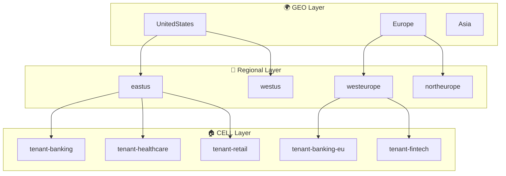

# 🏗️ Azure Stamps Pattern - Comprehensive Architecture Guide

> **🎯 Purpose**: This guide provides a deep technical dive into the enterprise-grade Azure Stamps Pattern implementation, covering architectural decisions, component relationships, security model, and operational considerations.

## 📋 **Navigation Guide**

| Section | Focus Area | Time to Read |
|---------|------------|--------------|
| [🏗️ Architecture Overview](#%EF%B8%8F-architecture-overview) | High-level design and hierarchical structure | 10 minutes |
| [🏛️ Architecture Layers](#%EF%B8%8F-architecture-layers) | Detailed component breakdown | 15 minutes |
| [🚀 Traffic Flow](#-traffic-flow-architecture) | Request routing and data flow | 10 minutes |
| [🔒 Security](#-security-architecture) | Multi-layer security model | 15 minutes |
| [📊 Monitoring](#-monitoring--observability) | Observability and monitoring strategy | 10 minutes |
| [🌱 Scaling](#-scaling-strategies) | Growth and expansion strategies | 5 minutes |

---

## 🏗️ Architecture Overview

This solution implements a sophisticated **GEO → Region → CELL** hierarchy using Azure's stamps pattern for maximum scalability, isolation, and global distribution.

### 🎯 **Key Design Principles**

- **🏠 Tenant Isolation**: Complete resource isolation per tenant (CELL)
- **🌍 Global Distribution**: Multi-geography deployment with regional failover
- **📈 Unlimited Scalability**: Add CELLs and regions without architectural changes
- **🔒 Defense in Depth**: Multi-layer security with WAF, NSG, and identity controls
- **📊 Operational Excellence**: Comprehensive monitoring with per-tenant visibility
- **💰 Cost Optimization**: Right-sized resources with automated scaling

This solution implements a sophisticated **GEO → Region → CELL** hierarchy using Azure's stamps pattern for maximum scalability, isolation, and global distribution.

### 🌍 **Hierarchical Structure**



**📐 Architecture Dimensions:**
- **Depth**: 3 layers (GEO → Region → CELL)
- **Width**: Unlimited expansion at each layer
- **Isolation**: Complete resource isolation per CELL
- **Redundancy**: Cross-region and cross-geo replication

### 🔄 **Real-World Example**

```
GEO: UnitedStates
  ├─ Region: eastus
  │    ├─ CELL: tenant-banking
  │    ├─ CELL: tenant-healthcare
  │    └─ CELL: tenant-retail
  └─ Region: westus
       ├─ CELL: tenant-banking-dr
       └─ CELL: tenant-retail-dr

GEO: Europe
  ├─ Region: westeurope
  │    ├─ CELL: tenant-banking-eu
  │    └─ CELL: tenant-fintech
  └─ Region: northeurope
       └─ CELL: tenant-banking-eu-dr
```

## 🏛️ Architecture Layers

### 1️⃣ **Global Layer** (`globalLayer.bicep`)
**Purpose**: Worldwide traffic distribution and control plane

**Components**:
- **🌐 Azure Front Door**: Global CDN, SSL termination, Web Application Firewall
- **📡 Traffic Manager**: DNS-based global load balancing with performance routing
- **🌍 DNS Zone**: Custom domain management and DNS resolution
- **🚀 Azure Functions**: Global control plane functions across multiple regions
  - `GetTenantCellFunction`: Routes tenants to appropriate CELL
  - `CreateTenantFunction`: Provisions new tenant resources
  - `AddUserToTenantFunction`: Tenant user management
- **📊 Global Cosmos DB**: Multi-master global routing database
- **📈 Global Log Analytics**: Centralized monitoring and observability

### 2️⃣ **Regional Layer** (`regionalLayer.bicep`)
**Purpose**: Regional traffic routing and operational services

**Components**:
- **🔄 Application Gateway**: Regional WAF, SSL termination, path-based routing to CELLs
- **🔐 Azure Key Vault**: Regional secrets and certificate management
- **🤖 Automation Account**: Regional runbooks and operational automation
- **📊 Regional Log Analytics**: Regional monitoring and compliance

### 3️⃣ **CELL Layer** (`deploymentStampLayer.bicep`)
**Purpose**: Isolated tenant application instances

**Components**:
- **🏗️ Container Apps Environment**: Kubernetes-based application hosting
- **🗄️ Azure SQL Database**: Isolated tenant database
- **💾 Storage Account**: Tenant-specific blob and file storage
- **🌌 CELL Cosmos DB**: Tenant data with regional scope
- **📦 Container Registry**: Application container images
- **🔍 Diagnostic Settings**: CELL-level monitoring and logging

### 4️⃣ **Cross-Cutting Layers**

#### **Geodes Layer** (`geodesLayer.bicep`)
- **🚪 API Management Premium**: Enterprise-grade multi-region API gateway with:
  - **Tenant-specific rate limiting**: Different quotas per tenant tier (Basic: 10K/hour, Premium: 50K/hour)
  - **API versioning**: Side-by-side v1/v2 API deployment capabilities
  - **Developer portals**: Self-service API documentation and key management
  - **Advanced security**: JWT validation, IP filtering, custom policies
  - **Multi-region active-active**: Global load balancing with automatic failover
  - **Request/response transformation**: Tenant-specific data format handling
  - **Comprehensive analytics**: Per-tenant API usage insights and SLA monitoring
- **🌌 Global Control Plane Cosmos DB**: Multi-region write replication for tenant routing

#### **Monitoring Layer** (`monitoringLayer.bicep`)
- **📈 Regional Log Analytics Workspaces**: Compliance and data residency
- **🔔 Azure Monitor**: Alerts and dashboards per region

## 🚀 Traffic Flow Architecture

### 🌐 Global Traffic Flow
```
[User Request] 
    ↓
[Azure Front Door] → Global SSL termination, CDN, WAF
    ↓
[Traffic Manager] → DNS-based geography routing
    ↓
[API Management (APIM)] → Enterprise API gateway, tenant policies, rate limiting
    ↓
[Regional Application Gateway] → Regional load balancing, SSL offloading
    ↓
[CELL Container Apps] → Tenant-isolated application
```

### 🔍 Enhanced Tenant Resolution Flow
```
[Tenant API Request] 
    ↓
[Front Door] → Global CDN and edge security
    ↓
[Traffic Manager] → Route to optimal geography
    ↓
[APIM Gateway] → Apply tenant-specific policies and rate limits
    ↓
[Global Function: GetTenantCellFunction] → Query Global Cosmos DB
    ↓
[Route to Specific CELL] → Based on tenant metadata and SLA tier
    ↓
[Application Gateway] → Regional SSL termination and WAF
    ↓
[CELL-specific Resources] → Isolated SQL DB, Storage, Container Apps
```

## 🏗️ Deployment Architecture

### 📂 Template Orchestration

1. **`main.bicep`** - Master orchestrator using nested loops:
   ```bicep
   for (geo, geoIdx) in geos
   for (region, regionIdx) in geo.regions
   for (cell, cellIdx) in region.cells
   ```

2. **Dependency Chain**:
   ```
   Global Resources (DNS, Traffic Manager, Front Door)
       ↓
   Regional Resources (App Gateway, Key Vault, Automation)
       ↓
   CELL Resources (Apps, Databases, Storage)
   ```

### 🎯 Parameterization Strategy

All environments configured through `geos` array in parameters:
```json
{
  "geos": [
    {
      "geoName": "UnitedStates",
      "regions": [
        {
          "regionName": "eastus",
          "keyVaultName": "kv-us-east",
          "cells": ["tenant-a", "tenant-b", "tenant-c"],
          "baseDomain": "us.contoso.com"
        }
      ]
    }
  ]
}
```

## 🔒 Security Architecture

### 🛡️ Multi-Layer Security Model

1. **Global Security**:
   - Front Door WAF with OWASP rules
   - Traffic Manager DDoS protection
   - DNS-level filtering

2. **Regional Security**:
   - Application Gateway WAF v2
   - Key Vault for secrets management
   - Network Security Groups

3. **CELL Security**:
   - Isolated networking per tenant
   - Separate SQL databases with encryption
   - Container-level security policies

### 🔐 Identity & Access Management

#### 🎫 **Azure B2C Integration**

**⚠️ Important Deployment Notes:**
- Azure AD B2C tenants **cannot be created via Bicep or ARM templates**
- You must first create your Azure AD B2C tenant manually in the Azure Portal
- The provided `b2c-setup.bicep` file links an existing B2C tenant to your subscription

**Deployment Steps:**
1. Create your Azure AD B2C tenant in the Azure Portal
2. Deploy `b2c-setup.bicep` to link the tenant to your subscription  
3. Deploy the rest of your solution (`main.bicep` and related modules)

**Multi-Tenant Identity Architecture:**
```bicep
// B2C Tenant Configuration (b2c-setup.bicep)
resource b2cTenant 'Microsoft.AzureActiveDirectory/b2cDirectories@2021-04-01' = {
  name: 'contoso-stamps-b2c'
  location: 'United States'
  properties: {
    createTenantProperties: {
      displayName: 'Contoso Stamps B2C'
      countryCode: 'US'
    }
  }
}
```

**Security Policies:**
- **Multi-Factor Authentication (MFA)**: Required for all admin accounts
- **Conditional Access**: Location and device-based restrictions
- **Identity Protection**: Risk-based authentication
- **Privileged Identity Management (PIM)**: Just-in-time admin access

#### 🔑 **Managed Identity Strategy**
- **Service-to-service authentication**: All Azure services use managed identities
- **RBAC**: Granular access control per layer
- **Key Vault Integration**: Secure secret and certificate management

## 📊 Monitoring & Observability

### 🔍 Multi-Level Monitoring

```
Global Level: Cross-region performance, global routing health
    ↓
Regional Level: Regional service health, compliance monitoring
    ↓
CELL Level: Tenant-specific metrics, application performance
```

### 📈 Key Metrics by Layer

**Global**:
- DNS resolution times
- Front Door cache hit ratios
- Global Cosmos DB latency
- Cross-region failover times

**Regional**:
- Application Gateway response times
- Regional resource utilization
- Key Vault access patterns

**CELL**:
- Application response times
- Database performance per tenant
- Storage utilization per tenant
- Container resource consumption

## 🌱 Scaling Strategies

### ➕ Adding New Tenants (CELLs)
1. Update `geos` array with new CELL name
2. Deploy updated template
3. Configure routing in Global Cosmos DB
4. Update Application Gateway path rules

### 🌍 Geographic Expansion
1. Add new GEO to `geos` array
2. Configure DNS for new geography
3. Deploy regional infrastructure
4. Update Traffic Manager with new endpoints

### 📈 CELL Scaling
- **Horizontal**: Add more CELLs per region
- **Vertical**: Upgrade CELL resources (SQL tier, storage class)
- **Geographic**: Replicate CELLs across regions

## 🚨 Disaster Recovery

### 🔄 Multi-Region Redundancy

- **Global Cosmos DB**: Multi-master replication
- **Traffic Manager**: Automatic failover routing
- **Regional Pairs**: CELLs deployed in paired regions
- **Backup Strategy**: Cross-region SQL backup replication

### 🛠️ Recovery Procedures

1. **CELL Failure**: Traffic Manager routes to healthy CELL
2. **Regional Failure**: DNS routes to healthy region
3. **Global Failure**: Geo-DNS routes to backup geography

## 💰 Cost Optimization

### 🎯 Right-Sizing Strategies

- **Development**: Basic tiers for all services
- **Production**: Premium tiers with reserved instances
- **Auto-scaling**: Container Apps scale to zero
- **Storage**: Lifecycle policies for blob storage

### 📊 Cost Monitoring
- Per-CELL cost allocation
- Regional cost breakdown
- Service-level cost tracking

---

## 🔗 Related Documentation

- [Deployment Guide](./DEPLOYMENT_GUIDE.md)
- [Operations Runbook](./OPERATIONS_GUIDE.md)
- [Security Baseline](./SECURITY_GUIDE.md)
