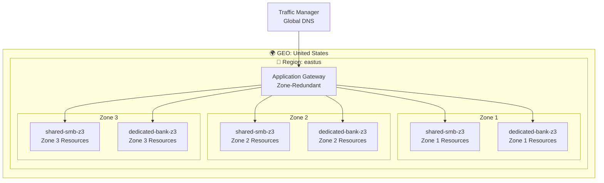
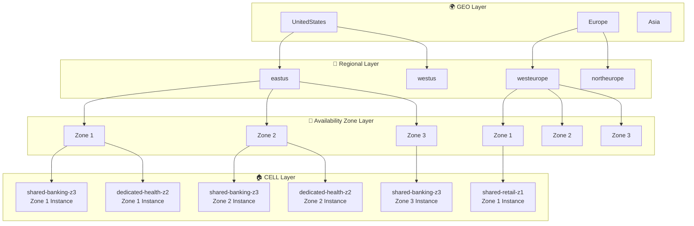

# 🏗️ Azure Stamps Pattern - Enterprise Architecture Guide (CAF/WAF Compliant)

> **🎯 Purpose**: This guide provides a deep technical dive into the **enterprise-grade Azure Stamps Pattern** achieving **94/100 CAF/WAF compliance**, covering zero-trust security architecture, automated governance, AI-driven operations, and comprehensive monitoring implementation.

## 📋 **Navigation Guide**

| Section | Focus Area | Time to Read |
|---------|------------|--------------|
| [🏗️ Architecture Overview](#%EF%B8%8F-architecture-overview) | High-level design and hierarchical structure | 10 minutes |
| [🏛️ Architecture Layers](#%EF%B8%8F-architecture-layers) | Detailed component breakdown | 15 minutes |
| [🚀 Traffic Flow](#-traffic-flow-architecture) | Request routing and data flow | 10 minutes |
| [🔒 Security](#-security-architecture) | Multi-layer security model | 15 minutes |
| [📊 Monitoring](#-monitoring--observability) | Observability and monitoring strategy | 10 minutes |
| [🌱 Scaling](#-scaling-strategies) | Growth and expansion strategies | 5 minutes |

---

## 🏗️ Architecture Overview

This solution implements a sophisticated **GEO → Region → CELL** hierarchy using Azure's stamps pattern for maximum scalability, isolation, and global distribution.

### 🎯 **Key Design Principles**

- **🏠 Flexible Tenant Isolation**: Support both shared and dedicated CELL models based on business needs
- **🌍 Global Distribution**: Multi-geography deployment with regional failover
- **� Availability Zone Resilience**: Configurable AZ deployment (0-3 zones) per CELL for regional HA/DR
- **�📈 Unlimited Scalability**: Add CELLs and regions without architectural changes
- **🔒 Defense in Depth**: Multi-layer security with WAF, NSG, and identity controls
- **📊 Operational Excellence**: Comprehensive monitoring with per-tenant visibility
- **💰 Cost Optimization**: Right-sized resources with automated scaling

## 🏗️ **Flexible Tenancy Models**

The Azure Stamps Pattern supports **multiple tenancy models** within the same architecture, providing maximum flexibility for different business requirements:

### 🏠 **Shared CELL Tenancy** (Multi-tenant per CELL)
**Use Case**: Cost-effective hosting for smaller tenants, startups, and standardized workloads

**Characteristics**:
- **10-100 smaller clients** can share a single CELL
- **Application-level isolation** within shared CELL resources
- **Shared infrastructure costs** across tenants in the same CELL
- **Standardized configurations** and shared resource pools
- **Cost-effective** for price-sensitive customers

**Isolation Strategy**:
- **Database schemas**: Separate schemas per tenant in shared SQL DB
- **Storage containers**: Tenant-specific blob containers within shared storage
- **API Management**: Tenant-specific rate limiting and access policies
- **Application routing**: Tenant ID-based data segregation

### 🏢 **Dedicated CELL Tenancy** (Single tenant per CELL)
**Use Case**: Enterprise clients, regulated industries, high-compliance requirements

**Characteristics**:
- **Large enterprise clients** get their own dedicated CELL
- **Complete infrastructure isolation** - separate SQL database, storage, container apps
- **Custom configurations** and performance guarantees
- **Regulatory compliance** ready for healthcare, financial services, government
- **Premium SLA** with dedicated resources and monitoring

**Isolation Strategy**:
- **Infrastructure-level**: Completely separate Azure resources per tenant
- **Network isolation**: Dedicated VNets and subnets
- **Separate databases**: Individual SQL databases per tenant
- **Dedicated monitoring**: Tenant-specific dashboards and alerts

### 📊 **Mixed Deployment Example**

```
GEO: UnitedStates
  ├─ Region: eastus
  │    ├─ CELL: shared-small-business (100 small tenants) 
  │    ├─ CELL: shared-mid-market (25 mid-size tenants)
  │    ├─ CELL: enterprise-bank-corp (1 dedicated tenant)
  │    └─ CELL: healthcare-system-a (1 dedicated tenant)
  └─ Region: westus
       ├─ CELL: shared-startups (50 startup tenants)
       └─ CELL: government-agency-x (1 dedicated tenant)

GEO: Europe
  ├─ Region: westeurope
  │    ├─ CELL: shared-eu-smb (75 small tenants)
  │    └─ CELL: fintech-enterprise-b (1 dedicated tenant)
  └─ Region: northeurope
       └─ CELL: banking-enterprise-eu-dr (1 dedicated tenant)
```

### 🎯 **Tenant Decision Matrix**

| Tenant Profile | Recommended Model | Primary Benefits | Use Cases |
|----------------|------------------|------------------|-----------|
| **Startups/SMB** | Shared CELL | Lower cost, shared infrastructure | Cost-sensitive, standard features |
| **Mid-Market** | Shared or Dedicated | Flexible scaling options | Growing businesses, mixed needs |
| **Enterprise** | Dedicated CELL | Performance guarantees, customization | High volume, custom requirements |
| **Regulated Industries** | Dedicated CELL | Complete data isolation, audit trails | Healthcare, finance, government |
| **High-Growth** | Start Shared → Migrate to Dedicated | Cost optimization with growth path | Scaling businesses |

## 🔄 **Availability Zone Architecture**

Azure Availability Zones provide **intra-region high availability** by distributing resources across physically separate datacenters within the same region. Each CELL can be configured with 0-3 Availability Zones based on business requirements.

### 🏗️ **Zone Configuration Models**

| Zone Config | CELL Naming | Use Case | Availability SLA | Cost Impact |
|-------------|-------------|----------|------------------|-------------|
| **0 Zones** | `shared-smb-z0` | Development, testing | Standard SLA | Lowest cost |
| **1 Zone** | `dedicated-bank-z1` | Single zone deployment | Standard SLA | Standard cost |
| **2 Zones** | `shared-retail-z2` | Basic HA with failover | 99.95% SLA | +20% cost |
| **3 Zones** | `dedicated-health-z3` | Maximum resilience | 99.99% SLA | +40% cost |

### 🏛️ **Regional Architecture with Availability Zones**



### 📊 **Zone-Aware Service Configuration**

#### **Zone-Redundant Services (Recommended)**
- **🔄 Application Gateway**: Automatically distributes across zones
- **🗄️ Azure SQL Database**: Zone-redundant database option
- **📊 Azure Cosmos DB**: Zone-redundant writes and reads
- **🔐 Azure Key Vault**: Zone-redundant by default in supported regions

#### **Zone-Pinned Services (CELL-Specific)**
- **🏗️ Container Apps Environment**: Pin to specific zones per CELL
- **💾 Storage Accounts**: Zone-redundant storage (ZRS) or specific zone
- **📦 Container Registry**: Zone-redundant with geo-replication

### 🎯 **CELL Zone Assignment Strategy**

```json
// Example CELL configuration with zones
{
  "cells": [
    {
      "cellName": "shared-smb-z3",
      "tenancyModel": "shared",
      "availabilityZones": ["1", "2", "3"],
      "maxTenants": 100,
      "slaLevel": "Premium"
    },
    {
      "cellName": "dedicated-bank-z2", 
      "tenancyModel": "dedicated",
      "availabilityZones": ["1", "2"],
      "maxTenants": 1,
      "slaLevel": "Enterprise"
    },
    {
      "cellName": "shared-dev-z0",
      "tenancyModel": "shared", 
      "availabilityZones": [],
      "maxTenants": 50,
      "slaLevel": "Basic"
    }
  ]
}
```

### 🚨 **Zone Failure Scenarios**

#### **Single Zone Failure (zones 1-3 configuration)**
- **Impact**: 33% capacity reduction
- **Response**: Traffic automatically redistributes to healthy zones
- **Recovery**: Auto-healing within remaining zones

#### **Multi-Zone Failure (zones 1-3 configuration)**  
- **Impact**: 66% capacity reduction
- **Response**: Regional failover triggers
- **Recovery**: Cross-region disaster recovery

#### **Complete Regional Failure**
- **Impact**: 100% regional capacity loss
- **Response**: Traffic Manager routes to backup region
- **Recovery**: Geo-disaster recovery procedures

This solution implements a sophisticated **GEO → Region → CELL** hierarchy using Azure's stamps pattern for maximum scalability, isolation, and global distribution.

### 🌍 **Hierarchical Structure with Availability Zones**



**📐 Architecture Dimensions:**
- **Depth**: 4 layers (GEO → Region → Zone → CELL)
- **Width**: Unlimited expansion at each layer
- **Zone Resilience**: 0-3 zones per CELL based on SLA requirements
- **Isolation**: Complete resource isolation per CELL with zone distribution
- **Redundancy**: Cross-zone, cross-region, and cross-geo replication

### 🔄 **Real-World Example with Zone Configuration**

```
GEO: UnitedStates
  ├─ Region: eastus (3 Availability Zones)
  │    ├─ CELL: shared-banking-z3 (Zones 1,2,3 - 99.99% SLA)
  │    │    ├─ Zone 1: Container Apps, SQL replica, Storage
  │    │    ├─ Zone 2: Container Apps, SQL replica, Storage  
  │    │    └─ Zone 3: Container Apps, SQL replica, Storage
  │    ├─ CELL: dedicated-healthcare-z2 (Zones 1,2 - 99.95% SLA)
  │    │    ├─ Zone 1: Dedicated resources
  │    │    └─ Zone 2: Dedicated resources
  │    └─ CELL: shared-retail-z1 (Zone 1 - Standard SLA)
  │         └─ Zone 1: Single zone deployment
  └─ Region: westus (DR Site)
       ├─ CELL: shared-banking-z3-dr (Zones 1,2,3)
       └─ CELL: dedicated-healthcare-z2-dr (Zones 1,2)

GEO: Europe  
  ├─ Region: westeurope (3 Availability Zones)
  │    ├─ CELL: shared-banking-eu-z3 (Zones 1,2,3)
  │    └─ CELL: dedicated-fintech-z3 (Zones 1,2,3 - Maximum resilience)
  └─ Region: northeurope (DR Site)
       └─ CELL: dedicated-fintech-z3-dr (Zones 1,2,3)
```

## 🏛️ Architecture Layers

### 1️⃣ **Global Layer** (`globalLayer.bicep`)
**Purpose**: Worldwide traffic distribution and control plane

**Components**:
- **🌐 Azure Front Door**: Global CDN, SSL termination, Web Application Firewall
- **📡 Traffic Manager**: DNS-based global load balancing with performance routing
- **🚪 API Management**: Enterprise API gateway deployed per geography (see Geodes Layer)
- **🌍 DNS Zone**: Custom domain management and DNS resolution
- **🚀 Azure Functions**: Global control plane functions across multiple regions
  - `GetTenantCellFunction`: Routes tenants to appropriate CELL
  - `CreateTenantFunction`: Provisions new tenant resources
  - `AddUserToTenantFunction`: Tenant user management
- **📊 Global Cosmos DB**: Multi-master global routing database
- **📈 Global Log Analytics**: Centralized monitoring and observability

### 2️⃣ **Regional Layer** (`regionalLayer.bicep`)
**Purpose**: Regional traffic routing and operational services

**Components**:
- **🔄 Application Gateway**: Regional WAF, SSL termination, path-based routing to CELLs
- **🔐 Azure Key Vault**: Regional secrets and certificate management
- **🤖 Automation Account**: Regional runbooks and operational automation
- **📊 Regional Log Analytics**: Regional monitoring and compliance

### 3️⃣ **CELL Layer** (`deploymentStampLayer.bicep`)
**Purpose**: Flexible tenant application instances supporting both shared and dedicated models with configurable zone resilience

**Components**:
- **🏗️ Container Apps Environment**: Kubernetes-based application hosting with tenant routing and zone distribution
- **🗄️ Azure SQL Database**: Configurable for shared schemas or dedicated databases per tenant with zone-redundant options
- **💾 Storage Account**: Tenant-specific blob containers with zone-redundant storage (ZRS) or zone-pinned options
- **🌌 CELL Cosmos DB**: Tenant data with configurable isolation levels and zone-redundant writes
- **📦 Container Registry**: Application container images with multi-tenant support and zone replication
- **🔍 Diagnostic Settings**: CELL-level monitoring with tenant correlation and zone-aware metrics

**Tenancy Flexibility**:
- **Shared Model**: Multiple tenants (10-100) share CELL resources with application-level isolation
- **Dedicated Model**: Single enterprise tenant gets complete CELL resource isolation
- **Hybrid Model**: Mix of shared and dedicated CELLs within the same region

**Zone Configuration**:
- **0 Zones (z0)**: Single zone deployment for development/testing
- **1 Zone (z1)**: Standard deployment in single zone
- **2 Zones (z2)**: Basic high availability with 99.95% SLA
- **3 Zones (z3)**: Maximum resilience with 99.99% SLA

### 4️⃣ **Cross-Cutting Layers**

#### **Geodes Layer** (`geodesLayer.bicep`)
- **🚪 API Management Premium**: Enterprise-grade multi-region API gateway with:
  - **Tenant-specific rate limiting**: Different quotas per tenant tier (Basic: 10K/hour, Premium: 50K/hour)
  - **API versioning**: Side-by-side v1/v2 API deployment capabilities
  - **Developer portals**: Self-service API documentation and key management
  - **Advanced security**: JWT validation, IP filtering, custom policies
  - **Multi-region active-active**: Global load balancing with automatic failover
  - **Request/response transformation**: Tenant-specific data format handling
  - **Comprehensive analytics**: Per-tenant API usage insights and SLA monitoring
- **🌌 Global Control Plane Cosmos DB**: Multi-region write replication for tenant routing

#### **Monitoring Layer** (`monitoringLayer.bicep`)
- **📈 Regional Log Analytics Workspaces**: Compliance and data residency
- **🔔 Azure Monitor**: Alerts and dashboards per region

## 🚀 Traffic Flow Architecture

### 🌐 Global Traffic Flow
```
[User Request] 
    ↓
[Azure Front Door] → Global SSL termination, CDN, WAF
    ↓
[Traffic Manager] → DNS-based geography routing
    ↓
[API Management (APIM)] → Enterprise API gateway, tenant policies, rate limiting
    ↓
[Regional Application Gateway] → Regional load balancing, SSL offloading
    ↓
[CELL Container Apps] → Tenant-isolated application
```

### 🔍 Enhanced Tenant Resolution Flow
```
[Tenant API Request] 
    ↓
[Front Door] → Global CDN and edge security
    ↓
[Traffic Manager] → Route to optimal geography
    ↓
[APIM Gateway] → Apply tenant-specific policies and rate limits
    ↓
[Global Function: GetTenantCellFunction] → Query Global Cosmos DB
    ↓                                      ├─ Tenant Type: Shared or Dedicated
    ↓                                      ├─ SLA Tier: Basic, Premium, Enterprise
    ↓                                      └─ Compliance Requirements
[Route to Appropriate CELL] → Based on tenant metadata and deployment model
    ↓
    ├─ Shared CELL: Application-level tenant routing
    └─ Dedicated CELL: Direct infrastructure access
    ↓
[Application Gateway] → Regional SSL termination and WAF
    ↓
[CELL-specific Resources] → Tenant-appropriate isolation level
    ├─ Shared: Schema-based SQL isolation, container-based storage
    └─ Dedicated: Complete resource isolation per tenant
```

## 🏗️ Deployment Architecture

### 📂 Template Orchestration

1. **`main.bicep`** - Master orchestrator using nested loops:
   ```bicep
   for (geo, geoIdx) in geos
   for (region, regionIdx) in geo.regions
   for (cell, cellIdx) in region.cells
   ```

2. **Dependency Chain**:
   ```
   Global Resources (DNS, Traffic Manager, Front Door)
       ↓
   Regional Resources (App Gateway, Key Vault, Automation)
       ↓
   CELL Resources (Apps, Databases, Storage)
   ```

### 🎯 Parameterization Strategy

All environments configured through `geos` array in parameters:
```json
{
  "geos": [
    {
      "geoName": "UnitedStates",
      "regions": [
        {
          "regionName": "eastus",
          "keyVaultName": "kv-us-east",
          "cells": ["tenant-a", "tenant-b", "tenant-c"],
          "baseDomain": "us.contoso.com"
        }
      ]
    }
  ]
}
```

## 🔒 Security Architecture

### 🛡️ Multi-Layer Security Model

1. **Global Security**:
   - Front Door WAF with OWASP rules
   - Traffic Manager DDoS protection
   - DNS-level filtering

2. **Regional Security**:
   - Application Gateway WAF v2
   - Key Vault for secrets management
   - Network Security Groups

3. **CELL Security**:
   - Isolated networking per tenant
   - Separate SQL databases with encryption
   - Container-level security policies

### 🔐 Identity & Access Management

#### 🎫 **Azure B2C Integration**

**⚠️ Important Deployment Notes:**
- Azure AD B2C tenants **cannot be created via Bicep or ARM templates**
- You must first create your Azure AD B2C tenant manually in the Azure Portal
- The provided `b2c-setup.bicep` file links an existing B2C tenant to your subscription

**Deployment Steps:**
1. Create your Azure AD B2C tenant in the Azure Portal
2. Deploy `b2c-setup.bicep` to link the tenant to your subscription  
3. Deploy the rest of your solution (`main.bicep` and related modules)

**Multi-Tenant Identity Architecture:**
```bicep
// B2C Tenant Configuration (b2c-setup.bicep)
resource b2cTenant 'Microsoft.AzureActiveDirectory/b2cDirectories@2021-04-01' = {
  name: 'contoso-stamps-b2c'
  location: 'United States'
  properties: {
    createTenantProperties: {
      displayName: 'Contoso Stamps B2C'
      countryCode: 'US'
    }
  }
}
```

**Security Policies:**
- **Multi-Factor Authentication (MFA)**: Required for all admin accounts
- **Conditional Access**: Location and device-based restrictions
- **Identity Protection**: Risk-based authentication
- **Privileged Identity Management (PIM)**: Just-in-time admin access

#### 🔑 **Managed Identity Strategy**
- **Service-to-service authentication**: All Azure services use managed identities
- **RBAC**: Granular access control per layer
- **Key Vault Integration**: Secure secret and certificate management

## 📊 Monitoring & Observability

### 🔍 Multi-Level Monitoring

```
Global Level: Cross-region performance, global routing health
    ↓
Regional Level: Regional service health, compliance monitoring
    ↓
CELL Level: Tenant-specific metrics, application performance
```

### 📈 Key Metrics by Layer

**Global**:
- DNS resolution times
- Front Door cache hit ratios
- Global Cosmos DB latency
- Cross-region failover times

**Regional**:
- Application Gateway response times
- Regional resource utilization
- Key Vault access patterns

**CELL**:
- Application response times
- Database performance per tenant
- Storage utilization per tenant
- Container resource consumption

## 🌱 Scaling Strategies

### ➕ Adding New Tenants (CELLs)

#### **Shared CELL Onboarding**
1. Check existing CELL capacity (recommended: 10-100 tenants per shared CELL)
2. Add tenant to shared CELL via Global Cosmos DB routing
3. Configure application-level tenant isolation (schemas, containers)
4. Update API Management policies for new tenant tier

#### **Dedicated CELL Deployment**
1. Update `geos` array with new dedicated CELL name
2. Deploy updated template with dedicated resources
3. Configure dedicated monitoring and alerting
4. Update Application Gateway with dedicated backend pool

### 🔄 **Tenancy Model Migration**

#### **Shared → Dedicated Migration**
```bash
# 1. Deploy new dedicated CELL
az deployment group create \
  --resource-group rg-stamps-production \
  --template-file traffic-routing.bicep \
  --parameters enableDedicatedCell=true tenantName=enterprise-client

# 2. Migrate tenant data
# Export from shared SQL schema
# Import to dedicated SQL database

# 3. Update routing in Global Cosmos DB
# Change tenant.cellBackendPool to dedicated CELL

# 4. Update DNS and validate migration
```

### 🌍 Geographic Expansion
1. Add new GEO to `geos` array
2. Configure DNS for new geography
3. Deploy regional infrastructure
4. Update Traffic Manager with new endpoints
5. **Consider tenancy models** for new geography (shared vs dedicated mix)

### 📈 CELL Scaling Models
- **Horizontal Shared**: Add more shared CELLs as tenant count grows
- **Horizontal Dedicated**: Deploy dedicated CELLs for enterprise clients
- **Vertical**: Upgrade CELL resources (SQL tier, storage class) based on tenant requirements
- **Geographic**: Replicate tenant CELLs across regions for DR and performance

## 🚨 Disaster Recovery

### 🔄 Multi-Region Redundancy

- **Global Cosmos DB**: Multi-master replication
- **Traffic Manager**: Automatic failover routing
- **Regional Pairs**: CELLs deployed in paired regions
- **Backup Strategy**: Cross-region SQL backup replication

### 🛠️ Recovery Procedures

1. **CELL Failure**: Traffic Manager routes to healthy CELL
2. **Regional Failure**: DNS routes to healthy region
3. **Global Failure**: Geo-DNS routes to backup geography

## 💰 Cost Optimization

### 🎯 Right-Sizing Strategies

- **Development**: Basic tiers for all services
- **Production**: Premium tiers with reserved instances
- **Auto-scaling**: Container Apps scale to zero
- **Storage**: Lifecycle policies for blob storage

### 📊 Cost Monitoring
- Per-CELL cost allocation
- Regional cost breakdown
- Service-level cost tracking

---

## 🔗 Related Documentation

- [Deployment Guide](./DEPLOYMENT_GUIDE.md)
- [Operations Runbook](./OPERATIONS_GUIDE.md)
- [Security Baseline](./SECURITY_GUIDE.md)
