# 🚀 Azure Stamps Pattern - Complete Deployment Guide

> **🎯 Purpose**: Step-by-step guide for deploying the Azure Stamps Pattern from development testing to enterprise production. Choose your deployment path based on your requirements.

## 📋 **Quick Navigation**

| Section | Description | Time Required |
|---------|-------------|---------------|
| [📋 Prerequisites](#-prerequisites) | Required tools and access | 10 minutes |
| [🌟 Option 1: Simple Setup](#-option-1-simple-two-region-setup-recommended-for-getting-started) | Development/testing deployment | 45 minutes |
| [🌍 Option 2: Enterprise Setup](#-option-2-global-multi-geo-setup-production) | Production global deployment | 2-3 hours |
| [🔧 Automation](#-automation-options) | CI/CD and automation options | 30 minutes |
| [🩺 Validation](#-post-deployment-validation) | Testing and validation steps | 20 minutes |

### 🛣️ **Choose Your Deployment Path**

```mermaid
flowchart TD
    A[Choose Deployment] --> B{Purpose?}
    B -->|Learning/Testing| C[Simple Setup<br/>2 Regions, Basic Config<br/>⏱️ 45 min]
    B -->|Production| D[Enterprise Setup<br/>Multi-GEO, Full Features<br/>⏱️ 2-3 hours]
    C --> E[deploy-stamps.sh<br/>or PowerShell]
    D --> F[main.bicep<br/>Full Configuration]
    E --> G[Development Ready]
    F --> H[Production Ready]
```



---

## 🎯 Deployment Overview

This guide provides comprehensive instructions for deploying the Azure Stamps Pattern infrastructure with multiple deployment options for different scenarios.

## 📋 Prerequisites

### ✅ Required Tools
```bash
# Azure CLI (latest version)
az --version
# Should be >= 2.50.0

# Bicep CLI 
bicep --version
# Should be >= 0.20.0

# PowerShell 7+ (for PowerShell deployment)
pwsh --version
# Should be >= 7.3.0
```

### 🔐 Azure Access Requirements
- **Azure subscription** with Contributor access
- **Resource Provider registrations**:
  ```bash
  az provider register --namespace Microsoft.Network
  az provider register --namespace Microsoft.DocumentDB
  az provider register --namespace Microsoft.Web
  az provider register --namespace Microsoft.ContainerRegistry
  az provider register --namespace Microsoft.App
  ```

### 🌍 Regional Considerations
- Verify service availability in target regions:
  ```bash
  az provider show --namespace Microsoft.App --query "resourceTypes[?resourceType=='containerApps'].locations"
  ```

## 🏗️ Deployment Architectures

### 🌟 **Option 1: Simple Two-Region Setup** (Recommended for Getting Started)

#### Configuration (`traffic-routing.parameters.json`):
```json
{
  "$schema": "https://schema.management.azure.com/schemas/2019-04-01/deploymentParameters.json#",
  "contentVersion": "1.0.0.0",
  "parameters": {
    "environment": { "value": "dev" },
    "location": { "value": "eastus" },
    "resourcePrefix": { "value": "stamps" },
    "publisherEmail": { "value": "admin@contoso.com" },
    "publisherName": { "value": "Contoso Corp" },
    "sqlAdminUsername": { "value": "sqladmin" },
    "sqlAdminPassword": { "value": "YourSecurePassword123!" },
    "baseDomain": { "value": "contoso.com" }
  }
}
```

#### Deployment:
```bash
# Option A: Automated Script (Recommended)
chmod +x deploy-stamps.sh
./deploy-stamps.sh

# Option B: Manual Azure CLI
az group create --name rg-stamps-eus-dev --location eastus
az deployment group create \
  --resource-group rg-stamps-eus-dev \
  --template-file traffic-routing.bicep \
  --parameters @traffic-routing.parameters.json
```

### 🌍 **Option 2: Global Multi-GEO Setup** (Production)

#### Configuration (`AzureArchitecture/main.parameters.json`):
```json
{
  "$schema": "https://schema.management.azure.com/schemas/2019-04-01/deploymentParameters.json#",
  "contentVersion": "1.0.0.0",
  "parameters": {
    "dnsZoneName": { "value": "stamps.contoso.com" },
    "trafficManagerName": { "value": "tm-stamps-global" },
    "frontDoorName": { "value": "fd-stamps-global" },
    "globalLogAnalyticsLocation": { "value": "eastus" },
    "globalLogAnalyticsWorkspaceName": { "value": "law-stamps-global" },
    "cellCount": { "value": 3 },
    "sqlAdminPassword": { "value": "YourSecurePassword123!" },
    "postgresAdminPassword": { "value": "YourSecurePassword123!" },
    "functionAppNamePrefix": { "value": "func-stamps" },
    "functionStorageNamePrefix": { "value": "stfunc" },
    "geos": {
      "value": [
        {
          "geoName": "UnitedStates",
          "regions": [
            {
              "regionName": "eastus",
              "keyVaultName": "kv-stamps-us-east",
              "cells": ["tenant-banking", "tenant-retail", "tenant-healthcare"],
              "logAnalyticsWorkspaceName": "law-stamps-us-east",
              "baseDomain": "us-east.contoso.com"
            },
            {
              "regionName": "westus",
              "keyVaultName": "kv-stamps-us-west",
              "cells": ["tenant-banking-dr", "tenant-retail-dr"],
              "logAnalyticsWorkspaceName": "law-stamps-us-west",
              "baseDomain": "us-west.contoso.com"
            }
          ]
        },
        {
          "geoName": "Europe",
          "regions": [
            {
              "regionName": "westeurope",
              "keyVaultName": "kv-stamps-eu-west",
              "cells": ["tenant-banking-eu", "tenant-fintech"],
              "logAnalyticsWorkspaceName": "law-stamps-eu-west",
              "baseDomain": "eu-west.contoso.com"
            }
          ]
        }
      ]
    },
    "apimName": { "value": "apim-stamps-global" },
    "apimPublisherEmail": { "value": "admin@contoso.com" },
    "apimPublisherName": { "value": "Contoso API Team" },
    "globalControlCosmosDbName": { "value": "cosmos-stamps-global" },
    "primaryLocation": { "value": "eastus" },
    "additionalLocations": {
      "value": [
        { "locationName": "westus", "failoverPriority": 1 },
        { "locationName": "westeurope", "failoverPriority": 2 }
      ]
    }
  }
}
```

#### Deployment:
```bash
cd AzureArchitecture
az deployment group create \
  --resource-group rg-stamps-global-prod \
  --template-file main.bicep \
  --parameters @main.parameters.json \
  --verbose
```

## 🔧 Deployment Methods

### 🖥️ **Method 1: Bash Script** (Linux/macOS/WSL)

```bash
#!/bin/bash
# Enhanced deployment with validation

# Configuration
# Configuration with proper region naming
RESOURCE_GROUP_NAME="rg-stamps-eus-production"
LOCATION="eastus"
TEMPLATE_FILE="traffic-routing.bicep"
PARAMETERS_FILE="traffic-routing.parameters.json"

# Pre-deployment validation
echo "🔍 Validating Bicep template..."
bicep build $TEMPLATE_FILE

if [ $? -ne 0 ]; then
    echo "❌ Bicep template validation failed"
    exit 1
fi

# What-if analysis
echo "📊 Running deployment what-if analysis..."
az deployment group what-if \
    --resource-group $RESOURCE_GROUP_NAME \
    --template-file $TEMPLATE_FILE \
    --parameters @$PARAMETERS_FILE

# Deploy
echo "🚀 Starting deployment..."
az deployment group create \
    --resource-group $RESOURCE_GROUP_NAME \
    --template-file $TEMPLATE_FILE \
    --parameters @$PARAMETERS_FILE \
    --verbose

# Post-deployment validation
echo "✅ Retrieving deployment outputs..."
az deployment group show \
    --resource-group $RESOURCE_GROUP_NAME \
    --name $(basename $TEMPLATE_FILE .bicep) \
    --query properties.outputs
```

### 🪟 **Method 2: PowerShell Script** (Windows/Cross-platform)

```powershell
# Enhanced PowerShell deployment script

param(
    [string]$ResourceGroupName = "rg-stamps-eus-production",
    [string]$Location = "eastus",
    [string]$Location = "eastus",
    [string]$TemplateFile = "traffic-routing.bicep",
    [string]$ParametersFile = "traffic-routing.parameters.json"
)

# Pre-deployment validation
Write-Host "🔍 Validating Bicep template..." -ForegroundColor Yellow
bicep build $TemplateFile

if ($LASTEXITCODE -ne 0) {
    Write-Host "❌ Bicep template validation failed" -ForegroundColor Red
    exit 1
}

# Create resource group if it doesn't exist
Write-Host "📦 Ensuring resource group exists..." -ForegroundColor Yellow
az group create --name $ResourceGroupName --location $Location

# What-if analysis
Write-Host "📊 Running deployment what-if analysis..." -ForegroundColor Yellow
az deployment group what-if `
    --resource-group $ResourceGroupName `
    --template-file $TemplateFile `
    --parameters "@$ParametersFile"

# Confirmation prompt
$confirmation = Read-Host "Continue with deployment? (y/N)"
if ($confirmation -ne 'y') {
    Write-Host "Deployment cancelled." -ForegroundColor Yellow
    exit 0
}

# Deploy
Write-Host "🚀 Starting deployment..." -ForegroundColor Green
$deploymentResult = az deployment group create `
    --resource-group $ResourceGroupName `
    --template-file $TemplateFile `
    --parameters "@$ParametersFile" `
    --verbose | ConvertFrom-Json

if ($deploymentResult) {
    Write-Host "✅ Deployment completed successfully!" -ForegroundColor Green
    
    # Display outputs
    Write-Host "📊 Deployment Outputs:" -ForegroundColor Cyan
    $deploymentResult.properties.outputs | ConvertTo-Json -Depth 3
} else {
    Write-Host "❌ Deployment failed" -ForegroundColor Red
    exit 1
}
```

### ⚙️ **Method 3: GitHub Actions CI/CD**

```yaml
# .github/workflows/deploy-stamps.yml
name: Deploy Azure Stamps Pattern

on:
  push:
    branches: [ main ]
  pull_request:
    branches: [ main ]
  workflow_dispatch:
    inputs:
      environment:
        description: 'Deployment environment'
        required: true
        default: 'dev'
        type: choice
        options:
        - dev
        - staging
        - production

jobs:
  validate:
    runs-on: ubuntu-latest
    steps:
    - uses: actions/checkout@v4
    
    - name: Setup Bicep
      run: |
        curl -Lo bicep https://github.com/Azure/bicep/releases/latest/download/bicep-linux-x64
        chmod +x ./bicep
        sudo mv ./bicep /usr/local/bin/bicep
    
    - name: Validate Bicep Templates
      run: |
        bicep build traffic-routing.bicep
        bicep build AzureArchitecture/main.bicep

  deploy:
    needs: validate
    runs-on: ubuntu-latest
    environment: ${{ github.event.inputs.environment || 'dev' }}
    
    steps:
    - uses: actions/checkout@v4
    
    - name: Azure Login
      uses: azure/login@v1
      with:
        creds: ${{ secrets.AZURE_CREDENTIALS }}
    
    - name: Deploy Stamps Pattern
      run: |
        az deployment group create \
          --resource-group rg-stamps-${{ github.event.inputs.environment || 'dev' }} \
          --template-file traffic-routing.bicep \
          --parameters @traffic-routing.parameters.json \
          --parameters environment=${{ github.event.inputs.environment || 'dev' }}
```

## 🔍 Post-Deployment Validation

### ✅ **Health Checks**

```bash
# Function to check resource health
check_resource_health() {
    local resource_type=$1
    local resource_group=$2
    
    echo "🔍 Checking $resource_type resources..."
    az resource list \
        --resource-group $resource_group \
        --resource-type $resource_type \
        --query "[].{Name:name, Location:location, State:properties.provisioningState}" \
        --output table
}

# Resource Group
RESOURCE_GROUP="rg-stamps-dev"

# Check all deployed resources
check_resource_health "Microsoft.Network/trafficManagerProfiles" $RESOURCE_GROUP
check_resource_health "Microsoft.Cdn/profiles" $RESOURCE_GROUP
check_resource_health "Microsoft.ApiManagement/service" $RESOURCE_GROUP
check_resource_health "Microsoft.DocumentDB/databaseAccounts" $RESOURCE_GROUP
check_resource_health "Microsoft.Network/applicationGateways" $RESOURCE_GROUP

# Test endpoints
echo "🌐 Testing deployed endpoints..."
OUTPUTS=$(az deployment group show \
    --resource-group $RESOURCE_GROUP \
    --name traffic-routing \
    --query properties.outputs)

# Extract URLs and test
TRAFFIC_MANAGER_FQDN=$(echo $OUTPUTS | jq -r '.trafficManagerFqdn.value')
FRONT_DOOR_ENDPOINT=$(echo $OUTPUTS | jq -r '.frontDoorEndpointHostname.value')

echo "Testing Traffic Manager: $TRAFFIC_MANAGER_FQDN"
curl -I "https://$TRAFFIC_MANAGER_FQDN" || echo "Traffic Manager not ready yet"

echo "Testing Front Door: $FRONT_DOOR_ENDPOINT"
curl -I "https://$FRONT_DOOR_ENDPOINT" || echo "Front Door not ready yet"
```

### 📊 **Monitoring Setup**

```bash
# Create dashboard for monitoring
az portal dashboard create \
    --resource-group $RESOURCE_GROUP \
    --name "Stamps-Pattern-Dashboard" \
    --input-path dashboard-config.json

# Setup alerts for critical resources
az monitor metrics alert create \
    --name "Traffic-Manager-Health" \
    --resource-group $RESOURCE_GROUP \
    --scopes $(az network traffic-manager profile show --name tm-stamps --resource-group $RESOURCE_GROUP --query id -o tsv) \
    --condition "count staticThreshold equals 0 endpoint_status" \
    --description "Traffic Manager endpoint is down"
```

## 🛠️ Troubleshooting Common Issues

### ❌ **Issue 1: Resource Name Conflicts**
```bash
# Check for existing resources
az resource list --query "[?contains(name, 'stamps')]" --output table

# Solution: Update resource prefix in parameters
"resourcePrefix": { "value": "mycompany-stamps" }
```

### ❌ **Issue 2: API Management Deployment Timeout**
```bash
# APIM takes 45-60 minutes to deploy
# Check deployment status
az deployment group show \
    --resource-group $RESOURCE_GROUP \
    --name traffic-routing \
    --query properties.provisioningState
```

### ❌ **Issue 3: Cosmos DB Region Unavailability**
```bash
# Check Cosmos DB service availability
az cosmosdb locations list --query "[?contains(name, 'eastus')]" --output table

# Solution: Update location in parameters
"location": { "value": "westus2" }
```

### ❌ **Issue 4: SQL Password Complexity Requirements**
```bash
# Ensure password meets requirements:
# - At least 8 characters
# - Contains uppercase, lowercase, digit, and special character
"sqlAdminPassword": { "value": "MySecureP@ssw0rd123!" }
```

## 🔄 Updating Existing Deployments

### ➕ **Adding New CELLs**
```bash
# Update parameters file with new CELL
# Then redeploy
az deployment group create \
    --resource-group $RESOURCE_GROUP \
    --template-file traffic-routing.bicep \
    --parameters @traffic-routing.parameters.json \
    --mode Incremental
```

### 🌍 **Regional Expansion**
```bash
# For global architecture, update geos array in main.parameters.json
# Deploy updated template
az deployment group create \
    --resource-group $RESOURCE_GROUP \
    --template-file AzureArchitecture/main.bicep \
    --parameters @AzureArchitecture/main.parameters.json
```

## 🧹 Cleanup

### 🗑️ **Complete Environment Cleanup**
```bash
# Remove resource group (WARNING: Irreversible)
az group delete --name $RESOURCE_GROUP_NAME --yes --no-wait

# Or selective cleanup
az resource delete --ids $(az resource list --resource-group $RESOURCE_GROUP_NAME --query "[?contains(type, 'Microsoft.Network')].id" -o tsv)
```

---

## 📚 Related Resources

- [Architecture Guide](./ARCHITECTURE_GUIDE.md)
- [Operations Guide](./OPERATIONS_GUIDE.md)
- [Security Baseline](./SECURITY_GUIDE.md)
- [Cost Optimization](./COST_OPTIMIZATION.md)
