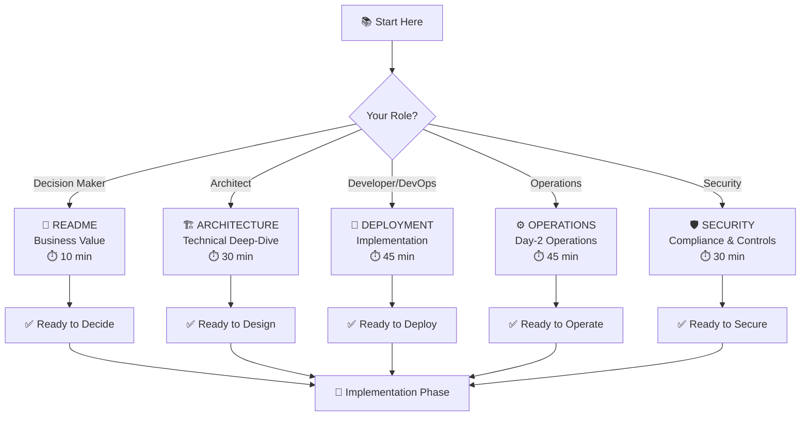
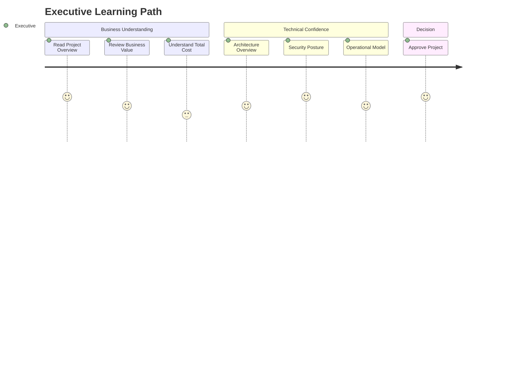
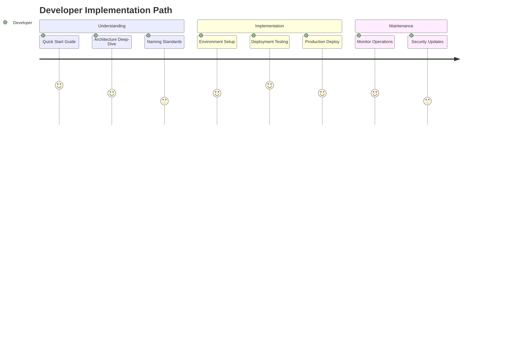
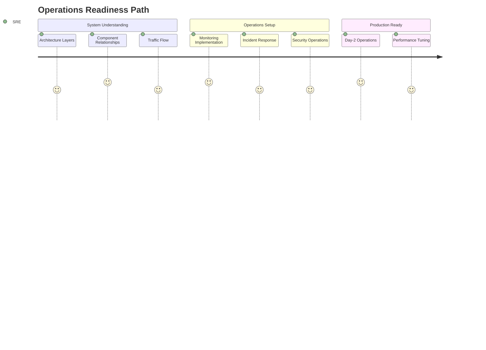

# 📚 Azure Stamps Pattern - Documentation Hub

> **🎯 Central Navigation**: Your complete guide to understanding, deploying, and operating the Azure Stamps Pattern enterprise architecture. Choose your path based on your role and requirements.

## 🗺️ **Learning Journey Map**



---

## 🎯 **Documentation Overview**

The Azure Stamps Pattern provides a comprehensive, enterprise-ready infrastructure solution with complete documentation for all phases of implementation and operation.

### 📖 **Documentation Portfolio**

| 📚 Guide | 🎯 Purpose | 👥 Primary Audience | 📊 Complexity | ⏱️ Read Time |
|----------|------------|---------------------|---------------|--------------|
| [📄 **README.md**](./README.md) | Project overview, quick start, business value | All stakeholders | ⭐⭐ | 10 min |
| [🏗️ **ARCHITECTURE_GUIDE.md**](./ARCHITECTURE_GUIDE.md) | Technical deep-dive, system design, traffic flow | Solution Architects, DevOps Engineers | ⭐⭐⭐⭐ | 30 min |
| [🚀 **DEPLOYMENT_GUIDE.md**](./DEPLOYMENT_GUIDE.md) | Step-by-step deployment procedures | DevOps Engineers, Platform Engineers | ⭐⭐⭐ | 45 min |
| [⚙️ **OPERATIONS_GUIDE.md**](./OPERATIONS_GUIDE.md) | Day-2 operations, monitoring, maintenance | SRE Teams, Operations Engineers | ⭐⭐⭐⭐ | 45 min |
| [🛡️ **SECURITY_GUIDE.md**](./SECURITY_GUIDE.md) | Security baseline, compliance, controls | Security Engineers, Compliance Teams | ⭐⭐⭐⭐ | 30 min |
| [📋 **NAMING_CONVENTIONS.md**](./NAMING_CONVENTIONS.md) | Resource naming standards and Azure best practices | All technical teams | ⭐⭐ | 15 min |

### 🎭 **Role-Based Documentation Paths**

#### 👨‍💼 **For Decision Makers & Executives**


**📋 Recommended Path:**
1. **📄 [README.md](./README.md)** - Business value and project overview *(10 minutes)*
2. **🏗️ [ARCHITECTURE_GUIDE.md](./ARCHITECTURE_GUIDE.md#%EF%B8%8F-architecture-overview)** - High-level architecture *(15 minutes)*
3. **🛡️ [SECURITY_GUIDE.md](./SECURITY_GUIDE.md#-security-overview)** - Security and compliance posture *(15 minutes)*
4. **⚙️ [OPERATIONS_GUIDE.md](./OPERATIONS_GUIDE.md#-operations-overview)** - Operational model *(10 minutes)*

#### 👨‍💻 **For Developers & DevOps Engineers**


**📋 Recommended Path:**
1. **📄 [README.md](./README.md)** - Quick start and prerequisites *(10 minutes)*
2. **🚀 [DEPLOYMENT_GUIDE.md](./DEPLOYMENT_GUIDE.md)** - Step-by-step deployment *(45 minutes)*
3. **📋 [NAMING_CONVENTIONS.md](./NAMING_CONVENTIONS.md)** - Naming standards *(15 minutes)*
4. **🏗️ [ARCHITECTURE_GUIDE.md](./ARCHITECTURE_GUIDE.md)** - Technical deep-dive *(30 minutes)*

#### 👨‍🔧 **For Platform & Operations Teams**


**📋 Recommended Path:**
1. **🏗️ [ARCHITECTURE_GUIDE.md](./ARCHITECTURE_GUIDE.md)** - System understanding *(30 minutes)*
2. **⚙️ [OPERATIONS_GUIDE.md](./OPERATIONS_GUIDE.md)** - Monitoring and maintenance *(45 minutes)*
3. **🛡️ [SECURITY_GUIDE.md](./SECURITY_GUIDE.md)** - Security operations *(30 minutes)*
4. **🚀 [DEPLOYMENT_GUIDE.md](./DEPLOYMENT_GUIDE.md#-post-deployment-validation)** - Validation procedures *(20 minutes)*

## 🔍 **Quick Reference & Common Tasks**

### 🚀 **Deployment Quick Links**
| Task | Documentation | Time Required |
|------|---------------|---------------|
| 🌟 **Simple 2-Region Setup** | [DEPLOYMENT_GUIDE - Option 1](./DEPLOYMENT_GUIDE.md#-option-1-simple-two-region-setup-recommended-for-getting-started) | 45 minutes |
| 🌍 **Enterprise Multi-GEO** | [DEPLOYMENT_GUIDE - Option 2](./DEPLOYMENT_GUIDE.md#-option-2-global-multi-geo-setup-production) | 2-3 hours |
| 🔧 **Automation Setup** | [DEPLOYMENT_GUIDE - Automation](./DEPLOYMENT_GUIDE.md#-automation-options) | 30 minutes |

### ⚙️ **Operations Quick Links**
| Task | Documentation | Time Required |
|------|---------------|---------------|
| 🏠 **Add New Tenant (CELL)** | [OPERATIONS_GUIDE - Adding Tenants](./OPERATIONS_GUIDE.md#-adding-new-tenants-cells) | 20 minutes |
| 🚨 **Incident Response** | [OPERATIONS_GUIDE - Incident Response](./OPERATIONS_GUIDE.md#-incident-response) | 15 minutes |
| 📊 **Monitoring Setup** | [OPERATIONS_GUIDE - Monitoring](./OPERATIONS_GUIDE.md#-monitoring--observability) | 30 minutes |
| 🔧 **Troubleshooting** | [OPERATIONS_GUIDE - Troubleshooting](./OPERATIONS_GUIDE.md#%EF%B8%8F-troubleshooting-guide) | Variable |

### 🛡️ **Security Quick Links**
| Task | Documentation | Time Required |
|------|---------------|---------------|
| ✅ **Security Baseline** | [SECURITY_GUIDE - Overview](./SECURITY_GUIDE.md#-security-overview) | 30 minutes |
| 🔐 **Identity Setup** | [SECURITY_GUIDE - Identity](./SECURITY_GUIDE.md#-identity--access-management) | 45 minutes |
| 📋 **Compliance Checklist** | [SECURITY_GUIDE - Compliance](./SECURITY_GUIDE.md#-compliance-frameworks) | 20 minutes |

### �️ **Architecture Reference**

#### **📐 System Layers**
```
🌍 Global Layer    → DNS, Traffic Manager, Front Door, Global Functions
🚪 Geodes Layer    → API Management (APIM), Global Control Plane Cosmos DB
🏢 Regional Layer  → Application Gateway, Key Vault, Automation Account
🏠 CELL Layer      → Container Apps, SQL Database, Storage Account
```

#### **🔄 Traffic Flow**
```
User → Front Door → Traffic Manager → APIM Gateway → App Gateway → Container Apps → SQL Database
```

#### **📊 Key Metrics**
- **Availability Target**: 99.95% global uptime
- **Performance Target**: <100ms global response time
- **Scale Target**: Unlimited tenants per region
- **Security Target**: Zero-trust architecture

---

## 🤝 **Getting Help**

### 📝 **Documentation Feedback**
If you find gaps or areas for improvement in this documentation:
1. Review the specific guide for detailed information
2. Check the troubleshooting sections for common issues
3. Refer to the architecture guide for technical context

### 🔧 **Implementation Support**
- **Architecture Questions**: [ARCHITECTURE_GUIDE.md](./ARCHITECTURE_GUIDE.md)
- **Deployment Issues**: [DEPLOYMENT_GUIDE.md](./DEPLOYMENT_GUIDE.md)
- **Operations Problems**: [OPERATIONS_GUIDE.md](./OPERATIONS_GUIDE.md)
- **Security Concerns**: [SECURITY_GUIDE.md](./SECURITY_GUIDE.md)

### 📚 **Additional Resources**
- **Azure Documentation**: [Azure Architecture Center](https://docs.microsoft.com/en-us/azure/architecture/)
- **Stamps Pattern**: [Azure Application Architecture Guide](https://docs.microsoft.com/en-us/azure/architecture/guide/)
- **Multi-Tenant SaaS**: [SaaS Architecture Guidance](https://docs.microsoft.com/en-us/azure/architecture/example-scenario/apps/sap-production)

### 🔐 **Security Highlights**
- Multi-layer WAF protection
- Azure B2C multi-tenant identity
- End-to-end encryption
- Compliance-ready (SOC 2, ISO 27001, HIPAA, GDPR)

## 📊 **Document Maintenance**

### 📅 **Last Updated**
- Documentation suite: August 2025
- Architecture patterns: Current with Azure best practices
- Security baselines: Aligned with Azure Security Benchmark v3

### 🔄 **Update Process**
1. All documentation is maintained in markdown for version control
2. Updates should be made via pull requests with technical review
3. Major architecture changes require documentation updates in parallel

### 📞 **Documentation Feedback**
- Technical questions: Open GitHub issues
- Documentation improvements: Submit pull requests
- Enterprise support: Contact your Microsoft representative

---

## 🏷️ **Navigation Tips**

### 📱 **Mobile/Quick Reference**
- Each guide has a table of contents for easy navigation
- Use browser search (Ctrl+F) to find specific topics quickly
- Cross-references between guides use clear hyperlinks

### 🖥️ **Desktop/Deep Dive**
- Open multiple guides in separate tabs for cross-reference
- Use the search functionality in your IDE/editor
- Bookmark specific sections for frequent reference

---

**🎯 Start Here**: New to the project? Begin with [README.md](./README.md)

**⚡ Quick Deploy**: Ready to deploy? Jump to [DEPLOYMENT_GUIDE.md](./DEPLOYMENT_GUIDE.md)

**🏗️ Deep Dive**: Want technical details? Explore [ARCHITECTURE_GUIDE.md](./ARCHITECTURE_GUIDE.md)
