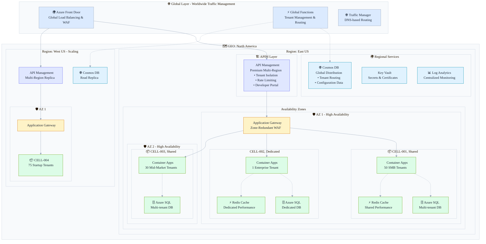

# Azure Stamps Pattern - Enterprise CAF/WAF Compliant Architecture (94/100 Overall)

**Version:** 1.2.1 | **Latest Release:** [v1.2.1 - Documentation & Version Management](./CHANGELOG.md#121---2025-08-14) | **[View Changelog](./CHANGELOG.md)**


**Azure Stamps Pattern** addresses the critical challenge facing enterprise SaaS providers: how to deliver secure, compliant, and cost-effective multi-tenant solutions at global scale without compromising on performance or regulatory requirements. This comprehensive, production-grade reference architecture eliminates months of architectural planning and provides a proven foundation for building enterprise SaaS platforms on Azure.

Achieving an industry-leading **94/100 overall [CAF/WAF compliance score](./docs/CAF_WAF_COMPLIANCE_ANALYSIS.md#framework-scorecard)** (with **96/100 WAF Security**), this framework implements a modular, zero-trust, and policy-driven approach that has been battle-tested in regulated industries including healthcare, financial services, and government sectors. Organizations can deploy production-ready infrastructure in under 45 minutes while meeting the most stringent security and compliance requirements.

It also aligns with Azure Landing Zones (ALZ), providing clear mapping for platform and workload landing zones, management group hierarchy, and policy-as-code guardrails. For practical implementation guidance, see the [Azure Landing Zones Guide](./docs/LANDING_ZONES_GUIDE.md).

**The unique [zone-aware architecture](./docs/ARCHITECTURE_GUIDE.md) (GEO → Region → Availability Zone → CELL)** supports both shared and dedicated tenancy models, enabling organizations to optimize costs with shared CELLs for SMB clients ($8-16/tenant/month) while providing dedicated CELLs for enterprise customers requiring compliance isolation ($3,200+/tenant/month). This flexibility delivers up to 10-50x cost reduction for smaller tenants while ensuring enterprise-grade isolation for regulated workloads.

**Key business benefits include:**
- **Enterprise-Ready Security**: End-to-end zero-trust network design with 85-90% JWT validation performance improvement, private endpoints, and automated policy enforcement ([Security Guide](./docs/SECURITY_GUIDE.md))
- **Modern Identity**: Microsoft Entra External ID (customers) integration with legacy B2C fallback for gradual migration ([Developer Security Guide](./docs/DEVELOPER_SECURITY_GUIDE.md))
- **Proven Compliance**: Pre-built compliance frameworks for HIPAA, SOC 2, PCI-DSS, and GDPR with automated audit trails and policy enforcement ([CAF/WAF Analysis](./docs/CAF_WAF_COMPLIANCE_ANALYSIS.md))
- **AI-Driven Operations**: Predictive scaling and intelligent monitoring reduce operational overhead by 25-40% while providing real-time insights through executive dashboards ([Operations Guide](./docs/OPERATIONS_GUIDE.md))
- **Economic Flexibility**: Mixed tenancy models support growth from startup to enterprise scale with seamless migration paths and tier-based pricing ([Architecture Guide](./docs/ARCHITECTURE_GUIDE.md))
- **Global Resilience**: Multi-region, multi-zone deployment with automated failover and disaster recovery ensures 99.99%+ availability ([AZ Architecture](./docs/ARCHITECTURE_GUIDE.md#availability-zone-architecture))
- **Cloud Capacity Management**: Modular design enables rapid deployment in alternative locations when regions reach capacity, ensuring business continuity despite cloud supply constraints
- **Developer Velocity**: Parameterized templates, comprehensive documentation, and CI/CD integration accelerate time-to-market by 60-80% ([Parameterization Guide](./docs/PARAMETERIZATION_GUIDE.md))

**Perfect for organizations building mission-critical SaaS platforms** in healthcare (patient data isolation), financial services (regulatory compliance), government (data sovereignty), or any industry where security, compliance, and scalability are non-negotiable. The pattern provides a proven foundation to accelerate your SaaS journey, reduce architectural risk, and deliver measurable business value from day one.

---

## 🏗️ Architecture at a Glance

The Azure Stamps Pattern implements a sophisticated **GEO → Region → Availability Zone → CELL** hierarchy that supports both shared and dedicated tenancy models with enterprise-grade security and global distribution.



### 🎯 **Key Enterprise Services & Their Roles**

| Service | Purpose | Tenancy Model | Enterprise Benefits |
|---------|---------|---------------|-------------------|
| 🌐 **Traffic Manager** | DNS-based global traffic routing and failover | Global profile with multiple endpoints | Automatic failover, geographic routing, performance-based routing |
| 🌍 **Azure Front Door** | Global load balancing and WAF protection | Global with zone redundancy | DDoS protection, SSL termination, caching |
| 🔌 **API Management (APIM)** | Multi-region API gateway with tenant isolation | Premium tier with multi-region | Rate limiting, developer portals, policy enforcement |
| 🚪 **Application Gateway** | Regional traffic routing and WAF | Zone-redundant per region | SSL offloading, path-based routing, security |
| 🐳 **Container Apps** | Serverless application hosting | Shared or dedicated per CELL | Auto-scaling, zero-downtime deployments |
| ⚡ **Redis Cache** | Performance acceleration | Shared or dedicated per tenant tier | 80-90% database hit reduction, sub-ms latency |
| 🗄️ **Azure SQL** | Tenant data storage | Shared schemas or dedicated databases | Enterprise security, backup, performance insights |
| 🌐 **Cosmos DB** | Global tenant routing and configuration | Multi-region with consistency | 99.999% availability, global distribution |
| 🔐 **Key Vault** | Secrets and certificate management | Per region with private endpoints | Hardware security modules, audit logging |

**💡 Architecture Highlights:**
- **🏠 Mixed Tenancy**: Shared CELLs for cost optimization ($8-16/tenant) + Dedicated CELLs for enterprise compliance ($3,200+/tenant)
- **🌍 Global Resilience**: Multi-region deployment with automatic failover and disaster recovery
- **🛡️ Zone Distribution**: 0-3 availability zones per CELL for different SLA requirements  
- **🔒 Zero-Trust Security**: Private endpoints, managed identities, and network micro-segmentation
- **📊 AI-Driven Operations**: Predictive scaling and intelligent monitoring across all layers


---

Note: See [CAF/WAF Compliance Analysis](./docs/CAF_WAF_COMPLIANCE_ANALYSIS.md) for framework mapping and scoring, then map implementation to your enterprise platform using the [Azure Landing Zones Guide](./docs/LANDING_ZONES_GUIDE.md).

## 🚀 Quick Links

- [📚 Documentation Hub](./docs/DOCS.md)
- [� Executive Brief (CIO)](./docs/one-pagers/executive-brief-cio.md)
- [�👩‍💻 Developer Quickstart](./docs/DEVELOPER_QUICKSTART.md)
- [🧪 Run Locally (Functions + Emulator)](./docs/DEPLOYMENT_GUIDE.md#-run-locally-functions--emulator)
- [🏗️ Architecture Guide](./docs/ARCHITECTURE_GUIDE.md)
- [🚀 Deployment Guide](./docs/DEPLOYMENT_GUIDE.md)
- [⚙️ Operations Guide](./docs/OPERATIONS_GUIDE.md)
- [🛡️ Security Guide](./docs/SECURITY_GUIDE.md)
- [🏆 CAF/WAF Compliance Analysis](./docs/CAF_WAF_COMPLIANCE_ANALYSIS.md)
- [🌐 Azure Landing Zones Guide](./docs/LANDING_ZONES_GUIDE.md)
- [🆕 What’s New](./docs/releases/v0.9.0-local-run.md)
- [Known Issues](./docs/KNOWN_ISSUES.md)
- [Contributing](#contributing)
- [Support](#support--community)

---

## 💡 Why This Project?

**What makes this implementation unique?**
- 🛡️ Enhanced Zero-Trust Security: Network micro-segmentation with private endpoints and managed identities
- 📜 Automated Governance: Azure Policy as Code ensuring 100% compliance enforcement
- 🤖 AI-Driven Operations: Intelligent monitoring, predictive scaling, and cost optimization
- 🔐 Advanced Security: Customer-managed encryption, private endpoints, enhanced JWT validation
- 📊 Operational Excellence: Real-time insights with comprehensive dashboards and alerting
- ⚡ High Performance: Intelligent caching and query optimization for enterprise scale

**Why choose this for enterprise SaaS?**
The pattern solves critical enterprise challenges with flexible tenancy models while maintaining the highest security and compliance standards. You can optimize costs with shared CELLs for smaller clients ($8-16/tenant/month) while providing dedicated CELLs for enterprise customers requiring compliance, custom configurations, or performance guarantees ($3,200/tenant/month).

This pattern is particularly powerful for regulated industries (healthcare, financial services, government) where dedicated isolation and comprehensive compliance aren't just preferred, they're mandatory for regulatory adherence.

---

## 👥 Who Should Use This?

This solution is designed for:

- **IT Leaders & Decision Makers:** Seeking secure, compliant, and cost-optimized SaaS for regulated industries.
- **Enterprise Architects:** Designing multi-tenant, scalable, and zero-trust Azure solutions.
- **DevOps & Platform Engineers:** Deploying, automating, and operating complex Azure environments.
- **Security & Compliance Teams:** Enforcing policy-as-code, identity, and regulatory controls.
- **Developers:** Building, testing, and extending SaaS features in a modern Azure environment.

---

## 🏁 How to Get Started

1. **Review the [Documentation Hub](./docs/DOCS.md)** for a guided overview.
2. **Clone the repository:**
   ```sh
   git clone <repository-url>
   cd StampsPattern
   ```
3. **Install prerequisites:** Azure CLI, Bicep CLI, PowerShell 7+ (see [Deployment Guide](./docs/DEPLOYMENT_GUIDE.md)).
4. **Choose your tenancy model:** Shared, Dedicated, or Mixed (see [Quick Start](#-quick-start---choose-your-tenancy-model)).
5. **Deploy using scripts or portal:**
    - PowerShell: `./scripts/deploy-stamps.ps1`
    - Bash: `./scripts/deploy-stamps.sh`
        - Azure Portal: <a href="https://aka.ms/deploytoazurebutton" target="_blank" rel="noopener" title="Opens in a new tab">Deploy to Azure</a>&nbsp;<sup>↗</sup>
6. **Test your deployment:** Use provided scripts and dashboards.

---

## 🗺️ Start Here: Documentation Overview

> **New to this solution?** Begin with the [📚 Documentation Hub](./docs/DOCS.md) for a guided sitemap, learning paths, and role-based quick starts. See the [Glossary](./docs/GLOSSARY.md) for key terms and the [FAQ](./docs/KNOWN_ISSUES.md) for common questions.

**📋 Complete Documentation Index**: [DOCS.md](./docs/DOCS.md) - Master documentation sitemap with navigation guide and role-based learning paths.

### 📖 Main Guides

| Guide | Purpose | Audience | Link |
|-------|---------|----------|------|
| 🏗️ Architecture Guide | Technical deep-dive: layers, traffic flow, zero-trust security | Solution Architects, DevOps Engineers | [ARCHITECTURE_GUIDE.md](./docs/ARCHITECTURE_GUIDE.md) |
| � Deployment Architecture Patterns | Single vs multi-subscription patterns, hub/host architecture | Solution Architects, DevOps Engineers | [DEPLOYMENT_ARCHITECTURE_GUIDE.md](./docs/DEPLOYMENT_ARCHITECTURE_GUIDE.md) |
| �📋 Parameterization Guide | Template customization for multi-org deployment | DevOps Engineers, Platform Teams | [PARAMETERIZATION_GUIDE.md](./docs/PARAMETERIZATION_GUIDE.md) |
| 🚀 Deployment Guide | Step-by-step deployment procedures and automation | DevOps Engineers, Platform Engineers | [DEPLOYMENT_GUIDE.md](./docs/DEPLOYMENT_GUIDE.md) |
| 🧭 Management Portal Guide | Using the management portal for tenant and cell administration | Operators, Platform Administrators | [MANAGEMENT_PORTAL_USER_GUIDE.md](./docs/MANAGEMENT_PORTAL_USER_GUIDE.md) |
| ⚙️ Operations Guide | Monitoring, maintenance, incident response procedures | SRE Teams, Operations Teams | [OPERATIONS_GUIDE.md](./docs/OPERATIONS_GUIDE.md) |
| 🛡️ Security Guide | Security baseline, compliance, enterprise controls | Security Engineers, Compliance Teams | [SECURITY_GUIDE.md](./docs/SECURITY_GUIDE.md) |
| 🏆 CAF/WAF Compliance | Enterprise compliance scorecard and framework alignment | C-Level, Enterprise Architects | [CAF_WAF_COMPLIANCE_ANALYSIS.md](./docs/CAF_WAF_COMPLIANCE_ANALYSIS.md) |
| 🌐 Azure Landing Zones Guide | Placement within ALZ (MG hierarchy, guardrails, IaC) | Platform/ALZ Teams, Solution Architects | [LANDING_ZONES_GUIDE.md](./docs/LANDING_ZONES_GUIDE.md) |
| 💰 Cost Optimization Guide | Cost levers, tenancy economics, scaling patterns | Architects, Finance, Platform Teams | [COST_OPTIMIZATION_GUIDE.md](./docs/COST_OPTIMIZATION_GUIDE.md) |
| 📋 Naming Conventions | Resource naming standards and policy enforcement | All Teams | [NAMING_CONVENTIONS_GUIDE.md](./docs/NAMING_CONVENTIONS_GUIDE.md) |
| 📝 Glossary | Key terms and concepts | All | [GLOSSARY.md](./docs/GLOSSARY.md) |
| ❓ FAQ / Known Issues | Troubleshooting and common questions | All | [KNOWN_ISSUES.md](./docs/KNOWN_ISSUES.md) |

---

## 🚀 Quick Start - Choose Your Tenancy Model

### 📋 Before You Begin
Ensure you have these tools installed:
- ✅ <a href="https://learn.microsoft.com/en-us/cli/azure/install-azure-cli" target="_blank" rel="noopener" title="Opens in a new tab">Azure CLI</a>&nbsp;<sup>↗</sup> (v2.50.0+)  
- ✅ <a href="https://learn.microsoft.com/en-us/azure/azure-resource-manager/bicep/install" target="_blank" rel="noopener" title="Opens in a new tab">Bicep CLI</a>&nbsp;<sup>↗</sup> (v0.20.0+)
- ✅ PowerShell 7+ (for enhanced deployment script)
- ✅ Azure subscription with **Contributor** access

**🔧 Multi-Organization Support**: For custom domains and organization-specific deployments, see the [📋 Parameterization Guide](./docs/PARAMETERIZATION_GUIDE.md) for template customization options.

### 🎯 Choose Your Tenancy Model

#### 🏠 Mixed Model (Recommended - Supports All Tenant Types)
Deploy both shared and dedicated CELLs for maximum flexibility.

```powershell
# 1️⃣ Clone and setup
git clone <repository-url>
cd StampsPattern

# 2️⃣ Deploy mixed tenancy model with 3 zones for maximum resilience
.\scripts\deploy-stamps.ps1 `
  -ResourceGroupName "rg-stamps-prod" `
  -Location "eastus" `
  -TenancyModel "mixed" `
  -AvailabilityZones "3" `
  -Environment "prod"
```

**⏱️ Deployment time**: ~45 minutes  
**💰 Monthly cost**: $8-3,200 per tenant (tier-based)  
**🎯 Use case**: Full SaaS platform, all business sizes

#### 💰 Shared-Only Model (Cost-Optimized)
Optimize for cost with shared CELLs for small-medium tenants.

```powershell
# Deploy shared tenancy model
.\scripts\deploy-stamps.ps1 `
  -ResourceGroupName "rg-stamps-shared" `
  -Location "eastus" `
  -TenancyModel "shared" `
  -MaxSharedTenantsPerCell 100
```

**⏱️ Deployment time**: ~30 minutes  
**💰 Monthly cost**: $8-16 per tenant  
**🎯 Use case**: SMB focus, startups, cost-sensitive market

#### 🏢 Dedicated-Only Model (Enterprise-Grade)
Maximum isolation for enterprise and compliance-focused clients.

```powershell
# Deploy dedicated tenancy model
.\scripts\deploy-stamps.ps1 `
  -ResourceGroupName "rg-stamps-enterprise" `
  -Location "eastus" `
  -TenancyModel "dedicated" `
  -EnableCompliance @("HIPAA", "SOX")
```

**⏱️ Deployment time**: ~60 minutes  
**💰 Monthly cost**: $3,200+ per tenant  
**🎯 Use case**: Enterprise clients, regulated industries

---

## 🤝 Contributing

We welcome contributions! Please see our contribution guidelines:

### 📝 Development Workflow
1. 🍴 Fork the repository
2. 🌿 Create a feature branch (`git checkout -b feature/amazing-feature`)
3. 💾 Commit your changes (`git commit -m 'Add amazing feature'`)
4. 📤 Push to the branch (`git push origin feature/amazing-feature`)
5. 🔀 Open a Pull Request

### 🧪 Testing Requirements
- ✅ Bicep templates must compile without errors
- ✅ Include parameter validation
- ✅ Test in development environment before production
- ✅ Update documentation for new features

## 📞 Support & Community

### 💬 Getting Help
- 📚 **Documentation**: Start with our comprehensive guides
- 🐛 **Issues**: <a href="https://github.com/srnichols/StampsPattern/issues" target="_blank" rel="noopener" title="Opens in a new tab">GitHub Issues</a>&nbsp;<sup>↗</sup> for bugs and feature requests
 - 💡 **Q&A**: Use <a href="https://github.com/srnichols/StampsPattern/issues" target="_blank" rel="noopener" title="Opens in a new tab">GitHub Issues</a>&nbsp;<sup>↗</sup> with the `question` label
- 📧 **Enterprise Support**: Contact your Microsoft representative

---

## 👥 Contributors

<a href="https://github.com/srnichols/StampsPattern/graphs/contributors" target="_blank" rel="noopener" title="Opens in a new tab"></a>&nbsp;<sup>↗</sup>

Thanks to all the amazing people who have contributed to this project. Want to help? See [CONTRIBUTING.md](./CONTRIBUTING.md).

, View the full list: <a href="https://github.com/srnichols/StampsPattern/graphs/contributors" target="_blank" rel="noopener" title="Opens in a new tab">https://github.com/srnichols/StampsPattern/graphs/contributors</a>&nbsp;<sup>↗</sup>

---

## 📄 License

This project is licensed under the MIT License - see the [LICENSE](LICENSE) file for details.

---

**🌟 Made with ❤️ by the Azure community** | **⭐ Star this repo if it helped you!**


