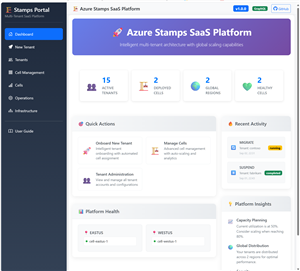

# Sample Galleries Index

A visual index of sample app galleries and the management portal. Click a thumbnail to open the gallery page with full-size screenshots and captions.

## Galleries

| Management Portal | TaskTracker |
|---|---|
| [](management-portal/docs/SCREENSHOTS.md)<br>**Management Portal**<br>Overview dashboard, tenant and cell management screenshots. | [](samples/TaskTracker/docs/SCREENSHOTS.md)<br>**TaskTracker**<br>Home, New Task and Edit Task screenshots. |

---

## How to add a gallery

1. Create a `docs/SCREENSHOTS.md` in your sample folder.
2. Add images to that `docs/` folder and (optionally) a `thumbnails/` subfolder.
3. To validate galleries locally, run the validator script from the repo root:

```powershell
pwsh -NoProfile -ExecutionPolicy Bypass -File .\scripts\validate-galleries.ps1
```

The validator checks every `SCREENSHOTS.md` in the repository for missing image references and reports any problems.

