# 🏗️ Azure Stamps Pattern - Architecture (ASPA) - Enterprise Guide (CAF/WAF Compliant)

## 🏗 Architecture Overview

See first: **[CAF/WAF Compliance Analysis](./CAF_WAF_COMPLIANCE_ANALYSIS.md)**, framework mapping and scoring details. Alignment note: this guide references CAF/WAF throughout; to see how these translate into enterprise landing zones, see the companion [Azure Landing Zones Guide](./LANDING_ZONES_GUIDE.md).

This Architecture Overview provides a concise tour of the Azure Stamps Pattern architecture, layers, flows, and core decisions so you can design, build, and scale compliant multi-tenant systems with confidence.

This solution implements a sophisticated **GEO → Region → Availability Zone → CELL** hierarchy using Azure's stamps pattern for maximum scalability, isolation, and global distribution. Availability Zones (AZs) are a critical layer for high availability (HA) and disaster recovery (DR), allowing each CELL to be deployed in 0, 1, 2, or 3 zones depending on business and SLA requirements.

> **Global Capacity Management & Cloud Supply Constraints**
>
> All major cloud providers occasionally face regional or zone capacity limits for compute and storage resources, due to demand surges, supply chain disruptions, or quota exhaustion. The Azure Stamps Pattern architecture is designed to address this reality: its modular, zone-aware, and multi-region CELL approach enables organizations to deploy new workloads or scale existing ones in any available region or zone, minimizing business disruption. If a preferred region or AZ is at capacity, new CELLs can be provisioned elsewhere with minimal reconfiguration, ensuring business continuity and operational agility even in constrained environments.
---

## 🧭 Quick Navigation

| Section | Focus Area | Time to Read | Best for |
|---------|------------|--------------|----------|
| [🏗 Architecture Overview](#-architecture-overview) | High-level design and hierarchy | 10 min | All readers |
| [🏛 Architecture Layers](#-architecture-layers) | Component breakdown | 15 min | Architects, Devs |
| [🚀 Traffic Flow](#-traffic-flow-architecture) | Request/data flow | 10 min | DevOps, Network |
| [🔒 Security Architecture](#-security-architecture) | Multi-layer security | 15 min | Security Teams |
| [📊 Monitoring & Observability](#-monitoring--observability) | Observability strategy | 10 min | Operations |
| [🌱 Scaling Strategies](#-scaling-strategies) | Growth/expansion | 5 min | IT Leaders |

---

## 🧭 Quick Navigation

### 🌍 **Visual: Global Architecture Hierarchy with Availability Zones**

```mermaid
%%{init: {"theme":"base","themeVariables":{"background":"transparent","primaryColor":"#E6F0FF","primaryTextColor":"#1F2937","primaryBorderColor":"#94A3B8","lineColor":"#94A3B8","secondaryColor":"#F3F4F6","tertiaryColor":"#DBEAFE","clusterBkg":"#F8FAFC","clusterBorder":"#CBD5E1","edgeLabelBackground":"#F8FAFC","fontFamily":"Segoe UI, Roboto, Helvetica, Arial, sans-serif"}} }%%
flowchart TB
    subgraph "🌐 Global Layer"
        FD[Azure Front Door<br/>Global Load Balancing]
        TM[Traffic Manager<br/>DNS-based Routing]
        GF[Global Functions<br/>Tenant Management]
    end
    
    subgraph "🌍 GEO: North America"
        subgraph "🏢 Region: East US"
            subgraph "🗂️ AZ 1"
                AG1[App Gateway<br/>Zone-Redundant]
                C1[CELL-001<br/>Shared: 50 tenants]
                C2[CELL-002<br/>Dedicated: 1 tenant]
            end
            subgraph "🗂️ AZ 2"
                C3[CELL-003<br/>Shared: 30 tenants]
            end
        end
        subgraph "🏢 Region: West US"
            subgraph "🗂️ AZ 1"
                AG2[App Gateway<br/>Zone-Redundant]
                C4[CELL-004<br/>Shared: 75 tenants]
            end
            subgraph "🗂️ AZ 2"
                C5[CELL-005<br/>Dedicated: 1 tenant]
            end
        end
    end
    
    subgraph "🌍 GEO: Europe"
        subgraph "🏢 Region: West Europe"
            subgraph "🗂️ AZ 1"
                AG3[App Gateway<br/>Zone-Redundant]
                C6[CELL-006<br/>Enterprise GDPR]
            end
        end
    end
    
    FD --> AG1
    FD --> AG2
    FD --> AG3
    
    AG1 --> C1
    AG1 --> C2
    AG2 --> C4
    AG2 --> C5
    AG3 --> C6
```



_Figure: Global-to-CELL hierarchy with zone-aware deployment. Azure Front Door and Traffic Manager route to regional Application Gateways, which direct traffic to shared or dedicated CELLs per tenant policy and capacity._

### 🎯 **Key Design Principles (Explained)**

| Principle | What It Means | Real-World Analogy | Implementation |
|-----------|---------------|-------------------|----------------|
| **🏠 Flexible Tenant Isolation** | Support both shared and dedicated models | Apartment building vs. private house | Shared CELLs (cost-effective) + Dedicated CELLs (compliance) |
| **🌍 Global Distribution** | Serve users from nearby locations | McDonald's has locations worldwide | Multi-GEO deployment with regional failover |
| **🏢 Availability Zone Resilience** | Handle datacenter failures | Bank branches in different districts | 0-3 zones per CELL for regional HA/DR |
| **📈 Unlimited Scalability** | Grow without redesigning | Add more franchise locations | Add CELLs and regions without architectural changes |
| **🔒 Zero-Trust Security** | Verify everything, trust nothing | Airport security checks everyone | Private endpoints, managed identities, continuous verification |
| **📊 Operational Excellence** | See what's happening everywhere | Corporate dashboard for all locations | Per-tenant monitoring with aggregated insights |
| **💰 Cost Optimization** | Right-size resources automatically | Adjust staffing based on customer traffic | Auto-scaling with intelligent caching |

### 🚨 **Latest Security Enhancements (August 2025)**

**🔐 Zero-Trust Network Implementation**:

- **Private Endpoints Only**: All data services isolated from public internet
- **Conditional Firewall Rules**: SQL firewall rules deploy only when private endpoints disabled
- **Enhanced JWT Validation**: 85-90% performance improvement with JWKS caching
- **Managed Identity First**: 100% elimination of connection strings and passwords

**⚡ Performance & Security Gains**:

- Cosmos DB: Public access permanently disabled (`publicNetworkAccess: 'Disabled'`)
- JWT Validation: ~100-200ms → ~10-20ms latency reduction
- Database Security: All connections through private endpoints with zero external exposure
- Caching Layer: Redis distributed caching reduces database hits by 80-90%

## 🏗️ **Flexible Tenancy Models**

The Azure Stamps Pattern supports **multiple tenancy models** within the same architecture, providing maximum flexibility for different business requirements:

### 🏠 **Shared CELL Tenancy** (Multi-tenant per CELL)

**Use Case**: Cost-effective hosting for smaller tenants, startups, and standardized workloads

**Characteristics**:

- **10-100 smaller clients** can share a single CELL
- **Application-level isolation** within shared CELL resources
- **Shared infrastructure costs** across tenants in the same CELL
- **Standardized configurations** and shared resource pools
- **Cost-effective** for price-sensitive customers

**Isolation Strategy**:

- **Database schemas**: Separate schemas per tenant in shared SQL DB
- **Storage containers**: Tenant-specific blob containers within shared storage
- **API Management**: Tenant-specific rate limiting and access policies
- **Application routing**: Tenant ID-based data segregation

### 🏢 **Dedicated CELL Tenancy** (Single tenant per CELL)

**Use Case**: Enterprise clients, regulated industries, high-compliance requirements

**Characteristics**:

- **Large enterprise clients** get their own dedicated CELL
- **Complete infrastructure isolation** - separate SQL database, storage, container apps
- **Custom configurations** and performance guarantees
- **Regulatory compliance** ready for healthcare, financial services, government
- **Premium SLA** with dedicated resources and monitoring

**Isolation Strategy**:

- **Infrastructure-level**: Completely separate Azure resources per tenant
- **Network isolation**: Dedicated VNets and subnets
- **Separate databases**: Individual SQL databases per tenant
- **Dedicated monitoring**: Tenant-specific dashboards and alerts

### 📊 **Mixed Deployment Example**

```
GEO: UnitedStates
  ├─ Region: eastus
  │    ├─ CELL: shared-small-business (100 small tenants) 
  │    ├─ CELL: shared-mid-market (25 mid-size tenants)
  │    ├─ CELL: enterprise-bank-corp (1 dedicated tenant)
  │    └─ CELL: healthcare-system-a (1 dedicated tenant)
  └─ Region: westus
       ├─ CELL: shared-startups (50 startup tenants)
       └─ CELL: government-agency-x (1 dedicated tenant)

GEO: Europe
  ├─ Region: westeurope
  │    ├─ CELL: shared-eu-smb (75 small tenants)
  │    └─ CELL: fintech-enterprise-b (1 dedicated tenant)
  └─ Region: northeurope
       └─ CELL: banking-enterprise-eu-dr (1 dedicated tenant)
```

_Example: Mixed deployment across GEOs showing shared and dedicated CELLs for different tenant profiles; use as a reference when planning capacity and isolation._

### 🎯 **Tenant Decision Matrix**

| Tenant Profile | Recommended Model | Primary Benefits | Use Cases |
|----------------|------------------|------------------|-----------|
| **Startups/SMB** | Shared CELL | Lower cost, shared infrastructure | Cost-sensitive, standard features |
| **Mid-Market** | Shared or Dedicated | Flexible scaling options | Growing businesses, mixed needs |
| **Enterprise** | Dedicated CELL | Performance guarantees, customization | High volume, custom requirements |
| **Regulated Industries** | Dedicated CELL | Complete data isolation, audit trails | Healthcare, finance, government |
| **High-Growth** | Start Shared → Migrate to Dedicated | Cost optimization with growth path | Scaling businesses |

_Table: Use this decision matrix to select shared vs dedicated CELLs based on tenant profile, compliance needs, and growth expectations._

## 🔄 **Availability Zone Architecture**

Azure Availability Zones provide **intra-region high availability** by distributing resources across physically separate datacenters within the same region. Each CELL can be configured with 0-3 Availability Zones based on business requirements.

### 🏗️ **Zone Configuration Models**

| Zone Config | CELL Naming | Use Case | Availability SLA | Cost Impact |
|-------------|-------------|----------|------------------|-------------|
| **0 Zones** | `shared-smb-z0` | Development, testing | Standard SLA | Lowest cost |
| **1 Zone** | `dedicated-bank-z1` | Single zone deployment | Standard SLA | Standard cost |
| **2 Zones** | `shared-retail-z2` | Basic HA with failover | 99.95% SLA | +20% cost |
| **3 Zones** | `dedicated-health-z3` | Maximum resilience | 99.99% SLA | +40% cost |

### 🏛️ **Regional Architecture with Availability Zones**

```mermaid
%%{init: {"theme":"base","themeVariables":{"background":"transparent","primaryColor":"#E6F0FF","primaryTextColor":"#1F2937","primaryBorderColor":"#94A3B8","lineColor":"#94A3B8","secondaryColor":"#F3F4F6","tertiaryColor":"#DBEAFE","clusterBkg":"#F8FAFC","clusterBorder":"#CBD5E1","edgeLabelBackground":"#F8FAFC","fontFamily":"Segoe UI, Roboto, Helvetica, Arial, sans-serif"}} }%%
flowchart TD
    subgraph "🌍 GEO: United States"
        subgraph "🏢 Region: eastus"
            subgraph "Zone 1"
                Z1_C1[shared-smb-z3<br/>Zone 1 Resources]
                Z1_C2[dedicated-bank-z3<br/>Zone 1 Resources]
            end
            subgraph "Zone 2"
                Z2_C1[shared-smb-z3<br/>Zone 2 Resources]
                Z2_C2[dedicated-bank-z3<br/>Zone 2 Resources]
            end
            subgraph "Zone 3"
                Z3_C1[shared-smb-z3<br/>Zone 3 Resources]
                Z3_C2[dedicated-bank-z3<br/>Zone 3 Resources]
            end
            
            AG[Application Gateway<br/>Zone-Redundant]
            AG --> Z1_C1
            AG --> Z1_C2
            AG --> Z2_C1
            AG --> Z2_C2
            AG --> Z3_C1
            AG --> Z3_C2
        end
    end
    
    TM[Traffic Manager<br/>Global DNS] --> AG
```



_Figure: Regional architecture distributing traffic across zone-pinned instances. Application Gateway is zone-redundant and fans in to per-zone resources._

### 📊 **Zone-Aware Service Configuration**

#### **Zone-Redundant Services (Recommended)**

- **🔄 Application Gateway**: Automatically distributes across zones
- **🗄️ Azure SQL Database**: Zone-redundant database option
- **📊 Azure Cosmos DB**: Zone-redundant writes and reads
- **🔐 Azure Key Vault**: Zone-redundant by default in supported regions

#### **Zone-Pinned Services (CELL-Specific)**

- **🏗️ Container Apps Environment**: Pin to specific zones per CELL
- **💾 Storage Accounts**: Zone-redundant storage (ZRS) or specific zone
- **📦 Container Registry**: Zone-redundant with geo-replication

### 🎯 **CELL Zone Assignment Strategy**

```jsonc
// Example CELL configuration with zones
{
  "cells": [
    {
      "cellName": "shared-smb-z3",
      "tenancyModel": "shared",
      "availabilityZones": ["1", "2", "3"],
      "maxTenants": 100,
      "slaLevel": "Premium"
    },
    {
      "cellName": "dedicated-bank-z2", 
      "tenancyModel": "dedicated",
      "availabilityZones": ["1", "2"],
      "maxTenants": 1,
      "slaLevel": "Enterprise"
    },
    {
      "cellName": "shared-dev-z0",
      "tenancyModel": "shared", 
      "availabilityZones": [],
      "maxTenants": 50,
      "slaLevel": "Basic"
    }
  ]
}
```

_Listing: Example CELL configuration demonstrating how to express tenancy model and availability zones per CELL._

### 🚨 **Zone Failure Scenarios**

#### **Single Zone Failure (zones 1-3 configuration)**

- **Impact**: 33% capacity reduction
- **Response**: Traffic automatically redistributes to healthy zones
- **Recovery**: Auto-healing within remaining zones

#### **Multi-Zone Failure (zones 1-3 configuration)**  

- **Impact**: 66% capacity reduction
- **Response**: Regional failover triggers
- **Recovery**: Cross-region disaster recovery

#### **Complete Regional Failure**

- **Impact**: 100% regional capacity loss
- **Response**: Traffic Manager routes to backup region
- **Recovery**: Geo-disaster recovery procedures

**Why Availability Zones Matter:**

- **High Availability (HA):** Deploying CELLs across multiple AZs protects against datacenter failures.
- **Disaster Recovery (DR):** AZs enable rapid failover and business continuity.
- **Flexible Cost/SLA:** You can choose the number of AZs per CELL to balance cost and durability for each tenant or workload.

### 🌍 **Hierarchical Structure with Availability Zones**


_Figure: Layered view (GEO → Region → Zone → CELL) highlighting where isolation and redundancy are applied._

**📐 Architecture Dimensions:**

- **Depth**: 4 layers (GEO → Region → Zone → CELL)
- **Width**: Unlimited expansion at each layer
- **Zone Resilience**: 0-3 zones per CELL based on SLA requirements
- **Isolation**: Complete resource isolation per CELL with zone distribution
- **Redundancy**: Cross-zone, cross-region, and cross-geo replication

### 🔄 **Real-World Example with Zone Configuration**

```
GEO: UnitedStates
  ├─ Region: eastus (3 Availability Zones)
  │    ├─ CELL: shared-banking-z3 (Zones 1,2,3 - 99.99% SLA)
  │    │    ├─ Zone 1: Container Apps, SQL replica, Storage
  │    │    ├─ Zone 2: Container Apps, SQL replica, Storage  
  │    │    └─ Zone 3: Container Apps, SQL replica, Storage
  │    ├─ CELL: dedicated-healthcare-z2 (Zones 1,2 - 99.95% SLA)
  │    │    ├─ Zone 1: Dedicated resources
  │    │    └─ Zone 2: Dedicated resources
  │    └─ CELL: shared-retail-z1 (Zone 1 - Standard SLA)
  │         └─ Zone 1: Single zone deployment
  └─ Region: westus (DR Site)
       ├─ CELL: shared-banking-z3-dr (Zones 1,2,3)
       └─ CELL: dedicated-healthcare-z2-dr (Zones 1,2)

GEO: Europe  
  ├─ Region: westeurope (3 Availability Zones)
  │    ├─ CELL: shared-banking-eu-z3 (Zones 1,2,3)
  │    └─ CELL: dedicated-fintech-z3 (Zones 1,2,3 - Maximum resilience)
  └─ Region: northeurope (DR Site)
       └─ CELL: dedicated-fintech-z3-dr (Zones 1,2,3)
```

## 🏛 Architecture Layers

The Azure Stamps Pattern is built using a carefully orchestrated five-layer architecture that provides clear separation of concerns while maintaining scalability and operational excellence. Each layer serves a specific purpose in the overall system, from global traffic distribution down to individual tenant workloads. This layered approach enables independent scaling, clear operational boundaries, and simplified troubleshooting.

Use this section as a map: start at the Global Layer for entry points and control plane, then follow down to the CELL Layer for tenant workloads. Cross-cutting layers (Geodes, Monitoring) provide shared capabilities across all tiers.

### 1️⃣ **Global Layer** (`globalLayer.bicep`)

**Purpose**: Worldwide traffic distribution and control plane

**Components**:

- **🌐 Azure Front Door**: Global CDN, SSL termination, Web Application Firewall
- **📡 Traffic Manager**: DNS-based global load balancing with performance routing
- **🚪 API Management**: Enterprise API gateway deployed per geography (see Geodes Layer)
- **🌍 DNS Zone**: Custom domain management and DNS resolution
- **🚀 Azure Functions**: Global control plane functions across multiple regions
  - `GetTenantCellFunction`: Routes tenants to appropriate CELL
  - `CreateTenantFunction`: Provisions new tenant resources
  - `AddUserToTenantFunction`: Tenant user management
- **📊 Global Cosmos DB**: Multi-master global routing database
- **📈 Global Log Analytics**: Centralized monitoring and observability

### 2️⃣ **Regional Layer** (`regionalLayer.bicep`)

**Purpose**: Regional traffic routing and operational services

**Components**:

- **🔄 Application Gateway**: Regional WAF, SSL termination, path-based routing to CELLs
- **🔐 Azure Key Vault**: Regional secrets and certificate management
- **🤖 Automation Account**: Regional runbooks and operational automation
- **📊 Regional Log Analytics**: Regional monitoring and compliance

### 3️⃣ **CELL Layer** (`deploymentStampLayer.bicep`)

**Purpose**: Flexible tenant application instances supporting both shared and dedicated models with configurable zone resilience

**Components**:

- **🏗️ Container Apps Environment**: Kubernetes-based application hosting with tenant routing and zone distribution
- **🗄️ Azure SQL Database**: Configurable for shared schemas or dedicated databases per tenant with zone-redundant options
- **💾 Storage Account**: Tenant-specific blob containers with zone-redundant storage (ZRS) or zone-pinned options
- **🌌 CELL Cosmos DB**: Tenant data with configurable isolation levels and zone-redundant writes
- **📦 Container Registry**: Application container images with multi-tenant support and zone replication
- **🔍 Diagnostic Settings**: CELL-level monitoring with tenant correlation and zone-aware metrics

**Tenancy Flexibility**:

- **Shared Model**: Multiple tenants (10-100) share CELL resources with application-level isolation
- **Dedicated Model**: Single enterprise tenant gets complete CELL resource isolation
- **Hybrid Model**: Mix of shared and dedicated CELLs within the same region

**Zone Configuration**:

- **0 Zones (z0)**: Single zone deployment for development/testing
- **1 Zone (z1)**: Standard deployment in single zone
- **2 Zones (z2)**: Basic high availability with 99.95% SLA
- **3 Zones (z3)**: Maximum resilience with 99.99% SLA

### 4️⃣ **Cross-Cutting Layers**

#### **Geodes Layer** (`geodesLayer.bicep`)

- **🚪 API Management Premium**: Enterprise-grade multi-region API gateway with:
  - **Tenant-specific rate limiting**: Different quotas per tenant tier (Basic: 10K/hour, Premium: 50K/hour)
  - **API versioning**: Side-by-side v1/v2 API deployment capabilities
  - **Developer portals**: Self-service API documentation and key management
  - **Advanced security**: JWT validation, IP filtering, custom policies
  - **Multi-region active-active**: Global load balancing with automatic failover
  - **Request/response transformation**: Tenant-specific data format handling
  - **Comprehensive analytics**: Per-tenant API usage insights and SLA monitoring
- **🌌 Global Control Plane Cosmos DB**: Multi-region write replication for tenant routing

#### **Monitoring Layer** (`monitoringLayer.bicep`)

- **📈 Regional Log Analytics Workspaces**: Compliance and data residency
- **🔔 Azure Monitor**: Alerts and dashboards per region

## 🚀 Traffic Flow Architecture

Understanding how requests flow through the Azure Stamps Pattern is crucial for troubleshooting, performance optimization, and security analysis. This section explains the journey from user request to response with visual diagrams.

At a glance: Global ingress (Front Door/Traffic Manager) enforces security and georouting, APIM applies policy and resolves tenant → the request is routed to the correct CELL (shared or dedicated) where business logic executes.

### 🎯 **Traffic Flow Explained (For Beginners)**

Think of the traffic flow like ordering food delivery:

1. **You place an order** (User makes API request)
2. **Delivery app routes to nearest restaurant** (Front Door + Traffic Manager)
3. **Restaurant manager checks your account** (APIM + Tenant Resolution)
4. **Order goes to correct kitchen** (Route to appropriate CELL)
5. **Food is prepared and delivered** (Application processes request and returns response)

### 🌐 **Visual: Complete Request Flow**

```mermaid
%%{init: {"theme":"base","themeVariables":{"background":"transparent","primaryColor":"#E6F0FF","primaryTextColor":"#1F2937","primaryBorderColor":"#94A3B8","lineColor":"#94A3B8","secondaryColor":"#F3F4F6","tertiaryColor":"#DBEAFE","clusterBkg":"#F8FAFC","clusterBorder":"#CBD5E1","edgeLabelBackground":"#F8FAFC","fontFamily":"Segoe UI, Roboto, Helvetica, Arial, sans-serif"}} }%%
flowchart TD
    User[👤 User Request<br/>api.myapp.com/v1/data] --> FD[🌍 Azure Front Door<br/>Global CDN + WAF]
    
    FD --> TM[🗺️ Traffic Manager<br/>DNS Geo-routing]
    
    TM -->|"Closest Region"| APIM[🏢 API Management<br/>Enterprise Gateway]
    
    APIM -->|"Tenant ID Extraction"| GTF[⚙️ Global Function<br/>GetTenantCellFunction]
    
    GTF -->|"Query Global DB"| GDB[(🌍 Global Cosmos DB<br/>Tenant Directory)]
    
    GDB --> GTF
    GTF -->|"Return CELL Info"| APIM
    
    APIM -->|"Route Decision"| AG{🛡️ Application Gateway<br/>Regional Load Balancer}
    
    AG -->|"Shared Tenant"| SC[🏠 Shared CELL<br/>Multi-tenant App]
    AG -->|"Enterprise Tenant"| DC[🏢 Dedicated CELL<br/>Single-tenant App]
    
    SC --> SDB[(📊 Shared SQL Database<br/>Schema Isolation)]
    DC --> DDB[(🔒 Dedicated SQL Database<br/>Complete Isolation)]
    
    SDB --> SC
    DDB --> DC
    
    SC --> AG
    DC --> AG
    AG --> APIM
    APIM --> TM
    TM --> FD
    FD --> User
```



    ### 🔁 End-to-end runtime diagram (operator view)

    The diagram below is a compact operator-focused runtime view you can use during incidents to quickly identify which component to check next (network, auth, app, or data).

    ```mermaid
    %%{init: {"theme":"base","themeVariables":{"background":"transparent","primaryColor":"#E6F0FF","primaryTextColor":"#1F2937","primaryBorderColor":"#94A3B8","lineColor":"#94A3B8","secondaryColor":"#F3F4F6","tertiaryColor":"#DBEAFE","clusterBkg":"#F8FAFC","clusterBorder":"#CBD5E1","edgeLabelBackground":"#F8FAFC","fontFamily":"Segoe UI, Roboto, Helvetica, Arial, sans-serif"}} }%%
    sequenceDiagram
      autonumber
      participant User as User
      participant FD as FrontDoor
      participant TM as TrafficManager
      participant APIM as APIM
      participant GFunc as GetTenantFunc
      participant GDB as GlobalCosmosDB
      participant AG as AppGateway
      participant CA as ContainerApp(CELL)
      participant DAB as DAB(ContainerApp)
      participant COS as CosmosDB

      User->>FD: HTTPS request (edge)
      FD->>TM: Route to nearest region
      TM->>APIM: Forward request
      APIM->>GFunc: Tenant lookup call
      GFunc->>GDB: Query tenant routing
      GDB-->>GFunc: Tenant cell info
      GFunc-->>APIM: Return cell info
      APIM->>AG: Route to regional backend
      AG->>CA: Forward to CELL app instance
      CA->>COS: App queries tenant data
      CA-->>AG: Response
      AG-->>APIM: Response
      APIM-->>TM: Response path back
      TM-->>FD: Response
      FD-->>User: Final response

      Note over DAB,COS: DAB serves GraphQL for management portal and reads/writes to Cosmos
      DAB->>COS: GraphQL queries/mutations
      DAB-->>APIM: DAB may be behind APIM in some deployments

    ```

_Figure: End-to-end request path with tenant resolution. Note how APIM consults the global directory to select a CELL before regional routing occurs._

### 🔍 **Detailed: Tenant Resolution Process**

**Step 1: Request Analysis**

```
Incoming Request: GET https://api.myapp.com/v1/customers/123
Headers: Authorization: Bearer JWT_TOKEN
```

**Step 2: Tenant Identification**


_Figure: Tenant identification sequence from JWT to routing decision._

**Step 3: CELL Assignment Logic**

| Tenant Type | Criteria | Target CELL | Isolation Level |
|-------------|----------|-------------|-----------------|
| **Startup** | < 1000 users, Basic SLA | Shared CELL | Schema-based |
| **SMB** | 1000-10K users, Standard SLA | Shared CELL | Schema + Container |
| **Enterprise** | > 10K users, Premium SLA | Dedicated CELL | Complete Infrastructure |
| **Regulated** | HIPAA/SOX compliance required | Dedicated CELL | Air-gapped Infrastructure |

### 📊 **Performance Characteristics**

| Layer | Typical Latency | Purpose | Caching Strategy |
|-------|----------------|---------|------------------|
| **Front Door** | 10-50ms | Global CDN, WAF | Edge caching |
| **Traffic Manager** | 1-5ms | DNS resolution | DNS caching |
| **APIM Gateway** | 5-20ms | Policy enforcement | JWT caching |
| **Tenant Lookup** | 2-10ms | CELL resolution | Redis caching |
| **Application Gateway** | 5-15ms | Regional routing | Session affinity |
| **CELL Application** | 20-100ms | Business logic | Application caching |

**Total End-to-End**: **43-200ms** (Target: < 100ms for 95th percentile)

_Table: Typical latency by layer; use for SLO planning and performance baselining._

## 🏗️ Deployment Architecture

This section connects the conceptual layers to the actual deployment templates. Start with the orchestrator, understand the dependency chain, then apply the parameterization strategy.

### 📂 Template Orchestration

1. **`main.bicep`** - Master orchestrator using nested loops:

   ```bicep
   for (geo, geoIdx) in geos
   for (region, regionIdx) in geo.regions
   for (cell, cellIdx) in region.cells
   ```

2. **Dependency Chain**:

   ```
   Global Resources (DNS, Traffic Manager, Front Door)
       ↓
   Regional Resources (App Gateway, Key Vault, Automation)
       ↓
   CELL Resources (Apps, Databases, Storage)
   ```

_Figure: Orchestration and dependency flow from global to regional to CELL resources._

### 🎯 Parameterization Strategy

All environments configured through `geos` array in parameters:

```json
{
  "geos": [
    {
      "geoName": "UnitedStates",
      "regions": [
        {
          "regionName": "eastus",
          "keyVaultName": "kv-us-east",
          "cells": ["tenant-a", "tenant-b", "tenant-c"],
          "baseDomain": "us.contoso.com"
        }
      ]
    }
  ]
}
```

## 🔒 Security Architecture

Security in the Azure Stamps Pattern follows a comprehensive defense-in-depth strategy that implements zero-trust principles across all architectural layers. Rather than relying on perimeter security alone, every component, network segment, and data flow is protected with multiple overlapping security controls. This approach ensures that even if one security layer is compromised, multiple additional layers continue to protect your tenants' data and applications.

### 🛡️ Multi-Layer Security Model

1. **Global Security**:
   - Front Door WAF with OWASP rules
   - Traffic Manager DDoS protection
   - DNS-level filtering

2. **Regional Security**:
   - Application Gateway WAF v2
   - Key Vault for secrets management
   - Network Security Groups

3. **CELL Security**:
   - Isolated networking per tenant
   - Separate SQL databases with encryption
   - Container-level security policies

### 🔐 Identity & Access Management

#### 🎫 **Microsoft Entra External ID (customers) Integration**

**⚠️ Important Deployment Notes:**

- Microsoft Entra External ID (customers, formerly Azure AD B2C) tenants cannot be created or linked via Bicep/ARM
- Create and configure your External ID tenant manually in the Azure portal
- Register applications (client APIs/web apps) and configure user flows/policies (sign-up/sign-in, password reset) there

**Deployment Steps:**

1. Create your External ID tenant in the Azure portal (customers)
2. Create app registrations and user flows required by this app (e.g., signupsignin)
3. Set function app settings: EXTERNAL_ID_TENANT, EXTERNAL_ID_CLIENT_ID, EXTERNAL_ID_USER_FLOW (legacy B2C_* also supported)
4. Deploy the rest of your solution (`main.bicep` and related modules)

**Multi-Tenant Identity Architecture:**

```text
// External ID for customers cannot be created via Bicep/ARM.
// Use the Azure portal to create the tenant and configure user flows.
```

**Security Policies:**

- **Multi-Factor Authentication (MFA)**: Required for all admin accounts
- **Conditional Access**: Location and device-based restrictions
- **Identity Protection**: Risk-based authentication
- **Privileged Identity Management (PIM)**: Just-in-time admin access

#### 🔑 **Managed Identity Strategy**

- **Service-to-service authentication**: All Azure services use managed identities
- **RBAC**: Granular access control per layer
- **Key Vault Integration**: Secure secret and certificate management

## 📊 Monitoring & Observability

### 🔍 Multi-Level Monitoring

```
Global Level: Cross-region performance, global routing health
    ↓
Regional Level: Regional service health, compliance monitoring
    ↓
CELL Level: Tenant-specific metrics, application performance
```

### 📈 Key Metrics by Layer

**Global**:

- DNS resolution times
- Front Door cache hit ratios
- Global Cosmos DB latency
- Cross-region failover times

**Regional**:

- Application Gateway response times
- Regional resource utilization
- Key Vault access patterns

**CELL**:

- Application response times
- Database performance per tenant
- Storage utilization per tenant
- Container resource consumption

## 🌱 Scaling Strategies

### ➕ Adding New Tenants (CELLs)

#### **Shared CELL Onboarding**

1. Check existing CELL capacity (recommended: 10-100 tenants per shared CELL)
2. Add tenant to shared CELL via Global Cosmos DB routing
3. Configure application-level tenant isolation (schemas, containers)
4. Update API Management policies for new tenant tier

#### **Dedicated CELL Deployment**

1. Update `geos` array with new dedicated CELL name
2. Deploy updated template with dedicated resources
3. Configure dedicated monitoring and alerting
4. Update Application Gateway with dedicated backend pool

### 🔄 **Tenancy Model Migration**

#### **Shared → Dedicated Migration**

```powershell
# 1. Deploy new dedicated CELL
az deployment group create \
  --resource-group rg-stamps-production \
  --template-file traffic-routing.bicep \
  --parameters enableDedicatedCell=true tenantName=enterprise-client

# 2. Migrate tenant data
# Export from shared SQL schema
# Import to dedicated SQL database

# 3. Update routing in Global Cosmos DB
# Change tenant.cellBackendPool to dedicated CELL

# 4. Update DNS and validate migration
```

### 🌍 Geographic Expansion

1. Add new GEO to `geos` array
2. Configure DNS for new geography
3. Deploy regional infrastructure
4. Update Traffic Manager with new endpoints
5. **Consider tenancy models** for new geography (shared vs dedicated mix)

### 📈 CELL Scaling Models

- **Horizontal Shared**: Add more shared CELLs as tenant count grows
- **Horizontal Dedicated**: Deploy dedicated CELLs for enterprise clients
- **Vertical**: Upgrade CELL resources (SQL tier, storage class) based on tenant requirements
- **Geographic**: Replicate tenant CELLs across regions for DR and performance

## 🚨 Disaster Recovery

### 🔄 Multi-Region Redundancy

- **Global Cosmos DB**: Multi-master replication
- **Traffic Manager**: Automatic failover routing
- **Regional Pairs**: CELLs deployed in paired regions
- **Backup Strategy**: Cross-region SQL backup replication

### 🛠️ Recovery Procedures

1. **CELL Failure**: Traffic Manager routes to healthy CELL
2. **Regional Failure**: DNS routes to healthy region
3. **Global Failure**: Geo-DNS routes to backup geography

## 💰 Cost Optimization

### 🎯 Right-Sizing Strategies

- **Development**: Basic tiers for all services
- **Production**: Premium tiers with reserved instances
- **Auto-scaling**: Container Apps scale to zero
- **Storage**: Lifecycle policies for blob storage

### 📊 Cost Monitoring

- Per-CELL cost allocation
- Regional cost breakdown
- Service-level cost tracking

---

---

## 🔗 Related Guides

- [Deployment Guide](./DEPLOYMENT_GUIDE.md)
- [Operations Runbook](./OPERATIONS_GUIDE.md)
- [Regional Layer Fixes](./archive/REGIONAL_LAYER_FIXES.md)
- [Security Baseline](./SECURITY_GUIDE.md)
- [Parameterization Guide](./PARAMETERIZATION_GUIDE.md)
- [Naming Conventions](./NAMING_CONVENTIONS_GUIDE.md)
- [Glossary](./GLOSSARY.md)
- [Known Issues](./KNOWN_ISSUES.md)
- [CAF/WAF Compliance Analysis](./CAF_WAF_COMPLIANCE_ANALYSIS.md)
- [Azure Landing Zones Guide](./LANDING_ZONES_GUIDE.md)
- [Data Strategy Guide](./DATA_STRATEGY_GUIDE.md)

---

**📝 Document Version Information**
- **Version**: 1.3.0
- **Last Updated**: 2025-08-18 01:28:00 UTC  
- **Status**: Current
- **Next Review**: 2025-11