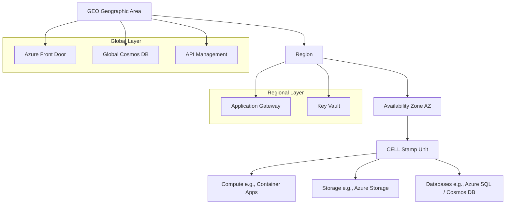
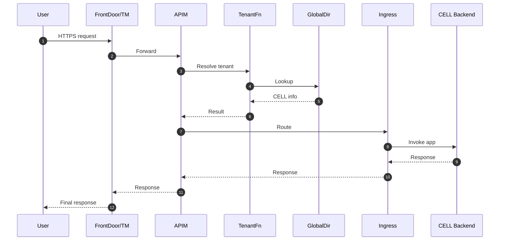
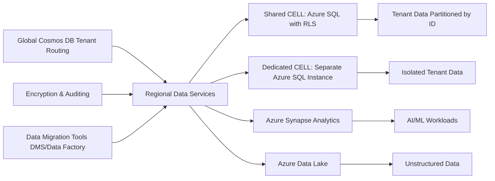
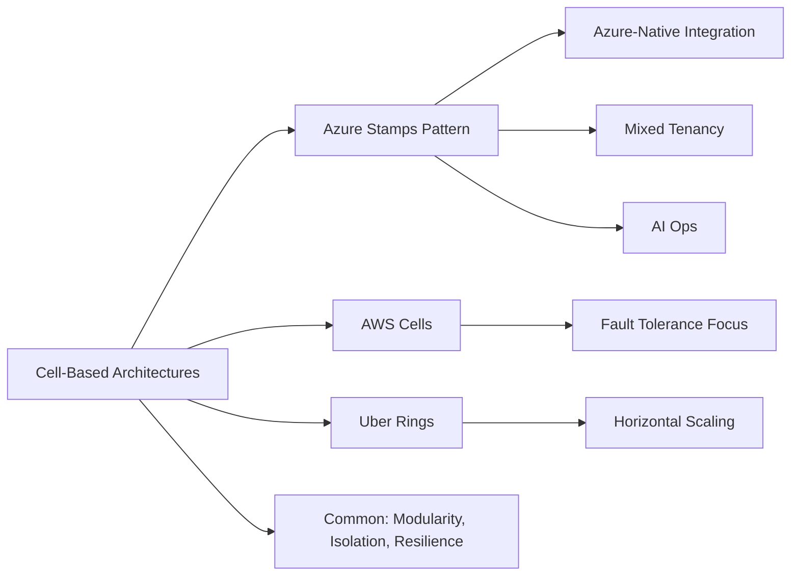

# Understanding the Azure Stamps Pattern: A Scalable Architecture for SaaS on Azure

## Executive Summary

The Azure Stamps Pattern is an opinionated reference architecture designed to help SaaS providers build secure, compliant, and scalable multi-tenant solutions on Microsoft Azure. Drawing from real-world experiences in scaling customer workloads, it emphasizes a modular "stamp" deployment model that aligns closely with cell-based architecture principles. This white paper provides an in-depth analysis of the pattern, including its key components, pros and cons, and comparison to other cell-based architectures. By leveraging Azure-native services and flexible tenancy models, the pattern enables rapid deployment, global resilience, and cost efficiency while addressing common challenges in regulated industries like healthcare and finance.

The analysis is based on a review of the pattern's documentation, including architecture guides, compliance analyses, and operational best practices. It highlights how the Stamps Pattern is unique to Azure but inspired by broader industry standards, offering a practical path for SaaS growth without being overly generic. This enhanced version incorporates detailed insights from the Data Strategy Guide, expanding on data management, partitioning, and compliance strategies, and includes visual aids via diagrams to improve understanding.

> Scope note: This is a concept-first whitepaper. Services named are examples, not prescriptions; Azure offers multiple interchangeable options per capability. Performance and cost figures are illustrative unless otherwise cited.

## Introduction

### Background on SaaS Scaling Challenges

Software-as-a-Service (SaaS) providers face unique demands: handling variable tenant loads, ensuring data isolation for compliance, achieving global availability, and optimizing costs as user bases grow. Traditional monolithic or microservices architectures often struggle with these, leading to downtime, security risks, or inefficient scaling.

Cell-based architectures emerged as a solution, partitioning systems into independent "cells" to isolate failures, enable horizontal scaling, and improve resilience. Popularized in cloud environments, this approach has been adopted by companies like Uber, AWS, and Microsoft to manage large-scale distributed systems.

### Overview of the Azure Stamps Pattern

The Azure Stamps Pattern builds on the Deployment Stamps (or Bulkhead) pattern, where "stamps" represent self-contained units of infrastructure and application components. It structures deployments hierarchically: GEO (geographic area) → Region → Availability Zone (AZ) → CELL (the core unit housing workloads).

- **Key Tenancy Models**: Supports shared CELLs (cost-effective for SMBs, ~$8-16/tenant/month) and dedicated CELLs (for enterprises, ~$3,200+/tenant/month), with seamless migration between them.
- **Core Services (examples)**: Azure Front Door or Traffic Manager for global routing; API Management for policy and governance; compute per CELL (Functions, App Service, Container Apps, or AKS); Azure SQL/Cosmos DB for data; and Key Vault for secrets.
- **Deployment**: Uses Bicep templates for Infrastructure as Code (IaC), with parameterization for customization (e.g., via `geos` array in JSON files).
- **Focus Areas**: Emphasizes zero-trust security, AI-driven operations, and alignment with Azure's Cloud Adoption Framework (CAF) and Well-Architected Framework (WAF), achieving a 94/100 compliance score.

This pattern is not a one-size-fits-all solution but an Azure-optimized approach, allowing flexibility in compute choices (e.g., Container Apps as default but extensible to AKS) while prioritizing scalability for growing SaaS businesses.

## Why Stamps? Design Principles

- Fault isolation: contain failures to a CELL to limit blast radius.
- Horizontal growth: scale by adding CELLs without redesign.
- Variable tenancy: mix shared and dedicated CELLs; migrate as tenants grow.
- Regional independence: place CELLs where data residency and latency require.
- Operational repeatability: treat CELLs as modular, parameterized building blocks.

## Key Components and Features

### Architectural Hierarchy

The pattern's structure ensures modularity:

- **Global Layer**: Handles cross-region traffic (e.g., Azure Front Door, Traffic Manager) and centralized data (e.g., Global Cosmos DB for tenant routing). May optionally front **API Management** for global policy.
- **Regional Layer**: Manages zone-redundant resources (e.g., Application Gateway for WAF, API Management if deployed regionally, Key Vault for secrets).
- **CELL Layer**: The "stamp" unit, containing compute (for example, Functions, App Service, Container Apps, or AKS), storage (Azure Storage), and databases (Azure SQL with shared schemas or dedicated instances). CELLs can span 0-3 AZs for varying SLAs (e.g., 99.99% with 3 zones).

The following diagram illustrates the hierarchical structure:



### High-Level Request Flow (Illustrative)

```mermaid
flowchart TD
    User[User Request] --> FD[Azure Front Door / Traffic Manager]
    FD --> APIM[API Management]
    APIM --> GFunc[Tenant Lookup Function]
    GFunc --> GDB[Global Cosmos (Directory)]
    GDB --> GFunc
    APIM --> AG[Application Gateway / Regional Ingress]
    AG --> Shared[Shared CELL]
    AG --> Dedicated[Dedicated CELL]
    Shared --> SQL[Shared SQL / Cosmos]
    Dedicated --> DSQL[Dedicated SQL / Cosmos]
    Shared --> AG
    Dedicated --> AG
    AG --> APIM --> FD --> User
```



## Choosing Compute for a CELL

- Event-driven, bursty, fastest iteration: Azure Functions
- Web/API with steady traffic and simple ops: App Service
- Polyglot microservices, scale-to-zero, Dapr/HTTP/gRPC: Container Apps
- Advanced control, service mesh, GPU/stateful workloads: AKS

Signals to switch:

- More tenants/noisy neighbors → isolate via dedicated plans or separate CELLs
- Need pod-level ops/custom ingress/GPU → prefer AKS/Container Apps
- Cost profile: steady → reserved plans/App Service; spiky → Functions/Container Apps

### Scaling and Operations

- **Scaling Strategies**: Horizontal (add CELLs), vertical (upgrade resources), or geographic (add regions/GEOs). Auto-scaling reduces costs by 20-40%.
- **Monitoring and Management**: Uses Azure Monitor, Log Analytics, and a custom Management Portal for per-tenant insights, predictive scaling, and dashboards.
- **Data Strategy**: The Data Strategy Guide outlines a comprehensive approach to managing data in multi-tenant environments, focusing on isolation, performance, and compliance. Key elements include:
  - **Partitioning and Tenancy Models**: Data is partitioned by tenant using strategies like shared databases with row-level security (RLS) for cost efficiency or dedicated databases for strict isolation. In shared models, tenants share infrastructure but data is logically separated via tenant IDs as partition keys in Cosmos DB or schema-based isolation in Azure SQL. Dedicated models deploy separate instances per tenant, ideal for high-compliance needs.
  - **Azure Services Integration**: Leverages Cosmos DB for globally distributed NoSQL data (e.g., tenant metadata, with multi-region writes for low latency), Azure SQL for relational data (hyperscale for massive scale), and Azure Synapse Analytics for big data processing and AI/ML workloads. Azure Data Lake Storage supports unstructured data, while Purview ensures data governance and lineage tracking.
    - **Security and Compliance Features**: Implements encryption at rest (using customer-managed keys) and in transit (TLS 1.2+), auditing via Azure SQL Auditing and Cosmos DB diagnostic logs, and access controls with Microsoft Entra managed identities. Supports regulations like GDPR, HIPAA, and PCI-DSS through data residency controls and sensitivity labeling.
  - **Best Practices for Scaling and Management**: Recommends optimal partitioning keys to avoid hot spots, indexing for query performance, and auto-scaling based on request units (RU/s) in Cosmos DB. Backup and disaster recovery use geo-redundant storage (GRS) and point-in-time restore. Data migration between tenancy models employs tools like Azure Database Migration Service (DMS) or Data Factory, with minimal downtime via blue-green deployments.
  - **Migration and Evolution**: Guides on evolving from shared to dedicated setups as tenants grow, including data sharding, replication, and synchronization strategies to maintain consistency across stamps.
  This strategy ensures data sovereignty, high availability (e.g., 99.999% durability), and cost optimization by aligning resource provisioning with tenant demands.

The following diagram shows a high-level data flow in the Stamps Pattern:



## HA/DR Modes at a Glance

- Active/Active (multi-region writes or split traffic)
  - Pros: lowest RTO/RPO, global performance
  - Cons: highest cost/complexity; consistency trade-offs
  - Use when: mission-critical workloads, strict SLOs, global users

- Active/Warm Standby
  - Pros: balanced cost vs. resilience; faster failover than cold
  - Cons: shadow capacity management; data sync complexity
  - Use when: strong uptime targets with moderated spend

- Active/Passive (cold)
  - Pros: lowest cost, simplest ops
  - Cons: higher RTO; reheating infrastructure on failover
  - Use when: tolerant to minutes/hours RTO; cost-sensitive environments

## Data Sharding and Shaping (Quickstart)

- Partition keys: choose tenantId or access path that balances load and co-locates hot data
- Isolation spectrum: shared (RLS/schema) → pooled per-tenant DB → dedicated per tenant
- Shaping: CQRS for read/write separation; event sourcing for audit; materialized views for hot queries
- Migration: replicate → validate → switchover; keep dual-write window short and idempotent
- DR: point-in-time restore, geo-redundancy, and regular restore drills

## Anti-Patterns to Avoid

- One giant shared database without RLS/partitioning
- Over-centralized global dependencies creating single points of failure
- Multi-region writes without consistency/idempotency strategy
- Enabling all premium HA options by default in small environments (runaway cost)
- Mixing identity and data boundaries (tenant leaks via logs/backups)

- **Security**: Zero-trust model with private endpoints, managed identities, and threat modeling; supports HIPAA, PCI-DSS, and GDPR.
- **Cost Optimization**: Tools like Azure Cost Management for budgeting, right-sizing (e.g., scale to zero in dev), and reserved instances; mixed tenancy models balance affordability and isolation.
- **Parameterization and Naming**: JSON-based configs for geo/regions/cells; standardized naming (e.g., `sqldb-{cell-name}-z{zone-count}-{region-short}`) aids automation and governance.

### Known Limitations

Deployment may encounter issues like naming conflicts or manual Microsoft Entra External ID (customers) setup. Performance challenges (e.g., JWT latency, Cosmos DB throttling) have workarounds like caching and retries.

## Pros and Cons of the Azure Stamps Pattern

### Pros

The pattern excels in enabling scalable, secure SaaS deployments:

- **Scalability and Resilience**: Easily add stamps for near-linear growth without redesign. Fault isolation ensures one CELL's failure doesn't impact others, supporting 99.99%+ availability with multi-AZ setups.
- **Cost Efficiency**: Mixed tenancy reduces expenses (e.g., shared CELLs for startups); AI-driven auto-scaling and right-sizing yield 25-40% savings. Tools like Azure Advisor provide ongoing recommendations.
- **Security and Compliance**: 96/100 WAF Security score with zero-trust, automated policy enforcement, and built-in support for regulations. Reduces compliance costs by 80% via audit automation.
- **Operational Excellence**: AI features for predictive monitoring and self-healing; accelerates developer velocity by 60-80% with IaC and CI/CD integration. Management Portal offers real-time dashboards.
- **Flexibility**: Not limited to specific services (e.g., swap Container Apps for AKS); supports global expansion and tenancy migrations.
- **Rapid Deployment**: Production-ready in under 45 minutes, minimizing architectural planning time.
- **Enhanced Data Management**: Detailed data strategy supports efficient partitioning, migration, and governance, reducing data-related risks and costs.

### Cons

While powerful, the pattern has trade-offs:

- **Higher Costs for Premium Features**: Dedicated CELLs and multi-zone configs can increase expenses (e.g., +40% for 3 AZs). Global replication in Cosmos DB adds 30-50% to data costs if not optimized.
- **Complexity in Management**: Orchestrating multiple stamps requires robust governance; data migrations between tenancy models can be involved.
- **Manual Elements**: Microsoft Entra External ID (customers, formerly Azure AD B2C) tenant creation isn't automated, and some setups (e.g., DNS) need portal intervention, potentially slowing CI/CD.
- **Potential Performance Overhead**: Unoptimized JWT validation or database queries may cause latency; requires ongoing tuning.
- **Learning Curve**: Opinionated nature means teams must adapt to Azure-specific tools; known issues like deployment validation errors demand troubleshooting expertise.
- **Overhead for Small-Scale**: For startups with few tenants, the full hierarchy might feel overkill compared to simpler shared models.
- **Data Strategy Complexity**: Implementing advanced partitioning and migration strategies may require additional expertise in Azure data services.

Overall, pros outweigh cons for mid-to-large SaaS providers in regulated sectors, but smaller operations may need to start with simplified variants.

## Comparison to Other Cell-Based Architecture Styles

Cell-based architectures partition systems into independent "cells", self-contained units with their own services, data, and infrastructure, to enhance fault tolerance, scalability, and manageability. This contrasts with monoliths (single-unit) or basic microservices (shared infra risks cascading failures).

The following diagram compares key aspects:



### Core Similarities

The Azure Stamps Pattern is a direct implementation of cell-based principles:

- **Modularity and Isolation**: Like AWS's cell-based designs or Uber's ring-based cells, stamps (CELLs) encapsulate workloads, preventing blast radius expansion. This aligns with Microsoft's Bulkhead pattern, where cells act as "bulkheads" to contain failures.
- **Scaling Approach**: Horizontal scaling by adding cells mirrors patterns in Akka or WSO2's cell-based reference architecture, enabling iterative growth without downtime.
- **Resilience Features**: Multi-region/AZ deployment for DR matches InfoQ's description of cell-based systems in distributed environments, with auto-failover and health monitoring.
- **Data Partitioning**: Tenant-specific data in stamps echoes sharding in cell architectures (e.g., DZone's guide), supporting compliance via isolation.
- **Inspiration from Industry**: Draws from SOA-era cells (e.g., for failure management) and cloud patterns like Deployment Stamps, making it compatible with broader ecosystems.

### Key Differences and Unique Aspects

While aligned, the Stamps Pattern is Azure-optimized and opinionated:

- **Azure-Native Focus**: Unlike generic cell patterns (e.g., TechTarget's basics or ByteByteGo's crash course), it integrates deeply with Azure services (e.g., Front Door for routing, Policy as Code for governance). This provides out-of-box compliance (94/100 CAF/WAF) but may require adaptation for multi-cloud.
- **Tenancy Flexibility**: Emphasizes mixed shared/dedicated models, which is more SaaS-specific than pure cell architectures (e.g., Rackspace's AWS cells focus on fault tolerance without tenancy nuances).
- **Operational AI**: Incorporates AI for predictive scaling and monitoring, extending beyond standard cell benefits (e.g., YouTube's "Back to Basics" on cells highlights uptime but not AI).
- **Potential Gaps**: Less emphasis on serverless compared to some cell variants (e.g., Medium's overviews); higher setup complexity than lightweight patterns but offset by Azure tooling.
- **Risks Addressed**: Mitigates cell-based risks like inter-cell communication overhead (via global layers) and testing effort (with IaC), but shares cons like duplication costs.
- **Data-Centric Enhancements**: The integrated data strategy provides more granular guidance on data handling than typical cell architectures, which often treat data as a secondary concern.

In summary, the Stamps Pattern lines up well with cell-based styles, serving as an Azure-specific evolution. It addresses SaaS pain points more directly than generic patterns, making it ideal for Azure-centric teams while being inspired by (and compatible with) industry standards.

## Recommendations for Adoption

- **Start Small**: Begin with a single shared CELL for proof-of-concept, then scale to mixed models.
- **Leverage Tools**: Use Bicep for deployments, Azure Monitor for ops, and parameterization for customization.
- **Best Practices**: Implement naming conventions, cost governance, and security hardening early. Follow the Data Strategy Guide for partitioning and migration planning.
- **When to Use**: Ideal for growing SaaS in regulated industries; consider alternatives like basic microservices for non-scalable apps.
- **Future Enhancements**: Monitor for Azure updates (e.g., better B2C automation) and integrate emerging AI ops.

## Conclusion

The Azure Stamps Pattern offers a robust, cell-inspired framework for scaling SaaS on Azure, balancing innovation with proven standards. Its pros in scalability, security, and efficiency make it a strong choice for enterprises, though costs and complexity warrant careful planning. With enhanced data strategy insights and visual diagrams, it provides comprehensive guidance for managing tenant data securely and efficiently. By understanding its alignment with cell-based architectures, organizations can confidently adopt it to accelerate growth, reduce risks, and deliver value in a competitive cloud landscape.

For more details, refer to the original GitHub repository: [Azure Stamps Pattern](https://github.com/srnichols/StampsPattern).

Related docs: <a href="./PARAMETERIZATION_GUIDE.md" target="_blank" rel="noopener" title="Opens in a new tab">Parameterization Guide</a>&nbsp;<sup>↗</sup>


---

*Author: Scott Nichols | Date: August 09, 2025*

---

**📝 Document Version Information**
- **Version**: 1.6.3
- **Last Updated**: 2025-09-03 13:38:15 UTC  
- **Status**: Current
- **Next Review**: 2025-11
