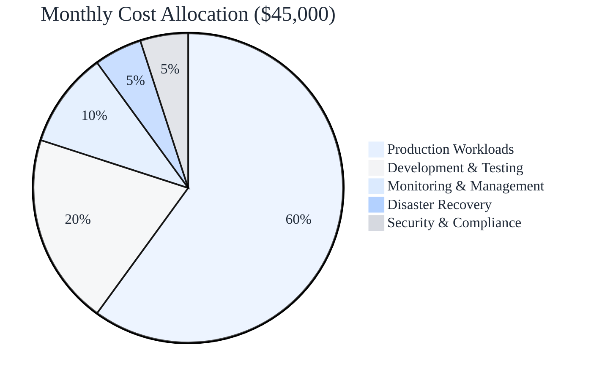
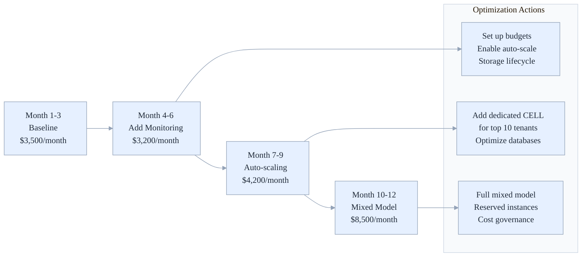
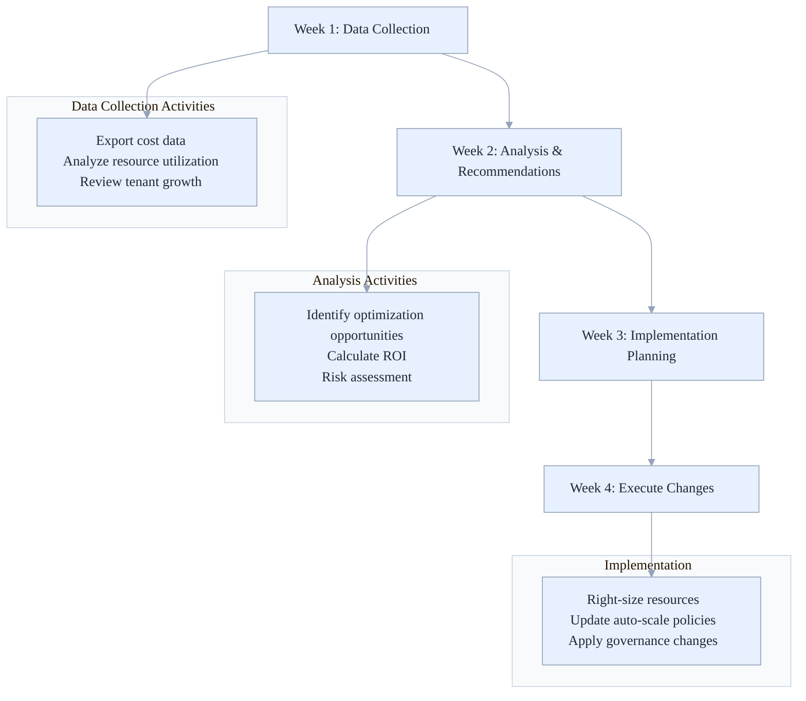

# 💰 Azure Stamps Pattern - Cost Optimization Guide

Practical ways to reduce spend across compute, storage, networking, data, and operations, without sacrificing reliability or security, plus staged cost models and a ready-to-use checklist aligned to CAF/WAF.

- What’s inside: Deployment cost analysis, layer-by-layer tactics, monitoring/governance, examples, and checklists
- Best for: Architects, DevOps, finance/FinOps, and IT leaders
- Outcomes: Lower, predictable costs with clear ROI and governance guardrails

## 👤 Who Should Read This Guide?

- **Architects/IT Leaders:** Make strategic, cost-effective decisions
- **DevOps/Platform Teams:** Implement and monitor cost-saving techniques
- **Finance/Operations:** Track, forecast, and govern cloud spend
- **Newcomers:** Learn best practices for cost optimization from day one

---

## 🧭 Quick Navigation

| Section | Focus Area | Best for |
|---------|------------|----------|
| [📊 Deployment Cost Analysis](#-deployment-cost-analysis) | Compare deployment options | Architects, Decision makers |
| [🏗️ Cost Optimization by Layer](#-cost-optimization-by-layer) | Layer-specific strategies | Technical teams |
| [💡 Cost Optimization Strategies](#-cost-optimization-strategies) | Cost-saving techniques | DevOps, Operations |
| [📈 Cost Monitoring & Governance](#-cost-monitoring--governance) | Cost control tools/processes | Finance, Operations |
| [🔧 Practical Optimization Examples](#-practical-optimization-examples) | Real-world scenarios | Implementation teams |
| [🔗 Resources & Tools](#-resources--tools) | Best practices, tools | All |

---

Last updated: August 2025

## 📚 For Newcomers

Visual guides at a glance:

- Visual comparison of monthly costs across deployment models and scales
- Workflow to right-size global edge and data replication for cost
- Cost trade-offs of shared, dedicated, and hybrid database models
- Strategic loop for continuous cost optimization
- Auto-scaling decision flow with cost impact
- Budget hierarchy and alert thresholds to prevent overruns

**What is this guide for?**
> This guide is your onboarding reference for understanding and optimizing costs in the Azure Stamps Pattern. It explains key cost drivers, provides visual breakdowns, and offers step-by-step workflows for reducing spend and maximizing ROI.

**Why is this important?**
>
> - **Financial control:** Avoid surprise bills and optimize for growth
> - **Strategic planning:** Make informed decisions with real data
> - **Onboarding:** Ramp up quickly with clear, actionable examples
> - **Continuous improvement:** Integrate cost optimization into daily operations

---

## 🎯 Overview

Cost optimization in the Azure Stamps Pattern requires understanding the **total cost of ownership (TCO)** across different deployment scenarios, tenancy models, and operational patterns. This guide provides:

- **Visual cost breakdowns** by deployment type and scale
- **Comparative analysis** of shared vs. dedicated tenancy models  
- **Optimization workflows** for different organizational maturity levels
- **ROI calculations** and **cost forecasting** methodologies
- **Real-world examples** with actual cost implications

---

## 🏗️ Zone Flexibility: Cost, Durability, and SLA Options

The Azure Stamps Pattern is built on a four-tier hierarchy: **GEO → Region → Availability Zone → CELL**. This enables highly flexible deployment options for each CELL, allowing you to optimize for cost, durability, and business requirements at a granular level.

- **No Zones (z0):** No zone redundancy. Lowest cost, suitable for dev/test or non-critical workloads. Standard durability and SLA.
- **1 Zone (z1):** Single zone deployment, standard SLA, moderate cost.
- **2 Zones (z2):** High availability with failover across two AZs, 99.95% SLA, increased cost (+20%).
- **3 Zones (z3):** Maximum durability and resilience with three AZs, 99.99% SLA, highest cost (+40%).

**Key Points:**

- You can mix and match zone configurations per CELL to right-size cost, durability, and SLA for every tenant or workload.
- Zone-aware naming and tagging (e.g., `ca-shared-smb-z3-eus-prod`) help track and manage these options and support compliance/auditing.
- Higher zone count increases cost but provides stronger SLAs, disaster recovery, and business continuity.

**Why Availability Zones Matter:**

- **High Availability (HA):** Deploying CELLs across multiple AZs protects against datacenter failures and supports strict SLA targets.
- **Disaster Recovery (DR):** AZs enable rapid failover and business continuity for each CELL.
- **Flexible Cost/SLA:** Choose the number of AZs per CELL to balance cost and durability for each tenant or workload, supporting both enterprise and cost-sensitive scenarios.

> **Global Capacity Management & Cloud Supply Constraints**
>
> Cloud providers sometimes face regional or zone capacity limits for compute and storage due to demand spikes, supply chain issues, or quota exhaustion. The Azure Stamps Pattern’s modular, zone-aware, and multi-region CELL design gives you more options to mitigate these challenges: if a region or AZ is at capacity, you can deploy new CELLs in available locations with minimal disruption, maintaining business continuity and agility even in constrained environments.

**Example Table:**

| Zone Config | Use Case | SLA Target | Cost Impact |
|-------------|--------------------------|------------|-------------|
| z0 (No Zones) | Dev/Test, non-critical  | Standard   | Lowest      |
| z1 (1 Zone)  | Standard prod workloads | Standard   | Baseline    |
| z2 (2 Zones) | HA, regulated workloads | 99.95%     | +20%        |
| z3 (3 Zones) | Mission-critical, DR    | 99.99%     | +40%        |

**Tip:** For cost-sensitive tenants, start with z0/z1. For enterprise or regulated tenants, use z2/z3 for higher durability and compliance.

This flexibility is a core advantage of the Azure Stamps Pattern, enabling you to right-size cost and resilience for every business scenario.

## 📊 Deployment Cost Analysis

Understanding the cost implications of different deployment scenarios is crucial for making informed architectural decisions. The following analysis compares various deployment patterns across different scales and tenancy models.

### 💰 **Cost Comparison: Deployment Models**

| Deployment Model | Small Scale<br/>(1-50 tenants) | Medium Scale<br/>(51-500 tenants) | Large Scale<br/>(500+ tenants) | Best For |
|------------------|---------------------------|----------------------------|--------------------------|----------|
| **🏠 Single Shared CELL** | **$2,500/month** | **$8,500/month** | **$25,000/month** | Startups, Cost-sensitive |
| **🏢 Mixed Model** | **$5,000/month** | **$15,000/month** | **$45,000/month** | Growing businesses |
| **🏛️ Dedicated CELLs** | **$8,500/month** | **$35,000/month** | **$120,000/month** | Enterprise, Compliance |
| **🌍 Multi-Region** | **$12,000/month** | **$50,000/month** | **$200,000/month** | Global enterprises |

### 📈 **Visual Cost Breakdown**

```mermaid
%%{init: {"theme":"base","themeVariables":{"background":"transparent","primaryColor":"#E6F0FF","primaryTextColor":"#1F2937","primaryBorderColor":"#94A3B8","lineColor":"#94A3B8","secondaryColor":"#F3F4F6","tertiaryColor":"#DBEAFE","clusterBkg":"#F8FAFC","clusterBorder":"#CBD5E1","edgeLabelBackground":"#F8FAFC","fontFamily":"Segoe UI, Roboto, Helvetica, Arial, sans-serif"}} }%%
flowchart TB
    subgraph "💰 Monthly Cost Analysis"
        A[Small Scale: 1-50 Tenants]
        B[Medium Scale: 51-500 Tenants]
        C[Large Scale: 500+ Tenants]
    end
    
    subgraph "🏠 Single Shared CELL"
        A1[$2,500/month<br/>✅ Lowest cost<br/>⚠️ Limited isolation]
        B1[$8,500/month<br/>✅ Cost-effective<br/>⚠️ Performance limits]
        C1[$25,000/month<br/>⚠️ May hit limits<br/>❌ Single point failure]
    end
    
    subgraph "🏢 Mixed Model"
        A2[$5,000/month<br/>✅ Balanced approach<br/>✅ Growth flexibility]
        B2[$15,000/month<br/>✅ Optimal balance<br/>✅ Performance + cost]
        C2[$45,000/month<br/>✅ Recommended<br/>✅ Scalable architecture]
    end
    
    subgraph "🏛️ Dedicated CELLs"
        A3[$8,500/month<br/>⚠️ Over-engineered<br/>✅ Maximum isolation]
        B3[$35,000/month<br/>✅ Enterprise-ready<br/>✅ Compliance built-in]
        C3[$120,000/month<br/>✅ Ultimate performance<br/>✅ Complete control]
    end
    
    A --> A1
    A --> A2
    A --> A3
    B --> B1
    B --> B2
    B --> B3
    C --> C1
    C --> C2
    C --> C3

```



### 💡 **Cost-Benefit Analysis by Use Case**

#### **🚀 Startup/SMB Scenario (1-50 tenants)**

- **Recommended**: Single Shared CELL ($2,500/month)
- **Cost per tenant**: $50-250/month
- **Break-even**: ~6 months with $400/tenant pricing
- **Growth path**: Migrate to Mixed Model at 25+ tenants

#### **📈 Growth-Stage Company (51-500 tenants)**  

- **Recommended**: Mixed Model ($15,000/month)
- **Cost per tenant**: $30-295/month  
- **Break-even**: ~4 months with $200/tenant pricing
- **Optimization**: Use dedicated CELLs for top 10% of tenants

#### **🏢 Enterprise/Global (500+ tenants)**

- **Recommended**: Multi-Region Mixed Model ($200,000/month)
- **Cost per tenant**: $100-400/month
- **Break-even**: ~3 months with $300/tenant pricing
- **Optimization**: Automated scaling and cost governance

### 🎯 **Decision Matrix: Deployment Model Selection**

| Criteria | Single Shared | Mixed Model | Dedicated CELLs | Multi-Region |
|----------|---------------|-------------|-----------------|--------------|
| **Initial Investment** | 🟢 Low | 🟡 Medium | 🔴 High | 🔴 Very High |
| **Operational Complexity** | 🟢 Simple | 🟡 Moderate | 🟡 Moderate | 🔴 Complex |
| **Tenant Isolation** | 🟡 Application | 🟢 Mixed | 🟢 Infrastructure | 🟢 Geographic |
| **Compliance Ready** | 🟡 Basic | 🟢 Good | 🟢 Excellent | 🟢 Enterprise |
| **Scalability** | 🟡 Limited | 🟢 Good | 🟢 Excellent | 🟢 Unlimited |
| **Performance SLA** | 🟡 Shared | 🟢 Tiered | 🟢 Dedicated | 🟢 Global |

---

## 🏗️ Cost Optimization by Layer

Each layer of the Azure Stamps Pattern offers specific opportunities for cost optimization. Understanding the cost drivers and optimization strategies for each layer enables targeted cost reduction without compromising functionality.

### 🌍 **Global Layer - Cost Optimization**

| Service | Standard Cost | Optimization Strategy | Potential Savings | Risk Level |
|---------|---------------|----------------------|------------------|------------|
| **Azure Front Door Premium** | $300-500/month | Use Standard tier for basic workloads | 40-60% | 🟡 Medium |
| **Traffic Manager** | $50-100/month | Consolidate health check endpoints | 20-30% | 🟢 Low |
| **Global Cosmos DB** | $500-2000/month | Use single-region writes, read replicas | 30-50% | 🟡 Medium |
| **DNS Zones** | $10-50/month | Consolidate zones, use CNAME records | 10-20% | 🟢 Low |

**💡 Global Layer Optimization Workflow:**

```mermaid
%%{init: {"theme":"base","themeVariables":{"background":"transparent","primaryColor":"#E6F0FF","primaryTextColor":"#1F2937","primaryBorderColor":"#94A3B8","lineColor":"#94A3B8","secondaryColor":"#F3F4F6","tertiaryColor":"#DBEAFE","clusterBkg":"#F8FAFC","clusterBorder":"#CBD5E1","edgeLabelBackground":"#F8FAFC","fontFamily":"Segoe UI, Roboto, Helvetica, Arial, sans-serif"}} }%%
flowchart LR
    A[📈 Assess Traffic Patterns] --> B[🌍 Right-size Front Door]
    B --> C[🌐 Optimize Cosmos DB Replication]
    C --> D[🧭 Consolidate DNS Zones]
    D --> E[📊 Monitor & Adjust]
    E --> A

```



### 🏢 **Regional Layer - Cost Optimization**

| Service | Standard Cost | Optimization Strategy | Potential Savings | Implementation Complexity |
|---------|---------------|----------------------|------------------|--------------------------|
| **Application Gateway v2** | $250-400/month | Enable auto-scaling, optimize WAF rules | 25-40% | 🟡 Medium |

> Adjacent guidance: For production WAF policies and governance at scale, align this regional layer with your enterprise landing zones. See [Azure Landing Zones Guide](./LANDING_ZONES_GUIDE.md).
| **Azure Key Vault** | $50-150/month | Use Standard tier, optimize key operations | 15-25% | 🟢 Low |
| **Log Analytics** | $200-800/month | Set retention policies, use commitment tiers | 30-60% | 🟡 Medium |
| **Virtual Network** | $100-300/month | Optimize peering, use service endpoints | 20-40% | 🟠 High |

### 🏠 **CELL Layer - Cost Optimization (Detailed)**

#### **Compute Services**

| Service Tier | Monthly Cost | Tenant Capacity | Cost per Tenant | Optimization Notes |
|-------------|--------------|-----------------|----------------|-------------------|
| **Container Apps - Consumption** | $150-500 | 10-50 | $15-50 | Scale to zero, optimize memory allocation |
| **Container Apps - Dedicated** | $800-2000 | 50-200 | $16-40 | Reserved capacity, predictable costs |
| **Azure Functions - Consumption** | $50-200 | Unlimited | Variable | Pay per execution, ideal for event-driven |
| **Azure Functions - Premium** | $300-800 | 10-100 | $30-80 | Pre-warmed instances, consistent performance |

#### **Database Services Cost Analysis**

```mermaid
%%{init: {"theme":"base","themeVariables":{"background":"transparent","primaryColor":"#E6F0FF","primaryTextColor":"#1F2937","primaryBorderColor":"#94A3B8","lineColor":"#94A3B8","secondaryColor":"#F3F4F6","tertiaryColor":"#DBEAFE","clusterBkg":"#F8FAFC","clusterBorder":"#CBD5E1","edgeLabelBackground":"#F8FAFC","fontFamily":"Segoe UI, Roboto, Helvetica, Arial, sans-serif"}} }%%
flowchart TB
    subgraph "Database Cost Comparison"
        A[Shared Database Model]
        B[Dedicated Database Model]
        C[Hybrid Model]
    end
    
    subgraph "Shared Model Benefits"
        A1[Lower per-tenant cost<br/>$5-15/tenant/month]
        A2[Shared compute resources<br/>Efficient utilization]
        A3[Simplified management<br/>Single backup/maintenance]
    end
    
    subgraph "Dedicated Model Benefits"
        B1[Higher isolation<br/>$50-200/tenant/month]
        B2[Predictable performance<br/>No noisy neighbor]
        B3[Compliance ready<br/>Audit trails per tenant]
    end
    
    subgraph "Hybrid Model (Recommended)"
        C1[Tiered approach<br/>$15-100/tenant/month]
        C2[Shared for small tenants<br/>Dedicated for enterprise]
        C3[Optimal cost/performance<br/>Growth flexibility]
    end
    
    A --> A1
    A --> A2
    A --> A3
    B --> B1
    B --> B2
    B --> B3
    C --> C1
    C --> C2
    C --> C3

```



---

## 💡 Cost Optimization Strategies

### 🎯 **Strategic Cost Optimization Framework**

```mermaid
%%{init: {"theme":"base","themeVariables":{"background":"transparent","primaryColor":"#E6F0FF","primaryTextColor":"#1F2937","primaryBorderColor":"#94A3B8","lineColor":"#94A3B8","secondaryColor":"#F3F4F6","tertiaryColor":"#DBEAFE","clusterBkg":"#F8FAFC","clusterBorder":"#CBD5E1","edgeLabelBackground":"#F8FAFC","fontFamily":"Segoe UI, Roboto, Helvetica, Arial, sans-serif"}} }%%
flowchart TD
    A[📊 Analyze Current Spend] --> B[🎯 Identify Optimization Targets]
    B --> C[📋 Prioritize by Impact/Effort]
    C --> D[🚀 Implement Changes]
    D --> E[📈 Monitor Results]
    E --> F[🔄 Continuous Improvement]
    F --> A
    
    subgraph "Analysis Tools"
        A1[Azure Cost Management<br/>Resource utilization<br/>Spending patterns]
        A2[Custom dashboards<br/>Per-tenant costs<br/>Service breakdown]
    end
    
    subgraph "Optimization Tactics"
        B1[Right-sizing<br/>Auto-scaling<br/>Reserved instances]
        B2[Lifecycle policies<br/>Serverless migration<br/>Resource consolidation]
    end
    
    A --> A1
    A --> A2
    B --> B1
    B --> B2
    
    
```



### 🔧 **Tactical Optimization Techniques**

#### **1. Right-Sizing Strategy**

| Resource Type | Over-provisioning Indicator | Action | Expected Savings |
|---------------|---------------------------|--------|------------------|
| **Container Apps** | CPU < 30%, Memory < 50% | Reduce allocation or enable auto-scale | 25-40% |
| **SQL Database** | DTU utilization < 40% | Downgrade tier or enable auto-scale | 20-35% |
| **Cosmos DB** | RU utilization < 50% | Switch to serverless or reduce provisioned RU | 30-50% |
| **Storage Account** | Low access patterns | Move to cool/archive tiers | 40-70% |

#### **2. Auto-Scaling Configuration**

```mermaid
%%{init: {"theme":"base","themeVariables":{"background":"transparent","primaryColor":"#E6F0FF","primaryTextColor":"#1F2937","primaryBorderColor":"#94A3B8","lineColor":"#94A3B8","secondaryColor":"#F3F4F6","tertiaryColor":"#DBEAFE","clusterBkg":"#F8FAFC","clusterBorder":"#CBD5E1","edgeLabelBackground":"#F8FAFC","fontFamily":"Segoe UI, Roboto, Helvetica, Arial, sans-serif"}} }%%
flowchart LR
    A[📊 Monitor Utilization] --> B{📈 Resource Usage}
    B -->|High| C[⬆️ Scale Up]
    B -->|Normal| D[🟰 Maintain]
    B -->|Low| E[⬇️ Scale Down]
    
    C --> F[💵 Cost Impact: +15-30%<br/>⚡ Performance: Improved]
    D --> G[💵 Cost Impact: Stable<br/>⚖️ Performance: Consistent]
    E --> H[💵 Cost Impact: -20-40%<br/>✅ Performance: Adequate]

```



#### **3. Environment-Specific Optimizations**

| Environment | Optimization Strategy | Cost Impact | Risk Level |
|-------------|----------------------|-------------|------------|
| **Development** | Scale to zero, basic tiers, shared resources | -60-80% | 🟢 Low |
| **Testing** | Auto-scale, standard tiers, limited replicas | -40-60% | 🟡 Medium |
| **Staging** | Production-like but smaller scale | -20-40% | 🟡 Medium |
| **Production** | Reserved instances, premium tiers, full redundancy | Baseline | 🔴 High |

### 📊 **ROI Calculation Framework**

#### **Cost Optimization ROI Formula**

```
Monthly Savings = (Original Cost - Optimized Cost) 
Implementation Cost = Labor hours × hourly rate + any migration costs
ROI = (Annual Savings - Implementation Cost) / Implementation Cost × 100%
```

#### **Example ROI Scenarios**

| Optimization Type | Implementation Cost | Monthly Savings | Annual ROI |
|------------------|-------------------|-----------------|------------|
| **Auto-scaling setup** | $5,000 | $2,000 | 380% |
| **Storage lifecycle policies** | $2,000 | $800 | 380% |
| **Reserved instance purchase** | $0 | $1,500 | ∞% (immediate) |
| **Database right-sizing** | $3,000 | $1,200 | 380% |

---

## 📊 Cost Monitoring & Governance

### 🛠️ **Cost Management Tools & Setup**

| Tool | Purpose | Setup Time | Cost Impact | Best For |
|------|---------|------------|-------------|----------|
| **Azure Cost Management** | Spend analysis, budgets, forecasting | 2-4 hours | High visibility | All teams |
| **Azure Advisor** | Automated cost recommendations | 30 minutes | Medium optimization | Quick wins |
| **Log Analytics** | Resource utilization tracking | 4-8 hours | Deep insights | Technical teams |
| **Power BI** | Custom cost dashboards | 8-16 hours | Executive reporting | Leadership |

### 💰 **Budget and Alert Configuration**

```mermaid
%%{init: {"theme":"base","themeVariables":{"background":"transparent","primaryColor":"#E6F0FF","primaryTextColor":"#1F2937","primaryBorderColor":"#94A3B8","lineColor":"#94A3B8","secondaryColor":"#F3F4F6","tertiaryColor":"#DBEAFE","clusterBkg":"#F8FAFC","clusterBorder":"#CBD5E1","edgeLabelBackground":"#F8FAFC","fontFamily":"Segoe UI, Roboto, Helvetica, Arial, sans-serif"}} }%%
flowchart TD
    subgraph "Budget Hierarchy"
        A[Master Budget<br/>$50,000/month]
        B[Production<br/>$30,000/month]
        C[Development<br/>$15,000/month]
        D[Testing<br/>$5,000/month]
    end
    
    subgraph "Alert Thresholds"
        E[80% - Warning<br/>📧 Email to team]
        F[90% - Critical<br/>📱 SMS + Email]
        G[100% - Emergency<br/>🚨 Auto-scale down]
        H[110% - Shutdown<br/>⛔ Stop non-critical]
    end
    
    A --> B
    A --> C  
    A --> D
    B --> E
    B --> F
    B --> G
    B --> H
    
    
```



### 📊 **Cost Governance Policies**

#### **Automated Cost Controls**

| Policy | Trigger | Action | Business Impact |
|--------|---------|--------|-----------------|
| **Resource Tagging** | Untagged resource created | Block deployment | 100% cost allocation |
| **SKU Restrictions** | Premium SKU in dev/test | Block or auto-downgrade | 40-60% savings |
| **Idle Resource Cleanup** | 7 days no activity | Auto-shutdown notification | 20-30% savings |
| **Budget Overrun** | 110% of budget | Auto-scale down non-critical | Prevents runaway costs |

### 🎯 **Cost Allocation Model**



#### **Per-Tenant Cost Tracking**

| Tenant Tier | Monthly Infrastructure Cost | Support Cost | Total Cost | Revenue Target |
|-------------|---------------------------|-------------|------------|----------------|
| **Starter** | $25 | $10 | $35 | $99 |
| **Professional** | $75 | $25 | $100 | $299 |
| **Enterprise** | $250 | $100 | $350 | $999 |
| **Global** | $800 | $200 | $1,000 | $2,999 |

---

## 💡 Practical Optimization Examples

### 📈 **Case Study 1: SaaS Startup (50 tenants → 200 tenants)**

**Initial State:**

- Single shared CELL: $3,500/month
- All tenants on same infrastructure
- No cost monitoring or optimization

**Optimization Journey:**



**Results:**

- **Cost per tenant**: $70 → $42.50 (39% improvement)
- **Revenue impact**: +$2M annually from better SLAs
- **Optimization ROI**: 275% in first year

### 💼 **Case Study 2: Enterprise Migration (1,000 tenants)**

**Challenge**: Migrating from on-premises to Azure Stamps Pattern

**Cost Comparison Analysis:**

| Infrastructure Component | On-Premises Annual | Azure Stamps Annual | Savings | Notes |
|-------------------------|-------------------|-------------------|---------|-------|
| **Compute Infrastructure** | $480,000 | $360,000 | $120,000 | Auto-scaling benefits |
| **Storage Systems** | $120,000 | $60,000 | $60,000 | Lifecycle management |
| **Networking** | $60,000 | $36,000 | $24,000 | Azure-native networking |
| **Backup & DR** | $240,000 | $120,000 | $120,000 | Built-in redundancy |
| **Operations & Maintenance** | $360,000 | $180,000 | $180,000 | Managed services |
| **Total Annual Cost** | **$1,260,000** | **$756,000** | **$504,000** | **40% savings** |

### 🛠️ **Optimization Playbooks**

#### **Playbook 1: Quarterly Cost Review Process**



#### **Playbook 2: New Tenant Onboarding Cost Optimization**

| Tenant Size | Onboarding Strategy | Infrastructure Assignment | Expected Monthly Cost |
|-------------|-------------------|--------------------------|----------------------|
| **1-10 users** | Shared CELL, basic tier | Existing shared infrastructure | $15-25 |
| **11-50 users** | Shared CELL, standard tier | May trigger new shared CELL | $25-75 |
| **51-200 users** | Dedicated CELL consideration | Evaluate dedicated vs shared | $100-300 |
| **200+ users** | Dedicated CELL, premium SLA | New dedicated infrastructure | $500-2,000 |

### 📝 Advanced Cost Optimization Checklist

#### **Monthly Optimization Tasks** ✅

- [ ] Review Azure Advisor recommendations
- [ ] Analyze resource utilization reports  
- [ ] Validate auto-scaling configurations
- [ ] Check for abandoned or idle resources
- [ ] Review storage access patterns
- [ ] Update budget forecasts

#### **Quarterly Strategic Reviews** ✅

- [ ] Conduct TCO analysis vs. competitors
- [ ] Evaluate new Azure services/pricing models
- [ ] Review tenant pricing strategy alignment
- [ ] Assess reserved instance opportunities
- [ ] Update disaster recovery costs
- [ ] Review compliance cost implications

#### **Annual Optimization Planning** ✅

- [ ] Comprehensive architecture review
- [ ] Multi-year cost forecasting
- [ ] Reserved instance renewal strategy
- [ ] Technology migration planning
- [ ] Cost governance policy updates
- [ ] Team training and skill development

---

## 🔗 Resources & Tools

### 📚 **Essential Reading**

 <a href="https://learn.microsoft.com/azure/cost-management-billing/" target="_blank" rel="noopener" title="Opens in a new tab">Azure Cost Management Documentation</a>&nbsp;<sup>↗</sup>
 <a href="https://azure.microsoft.com/pricing/calculator/" target="_blank" rel="noopener" title="Opens in a new tab">Azure Pricing Calculator</a>&nbsp;<sup>↗</sup>
 <a href="https://learn.microsoft.com/azure/architecture/framework/cost/" target="_blank" rel="noopener" title="Opens in a new tab">Well-Architected Cost Optimization</a>&nbsp;<sup>↗</sup>
 <a href="https://learn.microsoft.com/azure/cost-management-billing/reservations/" target="_blank" rel="noopener" title="Opens in a new tab">Azure Reserved Instances Guide</a>&nbsp;<sup>↗</sup>

### 🛠️ **Optimization Tools**

| Tool | Purpose | Cost | Setup Complexity |
|------|---------|------|------------------|
| **Azure Cost Management** | Native cost analysis | Free | 🟢 Simple |
| **Cloudyn** (deprecated) | Advanced cost analytics | N/A | N/A |
| **Azure Advisor** | Automated recommendations | Free | 🟢 Simple |
| **Azure Monitor** | Resource utilization tracking | $2-5 per GB | 🟡 Medium |
| **Power BI** | Custom dashboards | $10/user/month | 🟠 Complex |

### 📊 **Cost Monitoring Templates**

- **Executive Dashboard**: Monthly spend, budget vs actual, trend analysis
- **Technical Dashboard**: Resource utilization, optimization opportunities
- **Tenant Dashboard**: Per-tenant costs, profitability analysis
- **Forecast Dashboard**: Growth projections, capacity planning

### 🎯 **Quick Cost Assessment**

**Use this 5-minute assessment to identify immediate optimization opportunities:**

1. **Are you using auto-scaling?** → Potential 20-40% savings
2. **Do you have idle resources?** → Potential 10-30% savings  
3. **Are dev/test using production SKUs?** → Potential 40-60% savings
4. **Do you have storage lifecycle policies?** → Potential 30-70% savings
5. **Are you using reserved instances?** → Potential 20-30% savings

### 💡 **Cost Optimization Maturity Levels**

| Level | Characteristics | Cost Impact | Next Steps |
|-------|----------------|-------------|------------|
| **🟡 Basic** | Manual monitoring, reactive approach | Baseline | Set up budgets and alerts |
| **🟠 Intermediate** | Some automation, regular reviews | 10-20% optimized | Implement auto-scaling |
| **🔴 Advanced** | Proactive optimization, governance | 20-35% optimized | Advanced analytics, AI insights |
| **🟣 Expert** | Continuous optimization, predictive | 35-50% optimized | Full automation, ML-driven |

---

## 🎯 **Getting Started: 30-Day Cost Optimization Plan**

### **Week 1: Foundation**

- Set up Azure Cost Management
- Create budgets and alerts  
- Tag all resources
- Export baseline cost data

### **Week 2: Quick Wins**

- Enable auto-scaling where applicable
- Implement storage lifecycle policies
- Right-size obviously over-provisioned resources
- Clean up abandoned resources

### **Week 3: Analysis**

- Analyze cost trends and patterns
- Identify top cost drivers
- Evaluate reserved instance opportunities
- Plan environment-specific optimizations

### **Week 4: Strategic Planning**

- Develop long-term cost strategy
- Create governance policies
- Set up monitoring dashboards
- Plan quarterly review process

---

**💰 Remember:** Cost optimization is not a one-time activity, it's an ongoing practice that should be integrated into your operational processes for maximum effectiveness!

**🚀 Ready to start optimizing?** Begin with the 5-minute assessment above, then follow the 30-day plan for systematic cost reduction.
