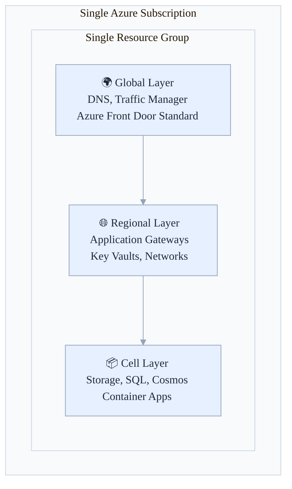
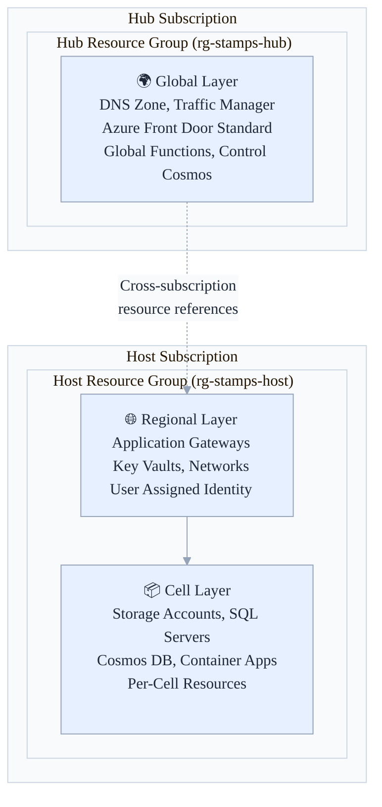

# 🏗️ Azure Stamps Pattern - Deployment Architecture Guide

This guide explains the two deployment architecture patterns supported by the Azure Stamps Pattern: **Single Subscription** and **Multi-Subscription (Landing Zone)** patterns.

## 📊 **Quick Comparison**

| Aspect | Single Subscription | Multi-Subscription |
|--------|-------------------|-------------------|
| **Best For** | Dev, test, small prod | Enterprise production |
| **Team Size** | Small to medium (< 50) | Large enterprise teams |
| **Governance** | Simple, unified | Complex, segregated |
| **Setup Time** | 30-45 minutes | 1-2 hours |
| **Complexity** | Low | Medium to high |

---

## 🔀 **Single Subscription Deployment**

**Ideal for:** Development, testing, small-scale production, or organizations with unified Azure governance.

### Architecture Overview



### Key Files

- **Main Template:** `AzureArchitecture/main.bicep`
- **Parameters:** `AzureArchitecture/main.parameters.json`

### Deployment Commands

```powershell
# Set your Azure subscription
az account set --subscription "<your-subscription-id>"

# Create resource group
az group create --name "rg-stamps-pattern" --location "eastus"

# Deploy the complete architecture
az deployment group create \
  --resource-group "rg-stamps-pattern" \
  --template-file "AzureArchitecture/main.bicep" \
  --parameters "@AzureArchitecture/main.parameters.json"
```

### Benefits ✅

- **Simpler Governance:** Single subscription to manage
- **Unified Billing:** All costs in one subscription
- **Faster Setup:** Deploy everything with one command
- **Lower Complexity:** Ideal for smaller teams
- **Development-Friendly:** Perfect for dev/test environments

### Limitations ❌

- **Shared Resource Limits:** All components share subscription quotas
- **Less Isolation:** Global and regional resources in same subscription
- **Limited Scale:** May hit subscription limits at enterprise scale

---

## 🏢 **Multi-Subscription Deployment (Landing Zone Pattern)**

**Ideal for:** Enterprise production, strict governance, Azure Landing Zone compliance, large-scale deployments.

### Architecture Overview



### Key Files

- **Hub Template:** `AzureArchitecture/hub-main.bicep`
- **Hub Parameters:** `AzureArchitecture/hub-main.parameters.json`
- **Host Template:** `AzureArchitecture/host-main.bicep`
- **Host Parameters:** `AzureArchitecture/host-main.parameters.json`

### Deployment Commands

```powershell
# Step 1: Deploy Hub Subscription (Global Resources)
az account set --subscription "<hub-subscription-id>"
az group create --name "rg-stamps-hub" --location "eastus"

az deployment group create \
  --resource-group "rg-stamps-hub" \
  --template-file "AzureArchitecture/hub-main.bicep" \
  --parameters "@AzureArchitecture/hub-main.parameters.json"

# Step 2: Deploy Host Subscription (Regional and Cell Resources)
az account set --subscription "<host-subscription-id>"
az group create --name "rg-stamps-host" --location "eastus"

az deployment group create \
  --resource-group "rg-stamps-host" \
  --template-file "AzureArchitecture/host-main.bicep" \
  --parameters "@AzureArchitecture/host-main.parameters.json"
```

### Benefits ✅

- **Better Resource Isolation:** Global and regional resources separated
- **Separate Billing:** Hub and Host costs tracked independently
- **Azure Landing Zone Compliance:** Follows Microsoft best practices
- **Enterprise Scale:** Supports large deployments without subscription limits
- **Enhanced Governance:** Different teams can manage Hub vs Host
- **Security Boundaries:** Clear separation of concerns

### Considerations ❌

- **Higher Complexity:** Requires managing multiple subscriptions
- **Cross-Subscription Permissions:** Need proper RBAC setup
- **More Setup Time:** Two-phase deployment process
- **Coordination Required:** Hub and Host deployments must be coordinated

---

## 🎯 **When to Choose Each Pattern**

### Choose **Single Subscription** when

- 🧪 **Development/Testing:** Building and testing the pattern
- 🏢 **Small Organizations:** Less than 50 people managing the platform
- 💰 **Cost Optimization:** Want unified billing and simpler cost tracking
- ⚡ **Quick Setup:** Need to deploy quickly for demos or PoCs
- 🔧 **Simple Governance:** Don't need complex subscription separation

### Choose **Multi-Subscription** when

- 🏭 **Enterprise Production:** Deploying for large-scale production use
- 📊 **Complex Governance:** Need separate billing and governance boundaries
- 🔒 **Compliance Requirements:** Regulatory need for resource isolation
- 👥 **Large Teams:** Multiple teams managing different aspects
- 🌐 **Azure Landing Zone:** Following Microsoft's enterprise architecture guidance

---

## 🚀 **Migration Path**

You can start with **Single Subscription** and migrate to **Multi-Subscription** later:

1. **Start Simple:** Deploy with `main.bicep` for initial development
2. **Prove the Pattern:** Validate architecture and business value
3. **Scale Up:** Migrate to `hub-main.bicep` + `host-main.bicep` for production

Both patterns support the same features:

- ✅ Azure Front Door Standard/Premium
- ✅ Multi-regional deployment
- ✅ HTTPS termination and redirects
- ✅ Cell-based tenant isolation
- ✅ Enterprise security controls

---

## 📚 **Related Documentation**

- [Deployment Guide](./DEPLOYMENT_GUIDE.md) - Complete deployment instructions
- [Architecture Guide](./ARCHITECTURE_GUIDE.md) - Detailed architecture overview
- [Security Guide](./SECURITY_GUIDE.md) - Security implementation details
- [Operations Guide](./OPERATIONS_GUIDE.md) - Day-2 operations guidance

---

**Last Updated:** August 2025
**Pattern Version:** v1.3.0

