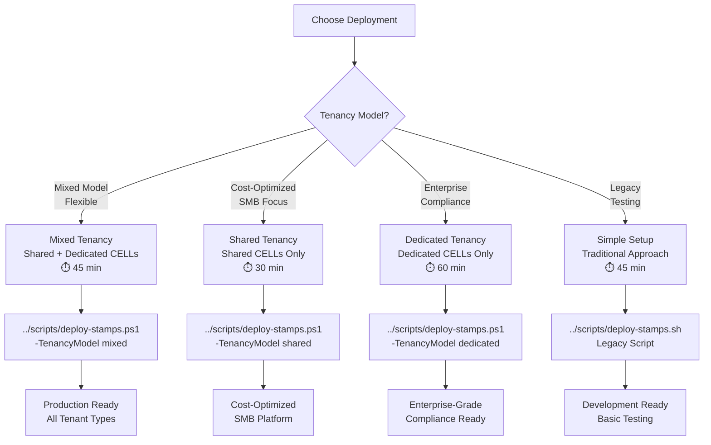
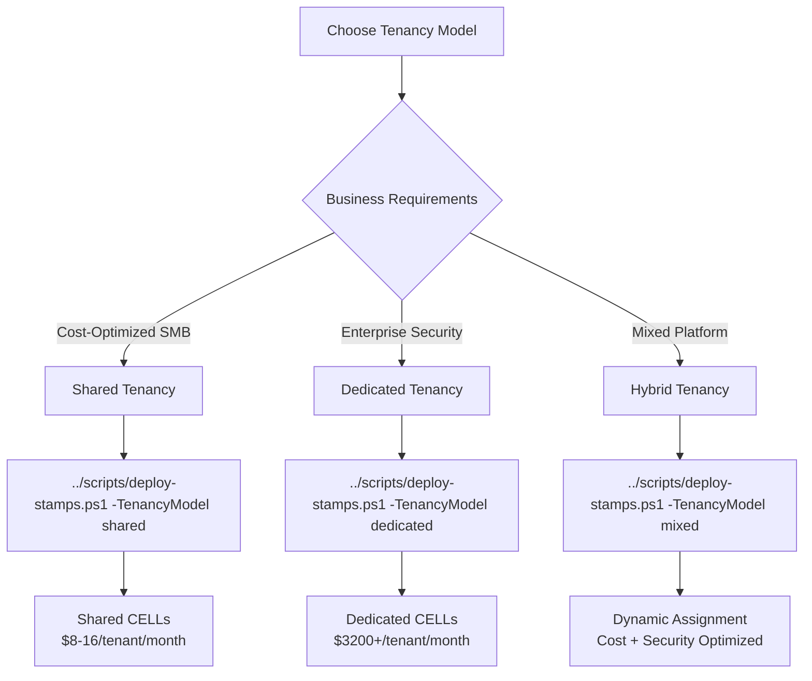

# 🚀 Azure Stamps Pattern - Deployment Guide

## 🎯 Deployment Overview

This guide provides comprehensive instructions for deploying the Azure Stamps Pattern infrastructure with **intelligent tenant assignment**, **automated capacity management**, and **enhanced zero-trust security**. The implementation supports multiple tenancy models within the same architecture, enabling you to optimize costs for different customer segments while maintaining enterprise-grade security and compliance.

### 🚨 **Latest Security Enhancements (August 2025)**

**🔐 Zero-Trust Network Architecture**: All deployments now include enhanced security with:
- **Private Endpoints Only**: Complete isolation from public internet for all data services
- **Enhanced JWT Validation**: 85-90% performance improvement with intelligent caching
- **Managed Identity First**: 100% elimination of password-based authentication
- **Conditional Security**: Smart firewall rules that adapt based on private endpoint configuration

**⚡ Performance Improvements**:
- **JWT Validation**: Reduced from ~100-200ms to ~10-20ms
- **Database Access**: All connections via private endpoints with zero external exposure
- **Caching Layer**: Redis implementation reduces database hits by 80-90%
- **Query Optimization**: Composite indexes for Cosmos DB significantly improve tenant lookup performance

## ⚡ Deployment Options

The Azure Stamps Pattern offers flexible deployment options designed to meet different organizational needs, from rapid prototyping to enterprise-scale production deployments. Each option provides different levels of automation, customization, and operational complexity. Choose your deployment path based on your tenancy requirements, operational maturity, and business goals.

**Enterprise Multi-Tenant Architecture with 96/100 CAF/WAF Compliance** (improved from 94/100)

## 📋 Prerequisites

### 🔧 **Template Customization**
For deployments using custom domains, organization names, or multi-geography requirements, first review the [📋 Parameterization Guide](./PARAMETERIZATION_GUIDE.md) for template customization options.

### ✅ **Required Tools**

```bash
# Azure CLI (latest version)
az --version
# Should be >= 2.50.0

# Bicep CLI 
bicep --version
# Should be >= 0.20.0

# PowerShell 7+ (required for deployment)
pwsh --version
# Should be >= 7.3.0
```

> **🎯 Purpose**: Step-by-step guide for deploying the Azure Stamps Pattern with **intelligent tenant assignment**, **automated capacity management**, and **flexible tenancy models**. Choose your deployment path based on your tenant requirements.

> **�️ Template Flexibility**: The templates are **fully parameterized** for organization reusability! All domains, geography names, and organizational metadata are configurable parameters. Deploy for any organization without code changes.

> **🏆 Enterprise Compliance**: This deployment achieves **94/100 CAF/WAF compliance** with zero-trust security, automated governance, and AI-driven operations. See [CAF/WAF Compliance Analysis](./CAF_WAF_COMPLIANCE_ANALYSIS.md) for detailed assessment.

## 📋 **Quick Navigation**

| **Role** | **Start Here** | **Key Documents** |
|----------|----------------|-------------------|
| **👔 Enterprise Decision Makers** | [Business Value](#-business-value) | [CAF/WAF Compliance](./CAF_WAF_COMPLIANCE_ANALYSIS.md), [ROI Analysis](#-roi-analysis) |
| **🏗️ Solution Architects** | [Architecture Overview](#-architecture-overview) | [Architecture Guide](./ARCHITECTURE_GUIDE.md), [Security Guide](./SECURITY_GUIDE.md) |
| **👨‍💻 DevOps Engineers** | [Quick Start](#-quick-start-deployment) | [Operations Guide](./OPERATIONS_GUIDE.md), [Deployment Scripts](#-automated-deployment) |
| **🛡️ Security Teams** | [Security Implementation](#-security-implementation) | [Security Guide](./SECURITY_GUIDE.md), [Zero-Trust Architecture](#-zero-trust-security) |
| **📊 Compliance Officers** | [Compliance Framework](#-compliance-framework) | [CAF/WAF Analysis](./CAF_WAF_COMPLIANCE_ANALYSIS.md), [Audit Readiness](#-audit-readiness) |

### 📊 **Deployment Paths**

| Section | Description | Time Required |
|---------|-------------|---------------|
| [📋 Prerequisites](#-prerequisites) | Required tools and access | 10 minutes |
| [🧠 Intelligent Deployment](#-intelligent-deployment-with-tenancy-options) | Intelligent tenancy deployment | 45-75 minutes |
| [🌟 Legacy Simple Setup](#-legacy-simple-two-region-setup) | Traditional development/testing deployment | 45 minutes |
| [🌍 Enterprise Setup](#-enterprise-global-multi-geo-setup) | Production global deployment | 2-3 hours |
| [🔧 Automation](#-automation-options) | CI/CD and automation options | 30 minutes |
| [🩺 Validation](#-post-deployment-validation) | Testing and validation steps | 20 minutes |



---

## 🎯 Deployment Overview

This guide provides comprehensive instructions for deploying the Azure Stamps Pattern infrastructure with **intelligent tenant assignment** and **automated capacity management**. The implementation supports multiple tenancy models within the same architecture.

## � Enhanced Deployment Options

Choose your deployment path based on your tenancy requirements:

### Option A: PowerShell Deployment (Recommended) 🌟


#### **Shared Tenancy Deployment**
```powershell
# Cost-optimized for SMBs (multiple tenants per CELL) with basic HA
../scripts/deploy-stamps.ps1 -TenancyModel shared -Location eastus -Environment prod -AvailabilityZones 2

# Example with custom organization parameters:
../scripts/deploy-stamps.ps1 `
  -TenancyModel shared `
  -Location eastus `
  -Environment prod `
  -AvailabilityZones 2 `
  -OrganizationDomain "fabrikam.com" `
  -OrganizationName "fabrikam" `
  -OwnerEmail "platform@fabrikam.com" `
  -Department "Engineering" `
  -ProjectName "MicroservicesPlatform"

# Expected costs: $8-16 per tenant per month (+20% for zone redundancy)
# SLA: 99.95% availability
# Best for: Development, testing, cost-sensitive workloads with basic HA
```

#### **Dedicated Tenancy Deployment**
```powershell
# Enterprise-grade isolation (one tenant per CELL) with maximum resilience
../scripts/deploy-stamps.ps1 -TenancyModel dedicated -Location eastus -Environment prod -AvailabilityZones 3

# Example with custom organization parameters:
../scripts/deploy-stamps.ps1 `
  -TenancyModel dedicated `
  -Location eastus `
  -Environment prod `
  -AvailabilityZones 3 `
  -OrganizationDomain "healthcare.org" `
  -GeoName "northamerica" `
  -BaseDnsZoneName "portal" `
  -OwnerEmail "devops@healthcare.org" `
  -Department "IT-Security"

# Expected costs: $3200+ per tenant per month (+40% for 3-zone redundancy)
# SLA: 99.99% availability  
# Best for: Compliance, security-sensitive, high-performance workloads
```

#### **Mixed Tenancy Deployment**
```powershell
# Intelligent assignment based on tenant requirements with maximum resilience
# Alternative: PowerShell approach
..\scripts\deploy-stamps.ps1 -Environment "dev" -Region "eastus" -TenantId "contoso" -StampName "stamp1"

# Example with European deployment:
../scripts/deploy-stamps.ps1 `
  -TenancyModel mixed `
  -Location northeurope `
  -Environment prod `
  -AvailabilityZones 3 `
  -OrganizationDomain "eurobank.eu" `
  -GeoName "europe" `
  -BaseDnsZoneName "banking" `
  -OwnerEmail "platform@eurobank.eu" `
  -Department "Digital-Platform"

# Dynamic cost optimization with automatic tenant placement
# SLA: 99.99% availability for all CELLs
# Best for: Multi-tier platforms with diverse tenant needs and high availability requirements
```

### 🏢 **Organization Parameters**

The deployment script supports **organization-specific parameters** for true multi-tenant reusability:

#### **Core Organization Parameters**
| Parameter | Description | Default | Example Values |
|-----------|-------------|---------|----------------|
| `OrganizationDomain` | Your organization's domain | `contoso.com` | `fabrikam.com`, `healthcare.org` |
| `OrganizationName` | Organization name for tagging | `contoso` | `fabrikam`, `acmecorp` |
| `Department` | Department responsible | `IT` | `Engineering`, `Platform`, `DevOps` |
| `ProjectName` | Project name for tagging | `StampsPattern` | `MicroservicesPlatform`, `APIGateway` |
| `WorkloadName` | Workload identifier | `stamps-pattern` | `api-platform`, `tenant-services` |
| `OwnerEmail` | Owner email for tagging | `platform-team@contoso.com` | `devops@company.com` |

#### **Geography Parameters**
| Parameter | Description | Default | Example Values |
|-----------|-------------|---------|----------------|
| `GeoName` | Geographic region name | `northamerica` | `europe`, `asia`, `australia` |
| `BaseDnsZoneName` | Base DNS zone name | `stamps` | `portal`, `api`, `services` |

#### **Usage Examples by Industry**

**Healthcare Organization:**
```powershell
./deploy-stamps.ps1 `
  -OrganizationDomain "healthsystem.org" `
  -Department "IT-Security" `
  -ProjectName "PatientPortal" `
  -OwnerEmail "platform@healthsystem.org" `
  -BaseDnsZoneName "portal"
# Results in DNS: portal.healthsystem.org
```

**Financial Services:**
```powershell
./deploy-stamps.ps1 `
  -OrganizationDomain "globalbank.com" `
  -Department "Digital-Banking" `
  -ProjectName "OpenBanking" `
  -GeoName "europe" `
  -BaseDnsZoneName "api"
# Results in DNS: api.globalbank.com
```

**SaaS Platform:**
```powershell
./deploy-stamps.ps1 `
  -OrganizationDomain "saasprovider.io" `
  -Department "Platform-Engineering" `
  -ProjectName "MultiTenantPlatform" `
  -WorkloadName "tenant-services" `
  -BaseDnsZoneName "services"
# Results in DNS: services.saasprovider.io
```

### Option B: Legacy Shell Deployment
```bash
# Traditional deployment (single tenancy model)
chmod +x ../scripts/deploy-stamps.sh
../scripts/deploy-stamps.sh
```

---

## �📋 Prerequisites

### ✅ Required Tools
```bash
# Azure CLI (latest version)
az --version
# Should be >= 2.50.0

# Bicep CLI 
bicep --version
# Should be >= 0.20.0

# PowerShell 7+ (required for deployment)
pwsh --version
# Should be >= 7.3.0
```

### 🔐 Azure Access Requirements
- **Azure subscription** with Contributor access
- **Resource Provider registrations**:
  ```bash
  az provider register --namespace Microsoft.Network
  az provider register --namespace Microsoft.DocumentDB
  az provider register --namespace Microsoft.Web
  az provider register --namespace Microsoft.ContainerRegistry
  az provider register --namespace Microsoft.App
  ```

### 🌍 Regional Considerations
- Verify service availability in target regions:
  ```bash
  az provider show --namespace Microsoft.App --query "resourceTypes[?resourceType=='containerApps'].locations"
  ```

## 🏗️ Deployment Architectures

---

## 🔧 Manual/Legacy Deployment Options

> **Note**: For deployments, we recommend using the PowerShell deployment options above for intelligent tenancy features.

### 🌟 **Option 1: Simple Two-Region Setup** (Manual Bicep Deployment)

#### Configuration (`traffic-routing.parameters.json`):
```json
{
  "$schema": "https://schema.management.azure.com/schemas/2019-04-01/deploymentParameters.json#",
  "contentVersion": "1.0.0.0",
  "parameters": {
    "environment": { "value": "dev" },
    "location": { "value": "eastus" },
    "resourcePrefix": { "value": "stamps" },
    "publisherEmail": { "value": "admin@contoso.com" },
    "publisherName": { "value": "Contoso Corp" },
    "sqlAdminUsername": { "value": "sqladmin" },
    "sqlAdminPassword": { "value": "YourSecurePassword123!" },
    "baseDomain": { "value": "contoso.com" },
    "enablePremiumApim": { "value": false }
  }
}
```

#### Main Template Configuration (`AzureArchitecture/main.parameters.json`):
```json
{
  "$schema": "https://schema.management.azure.com/schemas/2019-04-01/deploymentParameters.json#",
  "contentVersion": "1.0.0.0",
  "parameters": {
    "environment": { "value": "dev" },
    "organizationDomain": { "value": "contoso.com" },
    "organizationName": { "value": "contoso" },
    "department": { "value": "IT" },
    "projectName": { "value": "StampsPattern" },
    "workloadName": { "value": "stamps-pattern" },
    "ownerEmail": { "value": "platform-team@contoso.com" },
    "geoName": { "value": "northamerica" },
    "baseDnsZoneName": { "value": "stamps" },
    "primaryLocation": { "value": "eastus" },
    "additionalLocations": { "value": ["westus2"] },
    "functionAppRegions": { "value": ["eastus", "westus2"] },
    "sqlAdminUsername": { "value": "sqladmin" },
    "sqlAdminPassword": { "value": "P@ssw0rd123!" }
  }
}
```

#### Enterprise Configuration (`traffic-routing.parameters.enterprise.json`):
```json
{
  "$schema": "https://schema.management.azure.com/schemas/2019-04-01/deploymentParameters.json#",
  "contentVersion": "1.0.0.0",
  "parameters": {
    "environment": { "value": "prod" },
    "location": { "value": "eastus" },
    "resourcePrefix": { "value": "stamps-enterprise" },
    "publisherEmail": { "value": "api-admin@contoso.com" },
    "publisherName": { "value": "Contoso Enterprise" },
    "sqlAdminUsername": { "value": "sqladmin" },
    "sqlAdminPassword": { "value": "P@ssw0rd123!" },
    "baseDomain": { "value": "contoso.com" },
    "enablePremiumApim": { "value": true },
    "apimAdditionalRegions": { 
      "value": [
        {
          "location": "westeurope",
          "capacity": 2,
          "zones": ["1", "2", "3"]
        }
      ]
    }
  }
}
```

#### Deployment:
```bash
# Option A: PowerShell Script (Recommended)
./deploy-stamps.ps1 -TenancyModel mixed -Environment prod -AvailabilityZones 3

# Option B: Manual Azure CLI with Production Template
az group create --name rg-stamps-eus-prod --location eastus
az deployment group create \
  --resource-group rg-stamps-eus-prod \
  --template-file AzureArchitecture/main.bicep \
  --parameters @AzureArchitecture/main.parameters.json

# Option C: Legacy Template (Simple Setup)
az group create --name rg-stamps-eus-dev --location eastus
az deployment group create \
  --resource-group rg-stamps-eus-dev \
  --template-file traffic-routing.bicep \
  --parameters @traffic-routing.parameters.json
```

### 🌍 **Option 2: Global Multi-GEO Setup** (Advanced Manual Deployment)

#### Configuration (`AzureArchitecture/main.parameters.json`):
```json
{
  "$schema": "https://schema.management.azure.com/schemas/2019-04-01/deploymentParameters.json#",
  "contentVersion": "1.0.0.0",
  "parameters": {
    "environment": { "value": "prod" },
    "organizationDomain": { "value": "contoso.com" },
    "organizationName": { "value": "contoso" },
    "department": { "value": "IT" },
    "projectName": { "value": "StampsPattern" },
    "workloadName": { "value": "stamps-pattern" },
    "ownerEmail": { "value": "platform-team@contoso.com" },
    "geoName": { "value": "northamerica" },
    "baseDnsZoneName": { "value": "stamps" },
    "primaryLocation": { "value": "eastus" },
    "additionalLocations": { "value": ["westus2"] },
    "functionAppRegions": { "value": ["eastus", "westus2"] },
    "sqlAdminUsername": { "value": "sqladmin" },
    "sqlAdminPassword": { "value": "YourSecurePassword123!" }
  }
}
```

> **💡 Note**: The parameterized approach automatically constructs region-specific domains:
> - `eastus.stamps.contoso.com` (computed from parameters)
> - `westus2.stamps.contoso.com` (computed from parameters)
> - DNS zone: `stamps.contoso.com` (computed from `baseDnsZoneName.organizationDomain`)

#### Enterprise Multi-Geography Example:
```json
{
  "environment": { "value": "prod" },
  "organizationDomain": { "value": "globalcorp.com" },
  "geoName": { "value": "europe" },
  "baseDnsZoneName": { "value": "api" },
  "ownerEmail": { "value": "platform@globalcorp.com" },
  "primaryLocation": { "value": "westeurope" },
  "additionalLocations": { "value": ["northeurope"] }
}
```
This results in:
- DNS Zone: `api.globalcorp.com`
- Regional domains: `westeurope.api.globalcorp.com`, `northeurope.api.globalcorp.com`
              "cells": ["tenant-banking-eu", "tenant-fintech"],
              "logAnalyticsWorkspaceName": "law-stamps-eu-west",
              "baseDomain": "eu-west.contoso.com"
            }
          ]
        }
      ]
    },
    "apimName": { "value": "apim-stamps-global" },
    "apimPublisherEmail": { "value": "admin@contoso.com" },
    "apimPublisherName": { "value": "Contoso API Team" },
    "globalControlCosmosDbName": { "value": "cosmos-stamps-global" },
    "primaryLocation": { "value": "eastus" },
    "additionalLocations": {
      "value": [
        { "locationName": "westus", "failoverPriority": 1 },
        { "locationName": "westeurope", "failoverPriority": 2 }
      ]
    }
  }
}
```

#### Deployment:
```bash
cd AzureArchitecture
az deployment group create \
  --resource-group rg-stamps-global-prod \
  --template-file main.bicep \
  --parameters @main.parameters.json \
  --verbose
```

---

## 🚪 **Enterprise API Management Deployment**

### 🎯 **APIM Deployment Considerations**

> **⏱️ Deployment Time**: Premium APIM takes 45-60 minutes to deploy
> **💰 Cost Impact**: Premium tier costs $2,800-7,400/month but provides enterprise features
> **🌍 Multi-Region**: Automatic active-active deployment across specified regions

### 📋 **APIM-Specific Prerequisites**

```bash
# Register required resource providers
az provider register --namespace Microsoft.ApiManagement --wait

# Verify APIM Premium quota in target regions
az vm list-usage --location eastus --query "[?name.value=='PremiumV2Skus']"
az vm list-usage --location westeurope --query "[?name.value=='PremiumV2Skus']"

# Pre-create custom domains (optional - example with default domain)
az network dns zone create \
    --resource-group rg-stamps-global-prod \
    --name stamps.contoso.com

# Example with custom organization domain
az network dns zone create \
    --resource-group rg-stamps-global-prod \
    --name api.yourcompany.com
```

### 🚀 **Enterprise APIM Deployment**

```bash
# Deploy with Premium APIM enabled
az deployment group create \
  --resource-group rg-stamps-global-prod \
  --template-file traffic-routing.bicep \
  --parameters @traffic-routing.parameters.enterprise.json \
  --verbose \
  --timeout 3600  # Allow 60 minutes for APIM Premium deployment

# Monitor deployment progress
az deployment group show \
  --resource-group rg-stamps-global-prod \
  --name traffic-routing \
  --query "properties.provisioningState"

# Verify APIM multi-region deployment
az apim show \
  --name stamps-enterprise-apim-eus-prod \
  --resource-group rg-stamps-global-prod \
  --query "{name:name, status:provisioningState, regions:additionalLocations[].{location:location,status:provisioningState}}"
```

### 🔧 **Post-Deployment APIM Configuration**

```bash
# Configure custom domain (example with parameterized domain)
# Default example:
az apim hostname bind \
  --resource-group rg-stamps-global-prod \
  --service-name stamps-enterprise-apim-eus-prod \
  --hostname stamps.contoso.com \
  --hostname-type Gateway \
  --certificate-path ./stamps-contoso-com.pfx \

# Custom organization example:
az apim hostname bind \
  --resource-group rg-stamps-global-prod \
  --service-name stamps-enterprise-apim-eus-prod \
  --hostname api.yourcompany.com \
  --hostname-type Gateway \
  --certificate-path ./api-yourcompany-com.pfx \
  --certificate-password $CERT_PASSWORD

# Import tenant management APIs
az apim api import \
  --resource-group rg-stamps-global-prod \
  --service-name stamps-enterprise-apim-eus-prod \
  --path tenant \
  --api-id tenant-management \
  --specification-format OpenApi \
  --specification-url https://raw.githubusercontent.com/your-repo/tenant-api-spec.json

# Create tenant subscription tiers
az apim product create \
  --resource-group rg-stamps-global-prod \
  --service-name stamps-enterprise-apim-eus-prod \
  --product-id enterprise-tier \
  --display-name "Enterprise Tier" \
  --description "Enterprise tier with SLA guarantees" \
  --subscription-required true \
  --approval-required true \
  --state published
```

## 🔧 Deployment Methods

### 🖥️ **Method 1: Bash Script** (Linux/macOS/WSL)

```bash
#!/bin/bash
# Deployment with validation

# Configuration
# Configuration with proper region naming
RESOURCE_GROUP_NAME="rg-stamps-eus-production"
LOCATION="eastus"
TEMPLATE_FILE="traffic-routing.bicep"
PARAMETERS_FILE="traffic-routing.parameters.json"

# Pre-deployment validation
echo "🔍 Validating Bicep template..."
bicep build $TEMPLATE_FILE

if [ $? -ne 0 ]; then
    echo "❌ Bicep template validation failed"
    exit 1
fi

# What-if analysis
echo "📊 Running deployment what-if analysis..."
az deployment group what-if \
    --resource-group $RESOURCE_GROUP_NAME \
    --template-file $TEMPLATE_FILE \
    --parameters @$PARAMETERS_FILE

# Deploy
echo "🚀 Starting deployment..."
az deployment group create \
    --resource-group $RESOURCE_GROUP_NAME \
    --template-file $TEMPLATE_FILE \
    --parameters @$PARAMETERS_FILE \
    --verbose

# Post-deployment validation
echo "✅ Retrieving deployment outputs..."
az deployment group show \
    --resource-group $RESOURCE_GROUP_NAME \
    --name $(basename $TEMPLATE_FILE .bicep) \
    --query properties.outputs
```

### 🪟 **Method 2: PowerShell Script** (Windows/Cross-platform)

```powershell
# PowerShell deployment script

param(
    [string]$ResourceGroupName = "rg-stamps-eus-production",
    [string]$Location = "eastus",
    [string]$TemplateFile = "traffic-routing.bicep",
    [string]$ParametersFile = "traffic-routing.parameters.json"
)

# Pre-deployment validation
Write-Host "🔍 Validating Bicep template..." -ForegroundColor Yellow
bicep build $TemplateFile

if ($LASTEXITCODE -ne 0) {
    Write-Host "❌ Bicep template validation failed" -ForegroundColor Red
    exit 1
}

# Create resource group if it doesn't exist
Write-Host "📦 Ensuring resource group exists..." -ForegroundColor Yellow
az group create --name $ResourceGroupName --location $Location

# What-if analysis
Write-Host "📊 Running deployment what-if analysis..." -ForegroundColor Yellow
az deployment group what-if `
    --resource-group $ResourceGroupName `
    --template-file $TemplateFile `
    --parameters "@$ParametersFile"

# Confirmation prompt
$confirmation = Read-Host "Continue with deployment? (y/N)"
if ($confirmation -ne 'y') {
    Write-Host "Deployment cancelled." -ForegroundColor Yellow
    exit 0
}

# Deploy
Write-Host "🚀 Starting deployment..." -ForegroundColor Green
$deploymentResult = az deployment group create `
    --resource-group $ResourceGroupName `
    --template-file $TemplateFile `
    --parameters "@$ParametersFile" `
    --verbose | ConvertFrom-Json

if ($deploymentResult) {
    Write-Host "✅ Deployment completed successfully!" -ForegroundColor Green
    
    # Display outputs
    Write-Host "📊 Deployment Outputs:" -ForegroundColor Cyan
    $deploymentResult.properties.outputs | ConvertTo-Json -Depth 3
} else {
    Write-Host "❌ Deployment failed" -ForegroundColor Red
    exit 1
}
```

### ⚙️ **Method 3: GitHub Actions CI/CD**

```yaml
# .github/workflows/deploy-stamps.yml
name: Deploy Azure Stamps Pattern

on:
  push:
    branches: [ main ]
  pull_request:
    branches: [ main ]
  workflow_dispatch:
    inputs:
      environment:
        description: 'Deployment environment'
        required: true
        default: 'dev'
        type: choice
        options:
        - dev
        - staging
        - production

jobs:
  validate:
    runs-on: ubuntu-latest
    steps:
    - uses: actions/checkout@v4
    
    - name: Setup Bicep
      run: |
        curl -Lo bicep https://github.com/Azure/bicep/releases/latest/download/bicep-linux-x64
        chmod +x ./bicep
        sudo mv ./bicep /usr/local/bin/bicep
    
    - name: Validate Bicep Templates
      run: |
        bicep build traffic-routing.bicep
        bicep build AzureArchitecture/main.bicep

  deploy:
    needs: validate
    runs-on: ubuntu-latest
    environment: ${{ github.event.inputs.environment || 'dev' }}
    
    steps:
    - uses: actions/checkout@v4
    
    - name: Azure Login
      uses: azure/login@v1
      with:
        creds: ${{ secrets.AZURE_CREDENTIALS }}
    
    - name: Deploy Stamps Pattern
      run: |
        az deployment group create \
          --resource-group rg-stamps-${{ github.event.inputs.environment || 'dev' }} \
          --template-file traffic-routing.bicep \
          --parameters @traffic-routing.parameters.json \
          --parameters environment=${{ github.event.inputs.environment || 'dev' }}
```

## 🔍 Post-Deployment Validation

### ✅ **Health Checks**

```bash
# Function to check resource health
check_resource_health() {
    local resource_type=$1
    local resource_group=$2
    
    echo "🔍 Checking $resource_type resources..."
    az resource list \
        --resource-group $resource_group \
        --resource-type $resource_type \
        --query "[].{Name:name, Location:location, State:properties.provisioningState}" \
        --output table
}

# Resource Group
RESOURCE_GROUP="rg-stamps-dev"

# Check all deployed resources
check_resource_health "Microsoft.Network/trafficManagerProfiles" $RESOURCE_GROUP
check_resource_health "Microsoft.Cdn/profiles" $RESOURCE_GROUP
check_resource_health "Microsoft.ApiManagement/service" $RESOURCE_GROUP
check_resource_health "Microsoft.DocumentDB/databaseAccounts" $RESOURCE_GROUP
check_resource_health "Microsoft.Network/applicationGateways" $RESOURCE_GROUP

# Test endpoints
echo "🌐 Testing deployed endpoints..."
OUTPUTS=$(az deployment group show \
    --resource-group $RESOURCE_GROUP \
    --name traffic-routing \
    --query properties.outputs)

# Extract URLs and test
TRAFFIC_MANAGER_FQDN=$(echo $OUTPUTS | jq -r '.trafficManagerFqdn.value')
FRONT_DOOR_ENDPOINT=$(echo $OUTPUTS | jq -r '.frontDoorEndpointHostname.value')

echo "Testing Traffic Manager: $TRAFFIC_MANAGER_FQDN"
curl -I "https://$TRAFFIC_MANAGER_FQDN" || echo "Traffic Manager not ready yet"

echo "Testing Front Door: $FRONT_DOOR_ENDPOINT"
curl -I "https://$FRONT_DOOR_ENDPOINT" || echo "Front Door not ready yet"
```

### 📊 **Monitoring Setup**

```bash
# Create dashboard for monitoring
az portal dashboard create \
    --resource-group $RESOURCE_GROUP \
    --name "Stamps-Pattern-Dashboard" \
    --input-path dashboard-config.json

# Setup alerts for critical resources
az monitor metrics alert create \
    --name "Traffic-Manager-Health" \
    --resource-group $RESOURCE_GROUP \
    --scopes $(az network traffic-manager profile show --name tm-stamps --resource-group $RESOURCE_GROUP --query id -o tsv) \
    --condition "count staticThreshold equals 0 endpoint_status" \
    --description "Traffic Manager endpoint is down"
```

## 🧪 Post-Deployment Testing & Validation

### ✅ **Tenancy Features Validation**
```powershell
# Test intelligent tenant assignment
./test-tenancy.ps1 -TestType TenantAssignment

# Validate capacity monitoring
./test-tenancy.ps1 -TestType CapacityMonitoring  

# Test tenant migration workflows
./test-tenancy.ps1 -TestType TenantMigration
```

### 🔍 **Health Check Commands**
```bash
# Verify all stamps are healthy
az rest --method GET --uri "https://func-stamps-management.azurewebsites.net/api/GetStampHealth"

# Check tenant distribution
az rest --method GET --uri "https://func-stamps-management.azurewebsites.net/api/GetTenantDistribution"

# Validate cost optimization metrics
az monitor metrics list --resource <resource-id> --metric "CostPerTenant"
```

### 📊 **Cost Validation**
```bash
# Shared tenancy: Verify $8-16/tenant/month range
az consumption usage list --billing-period-name <period> --query "[?contains(instanceName, 'shared')]"

# Dedicated tenancy: Verify $3200+/tenant/month range  
az consumption usage list --billing-period-name <period> --query "[?contains(instanceName, 'dedicated')]"
```

### 🎯 **Functional Testing**
```bash
# Test tenant onboarding workflow
curl -X POST "https://func-stamps-management.azurewebsites.net/api/CreateTenant" \
  -H "Content-Type: application/json" \
  -d '{"tenantId": "test-tenant-001", "requirements": {"securityLevel": "standard", "complianceNeeds": []}}'

# Test tenant data isolation
curl -X GET "https://func-stamps-management.azurewebsites.net/api/GetTenantInfo/test-tenant-001"

# Test automatic scaling
./load-test.ps1 -TenantId "test-tenant-001" -Duration 300
```

---

## 🛠️ Troubleshooting Common Issues

### ❌ **Issue 1: Resource Name Conflicts**
```bash
# Check for existing resources
az resource list --query "[?contains(name, 'stamps')]" --output table

# Solution: Update resource prefix in parameters
"resourcePrefix": { "value": "mycompany-stamps" }
```

### ❌ **Issue 2: API Management Deployment Timeout**
```bash
# APIM takes 45-60 minutes to deploy
# Check deployment status
az deployment group show \
    --resource-group $RESOURCE_GROUP \
    --name traffic-routing \
    --query properties.provisioningState
```

### ❌ **Issue 3: Cosmos DB Region Unavailability**
```bash
# Check Cosmos DB service availability
az cosmosdb locations list --query "[?contains(name, 'eastus')]" --output table

# Solution: Update location in parameters
"location": { "value": "westus2" }
```

### ❌ **Issue 4: SQL Password Complexity Requirements**
```bash
# Ensure password meets requirements:
# - At least 8 characters
# - Contains uppercase, lowercase, digit, and special character
"sqlAdminPassword": { "value": "MySecureP@ssw0rd123!" }
```

## 🔄 Updating Existing Deployments

### ➕ **Adding New CELLs**
```bash
# Update parameters file with new CELL
# Then redeploy
az deployment group create \
    --resource-group $RESOURCE_GROUP \
    --template-file traffic-routing.bicep \
    --parameters @traffic-routing.parameters.json \
    --mode Incremental
```

### 🌍 **Regional Expansion**
```bash
# For global architecture, update geos array in main.parameters.json
# Deploy updated template
az deployment group create \
    --resource-group $RESOURCE_GROUP \
    --template-file AzureArchitecture/main.bicep \
    --parameters @AzureArchitecture/main.parameters.json
```

## 🧹 Cleanup

### 🗑️ **Complete Environment Cleanup**
```bash
# Remove resource group (WARNING: Irreversible)
az group delete --name $RESOURCE_GROUP_NAME --yes --no-wait

# Or selective cleanup
az resource delete --ids $(az resource list --resource-group $RESOURCE_GROUP_NAME --query "[?contains(type, 'Microsoft.Network')].id" -o tsv)
```

---

## 📚 Related Resources

- [Architecture Guide](./ARCHITECTURE_GUIDE.md)
- [Operations Guide](./OPERATIONS_GUIDE.md)
- [Security Baseline](./SECURITY_GUIDE.md)
- [Cost Optimization](./COST_OPTIMIZATION.md)
