# 🚀 Azure Stamps Pattern - Deployment Guide

Fast, reliable paths to deploy the Azure Stamps Pattern, from simple two-region setups to enterprise multi‑GEO, covering prerequisites, options, automation, validation, and troubleshooting.

- What’s inside: Prereqs, deployment paths (PS/Bicep/GitHub Actions), validation, and troubleshooting
- Best for: DevOps, architects, and security/operations stakeholders
- Outcomes: Repeatable, auditable deployments with parameterized org metadata

## 👤 Who Should Read This Guide?

- **DevOps Engineers:** Hands-on deployment, automation, and validation
- **Solution Architects:** Understand deployment models and parameterization
- **IT Leaders:** Evaluate deployment complexity, cost, and compliance
- **Security/Compliance Teams:** Review security controls and deployment best practices

---

## 🎯 **Deployment Overview (For New Users)**

This guide walks you through deploying the Azure Stamps Pattern - think of it as setting up a global network of identical "application factories" that can serve tenants efficiently and securely.

**What you're building:**
- **Global Infrastructure**: Like setting up franchise locations worldwide
- **Flexible Tenancy**: Some locations serve many customers (shared), others serve VIP clients exclusively (dedicated)
- **Zero-Trust Security**: Every connection is verified - no exceptions
- **Auto-Scaling**: Resources automatically adjust based on demand

**Time Investment:**
- **Simple Setup**: 45-60 minutes for basic 2-region deployment
- **Enterprise Setup**: 2-3 hours for full multi-GEO production deployment


## 🧭 Quick Navigation

| Section | Focus Area | Time to Read | Best for |
|---------|------------|--------------|----------|
| [🎯 Deployment Overview](#-deployment-overview-for-new-users) | What you're building | 5 min | All readers |
| [📖 Key Concepts](#-key-concepts-before-you-start) | Tenancy, hierarchy, layers | 10 min | Architects, DevOps |
| [⚡ Deployment Options](#-enhanced-deployment-options) | Paths and automation | 10 min | DevOps, IT Leaders |
| [📋 Prerequisites](#-prerequisites) | Tools, access, quotas | 10 min | All readers |
| [🧪 Run locally (Functions + Emulator)](#-run-locally-functions--emulator) | Local dev/test | 5 min | Devs |
| [🔧 Manual/Legacy Deployment](#-manuallegacy-deployment-options) | Manual/legacy steps | 10 min | DevOps |
| [🚪 Enterprise API Management](#-enterprise-api-management-deployment) | APIM deployment | 10 min | Security, DevOps |
| [🧪 Post-Deployment Validation](#-post-deployment-validation) | Testing, health checks | 10 min | DevOps |
| [🛠️ Troubleshooting](#-troubleshooting-common-issues) | Common issues | 5 min | All readers |
| [🔄 Updating Deployments](#-updating-existing-deployments) | Add/expand/cleanup | 5 min | DevOps |
| [📚 Related Guides](#-related-guides) | More docs | 2 min | All readers |

---

## 📚 For Newcomers to Azure Stamps Pattern Deployment

**What is the Azure Stamps Pattern?**
> Imagine deploying a network of identical, secure “application factories” (CELLs) worldwide. Each can serve many customers (shared) or VIPs (dedicated), all managed with zero-trust security and automated scaling. This guide helps you set up, customize, and validate your own global, multi-tenant Azure platform.

**Why use this pattern?**
> - **Predictable scaling:** Add more “factories” as you grow
> - **Isolation:** Issues in one CELL don’t affect others
> - **Global reach:** Serve users from the nearest location
> - **Compliance:** Built-in security and governance

---

## 🆕 New Developer Onboarding: Docs Health Check

Before opening your first PR, run the Markdown link checker locally to ensure there are no broken links:

```powershell
pwsh -File ./scripts/verify-doc-links.ps1 -IncludeImages -CheckExternal
```

Our CI runs the same check on pull requests and pushes. Fix any reported links (relative or external) before submitting your PR to avoid CI failures.


## 🧪 Run locally (Functions + Emulator)

Use this quick-start to run the Functions app and local data services for development.

Developer-focused, step-by-step path: see [Developer Quickstart](./DEVELOPER_QUICKSTART.md) for a concise workflow and deeper troubleshooting.

Prerequisites:
- .NET SDK 6.x or newer (for build)
- Node.js + npm (to install Azure Functions Core Tools)
- Docker Desktop (for Cosmos DB Emulator)

Steps:
1) Start local data stack (Cosmos Emulator, DAB, Portal) [optional]
  - PowerShell (Windows):
    - pwsh -File ./scripts/run-local.ps1
  - Default ports: Cosmos Emulator 8085, DAB 8082, Portal 8081

2) Ensure local.settings.json
  - File: AzureArchitecture/local.settings.json
  - CosmosDbConnection should point to https://localhost:8085/

3) Install Azure Functions Core Tools v4
  - npm i -g azure-functions-core-tools@4
  - If func isn’t found, ensure your npm global bin is on PATH.

4) Build and run the Functions host
  - From repo root: cd AzureArchitecture
  - Build: dotnet build
  - Start: func start

5) Verify endpoints
  - Health:    http://localhost:7071/api/health
  - SwaggerUI: http://localhost:7071/api/swagger/ui
  - ApiInfo:   http://localhost:7071/api/api/info

Tips:
- Port busy? Run: func start --port 7072
- Cosmos TLS trust: the run-local.ps1 script imports the emulator certificate into CurrentUser/Root; if calls fail, open https://localhost:8085/_explorer/emulator.pem once in a browser to trust the cert.
- Functions task in VS Code: use the default “build (functions)” task, then start with func start from the AzureArchitecture folder.


## 📖 Key Concepts Before You Start

Use this section to align on terminology and deployment flow before you run scripts. It summarizes tenancy choices, the GEO/Region/CELL hierarchy, and shows how a deployment progresses from prerequisites to validation.

### **Tenancy Models Explained**
| Model | Analogy | Best For | Cost per Tenant |
|-------|---------|----------|-----------------|
| **Shared CELL** | Apartment building | Startups, SMBs | $8-16/month |
| **Dedicated CELL** | Private house | Enterprises, Compliance-required | $3,200/month |

### **Geographic Hierarchy**
```
🌍 GEO (North America)
  └── 🏢 Region (East US)
      └── 🏠 CELL (Shared or Dedicated)
          └── 👥 Tenants (1-100 depending on model)
```

### 🗺️ **Deployment Flow Overview**

```mermaid
%%{init: {"theme":"base","themeVariables":{"background":"transparent","primaryColor":"#E6F0FF","primaryTextColor":"#1F2937","primaryBorderColor":"#94A3B8","lineColor":"#94A3B8","secondaryColor":"#F3F4F6","tertiaryColor":"#DBEAFE","clusterBkg":"#F8FAFC","clusterBorder":"#CBD5E1","edgeLabelBackground":"#F8FAFC","fontFamily":"Segoe UI, Roboto, Helvetica, Arial, sans-serif"}} }%%
flowchart TD
    A[🚀 Start Deployment] --> B{Prerequisites Met?}
    B -->|No| C[📋 Install Tools<br/>Azure CLI, Bicep, PowerShell]
    B -->|Yes| D[🎯 Choose Tenancy Model]
    C --> D
    
    D --> E{Deployment Model?}
    E -->|Shared| F[💰 Cost-Optimized<br/>$8-16/tenant/month]
    E -->|Dedicated| G[🏢 Enterprise-Grade<br/>$3,200+/tenant/month]
    E -->|Mixed| H[🏠 Recommended<br/>$8-3,200/tenant/month]
    
    F --> I[⚡ Quick Deploy<br/>30 minutes]
    G --> J[🛡️ Enterprise Deploy<br/>60 minutes]
    H --> K[🎯 Flexible Deploy<br/>45 minutes]
    
    I --> L[🧪 Post-Deployment Tests]
    J --> L

    M -->|No| N[🛠️ Troubleshooting<br/>Check Known Issues]
    M -->|Yes| O[✅ Deployment Complete]
    N --> L

```



_Figure: End-to-end deployment decision tree from prerequisites through tenancy choice to validation._

### **What Gets Deployed**
- **Global Layer**: DNS routing, CDN, global tenant directory
- **Regional Layer**: Security gateways, monitoring, regional services  
- **CELL Layer**: Your actual applications and databases (shared or dedicated)


---

**🔐 Zero-Trust Network Architecture**: All deployments now include enhanced security with:
- **Private Endpoints Only**: Complete isolation from public internet for all data services
- **Enhanced JWT Validation**: 85-90% performance improvement with intelligent caching
- **Managed Identity First**: 100% elimination of password-based authentication
- **Conditional Security**: Smart firewall rules that adapt based on private endpoint configuration

**⚡ Performance Improvements**:
- **JWT Validation**: Reduced from ~100-200ms to ~10-20ms
- **Database Access**: All connections via private endpoints with zero external exposure
- **Caching Layer**: Redis implementation reduces database hits by 80-90%
- **Query Optimization**: Composite indexes for Cosmos DB significantly improve tenant lookup performance


---

The Azure Stamps Pattern offers flexible deployment options designed to meet different organizational needs, from rapid prototyping to enterprise-scale production deployments. Each option provides different levels of automation, customization, and operational complexity. Choose your deployment path based on your tenancy requirements, operational maturity, and business goals.

**Enterprise Multi-Tenant Architecture with CAF/WAF Compliance**

The following sections map these concepts to concrete commands, parameters, and CI/CD examples so you can pick the path that fits your team today and scale it later without rework.


---

### 🔧 **What You Need Before Starting**

**Think of prerequisites like having the right tools before building a house:**

#### **Azure Access Requirements**
- **Azure Subscription**: Like having a building permit
  - Need **Contributor** access (ability to create resources)
  - Subscription with sufficient quota for required resources
- **Microsoft Entra ID**: Like having security clearance (formerly Azure AD)
  - Permissions to create App Registrations (for security)
  - Permission to assign roles to managed identities

#### **Local Development Tools**
```bash
# Azure CLI (latest version) - Your main tool for talking to Azure
az --version
# Should be >= 2.50.0

# Bicep CLI - Like having blueprints for construction
bicep --version  
# Should be >= 0.20.0

# PowerShell 7+ - Your project manager tool
pwsh --version
# Should be >= 7.3.0
```

**Why these tools?**
- **Azure CLI**: Communicates with Azure to create resources
- **Bicep**: Defines what infrastructure to build (like architectural blueprints)
- **PowerShell**: Orchestrates the deployment process

#### **Knowledge Prerequisites**
- **Basic Azure concepts**: Resource groups, subscriptions, regions
- **DNS basics**: Understanding of domain names and routing
- **Multi-tenancy concepts**: Review [GLOSSARY.md](./GLOSSARY.md) if needed

### 🔧 **Template Customization**
For deployments using custom domains, organization names, or multi-geography requirements, first review the [📋 Parameterization Guide](./PARAMETERIZATION_GUIDE.md) for template customization options.

### 🌐 Domain naming (test vs. production)

- Test framework: No global domain reservation is required. Use Azure base domains/hostnames for Container Apps/Functions during development and testing.
- Production: Implement a global domain reservation to guarantee uniqueness across tenants. See “Domain naming and global uniqueness” in the [Management Portal Plan](./MANAGEMENT_PORTAL_PLAN.md#domain-naming-and-global-uniqueness) for patterns and caveats.


---

#### **Minimum Resources Needed**
| Resource Type | Minimum SKU | Purpose | Estimated Monthly Cost |
|---------------|-------------|---------|----------------------|
| Container Apps Environment | Consumption | Host applications | $0-50 |
| Azure SQL Database | Basic (shared) or Standard (dedicated) | Data storage | $5-200 |
| Application Gateway | Standard_v2 | Regional security | $25 |
| API Management | Developer | API gateway | $50 |
| Storage Account | Standard LRS | Blob/file storage | $5-20 |
| Key Vault | Standard | Security secrets | $3 |

**Total estimated starting cost: $88-348/month** (varies by tenancy model and scale)

_Table: Starting SKUs and rough monthly costs to budget initial environments; adjust by tenancy model and availability zone count._


---


> **🧩 Template Flexibility**: The templates are **fully parameterized** for organization reusability! All domains, geography names, and organizational metadata are configurable parameters. Deploy for any organization without code changes.

> **🏆 Enterprise Compliance**: This deployment achieves **94/100 overall CAF/WAF compliance** (with **96/100 WAF Security**), with zero-trust security, automated governance, and AI-driven operations. See [CAF/WAF Compliance Analysis](./CAF_WAF_COMPLIANCE_ANALYSIS.md) for detailed assessment.  
> 🔗 See also: **[Azure Landing Zones Guide](./LANDING_ZONES_GUIDE.md)** to align deployments with your enterprise landing zone topology.


---

## 🎯 Deployment Overview

This guide provides comprehensive instructions for deploying the Azure Stamps Pattern infrastructure with **intelligent tenant assignment** and **automated capacity management**. The implementation supports multiple tenancy models within the same architecture.

At a glance: You’ll run a parameterized deployment that creates global, regional, and CELL resources; then you’ll validate health, tenancy routing, and cost signals.

## 🚀 Enhanced Deployment Options

Choose your deployment path based on your tenancy requirements:

### Option A: PowerShell Deployment (Recommended) 🌟


_Figure: Choosing shared, dedicated, or hybrid determines script flags and expected cost/SLA._

#### **Shared Tenancy Deployment**
```powershell
# Cost-optimized for SMBs (multiple tenants per CELL) with basic HA
../scripts/deploy-stamps.ps1 -TenancyModel shared -Location eastus -Environment prod -AvailabilityZones 2

# Example with custom organization parameters:
../scripts/deploy-stamps.ps1 `
  -TenancyModel shared `
  -Location eastus `
  -Environment prod `
  -AvailabilityZones 2 `
  -OrganizationDomain "fabrikam.com" `
  -OrganizationName "fabrikam" `
  -OwnerEmail "platform@fabrikam.com" `
  -Department "Engineering" `
  -ProjectName "MicroservicesPlatform"

# Expected costs: $8-16 per tenant per month (+20% for zone redundancy)
# SLA: 99.95% availability
# Best for: Development, testing, cost-sensitive workloads with basic HA
```

_Caption: Use shared CELLs to minimize per-tenant cost; enforce isolation at the application and data schema level._

#### **Dedicated Tenancy Deployment**
```powershell
# Enterprise-grade isolation (one tenant per CELL) with maximum resilience
../scripts/deploy-stamps.ps1 -TenancyModel dedicated -Location eastus -Environment prod -AvailabilityZones 3

# Example with custom organization parameters:
../scripts/deploy-stamps.ps1 `
  -TenancyModel dedicated `
  -Location eastus `
  -Environment prod `
  -AvailabilityZones 3 `
  -OrganizationDomain "healthcare.org" `
  -GeoName "northamerica" `
  -BaseDnsZoneName "portal" `
  -OwnerEmail "devops@healthcare.org" `
  -Department "IT-Security"

# Expected costs: $3200+ per tenant per month (+40% for 3-zone redundancy)
# SLA: 99.99% availability  
# Best for: Compliance, security-sensitive, high-performance workloads
```

_Caption: Dedicated CELLs maximize isolation and compliance at higher cost; ideal for regulated or high-throughput tenants._

#### **Mixed Tenancy Deployment**
```powershell
# Intelligent assignment based on tenant requirements with maximum resilience
# Alternative: PowerShell approach
..\scripts\deploy-stamps.ps1 -Environment "dev" -Region "eastus" -TenantId "contoso" -StampName "stamp1"

# Example with European deployment:
../scripts/deploy-stamps.ps1 `
  -TenancyModel mixed `
  -Location northeurope `
  -Environment prod `
  -AvailabilityZones 3 `
  -OrganizationDomain "eurobank.eu" `
  -GeoName "europe" `
  -BaseDnsZoneName "banking" `
  -OwnerEmail "platform@eurobank.eu" `
  -Department "Digital-Platform"

# Dynamic cost optimization with automatic tenant placement
# SLA: 99.99% availability for all CELLs
# Best for: Multi-tier platforms with diverse tenant needs and high availability requirements
```

_Caption: Hybrid deployments let you start tenants in shared CELLs and promote to dedicated when requirements change._

### 🏢 **Organization Parameters**

The deployment script supports **organization-specific parameters** for true multi-tenant reusability:

#### **Core Organization Parameters**
| Parameter | Description | Default | Example Values |
|-----------|-------------|---------|----------------|
| `OrganizationDomain` | Your organization's domain | `contoso.com` | `fabrikam.com`, `healthcare.org` |
| `OrganizationName` | Organization name for tagging | `contoso` | `fabrikam`, `acmecorp` |
| `Department` | Department responsible | `IT` | `Engineering`, `Platform`, `DevOps` |
| `ProjectName` | Project name for tagging | `StampsPattern` | `MicroservicesPlatform`, `APIGateway` |
| `WorkloadName` | Workload identifier | `stamps-pattern` | `api-platform`, `tenant-services` |
| `OwnerEmail` | Owner email for tagging | `platform-team@contoso.com` | `devops@company.com` |

#### **Geography Parameters**
| Parameter | Description | Default | Example Values |
|-----------|-------------|---------|----------------|
| `GeoName` | Geographic region name | `northamerica` | `europe`, `asia`, `australia` |
| `BaseDnsZoneName` | Base DNS zone name | `stamps` | `portal`, `api`, `services` |

#### **Usage Examples by Industry**

**Healthcare Organization:**
```powershell
./deploy-stamps.ps1 `
  -OrganizationDomain "healthsystem.org" `
  -Department "IT-Security" `
  -ProjectName "PatientPortal" `
  -OwnerEmail "platform@healthsystem.org" `
  -BaseDnsZoneName "portal"
# Results in DNS: portal.healthsystem.org
```

**Financial Services:**
```powershell
./deploy-stamps.ps1 `
  -OrganizationDomain "globalbank.com" `
  -Department "Digital-Banking" `
  -ProjectName "OpenBanking" `
  -GeoName "europe" `
  -BaseDnsZoneName "api"
# Results in DNS: api.globalbank.com
```

**SaaS Platform:**
```powershell
./deploy-stamps.ps1 `
  -OrganizationDomain "saasprovider.io" `
  -Department "Platform-Engineering" `
  -ProjectName "MultiTenantPlatform" `
  -WorkloadName "tenant-services" `
  -BaseDnsZoneName "services"
# Results in DNS: services.saasprovider.io
```

### Option B: Legacy Shell Deployment
```bash
# Traditional deployment (single tenancy model)
chmod +x ../scripts/deploy-stamps.sh
../scripts/deploy-stamps.sh
```

---

## 📋 Prerequisites

### ✅ Required Tools
```bash
# Azure CLI (latest version)
az --version
# Should be >= 2.50.0

# Bicep CLI 
bicep --version
# Should be >= 0.20.0

# PowerShell 7+ (required for deployment)
pwsh --version
# Should be >= 7.3.0
```

### 🔐 Azure Access Requirements
### 👥 Identity Prerequisite (Microsoft Entra External ID for customers)
- Create your External ID tenant in the Azure portal (replacement for Azure AD B2C)
- Configure app registrations and user flows (e.g., signupsignin)
- In your function app configuration, set:
  - EXTERNAL_ID_TENANT
  - EXTERNAL_ID_CLIENT_ID
  - EXTERNAL_ID_USER_FLOW
  - (Legacy B2C_* keys are still read for backward compatibility)
  - Note: The `AzureArchitecture/b2c-setup.bicep` file is now an informational no‑op. External ID/B2C tenants cannot be created or linked via Bicep/ARM. Create and configure your tenant and user flows in the Azure portal.

#### Portal setup prerequisites (summary)
Before running Bicep, prepare these in the Microsoft Entra admin center (External ID → Customers):
- Create/select your External ID tenant (confirm tenant short name, e.g., contoso)
- App registrations: one for the client app (SPA/web) and one for the protected API (if validating aud)
- Expose an API: set Application ID URI to match your audience (e.g., api://stamps-pattern)
- Create a user flow for sign-up/sign-in (e.g., B2C_1_signupsignin)
- Collect and map values to app settings: EXTERNAL_ID_TENANT, EXTERNAL_ID_CLIENT_ID, EXTERNAL_ID_USER_FLOW

For detailed, step-by-step instructions, see Security Guide → Microsoft Entra External ID (customers) → [Portal setup prerequisites](./SECURITY_GUIDE.md#portal-setup-prerequisites-do-this-before-running-bicep).

- **Azure subscription** with Contributor access
- **Resource Provider registrations**:
  ```bash
  az provider register --namespace Microsoft.Network
  az provider register --namespace Microsoft.DocumentDB
  az provider register --namespace Microsoft.Web
  az provider register --namespace Microsoft.ContainerRegistry
  az provider register --namespace Microsoft.App
  ```

### 🌍 Regional Considerations
- Verify service availability in target regions:
  ```bash
  az provider show --namespace Microsoft.App --query "resourceTypes[?resourceType=='containerApps'].locations"
  ```

## 🏗️ Deployment Architectures

---

## 🔧 Manual/Legacy Deployment Options

> **Note**: For deployments, we recommend using the PowerShell deployment options above for intelligent tenancy features.

### 🌟 **Option 1: Simple Two-Region Setup** (Manual Bicep Deployment)

#### Quick start with sample parameters

Use the ready-to-run sample parameter files under `AzureArchitecture/examples/`:
- `main.sample.smoke.json`, minimal, lab-friendly (HTTP, no certs)
- `main.sample.silver.json`, moderate HA, still lab-friendly
- `main.sample.platinum.json`, higher HA/DR settings, still lab-friendly

Notes:
- In lab mode, set `useHttpForSmoke: true` (already set in the samples). This enables HTTP on the regional Application Gateway so you don’t need a Key Vault certificate to start.
- Network prerequisites (VNet/Subnet/Public IP) are created automatically by the template via the regional network module; no pre-created networking is required for a first run.

PowerShell example (what-if then deploy) using the smoke sample:

```powershell
$rg = "rg-stamps-smoke"
$tmpl = "AzureArchitecture/main.bicep"
$params = "AzureArchitecture/examples/main.sample.smoke.json"

az group create --name $rg --location eastus
az deployment group what-if --resource-group $rg --template-file $tmpl --parameters @$params
az deployment group create --resource-group $rg --template-file $tmpl --parameters @$params --verbose
```

#### Configuration (`traffic-routing.parameters.json`):
```jsonc
{
  "$schema": "https://schema.management.azure.com/schemas/2019-04-01/deploymentParameters.json#",
  "contentVersion": "1.0.0.0",
  "parameters": {
    "environment": { "value": "dev" },
    "location": { "value": "eastus" },
    "resourcePrefix": { "value": "stamps" },
    "publisherEmail": { "value": "admin@contoso.com" },
    "publisherName": { "value": "Contoso Corp" },
    "sqlAdminUsername": { "value": "sqladmin" },
    "sqlAdminPassword": { "value": "YourSecurePassword123!" },
    "baseDomain": { "value": "contoso.com" },
    "enablePremiumApim": { "value": false }
  }
}
```

#### Main Template Configuration (`AzureArchitecture/main.parameters.json`):
```jsonc
{
  "$schema": "https://schema.management.azure.com/schemas/2019-04-01/deploymentParameters.json#",
  "contentVersion": "1.0.0.0",
  "parameters": {
    "environment": { "value": "dev" },
    "organizationDomain": { "value": "contoso.com" },
    "organizationName": { "value": "contoso" },
    "department": { "value": "IT" },
    "projectName": { "value": "StampsPattern" },
    "workloadName": { "value": "stamps-pattern" },
    "ownerEmail": { "value": "platform-team@contoso.com" },
    "geoName": { "value": "northamerica" },
    "baseDnsZoneName": { "value": "stamps" },
    "primaryLocation": { "value": "eastus" },
  "additionalLocations": { "value": ["westus2"] },
  // Lab toggle: use HTTP-only listeners to avoid Key Vault certs
  "useHttpForSmoke": { "value": true },
    "functionAppRegions": { "value": ["eastus", "westus2"] },
    "sqlAdminUsername": { "value": "sqladmin" },
    "sqlAdminPassword": { "value": "P@ssw0rd123!" }
  }
}
```

#### Enterprise Configuration (`traffic-routing.parameters.enterprise.json`):
```jsonc
{
  "$schema": "https://schema.management.azure.com/schemas/2019-04-01/deploymentParameters.json#",
  "contentVersion": "1.0.0.0",
  "parameters": {
    "environment": { "value": "prod" },
    "location": { "value": "eastus" },
    "resourcePrefix": { "value": "stamps-enterprise" },
    "publisherEmail": { "value": "api-admin@contoso.com" },
    "publisherName": { "value": "Contoso Enterprise" },
    "sqlAdminUsername": { "value": "sqladmin" },
    "sqlAdminPassword": { "value": "P@ssw0rd123!" },
    "baseDomain": { "value": "contoso.com" },
    "enablePremiumApim": { "value": true },
    "apimAdditionalRegions": { 
      "value": [
        {
          "location": "westeurope",
          "capacity": 2,
          "zones": ["1", "2", "3"]
        }
      ]
    }
  }
}
```

#### Deployment:
```bash
# Option A: PowerShell Script (Recommended)
./deploy-stamps.ps1 -TenancyModel mixed -Environment prod -AvailabilityZones 3

# Option B: Manual Azure CLI with Production Template
az group create --name rg-stamps-eus-prod --location eastus
az deployment group create \
  --resource-group rg-stamps-eus-prod \
  --template-file AzureArchitecture/main.bicep \
  --parameters @AzureArchitecture/main.parameters.json

# Option C: Legacy Template (Simple Setup)
az group create --name rg-stamps-eus-dev --location eastus
az deployment group create \
  --resource-group rg-stamps-eus-dev \
  --template-file traffic-routing.bicep \
  --parameters @traffic-routing.parameters.json
```

### 🌍 **Option 2: Global Multi-GEO Setup** (Advanced Manual Deployment)

#### Configuration (`AzureArchitecture/main.parameters.json`):
```jsonc
{
  "$schema": "https://schema.management.azure.com/schemas/2019-04-01/deploymentParameters.json#",
  "contentVersion": "1.0.0.0",
  "parameters": {
    "environment": { "value": "prod" },
    "organizationDomain": { "value": "contoso.com" },
    "organizationName": { "value": "contoso" },
    "department": { "value": "IT" },
    "projectName": { "value": "StampsPattern" },
    "workloadName": { "value": "stamps-pattern" },
    "ownerEmail": { "value": "platform-team@contoso.com" },
    "geoName": { "value": "northamerica" },
    "baseDnsZoneName": { "value": "stamps" },
    "primaryLocation": { "value": "eastus" },
  "additionalLocations": { "value": ["westus2"] },
  // Optional: leave true for lab runs; set to false for HTTPS with Key Vault certs
  "useHttpForSmoke": { "value": true },
    "functionAppRegions": { "value": ["eastus", "westus2"] },
    "sqlAdminUsername": { "value": "sqladmin" },
    "sqlAdminPassword": { "value": "YourSecurePassword123!" }
  }
}
```

> **💡 Note**: The parameterized approach automatically constructs region-specific domains:
> - `eastus.stamps.contoso.com` (computed from parameters)
> - `westus2.stamps.contoso.com` (computed from parameters)
> - DNS zone: `stamps.contoso.com` (computed from `baseDnsZoneName.organizationDomain`)

> Additional locations format: For `AzureArchitecture/main.bicep`, `additionalLocations` is an array of region name strings (e.g., `["westus2", "westeurope"]`). Failover priority is computed internally by the template; you do not need to provide `{locationName, failoverPriority}` objects.

#### Enterprise Multi-Geography Example:
```jsonc
{
  "environment": { "value": "prod" },
  "organizationDomain": { "value": "globalcorp.com" },
  "geoName": { "value": "europe" },
  "baseDnsZoneName": { "value": "api" },
  "ownerEmail": { "value": "platform@globalcorp.com" },
  "primaryLocation": { "value": "westeurope" },
  "additionalLocations": { "value": ["northeurope"] },
  "useHttpForSmoke": { "value": true }
}
```
This results in:
- DNS Zone: `api.globalcorp.com`
- Regional domains: `westeurope.api.globalcorp.com`, `northeurope.api.globalcorp.com`
```

#### Deployment:
```bash
cd AzureArchitecture
az deployment group create \
  --resource-group rg-stamps-global-prod \
  --template-file main.bicep \
  --parameters @main.parameters.json \
  --verbose
```

---

### 🔧 HTTPS vs. HTTP (lab toggle)

- For lab/testing runs, set `useHttpForSmoke: true` (as in the sample files). The regional Application Gateway will expose port 80 with an HTTP listener and no certificate requirements.
- For production, set `useHttpForSmoke: false` so the template enables HTTPS listeners. Ensure a Key Vault certificate is provisioned and referenced where required by the template.

### 🕸️ Networking prerequisites

The template provisions per-region networking (VNet, `subnet-agw`, and Standard Public IP) automatically via a regional network module. You don’t need to pre-create these for first deployments. Bring your own network later by wiring custom IDs in parameters if desired.

---

## 🚪 **Enterprise API Management Deployment**

### 🎯 **APIM Deployment Considerations**

> **⏱️ Deployment Time**: Premium APIM takes 45-60 minutes to deploy
> **💰 Cost Impact**: Premium tier costs $2,800-7,400/month but provides enterprise features
> **🌍 Multi-Region**: Automatic active-active deployment across specified regions

### 📋 **APIM-Specific Prerequisites**

```bash
# Register required resource providers
az provider register --namespace Microsoft.ApiManagement --wait

# Verify APIM Premium quota in target regions
az vm list-usage --location eastus --query "[?name.value=='PremiumV2Skus']"
az vm list-usage --location westeurope --query "[?name.value=='PremiumV2Skus']"

# Pre-create custom domains (optional - example with default domain)
az network dns zone create \
    --resource-group rg-stamps-global-prod \
    --name stamps.contoso.com

# Example with custom organization domain
az network dns zone create \
    --resource-group rg-stamps-global-prod \
    --name api.yourcompany.com
```

### 🚀 **Enterprise APIM Deployment**

```bash
# Deploy with Premium APIM enabled
az deployment group create \
  --resource-group rg-stamps-global-prod \
  --template-file traffic-routing.bicep \
  --parameters @traffic-routing.parameters.enterprise.json \
  --verbose \
  --timeout 3600  # Allow 60 minutes for APIM Premium deployment

# Monitor deployment progress
az deployment group show \
  --resource-group rg-stamps-global-prod \
  --name traffic-routing \
  --query "properties.provisioningState"

# Verify APIM multi-region deployment
az apim show \
  --name stamps-enterprise-apim-eus-prod \
  --resource-group rg-stamps-global-prod \
  --query "{name:name, status:provisioningState, regions:additionalLocations[].{location:location,status:provisioningState}}"
```

### 🔧 **Post-Deployment APIM Configuration**

```bash
# Configure custom domain (example with parameterized domain)
# Default example:
az apim hostname bind \
  --resource-group rg-stamps-global-prod \
  --service-name stamps-enterprise-apim-eus-prod \
  --hostname stamps.contoso.com \
  --hostname-type Gateway \
  --certificate-path ./stamps-contoso-com.pfx \

# Custom organization example:
az apim hostname bind \
  --resource-group rg-stamps-global-prod \
  --service-name stamps-enterprise-apim-eus-prod \
  --hostname api.yourcompany.com \
  --hostname-type Gateway \
  --certificate-path ./api-yourcompany-com.pfx \
  --certificate-password $CERT_PASSWORD

# Import tenant management APIs
az apim api import \
  --resource-group rg-stamps-global-prod \
  --service-name stamps-enterprise-apim-eus-prod \
  --path tenant \
  --api-id tenant-management \
  --specification-format OpenApi \
  --specification-url https://raw.githubusercontent.com/srnichols/StampsPattern/tenant-api-spec.json

# Create tenant subscription tiers
az apim product create \
  --resource-group rg-stamps-global-prod \
  --service-name stamps-enterprise-apim-eus-prod \
  --product-id enterprise-tier \
  --display-name "Enterprise Tier" \
  --description "Enterprise tier with SLA guarantees" \
  --subscription-required true \
  --approval-required true \
  --state published
```

## 🔧 Deployment Methods

### 🖥️ **Method 1: Bash Script** (Linux/macOS/WSL)

```bash
#!/bin/bash
# Deployment with validation

# Configuration
# Configuration with proper region naming
RESOURCE_GROUP_NAME="rg-stamps-eus-production"
LOCATION="eastus"
TEMPLATE_FILE="traffic-routing.bicep"
PARAMETERS_FILE="traffic-routing.parameters.json"

# Pre-deployment validation
echo "🔍 Validating Bicep template..."
bicep build $TEMPLATE_FILE

if [ $? -ne 0 ]; then
    echo "❌ Bicep template validation failed"
    exit 1
fi

# What-if analysis
echo "📊 Running deployment what-if analysis..."
az deployment group what-if \
    --resource-group $RESOURCE_GROUP_NAME \
    --template-file $TEMPLATE_FILE \
    --parameters @$PARAMETERS_FILE

# Deploy
echo "🚀 Starting deployment..."
az deployment group create \
    --resource-group $RESOURCE_GROUP_NAME \
    --template-file $TEMPLATE_FILE \
    --parameters @$PARAMETERS_FILE \
    --verbose

# Post-deployment validation
echo "✅ Retrieving deployment outputs..."
az deployment group show \
    --resource-group $RESOURCE_GROUP_NAME \
    --name $(basename $TEMPLATE_FILE .bicep) \
    --query properties.outputs
```

### 🪟 **Method 2: PowerShell Script** (Windows/Cross-platform)

```powershell
# PowerShell deployment script

param(
    [string]$ResourceGroupName = "rg-stamps-eus-production",
    [string]$Location = "eastus",
    [string]$TemplateFile = "traffic-routing.bicep",
    [string]$ParametersFile = "traffic-routing.parameters.json"
)

# Pre-deployment validation
Write-Host "🔍 Validating Bicep template..." -ForegroundColor Yellow
bicep build $TemplateFile

if ($LASTEXITCODE -ne 0) {
    Write-Host "❌ Bicep template validation failed" -ForegroundColor Red
    exit 1
}

# Create resource group if it doesn't exist
Write-Host "📦 Ensuring resource group exists..." -ForegroundColor Yellow
az group create --name $ResourceGroupName --location $Location

# What-if analysis
Write-Host "📊 Running deployment what-if analysis..." -ForegroundColor Yellow
az deployment group what-if `
    --resource-group $ResourceGroupName `
    --template-file $TemplateFile `
    --parameters "@$ParametersFile"

# Confirmation prompt
$confirmation = Read-Host "Continue with deployment? (y/N)"
if ($confirmation -ne 'y') {
    Write-Host "Deployment cancelled." -ForegroundColor Yellow
    exit 0
}

# Deploy
Write-Host "🚀 Starting deployment..." -ForegroundColor Green
$deploymentResult = az deployment group create `
    --resource-group $ResourceGroupName `
    --template-file $TemplateFile `
    --parameters "@$ParametersFile" `
    --verbose | ConvertFrom-Json

if ($deploymentResult) {
    Write-Host "✅ Deployment completed successfully!" -ForegroundColor Green
    
    # Display outputs
    Write-Host "📊 Deployment Outputs:" -ForegroundColor Cyan
    $deploymentResult.properties.outputs | ConvertTo-Json -Depth 3
} else {
    Write-Host "❌ Deployment failed" -ForegroundColor Red
    exit 1
}
```

### ⚙️ **Method 3: GitHub Actions CI/CD**

```yaml
# .github/workflows/deploy-stamps.yml
name: Deploy Azure Stamps Pattern

on:
  push:
    branches: [ main ]
  pull_request:
    branches: [ main ]
  workflow_dispatch:
    inputs:
      environment:
        description: 'Deployment environment'
        required: true
        default: 'dev'
        type: choice
        options:
        - dev
        - staging
        - production

jobs:
  validate:
    runs-on: ubuntu-latest
    steps:
    - uses: actions/checkout@v4
    
    - name: Setup Bicep
      run: |
        curl -Lo bicep https://github.com/Azure/bicep/releases/latest/download/bicep-linux-x64
        chmod +x ./bicep
        sudo mv ./bicep /usr/local/bin/bicep
    
    - name: Validate Bicep Templates
      run: |
        bicep build traffic-routing.bicep
        bicep build AzureArchitecture/main.bicep

  deploy:
    needs: validate
    runs-on: ubuntu-latest
    environment: ${{ github.event.inputs.environment || 'dev' }}
    
    steps:
    - uses: actions/checkout@v4
    
    - name: Azure Login
      uses: azure/login@v1
      with:
        creds: ${{ secrets.AZURE_CREDENTIALS }}
    
  - name: Deploy Azure Stamps Pattern
      run: |
        az deployment group create \
          --resource-group rg-stamps-${{ github.event.inputs.environment || 'dev' }} \
          --template-file traffic-routing.bicep \
          --parameters @traffic-routing.parameters.json \
          --parameters environment=${{ github.event.inputs.environment || 'dev' }}
```

## 🔍 Post-Deployment Validation

### ✅ **Health Checks**

```bash
# Function to check resource health
check_resource_health() {
    local resource_type=$1
    local resource_group=$2
    
    echo "🔍 Checking $resource_type resources..."
    az resource list \
        --resource-group $resource_group \
        --resource-type $resource_type \
        --query "[].{Name:name, Location:location, State:properties.provisioningState}" \
        --output table
}

# Resource Group
RESOURCE_GROUP="rg-stamps-dev"

# Check all deployed resources
check_resource_health "Microsoft.Network/trafficManagerProfiles" $RESOURCE_GROUP
check_resource_health "Microsoft.Cdn/profiles" $RESOURCE_GROUP
check_resource_health "Microsoft.ApiManagement/service" $RESOURCE_GROUP
check_resource_health "Microsoft.DocumentDB/databaseAccounts" $RESOURCE_GROUP
check_resource_health "Microsoft.Network/applicationGateways" $RESOURCE_GROUP

# Test endpoints
echo "🌐 Testing deployed endpoints..."
OUTPUTS=$(az deployment group show \
    --resource-group $RESOURCE_GROUP \
    --name traffic-routing \
    --query properties.outputs)

# Extract URLs and test
TRAFFIC_MANAGER_FQDN=$(echo $OUTPUTS | jq -r '.trafficManagerFqdn.value')
FRONT_DOOR_ENDPOINT=$(echo $OUTPUTS | jq -r '.frontDoorEndpointHostname.value')

echo "Testing Traffic Manager: $TRAFFIC_MANAGER_FQDN"
curl -I "https://$TRAFFIC_MANAGER_FQDN" || echo "Traffic Manager not ready yet"

echo "Testing Front Door: $FRONT_DOOR_ENDPOINT"
curl -I "https://$FRONT_DOOR_ENDPOINT" || echo "Front Door not ready yet"
```

### 📊 **Monitoring Setup**

```bash
# Create dashboard for monitoring
az portal dashboard create \
    --resource-group $RESOURCE_GROUP \
    --name "Stamps-Pattern-Dashboard" \
    --input-path dashboard-config.json

# Setup alerts for critical resources
az monitor metrics alert create \
    --name "Traffic-Manager-Health" \
    --resource-group $RESOURCE_GROUP \
    --scopes $(az network traffic-manager profile show --name tm-stamps --resource-group $RESOURCE_GROUP --query id -o tsv) \
    --condition "count staticThreshold equals 0 endpoint_status" \
    --description "Traffic Manager endpoint is down"
```

## 🧪 Post-Deployment Testing & Validation

### ✅ **Tenancy Features Validation**
```powershell
# Test intelligent tenant assignment
./test-tenancy.ps1 -TestType TenantAssignment

# Validate capacity monitoring
./test-tenancy.ps1 -TestType CapacityMonitoring  

# Test tenant migration workflows
./test-tenancy.ps1 -TestType TenantMigration
```

### 🔍 **Health Check Commands**
```bash
# Verify all stamps are healthy
az rest --method GET --uri "https://func-stamps-management.azurewebsites.net/api/GetStampHealth"

# Check tenant distribution
az rest --method GET --uri "https://func-stamps-management.azurewebsites.net/api/GetTenantDistribution"

# Validate cost optimization metrics
az monitor metrics list --resource <resource-id> --metric "CostPerTenant"
```

### 📊 **Cost Validation**
```bash
# Shared tenancy: Verify $8-16/tenant/month range
az consumption usage list --billing-period-name <period> --query "[?contains(instanceName, 'shared')]"

# Dedicated tenancy: Verify $3200+/tenant/month range  
az consumption usage list --billing-period-name <period> --query "[?contains(instanceName, 'dedicated')]"
```

### 🎯 **Functional Testing**
```bash
# Test tenant onboarding workflow
curl -X POST "https://func-stamps-management.azurewebsites.net/api/CreateTenant" \
  -H "Content-Type: application/json" \
  -d '{"tenantId": "test-tenant-001", "requirements": {"securityLevel": "standard", "complianceNeeds": []}}'

# Test tenant data isolation
curl -X GET "https://func-stamps-management.azurewebsites.net/api/GetTenantInfo/test-tenant-001"

# Test automatic scaling
./load-test.ps1 -TenantId "test-tenant-001" -Duration 300
```

---

## 🧾 Production SaaS Checklist

Use this quick checklist before promoting a test deployment to production. Cross‑reference the linked guides for details.

- Printable one‑pager: [Production SaaS Checklist (PDF-friendly)](./one-pagers/production-saas-checklist.md)

- Domain naming and uniqueness
  - Implement global domain reservation to guarantee tenant domain uniqueness. See “Domain naming and global uniqueness” in the Management Portal Plan.
  - Enforce reservation in the API layer (reject duplicates) and include cleanup on tenant delete.
- Authentication and authorization
  - Enable built‑in auth for Azure Container Apps and Functions; require login for all endpoints.
  - Map Entra ID groups to application roles (e.g., platform.admin). Disable anonymous access and lock down CORS.
  - Propagate platform roles to DAB; ensure non‑admins have read‑only or least‑privilege permissions.
- API/DAB hardening
  - Disable public schema mutation where not needed; restrict filters/projections; rate‑limit externally exposed routes via APIM/App Gateway.
  - Turn off development features in production (verbose errors, GraphQL introspection if policy requires).
- Data and Cosmos DB settings
  - Validate partition keys (tenants: /tenantId, operations TTL, catalogs: /type). Keep composite indexes aligned with read patterns.
  - Configure RU limits/auto‑scale, backup/restore (PITR), failover priority, and consistency as required.
  - Use managed identity for all data access; store secrets in Key Vault only.
- Networking and zero‑trust
  - Private endpoints for data planes; VNET integration for Container Apps; restrict egress and inbound paths.
  - WAF policies in front of public entry points; baseline DDoS and NSG rules; validate no public exposure for data services.
- Observability and operations
  - App Insights + Log Analytics wired; dashboards for availability/latency/error rate/Throttle (429) on Cosmos.
  - Alerts for tenant‑critical SLOs, RU consumption, container restarts, and auth failures.
- Resilience, DR, and readiness
  - Region pairs defined; validate failover runbooks; periodic restore tests from backups.
  - Chaos/latency drills on non‑prod; capacity and scale‑out rules reviewed.
- Cost controls
  - Budgets and anomaly alerts; log retention policies; image and artifact retention; scale bounds for ACA/jobs.
- Governance and compliance
  - Azure Policy (policy as code) assigned; Defender for Cloud recommendations addressed; audit logs retained.

References:
- Management Portal Plan: Domain reservation and control‑plane data model (./MANAGEMENT_PORTAL_PLAN.md)
- Security Baseline: Zero‑trust, identity, and network controls (./SECURITY_GUIDE.md)
- Parameterization: Organization/geography/DNS inputs (./PARAMETERIZATION_GUIDE.md)

## 🛠️ Troubleshooting Common Issues

### ❌ **Issue 1: Resource Name Conflicts**
```bash
# Check for existing resources
az resource list --query "[?contains(name, 'stamps')]" --output table

# Solution: Update resource prefix in parameters
"resourcePrefix": { "value": "mycompany-stamps" }
```

### ❌ **Issue 2: API Management Deployment Timeout**
```bash
# APIM takes 45-60 minutes to deploy
# Check deployment status
az deployment group show \
    --resource-group $RESOURCE_GROUP \
    --name traffic-routing \
    --query properties.provisioningState
```

### ❌ **Issue 3: Cosmos DB Region Unavailability**
```bash
# Check Cosmos DB service availability
az cosmosdb locations list --query "[?contains(name, 'eastus')]" --output table

# Solution: Update location in parameters
"location": { "value": "westus2" }
```

### ❌ **Issue 4: SQL Password Complexity Requirements**
```bash
# Ensure password meets requirements:
# - At least 8 characters
# - Contains uppercase, lowercase, digit, and special character
"sqlAdminPassword": { "value": "MySecureP@ssw0rd123!" }
```

## 🔄 Updating Existing Deployments

### ➕ **Adding New CELLs**
```bash
# Update parameters file with new CELL
# Then redeploy
az deployment group create \
    --resource-group $RESOURCE_GROUP \
    --template-file traffic-routing.bicep \
    --parameters @traffic-routing.parameters.json \
    --mode Incremental
```

### 🌍 **Regional Expansion**
```bash
# For global architecture, update geos array in main.parameters.json
# Deploy updated template
az deployment group create \
    --resource-group $RESOURCE_GROUP \
    --template-file AzureArchitecture/main.bicep \
    --parameters @AzureArchitecture/main.parameters.json
```

## 🧹 Cleanup

### 🗑️ **Complete Environment Cleanup**
```bash
# Remove resource group (WARNING: Irreversible)
az group delete --name $RESOURCE_GROUP_NAME --yes --no-wait

# Or selective cleanup
az resource delete --ids $(az resource list --resource-group $RESOURCE_GROUP_NAME --query "[?contains(type, 'Microsoft.Network')].id" -o tsv)
```

### 🧪 Local Dev Cleanup
```powershell
# Stop local stack (Cosmos Emulator/DAB/Portal) if you started it
pwsh -File ./scripts/stop-local.ps1

# Optional: Clear Azurite local data used during functions development
Remove-Item -LiteralPath "./AzureArchitecture/.azurite" -Recurse -Force -ErrorAction SilentlyContinue

# Optional: Clean function app build artifacts
dotnet clean ./AzureArchitecture/AzureArchitecture.csproj
```

---


---

## 📚 Related Guides

- [Architecture Guide](./ARCHITECTURE_GUIDE.md)
- [Operations Runbook](./OPERATIONS_GUIDE.md)
- [Security Baseline](./SECURITY_GUIDE.md)
- [Parameterization Guide](./PARAMETERIZATION_GUIDE.md)
- [Naming Conventions](./NAMING_CONVENTIONS_GUIDE.md)
- [Glossary](./GLOSSARY.md)
- [Known Issues](./KNOWN_ISSUES.md)
- [Cost Optimization](./COST_OPTIMIZATION_GUIDE.md)
- [Production SaaS Checklist, One‑Pager](./one-pagers/production-saas-checklist.md)

---

*Last updated: August 2025*

## ✅ CI Checks: Bicep Lint and What-If

This repo includes two lightweight GitHub Actions to keep deployments safe:

- Bicep Lint: Builds all .bicep files and treats warnings as errors
  - File: .github/workflows/bicep-lint.yml
  - Triggers: Pull requests that touch AzureArchitecture/**/*.bicep or bicepconfig.json
  - What it does: Installs Bicep CLI and runs bicep build -w on each template

- What-If (Smoke): Manual workflow to preview changes using the smoke parameters
  - File: .github/workflows/bicep-whatif.yml
  - Triggers: Manual (workflow_dispatch)
  - Inputs: resourceGroup (default rg-stamps-smoke), subscriptionId, location (default eastus)
  - Secrets required (OIDC): AZURE_CLIENT_ID, AZURE_TENANT_ID. Alternatively, switch to azure/login@v1 with a single AZURE_CREDENTIALS secret (JSON) if OIDC isn’t available.

- What-If (Matrix): Optional workflow to preview changes across profiles/regions in parallel
  - File: .github/workflows/bicep-whatif-matrix.yml
  - Profiles covered: smoke (metrics-only, HTTP lab), dev, prod
  - Purpose: Catch profile-specific issues early

How to run What-If:
1) In GitHub Actions, select "Bicep What-If (Smoke)"
2) Provide your Subscription ID; use or change the default Resource Group and Location
3) Ensure required secrets exist as noted above

Tip: The workflow uses AzureArchitecture/examples/main.sample.smoke.json and validates with az deployment group what-if.
