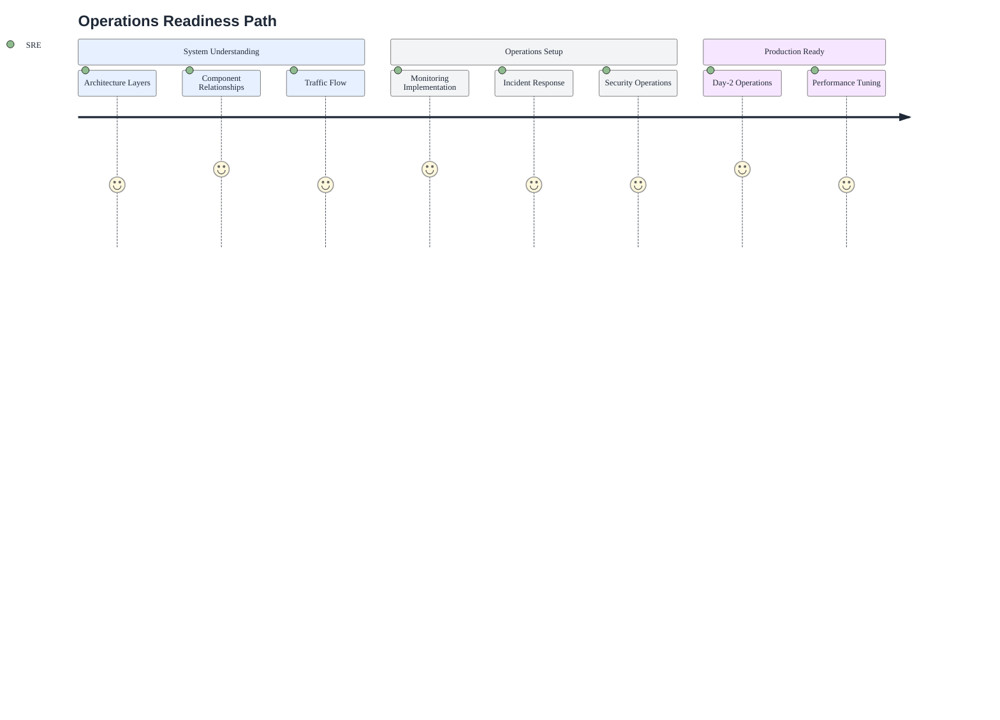

# Documentation Hub

Your single source of truth for the Azure Stamps Pattern, organized by role and learning path to help you navigate architecture, deployment, operations, security, and compliance.

## 🎯 Start Here — 60 second checklist

- Read `README.md` (project overview & prerequisites).
- Run the Live Data Path: `docs/LIVE_DATA_PATH.md` to seed Cosmos and validate Management Portal ↔ DAB ↔ Cosmos.
- For local development: follow `docs/DEVELOPER_QUICKSTART.md` (run Functions + Portal locally).
- For deployments: open `docs/DEPLOYMENT_GUIDE.md` and use `scripts/deploy.ps1` or Bicep templates as documented.

## 👤 Who Should Use This Guide?

...

# 📚 Azure Stamps Pattern - Documentation Sitemap

Your single source of truth for the Azure Stamps Pattern, organized by role and learning path to help you navigate architecture, deployment, operations, security, and compliance.

## 🎯 Start Here — 60 second checklist

- Read `README.md` (project overview & prerequisites).
- Run the Live Data Path: `docs/LIVE_DATA_PATH.md` to seed Cosmos and validate Management Portal ↔ DAB ↔ Cosmos.
- For local development: follow `docs/DEVELOPER_QUICKSTART.md` (run Functions + Portal locally).
- For deployments: open `docs/DEPLOYMENT_GUIDE.md` and use `scripts/deploy.ps1` or Bicep templates as documented.

## 👤 Who Should Use This Guide?

- **Newcomers:** Start here to understand the big picture and find your learning path
- **Developers/DevOps:** Quickly locate deployment, troubleshooting, and implementation guides
- **Solution Architects:** Access deep-dive technical and compliance documentation

3. **Use the [Quick Start Paths](#quick-start-paths-by-experience-level)** to jump in based on your experience
4. **Reference the [Documentation Portfolio](#documentation-overview)** for a summary of all guides

---

- External links to Microsoft Learn and other sites: we use HTML anchors with target="_blank" and rel="noopener", plus a small visual cue ↗. Some viewers (GitHub, VS Code preview) may ignore target. Tip: use Ctrl+Click (Windows/Linux) or Cmd+Click (macOS) to open in a new tab.

---

Follow this sequence to build understanding logically from concepts to implementation:

%%{init: {"theme":"base","themeVariables":{"background":"transparent","primaryColor":"#E6F0FF","primaryTextColor":"#1F2937","primaryBorderColor":"#94A3B8","lineColor":"#94A3B8","secondaryColor":"#F3F4F6","tertiaryColor":"#DBEAFE","clusterBkg":"#F8FAFC","clusterBorder":"#CBD5E1","edgeLabelBackground":"#F8FAFC","fontFamily":"Segoe UI, Roboto, Helvetica, Arial, sans-serif"}} }%%
flowchart LR
    ````markdown
    # 📚 Azure Stamps Pattern - Documentation Sitemap

    Your single source of truth for the Azure Stamps Pattern, organized by role and learning path to help you navigate architecture, deployment, operations, security, and compliance.

    ---
    # Documentation Hub

    This is the central documentation index for the Azure Stamps Pattern. It is organized by role and learning path so newcomers, developers, architects, and operators can quickly find what they need.

    ## 🎯 Start Here — 60 second checklist

    - Read `README.md` (project overview & prerequisites).
    - Run the Live Data Path: `docs/LIVE_DATA_PATH.md` to seed Cosmos and validate Management Portal ↔ DAB ↔ Cosmos.
    - For local development: follow `docs/DEVELOPER_QUICKSTART.md` (run Functions + Portal locally).
    - For deployments: open `docs/DEPLOYMENT_GUIDE.md` and use `scripts/deploy.ps1` or Bicep templates as documented.

    ## 👤 Who Should Use This Guide?

    - Newcomers: start here to understand the big picture and find a learning path.
    - Developers/DevOps: deployment, troubleshooting, and implementation guides.
    - Solution Architects: deep technical and compliance documentation.

    ---

    ## 📚 Documentation Sitemap (high level)

    The documentation is grouped into logical areas. Use the links below to jump to the guide you need.

    ### Core Guides
    - 🏗️ Architecture: [ARCHITECTURE_GUIDE.md](./ARCHITECTURE_GUIDE.md)
    - 🚀 Deployment: [DEPLOYMENT_GUIDE.md](./DEPLOYMENT_GUIDE.md)
    - ⚙️ Operations: [OPERATIONS_GUIDE.md](./OPERATIONS_GUIDE.md)
    - �️ Security: [SECURITY_GUIDE.md](./SECURITY_GUIDE.md)
    - 💰 Cost Optimization: [COST_OPTIMIZATION_GUIDE.md](./COST_OPTIMIZATION_GUIDE.md)
    - 🧩 Parameterization: [PARAMETERIZATION_GUIDE.md](./PARAMETERIZATION_GUIDE.md)

    ### Developer & Authoring
    - 🔐 Developer Security Guide: [DEVELOPER_SECURITY_GUIDE.md](./DEVELOPER_SECURITY_GUIDE.md)
    - 👨‍💻 Developer Quickstart: [DEVELOPER_QUICKSTART.md](./DEVELOPER_QUICKSTART.md)
    - 🖊️ Mermaid Template: [mermaid-template.md](./mermaid-template.md)
    - � Auth & CI Strategy: [AUTH_CI_STRATEGY.md](./AUTH_CI_STRATEGY.md)

    ### Management Portal
    - � User Guide: [MANAGEMENT_PORTAL_USER_GUIDE.md](./MANAGEMENT_PORTAL_USER_GUIDE.md)
    - � Live Data Path: [LIVE_DATA_PATH.md](./LIVE_DATA_PATH.md)

    ### Enterprise Alignment
    - 🧭 CAF/WAF Compliance Analysis: [CAF_WAF_COMPLIANCE_ANALYSIS.md](./CAF_WAF_COMPLIANCE_ANALYSIS.md)
    - �️ Azure Landing Zones: [LANDING_ZONES_GUIDE.md](./LANDING_ZONES_GUIDE.md)

    ---

    ## 📚 Quick Start Paths by Experience Level

    ### 🆕 New to Azure Multi-Tenancy (2-3 hours)
    Glossary → README → Architecture Guide → Simple Deployment

    ### 👨‍💻 Experienced Developer (1.5-2.5 hours)
    README → Deployment Guide → Developer Security → Known Issues

    ### 👨‍💼 IT Leadership (30-45 minutes)
    README → Compliance Analysis

    ### 🏗️ Solution Architect (2-3 hours)
    Architecture Guide → Security Guide → Operations Guide

    ---

    ## 🗺️ Learning Journey Map

    ```mermaid
    flowchart TD
      A[📚 Start Here] --> B{Your Role?}
      B -->|Decision Maker| C[📄 README - Business Value & ROI]
      B -->|Architect| D[🏗️ ARCHITECTURE - Technical Deep-Dive]
      B -->|Developer/DevOps| E[🚀 DEPLOYMENT - Implementation]
      B -->|Operations| F[⚙️ OPERATIONS - Monitoring & Runbooks]
      B -->|Security| G[🛡️ SECURITY - Zero-Trust & Compliance]

    ```mermaid

    ---

    ## � Documentation Overview

    Use this section as a catalog and reference.

    - 🏗️ Architecture: [ARCHITECTURE_GUIDE.md](./ARCHITECTURE_GUIDE.md)
    - 🚀 Deployment: [DEPLOYMENT_GUIDE.md](./DEPLOYMENT_GUIDE.md)
    - ⚙️ Operations: [OPERATIONS_GUIDE.md](./OPERATIONS_GUIDE.md)
    - 🛡️ Security: [SECURITY_GUIDE.md](./SECURITY_GUIDE.md)
    - 🔐 Developer Security Guide: [DEVELOPER_SECURITY_GUIDE.md](./DEVELOPER_SECURITY_GUIDE.md)
    - 👨‍💻 Developer Quickstart: [DEVELOPER_QUICKSTART.md](./DEVELOPER_QUICKSTART.md)
    - � Management Portal: [MANAGEMENT_PORTAL_USER_GUIDE.md](./MANAGEMENT_PORTAL_USER_GUIDE.md)
    - � Live Data Path: [LIVE_DATA_PATH.md](./LIVE_DATA_PATH.md)

    ---

    ## 🤝 Getting Help

    - Documentation feedback: open an issue or submit a PR with suggested improvements.
    - Implementation support: check the relevant guide (Architecture, Deployment, Operations, Security).

    ---

    **Start here**: [README.md](../README.md)

    G --> L[✅ Security Hardened]
    N --> O[✅ Compliance Verified]
    
    H --> M[🎯 Implementation Phase]
    I --> M
    J --> M
    K --> M
    L --> M
    O --> M
```mermaid

---

## 📚 Documentation Overview

A complete index of the documentation set. Use this as a quick catalog and to verify coverage.

### Core Guides

- 🏗️ Architecture: [ARCHITECTURE_GUIDE.md](./ARCHITECTURE_GUIDE.md)
- 🚀 Deployment: [DEPLOYMENT_GUIDE.md](./DEPLOYMENT_GUIDE.md)
- 📐 Deployment Architecture Patterns: [DEPLOYMENT_ARCHITECTURE_GUIDE.md](./DEPLOYMENT_ARCHITECTURE_GUIDE.md)
- ⚙️ Operations: [OPERATIONS_GUIDE.md](./OPERATIONS_GUIDE.md)
- 🛡️ Security: [SECURITY_GUIDE.md](./SECURITY_GUIDE.md)
- 💰 Cost Optimization: [COST_OPTIMIZATION_GUIDE.md](./COST_OPTIMIZATION_GUIDE.md)
- 🧩 Parameterization: [PARAMETERIZATION_GUIDE.md](./PARAMETERIZATION_GUIDE.md)
- 🏷️ Naming Conventions: [NAMING_CONVENTIONS_GUIDE.md](./NAMING_CONVENTIONS_GUIDE.md)

### Management Portal

- 📘 User Guide: [MANAGEMENT_PORTAL_USER_GUIDE.md](./MANAGEMENT_PORTAL_USER_GUIDE.md)
- 🔁 Live Data Path: [LIVE_DATA_PATH.md](./LIVE_DATA_PATH.md)

### Enterprise Alignment

- 🧭 CAF/WAF Compliance Analysis: [CAF_WAF_COMPLIANCE_ANALYSIS.md](./CAF_WAF_COMPLIANCE_ANALYSIS.md)
- 🗺️ Azure Landing Zones: [LANDING_ZONES_GUIDE.md](./LANDING_ZONES_GUIDE.md)

### Developer & Authoring

- 🔐 Developer Security Guide: [DEVELOPER_SECURITY_GUIDE.md](./DEVELOPER_SECURITY_GUIDE.md)
- 👨‍💻 Developer Quickstart: [DEVELOPER_QUICKSTART.md](./DEVELOPER_QUICKSTART.md)
- 🖊️ Mermaid Template (light blue): [mermaid-template.md](./mermaid-template.md)
- 🔐 Auth & CI Strategy: [AUTH_CI_STRATEGY.md](./AUTH_CI_STRATEGY.md)
- 🔒 Secrets & Config: [SECRETS_AND_CONFIG.md](./SECRETS_AND_CONFIG.md)
- 🛂 RBAC Cheat Sheet: [RBAC_CHEATSHEET.md](./RBAC_CHEATSHEET.md)

### One-Pagers & Checklists

- 🧾 Production SaaS Checklist (Printable): [one-pagers/production-saas-checklist.md](./one-pagers/production-saas-checklist.md)
- 💼 Executive Brief (CIO): [one-pagers/executive-brief-cio.md](./one-pagers/executive-brief-cio.md)

### Whitepapers

- 🧠 Concept Whitepaper: [Azure_Stamps_Pattern_Analysis_WhitePaper.md](./Azure_Stamps_Pattern_Analysis_WhitePaper.md)

### Reference & Support

- 📖 Glossary: [GLOSSARY.md](./GLOSSARY.md)
- 🧰 Known Issues: [KNOWN_ISSUES.md](./KNOWN_ISSUES.md)
- 📰 Release Notes: [releases/](./releases)

---

### 🎭 **Role-Based Documentation Paths**

#### 👨‍💼 **For Decision Makers & Executives**

```mermaid
%%{init: {"theme":"base","themeVariables":{"background":"transparent","primaryColor":"#E6F0FF","primaryTextColor":"#1F2937","primaryBorderColor":"#94A3B8","lineColor":"#94A3B8","secondaryColor":"#F3F4F6","tertiaryColor":"#DBEAFE","clusterBkg":"#F8FAFC","clusterBorder":"#CBD5E1","edgeLabelBackground":"#F8FAFC","fontFamily":"Segoe UI, Roboto, Helvetica, Arial, sans-serif"}} }%%
journey
    title Executive Learning Path
    section Business Understanding
      Read Project Overview: 5: Executive
      Review Business Value: 4: Executive
      Understand Total Cost: 3: Executive
    section Technical Confidence
      Architecture Overview: 4: Executive
      Security Posture: 5: Executive
      Operational Model: 4: Executive
    section Decision
      Approve Project: 5: Executive
```mermaid

**📋 Recommended Path:**

1. **📄 [README.md](../README.md)** - Business value and project overview *(10 minutes)*
2. **💼 [Executive Brief (CIO)](./one-pagers/executive-brief-cio.md)** - ROI, KPIs, phased adoption *(10 minutes)*
3. **📊 [CAF_WAF_COMPLIANCE_ANALYSIS.md](./CAF_WAF_COMPLIANCE_ANALYSIS.md)** - Enterprise compliance showcase *(15 minutes)*
4. **🏗️ [ARCHITECTURE_GUIDE.md](./ARCHITECTURE_GUIDE.md#️-architecture-overview)** - High-level architecture *(15 minutes)*
5. **🛡️ [SECURITY_GUIDE.md](./SECURITY_GUIDE.md#-security-overview)** - Security and compliance posture *(15 minutes)*
6. **⚙️ [OPERATIONS_GUIDE.md](./OPERATIONS_GUIDE.md#-operations-overview)** - Operational model *(10 minutes)*

> Tip for IT Leadership: Skim the Executive Brief, then use the concept whitepaper’s “Why Stamps?”, HA/DR modes, and compute choices to align architecture with your SLOs and budget. See: [Azure_Stamps_Pattern_Analysis_WhitePaper.md](./Azure_Stamps_Pattern_Analysis_WhitePaper.md)

#### 📊 **For Compliance Officers & Auditors**

```mermaid
%%{init: {"theme":"base","themeVariables":{"background":"transparent","primaryColor":"#E6F0FF","primaryTextColor":"#1F2937","primaryBorderColor":"#94A3B8","lineColor":"#94A3B8","secondaryColor":"#F3F4F6","tertiaryColor":"#DBEAFE","clusterBkg":"#F8FAFC","clusterBorder":"#CBD5E1","edgeLabelBackground":"#F8FAFC","fontFamily":"Segoe UI, Roboto, Helvetica, Arial, sans-serif"}} }%%
journey
    title Compliance Assessment Path
    section Framework Understanding
      CAF/WAF Overview: 5: Compliance
      Security Controls: 5: Compliance
      Governance Model: 4: Compliance
    section Detailed Review
      Policy Automation: 5: Compliance
      Audit Evidence: 4: Compliance
      Risk Assessment: 5: Compliance
    section Certification
      Compliance Validation: 5: Compliance
```mermaid

**📋 Recommended Path:**

1. **📊 [CAF_WAF_COMPLIANCE_ANALYSIS.md](./CAF_WAF_COMPLIANCE_ANALYSIS.md)** - Complete compliance assessment *(25 minutes)*
2. **🛡️ [SECURITY_GUIDE.md](./SECURITY_GUIDE.md)** - Zero-trust security implementation *(20 minutes)*
3. **⚙️ [OPERATIONS_GUIDE.md](./OPERATIONS_GUIDE.md)** - Governance and policy automation *(15 minutes)*
4. **🚀 [DEPLOYMENT_GUIDE.md](./DEPLOYMENT_GUIDE.md#-post-deployment-validation)** - Audit readiness procedures *(10 minutes)*

#### 👨‍💻 **For Developers & DevOps Engineers**

```mermaid
%%{init: {"theme":"base","themeVariables":{"background":"transparent","primaryColor":"#E6F0FF","primaryTextColor":"#1F2937","primaryBorderColor":"#94A3B8","lineColor":"#94A3B8","secondaryColor":"#F3F4F6","tertiaryColor":"#DBEAFE","clusterBkg":"#F8FAFC","clusterBorder":"#CBD5E1","edgeLabelBackground":"#F8FAFC","fontFamily":"Segoe UI, Roboto, Helvetica, Arial, sans-serif"}} }%%
journey
    title Developer Implementation Path
    section Understanding
      Quick Start Guide: 5: Developer
      Implementation Status: 5: Developer
      Architecture Deep-Dive: 4: Developer
      Naming Standards: 3: Developer
    section Implementation
      Environment Setup: 4: Developer
      Deployment Testing: 5: Developer
      Production Deploy: 4: Developer
    section Maintenance
      Monitor Operations: 4: Developer
      Troubleshooting: 5: Developer
      Security Updates: 3: Developer
```

**📋 Recommended Path:**

1. **📄 [README.md](../README.md)** - Quick start and prerequisites *(10 minutes)*
2. **🚀 [DEPLOYMENT_GUIDE.md](./DEPLOYMENT_GUIDE.md)** - Step-by-step deployment *(45 minutes)*
3. **🛠️ [KNOWN_ISSUES.md](./KNOWN_ISSUES.md)** - Troubleshooting common issues *(Reference as needed)*
4. **📋 [PARAMETERIZATION_GUIDE.md](./PARAMETERIZATION_GUIDE.md)** - Multi-org template customization *(20 minutes)*
5. **📋 [NAMING_CONVENTIONS_GUIDE.md](./NAMING_CONVENTIONS_GUIDE.md)** - Naming standards *(15 minutes)*
6. **🏗️ [ARCHITECTURE_GUIDE.md](./ARCHITECTURE_GUIDE.md)** - Technical deep-dive *(30 minutes)*

**🆕 New Developer Highlights:**

- **Implementation Status**: See exactly what enterprise features have been implemented
- **Known Issues Guide**: 400+ lines of troubleshooting solutions for common problems
- **Enhanced CI/CD**: Load testing, security scanning, and code quality automation
- **Interactive API Docs**: Swagger UI for hands-on API exploration

#### 👨‍🔧 **For Platform & Operations Teams**



**📋 Recommended Path:**

1. **🏗️ [ARCHITECTURE_GUIDE.md](./ARCHITECTURE_GUIDE.md)** - System understanding *(30 minutes)*
2. **⚙️ [OPERATIONS_GUIDE.md](./OPERATIONS_GUIDE.md)** - Monitoring and maintenance *(45 minutes)*
3. **🛡️ [SECURITY_GUIDE.md](./SECURITY_GUIDE.md)** - Security operations *(30 minutes)*
4. **🚀 [DEPLOYMENT_GUIDE.md](./DEPLOYMENT_GUIDE.md#-post-deployment-validation)** - Validation procedures *(20 minutes)*

## 🔍 **Quick Reference & Common Tasks**

### 🚀 **Deployment Quick Links**

| Task | Documentation | Time Required |
|------|---------------|---------------|
| 📐 **Choose Deployment Pattern** | [DEPLOYMENT_ARCHITECTURE_GUIDE](./DEPLOYMENT_ARCHITECTURE_GUIDE.md) | 10 minutes |
| 🌟 **Simple 2-Region Setup** | [DEPLOYMENT_GUIDE - Option 1](./DEPLOYMENT_GUIDE.md#-option-1-simple-two-region-setup-manual-bicep-deployment) | 45 minutes |
| 🌍 **Enterprise Multi-GEO** | [DEPLOYMENT_GUIDE - Option 2](./DEPLOYMENT_GUIDE.md#-option-2-global-multi-geo-setup-advanced-manual-deployment) | 2-3 hours |
| 🔧 **Automation Setup** | [DEPLOYMENT_GUIDE - Methods](./DEPLOYMENT_GUIDE.md#-deployment-methods) | 30 minutes |
| 👩‍💻 **Run Locally (Dev)** | [DEVELOPER_QUICKSTART](./DEVELOPER_QUICKSTART.md) | 10-15 minutes |

### 🆕 **Implementation Quick Links**

| Feature | Documentation | Implementation Details |
|---------|---------------|----------------------|
| 🔒 **Azure Defender** | [Advanced Security Bicep](../AzureArchitecture/advancedSecurity.bicep) | Subscription-scoped threat protection |
| 🧪 **Load Testing** | [k6 Load Tests](../scripts/load-test.js) | Comprehensive performance validation |
| 🔍 **Integration Tests** | [Cosmos DB Tests](../AzureArchitecture/Tests/CosmosDbIntegrationTests.cs) | End-to-end tenant lifecycle testing |
| 📊 **Enhanced Monitoring** | [Monitoring Bicep](../AzureArchitecture/enhancedMonitoring.bicep) | Cache performance and security alerts |
| 📖 **API Documentation** | [Documentation Function](../AzureArchitecture/DocumentationFunction.cs) | Interactive Swagger UI |
| 🛠️ **Troubleshooting** | [Known Issues Guide](./KNOWN_ISSUES.md) | 400+ lines of practical solutions |
| 💰 **Cost Optimization** | [Cost Optimization Guide](./COST_OPTIMIZATION_GUIDE.md) | Savings levers and staged models |
| 🔐 **Developer Security** | [Developer Security Guide](./DEVELOPER_SECURITY_GUIDE.md) | JWT, MI, caching, and DI patterns |
| 🧪 **Run Locally** | [Deployment Guide → Run locally](./DEPLOYMENT_GUIDE.md#-run-locally-functions--emulator) | Functions + Cosmos Emulator quick-start |
| ✅ **CI What-If** | [Deployment Guide → CI Checks](./DEPLOYMENT_GUIDE.md#-ci-checks-bicep-lint-and-what-if) | Bicep lint and what-if workflows |

### ⚙️ **Operations Quick Links**

| Task | Documentation | Time Required |
|------|---------------|---------------|
| 🏠 **Add New Tenant (CELL)** | [OPERATIONS_GUIDE - Tenant Management](./OPERATIONS_GUIDE.md#-flexible-tenant-management-operations) | 20 minutes |
| 🗂️ **Management Portal** | [User Guide](./MANAGEMENT_PORTAL_USER_GUIDE.md) | 15-30 minutes |
| 🚨 **Incident Response** | [OPERATIONS_GUIDE - Incident Response](./OPERATIONS_GUIDE.md#-incident-response) | 15 minutes |
| 📊 **Monitoring Setup** | [OPERATIONS_GUIDE - Monitoring](./OPERATIONS_GUIDE.md#-monitoring--observability) | 30 minutes |
| 🔧 **Troubleshooting** | [OPERATIONS_GUIDE - Maintenance](./OPERATIONS_GUIDE.md#-maintenance-procedures) | Variable |

### 🛡️ **Security Quick Links**

| Task | Documentation | Time Required |
|------|---------------|---------------|
| ✅ **Security Baseline** | [SECURITY_GUIDE - Overview](./SECURITY_GUIDE.md#-security-overview) | 30 minutes |
| 🔐 **Identity Setup** | [SECURITY_GUIDE - Identity](./SECURITY_GUIDE.md#-identity--access-management) | 45 minutes |
| 📋 **Compliance Checklist** | [SECURITY_GUIDE - Compliance](./SECURITY_GUIDE.md#-security-baseline-compliance) | 20 minutes |

### 🏗️ **Architecture Reference**

#### **📐 System Layers**

```
🌍 Global Layer    → DNS, Traffic Manager, Front Door, Global Functions
🚪 Geodes Layer    → API Management (APIM), Global Control Plane Cosmos DB
🏢 Regional Layer  → Application Gateway, Key Vault, Automation Account
🏠 CELL Layer      → Flexible: Shared (10-100 tenants) or Dedicated (1 tenant)
```

#### **🔄 Traffic Flow**

```
User → Front Door → Traffic Manager → APIM Gateway → App Gateway → CELL (Shared/Dedicated) → SQL/Storage
```

#### **🏠 Tenancy Models**

- **Shared CELL**: 10-100 small tenants, cost-optimized, application-level isolation
- **Dedicated CELL**: Single enterprise tenant, compliance-ready, infrastructure-level isolation
- **Mixed Deployment**: Optimize costs with tenant segmentation strategy

#### **📊 Key Metrics**

- **Availability Target**: 99.95% global uptime
- **Performance Target**: <100ms global response time  
- **Scale Target**: Unlimited tenants per region (shared or dedicated)
- **Cost Efficiency**: $16/tenant (shared) to $3,200/tenant (dedicated)
- **Security Target**: Zero-trust architecture with flexible isolation levels

---

## 🤝 **Getting Help**

### 📝 **Documentation Feedback**

If you find gaps or areas for improvement in this documentation:

1. Review the specific guide for detailed information
2. Check the troubleshooting sections for common issues
3. Refer to the architecture guide for technical context

### 🔧 **Implementation Support**

- **Architecture Questions**: [ARCHITECTURE_GUIDE.md](./ARCHITECTURE_GUIDE.md)
- **Deployment Issues**: [DEPLOYMENT_GUIDE.md](./DEPLOYMENT_GUIDE.md)
- **Operations Problems**: [OPERATIONS_GUIDE.md](./OPERATIONS_GUIDE.md)
- **Security Concerns**: [SECURITY_GUIDE.md](./SECURITY_GUIDE.md)

### 📚 **Additional Resources**

- **Azure Documentation**: <a href="https://learn.microsoft.com/azure/architecture/" target="_blank" rel="noopener" title="Opens in a new tab">Azure Architecture Center</a>&nbsp;<sup>↗</sup>
- **Azure Stamps Pattern**: <a href="https://learn.microsoft.com/azure/architecture/guide/" target="_blank" rel="noopener" title="Opens in a new tab">Azure Application Architecture Guide</a>&nbsp;<sup>↗</sup>
- **Multi-Tenant SaaS**: <a href="https://learn.microsoft.com/azure/architecture/solution-ideas/articles/saas-multitenant-database-sharding-pattern" target="_blank" rel="noopener" title="Opens in a new tab">SaaS architecture and patterns</a>&nbsp;<sup>↗</sup>
- **Azure Landing Zones**: <a href="https://learn.microsoft.com/azure/cloud-adoption-framework/ready/landing-zone/" target="_blank" rel="noopener" title="Opens in a new tab">Landing Zones overview</a>&nbsp;<sup>↗</sup>

### 🔐 **Security Highlights**

- Multi-layer WAF protection
- Microsoft Entra External ID (customers) multi-tenant identity
- End-to-end encryption
- Compliance-ready (SOC 2, ISO 27001, HIPAA, GDPR)

## 📊 **Document Maintenance**

### 📅 **Last Updated**

- Documentation suite: August 2025
- Architecture patterns: Current with Azure best practices
- Security baselines: Aligned with Azure Security Benchmark v3

### 🔄 **Update Process**

1. All documentation is maintained in markdown for version control
2. Updates should be made via pull requests with technical review
3. Major architecture changes require documentation updates in parallel

### 📞 **Documentation Feedback**

- Technical questions: Open GitHub issues
- Documentation improvements: Submit pull requests
- Enterprise support: Contact your Microsoft representative

---

## 🏷️ **Navigation Tips**

### 📱 **Mobile/Quick Reference**

- Each guide has a table of contents for easy navigation
- Use browser search (Ctrl+F) to find specific topics quickly
- Cross-references between guides use clear hyperlinks

### 🖥️ **Desktop/Deep Dive**

- Open multiple guides in separate tabs for cross-reference
- Use the search functionality in your IDE/editor
- Bookmark specific sections for frequent reference

---

**🎯 Start Here**: Begin with [README.md](../README.md)

**⚡ Quick Deploy**: Ready to deploy? Jump to [DEPLOYMENT_GUIDE.md](./DEPLOYMENT_GUIDE.md)

**🏗️ Deep Dive**: Want technical details? Explore [ARCHITECTURE_GUIDE.md](./ARCHITECTURE_GUIDE.md)

**🤝 Contribution Guidelines**: See [CONTRIBUTING.md](../CONTRIBUTING.md) for how to contribute, report issues, or suggest improvements.
