# Azure Stamps Pattern - Architecture (ASPA)
## 🛠️ Known Issues & Workarounds

Practical fixes and workarounds for common issues across development, deployment, and operations of the Azure Stamps Pattern - Architecture (ASPA), aimed at developers, DevOps, ops, and support to restore health fast.

- What's inside: Deployment, development, performance, security, database, and ops issue playbooks
- Best for: Developers, DevOps, operations, support, and newcomers
- Outcomes: Faster troubleshooting, fewer regressions, and improved operational maturity

## 👤 Who Should Read This Guide?

- **Developers/DevOps:** Troubleshoot deployment and development issues
- **Operations Teams:** Resolve performance, security, and operational incidents
- **Support Engineers:** Provide fast, accurate solutions to users
- **Newcomers:** Learn about common pitfalls and best practices

---

## 🧭 Quick Navigation

> **Top 10 Fixes — TL;DR (fast triage)**
>
> 1. Bicep/template errors — run `bicep build <file>.bicep` and `az deployment group what-if` → see [Deployment Issues](#-deployment-issues).
> 2. Name conflicts — change `resourceToken` or use uniqueString(resourceGroup().id) → [Deployment Issues](#-deployment-issues).
> 3. DAB crashing / port mismatch — confirm `ASPNETCORE_URLS` vs Container App `targetPort` → [Deployment Issues](#-deployment-issues).
> 4. Portal timeouts to DAB — check `DAB_GRAPHQL_URL` secret and Container App logs → [Troubleshooting Playbooks](#portal-→-dab-connectivity-decision-tree).
> 5. Seeder 401/403 — grant Cosmos DB Data Contributor to the identity and use DefaultAzureCredential locally → [Development Issues](#-development-issues).
> 6. Key Vault access denied — grant `get`/`list` or Key Vault Secrets User RBAC to the principal → [Security Issues](#-security-issues).
> 7. Cosmos 429 throttling — implement retries/backoff and scale RU/s or enable autoscale → [Performance Issues](#-performance-issues).
> 8. Functions host exits locally — build from `AzureArchitecture` and run `func start --verbose` → [Development Issues](#-development-issues).
> 9. Docs link checker failures — run `pwsh ./scripts/verify-doc-links.ps1` and fix relative links → [Troubleshooting Tools](#-troubleshooting-tools).
> 10. APIM/provisioning timeouts — check deployment state and increase provisioning timeout if needed → [Deployment Issues](#-deployment-issues).
>

## ⚡ Top 10 Quick Fixes (fast triage)

1. [Bicep/template validation failures](#-deployment-issues): run `bicep build <file>.bicep` and `az deployment group what-if --resource-group rg -f <file>.bicep --parameters @params.json`.
2. [Resource name conflicts](#-deployment-issues): change `resourceToken` in parameters or use uniqueString(resourceGroup().id) to generate prefixes.
3. [DAB Container crashing or port mismatch](#-deployment-issues): ensure DAB container listens on the same port as container-app `targetPort` (Dockerfile sets ASPNETCORE_URLS).
4. [Portal timeouts talking to DAB](#-deployment-issues): check DAB ingress FQDN/secret and Container App logs; validate `DAB_GRAPHQL_URL` secret.
5. [Seeder unauthorized (401/403)](#-development-issues): verify managed identity/service principal has Cosmos DB Data Contributor role and use DefaultAzureCredential locally.
6. [Key Vault/Secret access denied](#-security-issues): grant the principal `get`/`list` permissions or add the managed identity to Key Vault access policies.
7. [Cosmos 429 throttling](#-performance-issues): add retry/backoff, scale RU/s or enable autoscale, optimize queries and add composite indexes.
8. [Functions host exits locally](#-development-issues): build from `AzureArchitecture` and run `func start --verbose`; check `local.settings.json` for emulator endpoints.
9. [Link checker failures in docs](#-troubleshooting-tools): run `pwsh ./scripts/verify-doc-links.ps1` and fix relative links.
10. [APIM or premium resource timeouts](#-deployment-issues): allow extended timeouts and monitor provisioning state via `az deployment group show`.

| Section | Focus Area | Best for |
|---------|------------|----------|
| [🚀 Deployment Issues](#-deployment-issues) | Bicep, naming, External ID | DevOps |
| [🔧 Development Issues](#-development-issues) | Emulator, Redis, local dev | Developers |
| [⚡ Performance Issues](#-performance-issues) | JWT, Cosmos DB, scaling | DevOps |
| [🔐 Security Issues](#-security-issues) | Defender, Key Vault | Security, DevOps |
| [🗃️ Database Issues](#️-database-issues) | SQL, timeouts, pooling | DevOps |
| [🧰 Operational Issues](#-operational-issues) | Health checks, memory | Operations |
| [🔍 Troubleshooting Tools](#-troubleshooting-tools) | CLI, Kusto, logs | All readers |
| [📞 Getting Help](#-getting-help) | Support, escalation | All readers |

---

## 📚 For Newcomers to the Known Issues Guide

**What is this guide for?**
> This guide is your first stop when something goes wrong with the Stamps Pattern. It covers the most frequent issues, their symptoms, and proven solutions, so you can get back to building, deploying, and operating with confidence.

**Why is this important?**
>
> - **Faster troubleshooting:** Find answers without searching endlessly
> - **Knowledge sharing:** Learn from real-world problems and solutions
> - **Onboarding:** New team members ramp up quickly by seeing common pitfalls
> - **Operational excellence:** Reduce downtime and improve reliability

### 🔍 **Troubleshooting Decision Tree**

```mermaid
%%{init: {"theme":"base","themeVariables":{"background":"transparent","primaryColor":"#E6F0FF","primaryTextColor":"#1F2937","primaryBorderColor":"#94A3B8","lineColor":"#94A3B8","secondaryColor":"#F3F4F6","tertiaryColor":"#DBEAFE","clusterBkg":"#F8FAFC","clusterBorder":"#CBD5E1","edgeLabelBackground":"#F8FAFC","fontFamily":"Segoe UI, Roboto, Helvetica, Arial, sans-serif"}} }%%
flowchart TD
    A[🚨 Issue Detected] --> B{Issue Category?}
    
    B -->|Deployment| C[🚀 Deployment Issues]
    B -->|Development| D[🔧 Development Issues]
    B -->|Performance| E[⚡ Performance Issues]
    B -->|Security| F[🔐 Security Issues]
    B -->|Database| G[🗃️ Database Issues]
    B -->|Operations| H[🧰 Operational Issues]
    
    C --> C1{Bicep Error?}
    C1 -->|Yes| C2[Validate Template<br/>Check Syntax]
    C1 -->|No| C3{Naming Conflict?}
    C3 -->|Yes| C4[Check Resource Names<br/>Update Parameters]
    C3 -->|No| C5[Check Prerequisites<br/>Review Quota]
    
    D --> D1{Local Dev?}
    D1 -->|Yes| D2[Check Emulator<br/>Update Settings]
    D1 -->|No| D3[Review Redis Config<br/>Check Connections]
    
    E --> E1{JWT Slow?}
    E1 -->|Yes| E2[Check JWKS Cache<br/>Update Settings]
    E1 -->|No| E3{Database Slow?}
    E3 -->|Yes| E4[Check Query Performance<br/>Review Indexes]
    
    F --> F1[Review Security Settings<br/>Check Key Vault Access]
    
    G --> G1{Timeout?}
    G1 -->|Yes| G2[Check Connection Pool<br/>Review Query Time]
    G1 -->|No| G3[Review SQL Performance<br/>Check Indexes]
    
    H --> H1{Health Check Fail?}
    H1 -->|Yes| H2[Check Service Health<br/>Review Dependencies]
    H1 -->|No| H3[Check Memory Usage<br/>Review Scaling]

```



### 📊 **Issue Resolution Matrix**

```mermaid
%%{init: {"theme":"base","themeVariables":{"background":"transparent","primaryColor":"#E6F0FF","primaryTextColor":"#1F2937","primaryBorderColor":"#94A3B8","lineColor":"#94A3B8","secondaryColor":"#F3F4F6","tertiaryColor":"#DBEAFE","clusterBkg":"#F8FAFC","clusterBorder":"#CBD5E1","edgeLabelBackground":"#F8FAFC","fontFamily":"Segoe UI, Roboto, Helvetica, Arial, sans-serif"}} }%%
flowchart LR
    subgraph "🎯 Issue Severity"
        A[🔴 Critical<br/>Production Down]
        B[🟠 High<br/>Major Feature Impact]
        C[🟡 Medium<br/>Minor Impact]
        D[🟢 Low<br/>Enhancement]
    end
    
    subgraph "⏱️ Response Time"
        A1[Immediate<br/>15 minutes]
        B1[Urgent<br/>2 hours]
        C1[Standard<br/>24 hours]
        D1[Planned<br/>Next Sprint]
    end
    
    subgraph "👥 Escalation Path"
        A2[On-Call Engineer<br/>+ Management]
        B2[Senior Engineer<br/>+ Team Lead]
        C2[Team Member<br/>Self-Service]
        D2[Backlog<br/>Planning]
    end
    
    A --> A1 --> A2
    B --> B1 --> B2
    C --> C1 --> C2
    D --> D1 --> D2

```



---

## 🔁 Troubleshooting Playbooks (decision trees)

Below are three focused decision trees that operators reach for frequently: Portal → DAB connectivity, DAB container startup, and AAD/authentication issues. Use these as quick visual playbooks during incidents.

### 1) Portal → DAB connectivity decision tree

```mermaid
%%{init: {"theme":"base","themeVariables":{"background":"transparent","primaryColor":"#E6F0FF","primaryTextColor":"#1F2937","primaryBorderColor":"#94A3B8","lineColor":"#94A3B8","secondaryColor":"#F3F4F6","tertiaryColor":"#DBEAFE","clusterBkg":"#F8FAFC","clusterBorder":"#CBD5E1","edgeLabelBackground":"#F8FAFC","fontFamily":"Segoe UI, Roboto, Helvetica, Arial, sans-serif"}} }%%
flowchart TD
    P0[User reports Portal data missing / GraphQL timeouts]
    P0 --> P1{Is Portal returning 5xx or client-side timeout?}

    P1 -->|5xx| P2[Check Portal logs & App Insights for GraphQL errors]
    P1 -->|Timeout| P3[Check network / DNS & Portal HTTP client settings]

    P2 --> P4{Is DAB endpoint configured (DAB_GRAPHQL_URL)?}
    P3 --> P4

    P4 -->|No| P5[Set secret `DAB_GRAPHQL_URL` to Container App ingress FQDN + /graphql]
    P4 -->|Yes| P6[Ping DAB endpoint from Portal (curl/postman) using managed identity header if required]

    P6 -->|Connection refused / DNS| P7[Check Container App ingress FQDN, DNS CNAME, and firewall / private endpoint settings]
    P6 -->|401/403| P8[Verify identity/secret used by Portal; check Key Vault secret and managed identity assignments]
    P6 -->|200 but errors| P9[Inspect DAB logs and GraphQL error payloads]

    P7 --> P10[Check Container App revision status and DAB container logs (az containerapp revision list & logs tail)]
    P8 --> P11[Ensure Portal principal has Key Vault GET & that DAB secret is readable]
    P9 --> P12[Verify DAB schema mapping vs Cosmos containers; run introspection query]

    P10 --> P12
    P11 --> P12

    P12 --> P13[If still failing: redeploy DAB with corrected targetPort and validate ACR pull permissions]
    P13 --> P14[If redeploy fails: capture logs, open issue, escalate to infra on-call]
```

### 2) DAB container startup decision tree

```mermaid
%%{init: {"theme":"base","themeVariables":{"background":"transparent","primaryColor":"#E6F0FF","primaryTextColor":"#1F2937","primaryBorderColor":"#94A3B8","lineColor":"#94A3B8","secondaryColor":"#F3F4F6","tertiaryColor":"#DBEAFE","clusterBkg":"#F8FAFC","clusterBorder":"#CBD5E1","edgeLabelBackground":"#F8FAFC","fontFamily":"Segoe UI, Roboto, Helvetica, Arial, sans-serif"}} }%%
flowchart TD
    D0[Container App shows unhealthy / crash-loop]
    D0 --> D1{Does container start then exit, or fail to pull image?}

    D1 -->|Exits| D2[Inspect container stdout/stderr logs]
    D1 -->|Image pull| D3[Check ACR image existence and managed identity AcrPull role]

    D2 --> D4{Startup error: missing file/config?}
    D4 -->|Yes| D5[Verify /App/dab-config.json is present in image or passed as secret]
    D4 -->|No| D6[Check for unhandled exception stacktrace — missing env var, invalid connection string]

    D3 --> D7[Confirm MI has AcrPull on ACR & image tag exists in registry]

    D5 --> D8[Rebuild image to include config or mount config as secret; push and update revision]
    D6 --> D9[Fix env vars in Container App or Key Vault references; restart revision]
    D7 --> D10[If MI missing, assign AcrPull and restart; if image missing, push image]

    D8 --> D11[Monitor new revision; if healthy, proceed to functional test (graphql introspection)]
    D9 --> D11
    D10 --> D11

    D11 --> D12[If still unhealthy: capture full logs and escalate to engineering]
```

### 3) AAD / Authentication decision tree

```mermaid
%%{init: {"theme":"base","themeVariables":{"background":"transparent","primaryColor":"#E6F0FF","primaryTextColor":"#1F2937","primaryBorderColor":"#94A3B8","lineColor":"#94A3B8","secondaryColor":"#F3F4F6","tertiaryColor":"#DBEAFE","clusterBkg":"#F8FAFC","clusterBorder":"#CBD5E1","edgeLabelBackground":"#F8FAFC","fontFamily":"Segoe UI, Roboto, Helvetica, Arial, sans-serif"}} }%%
flowchart TD
    A0[401/403 when calling service that uses AAD]
    A0 --> A1{Is the call from local dev or deployed service?}

    A1 -->|Local| A2[Check DefaultAzureCredential sequence: Azure CLI / VS Code / VisualStudio logged in?]
    A1 -->|Deployed| A3[Check managed identity assignment on resource]

    A2 --> A4[Run `az account get-access-token --resource <resource>` to validate token]
    A3 --> A5{Has resource principal assigned correct RBAC/Key Vault policy?}

    A5 -->|No| A6[Assign appropriate role: Cosmos DB Data Contributor / ACR Pull / Key Vault Get]
    A5 -->|Yes| A7[Check Key Vault references & secret URIs in app settings]

    A6 --> A8[Retry request after role propagation (~1-5 min)]
    A7 --> A9[If still failing, capture access token and validate scopes/audience using jwt.ms]

    A9 --> A10[If token incorrect audience/role: fix app registration or token exchange; if scopes missing: update role assignment]
    A10 --> A11[Successful authentication -> continue normal operations]

```

---

---

# 🛠️ Known Issues & Workarounds - Azure Stamps Pattern

This document provides solutions to common issues encountered during development, deployment, and operation of the Azure Stamps Pattern.

## 📋 Table of Contents

- [🚀 Deployment Issues](#-deployment-issues)
- [🔧 Development Issues](#-development-issues)
- [⚡ Performance Issues](#-performance-issues)
- [🔐 Security Issues](#-security-issues)
- [🗃️ Database Issues](#️-database-issues)
- [🧰 Operational Issues](#-operational-issues)

---

## 🚀 Deployment Issues

### Issue: Bicep Template Validation Errors

**Problem**: Getting validation errors when deploying Bicep templates.

**Common Symptoms**:

```
Error: Scope "resourceGroup" is not valid for this resource type
Error: The provided value can have a length as small as 2 and may be too short
```

**Solution**:

```powershell
# 1. Always validate templates before deployment
az bicep build --file main.bicep

# 2. Run what-if analysis
az deployment group what-if \
  --resource-group rg-stamps-dev \
  --template-file main.bicep \
  --parameters main.parameters.json

# 3. For subscription-scoped resources (Azure Defender), use:
az deployment sub create \
  --location eastus \
  --template-file advancedSecurity.bicep \
  --parameters resourceGroupName=rg-stamps-dev
```

**Prevention**: Use the CI/CD pipeline which includes automatic validation.

---

### Issue: Resource Naming Conflicts

**Problem**: Resources with duplicate names causing deployment failures.

**Symptoms**:

```
Error: The resource name 'sa123abc' is already taken
```

**Workaround**:

```powershell
# Use the resource token parameter to ensure uniqueness
# In main.parameters.json, ensure resourceToken is unique:
{
  "resourceToken": {
    "value": "myorg001"  // Use your organization prefix + environment
  }
}

# Or let it auto-generate:
param resourceToken string = take(uniqueString(resourceGroup().id), 6)
```

---

### Issue: Microsoft Entra External ID (customers) Deployment Limitations

**Problem**: Microsoft Entra External ID (customers, formerly Azure AD B2C) tenants cannot be created via Bicep/ARM templates.

**Symptoms**:

```
Error: Resource type 'Microsoft.AzureActiveDirectory/b2cDirectories' not supported
```

**Workaround**:

```powershell
# 1. Manually create the External ID tenant in the Azure portal first
# 2. Configure app registrations and user flows there
# 3. Set EXTERNAL_ID_* app settings in your function app
az deployment group create \
  --resource-group rg-stamps-dev \
    # No ARM/Bicep support to create/link tenants as of today
```

---

### Issue: Storage diagnostics categories unsupported in smoke

**Problem**: Storage diagnostic log categories vary by storage kind/SKU. In some subscriptions/regions, neither Blob*nor Storage* categories were accepted for the existing account used in smoke deployments, causing deployment failures like:

```
BadRequest: Category 'StorageRead' is not supported
```

**Resolution (Smoke)**: For smoke deployments, enable metrics-only for Storage diagnostics to avoid category mismatches. This preserves observability while keeping deployments reliable and fast.

**Notes**:

- This applies only to smoke. For full environments, switch to explicit categories appropriate for the storage kind (Blob*for BlockBlobStorage; Storage* for GPv2) once confirmed in your subscription/region.
- The Bicep now emits only `AllMetrics` for Storage in smoke mode; revisit if you need detailed logs.

---

## 🔧 Development Issues

### Issue: Cosmos DB Emulator Connection Failures

**Problem**: Integration tests fail with emulator connection errors.

**Symptoms**:

```
CosmosException: Service is unavailable
SSL connection error
```

**Solution**:

```powershell
# 1. Install and start Cosmos DB Emulator
# Download from: https://aka.ms/cosmosdb-emulator

# 2. Start with proper SSL configuration
"C:\Program Files\Azure Cosmos DB Emulator\CosmosDB.Emulator.exe" /AllowNetworkAccess /Key=your-key

# 3. For development, disable SSL validation:
var cosmosClientOptions = new CosmosClientOptions
{
    HttpClientTimeout = TimeSpan.FromSeconds(30),
    ConnectionMode = ConnectionMode.Gateway, // Required for emulator
    ConsistencyLevel = ConsistencyLevel.Session,
    // For emulator only - DO NOT use in production
    HttpClientFactory = () => new HttpClient(new HttpClientHandler()
    {
        ServerCertificateCustomValidationCallback = (message, certificate, chain, errors) => true
    })
};
```

---

### Issue: Redis Cache Connection Failures in Development

**Problem**: Functions fail to connect to Redis cache locally.

**Symptoms**:

```
StackExchange.Redis.RedisConnectionException: No connection is available
```

**Workaround**:

```csharp
// Use fallback to in-memory cache for local development
public void ConfigureServices(IServiceCollection services)
{
    var redisConnectionString = Environment.GetEnvironmentVariable("RedisConnection");
    if (!string.IsNullOrEmpty(redisConnectionString))
    {
        try 
        {
            services.AddStackExchangeRedisCache(options =>
            {
                options.Configuration = redisConnectionString;
                options.InstanceName = "StampsPattern";
            });
            services.AddScoped<ITenantCacheService, RedisTenantCacheService>();
        }
        catch 
        {
            // Fallback to in-memory cache
            services.AddMemoryCache();
            services.AddScoped<ITenantCacheService, MemoryTenantCacheService>();
        }
    }
    else
    {
        // Local development fallback
        services.AddMemoryCache();
        services.AddScoped<ITenantCacheService, MemoryTenantCacheService>();
    }
}
```

---

### Issue: Functions host exits on startup or endpoints not reachable locally

**Problem**: `func start` builds the Functions app but the host exits quickly, or HTTP probes like `/api/health` or `/api/swagger/ui` return connection errors.

**Checklist & Fixes**:

```powershell
# 1) Verify Azure Functions Core Tools v4 is installed and on PATH
func --version  # Expect major version 4

# 2) Build from the AzureArchitecture folder to catch compile issues
cd ./AzureArchitecture
dotnet build

# 3) Start the host from the AzureArchitecture folder (don’t nest under bin/)
func start

# 4) Port in use? Try an alternate port
func start --port 7072

# 5) Ensure local.settings.json points to the emulator
#   - CosmosDbConnection: https://localhost:8085/
#   - The run-local.ps1 script imports the emulator cert; if SSL errors persist,
#     open https://localhost:8085/_explorer/emulator.pem in a browser once to trust it.

# 6) Avoid overlapping builds/hosts
#    Stop any running VS Code build tasks and background function hosts before retrying.

# 7) Optional: Start Azurite for Storage if your functions need it
azurite --silent --location ./.azurite --debug ./.azurite/debug.log

# 8) Check verbose logs for exceptions
func start --verbose
```

**Notes**:

- Start from the `AzureArchitecture` directory so the host picks up `host.json` and function assemblies.
- If the process exits immediately, inspect the last log lines for unhandled exceptions (e.g., missing env var).
- Ensure only one host instance is running to prevent port conflicts.

For a step-by-step setup, see [Developer Quickstart](./DEVELOPER_QUICKSTART.md).

---

## ⚡ Performance Issues

### Issue: High JWT Validation Latency

**Problem**: JWT validation taking longer than expected (>100ms).

**Investigation**:

```csharp
// Add performance logging to identify bottlenecks
public async Task<bool> ValidateJwtAsync(string token)
{
    var stopwatch = Stopwatch.StartNew();
    
    try 
    {
        // Check cache first
        var cacheKey = $"jwt:validation:{token.GetHashCode()}";
        var cachedResult = await _cache.GetStringAsync(cacheKey);
        
        if (cachedResult != null)
        {
            _logger.LogInformation("JWT validation cache hit - Duration: {Duration}ms", stopwatch.ElapsedMilliseconds);
            return bool.Parse(cachedResult);
        }
        
        // Validate JWT
        var result = await ValidateTokenWithJwks(token);
        
        // Cache result for 5 minutes
        await _cache.SetStringAsync(cacheKey, result.ToString(), 
            new DistributedCacheEntryOptions { SlidingExpiration = TimeSpan.FromMinutes(5) });
            
        _logger.LogInformation("JWT validation completed - Duration: {Duration}ms, CacheHit: false", stopwatch.ElapsedMilliseconds);
        return result;
    }
    finally 
    {
        stopwatch.Stop();
    }
}
```

**Solutions**:

1. Ensure Redis cache is properly configured
2. Increase JWKS cache TTL if appropriate
3. Consider pre-warming cache for frequently used tokens
4. Monitor cache hit ratios via Application Insights

---

### Issue: Cosmos DB Rate Limiting (429 errors)

**Problem**: Receiving 429 throttling errors from Cosmos DB.

**Symptoms**:

```
Microsoft.Azure.Cosmos.CosmosException: Request rate is large
Status: 429 TooManyRequests
```

**Immediate Solutions**:

```csharp
// 1. Implement exponential backoff retry policy
var cosmosClientOptions = new CosmosClientOptions
{
    MaxRetryAttemptsOnRateLimitedRequests = 5,
    MaxRetryWaitTimeOnRateLimitedRequests = TimeSpan.FromSeconds(30),
    ConsistencyLevel = ConsistencyLevel.Session
};

// 2. Optimize queries with proper indexing
var queryDefinition = new QueryDefinition(
    "SELECT * FROM c WHERE c.tenantId = @tenantId AND c.region = @region")
    .WithParameter("@tenantId", tenantId)
    .WithParameter("@region", region);

// 3. Use bulk operations for multiple operations
var tasks = tenants.Select(tenant => 
    container.CreateItemAsync(tenant, new PartitionKey(tenant.TenantId))
);
await Task.WhenAll(tasks);
```

**Long-term Solutions**:

- Scale up RU/s during peak hours
- Implement autoscale for Cosmos DB
- Review and optimize query patterns
- Add composite indexes for common query patterns

---

## 🔐 Security Issues

### Issue: Azure Defender Not Activating

**Problem**: Azure Defender policies not being applied despite deployment.

**Diagnosis**:

```powershell
# Check current pricing tier
az security pricing show --name VirtualMachines
az security pricing show --name AppServices
az security pricing show --name SqlServers

# Verify at subscription level
az account show --query id
```

**Solution**:

```powershell
# Deploy security template at subscription scope
az deployment sub create \
  --location eastus \
  --template-file advancedSecurity.bicep \
  --parameters resourceGroupName=rg-stamps-prod \
  --parameters enableAzureDefender=true
```

---

### Issue: Key Vault Access Denied

**Problem**: Functions unable to access Key Vault secrets.

**Symptoms**:

```
Azure.Security.KeyVault.Secrets.SecretClientException: Forbidden
```

**Solution**:

```bash
# 1. Verify managed identity is enabled
az functionapp identity show --name fa-stamps-eastus --resource-group rg-stamps-dev

# 2. Grant Key Vault access
FUNCTION_PRINCIPAL_ID=$(az functionapp identity show --name fa-stamps-eastus --resource-group rg-stamps-dev --query principalId --output tsv)

az keyvault set-policy \
  --name kv-stamps123abc \
  --object-id $FUNCTION_PRINCIPAL_ID \
  --secret-permissions get list

# 3. Use managed identity in code
var credential = new DefaultAzureCredential();
var keyVaultClient = new SecretClient(new Uri("https://kv-stamps123abc.vault.azure.net/"), credential);
```

---

## 🗃️ Database Issues

### Issue: SQL Database Connection Timeouts

**Problem**: SQL Database connections timing out intermittently.

**Investigation**:

```sql
-- Check current connections
SELECT 
    session_id,
    status,
    blocking_session_id,
    wait_type,
    wait_time,
    last_request_start_time
FROM sys.dm_exec_sessions 
WHERE is_user_process = 1;

-- Check for blocking
SELECT 
    blocking.session_id AS BlockingSessionId,
    blocked.session_id AS BlockedSessionId,
    waitresource,
    waittype
FROM sys.dm_exec_requests blocked
INNER JOIN sys.dm_exec_requests blocking ON blocked.blocking_session_id = blocking.session_id;
```

**Solutions**:

```csharp
// 1. Implement connection pooling
services.AddDbContext<StampsContext>(options =>
    options.UseSqlServer(connectionString, sqlOptions =>
    {
        sqlOptions.EnableRetryOnFailure(3, TimeSpan.FromSeconds(30), null);
        sqlOptions.CommandTimeout(30);
    })
);

// 2. Use async operations
public async Task<TenantInfo> GetTenantAsync(string tenantId)
{
    using var connection = new SqlConnection(_connectionString);
    await connection.OpenAsync();
    
    var command = new SqlCommand("SELECT * FROM Tenants WHERE TenantId = @tenantId", connection);
    command.Parameters.AddWithValue("@tenantId", tenantId);
    
    using var reader = await command.ExecuteReaderAsync();
    // Process results...
}
```

---

## 🧰 Operational Issues

### Issue: Load Balancer Health Check Failures

**Problem**: Health checks failing causing traffic routing issues.

**Diagnosis**:

```bash
# Check health endpoint
curl -f https://fa-stamps-eastus.azurewebsites.net/api/health

# Check Application Insights for health check metrics
az monitor app-insights query \
  --app stamps-app-insights \
  --analytics-query "requests | where name == 'GET /api/health' | where timestamp > ago(1h)"
```

**Solution**:

```csharp
// Implement comprehensive health check
[Function("HealthCheck")]
public async Task<HttpResponseData> HealthCheck([HttpTrigger(AuthorizationLevel.Anonymous, "get", Route = "health")] HttpRequestData req)
{
    var healthChecks = new Dictionary<string, bool>();
    
    try 
    {
        // Check Cosmos DB
        var cosmosResponse = await _cosmosClient.ReadAccountAsync();
        healthChecks["cosmos-db"] = true;
    }
    catch 
    {
        healthChecks["cosmos-db"] = false;
    }
    
    try 
    {
        // Check Redis Cache
        await _cache.GetStringAsync("health-check");
        healthChecks["redis-cache"] = true;
    }
    catch 
    {
        healthChecks["redis-cache"] = false;
    }
    
    var isHealthy = healthChecks.Values.All(x => x);
    var status = isHealthy ? HttpStatusCode.OK : HttpStatusCode.ServiceUnavailable;
    
    var response = req.CreateResponse(status);
    await response.WriteAsJsonAsync(new { 
        status = isHealthy ? "Healthy" : "Unhealthy",
        checks = healthChecks,
        timestamp = DateTime.UtcNow
    });
    
    return response;
}
```

---

### Issue: High Memory Usage in Function Apps

**Problem**: Function Apps experiencing memory pressure and restarts.

**Diagnosis**:

```bash
# Check memory metrics
az monitor metrics list \
  --resource /subscriptions/sub-id/resourceGroups/rg-stamps/providers/Microsoft.Web/sites/fa-stamps \
  --metric "MemoryWorkingSet" \
  --start-time 2025-08-06T00:00:00Z \
  --end-time 2025-08-06T23:59:59Z
```

**Solutions**:

```csharp
// 1. Implement proper disposal patterns
public class TenantFunction : IDisposable
{
    private readonly CosmosClient _cosmosClient;
    private bool _disposed = false;
    
    public void Dispose()
    {
        Dispose(true);
        GC.SuppressFinalize(this);
    }
    
    protected virtual void Dispose(bool disposing)
    {
        if (!_disposed && disposing)
        {
            _cosmosClient?.Dispose();
            _disposed = true;
        }
    }
}

// 2. Use object pooling for expensive objects
services.AddSingleton<IObjectPool<StringBuilder>>(serviceProvider =>
{
    var provider = new DefaultObjectPoolProvider();
    return provider.Create<StringBuilder>();
});

// 3. Configure proper garbage collection
// In host.json:
{
  "functionTimeout": "00:05:00",
  "extensions": {
    "http": {
      "routePrefix": "api",
      "maxConcurrentRequests": 100,
      "maxOutstandingRequests": 200
    }
  }
}
```

---

## 🔍 Troubleshooting Tools

### Essential Commands

```bash
# Check resource status
az resource list --resource-group rg-stamps-dev --output table

# Monitor logs in real-time
az monitor activity-log list --resource-group rg-stamps-dev --start-time 2025-08-06T00:00:00Z

# Function app logs
az functionapp logs tail --name fa-stamps-eastus --resource-group rg-stamps-dev

# Performance metrics
az monitor metrics list --resource /subscriptions/sub-id/resourceGroups/rg-stamps/providers/Microsoft.Web/sites/fa-stamps --metric "ResponseTime"
```

### Application Insights Queries

```kusto
// Function performance analysis
requests
| where timestamp > ago(24h)
| summarize 
    avg(duration), 
    percentiles(duration, 50, 95, 99) 
    by operation_Name
| order by avg_duration desc

// Error analysis
exceptions
| where timestamp > ago(24h)
| summarize count() by problemId, outerMessage
| order by count_ desc

// Cache performance
traces
| where message contains "cache"
| where timestamp > ago(24h)
| extend cacheHit = tobool(customDimensions["CacheHit"])
| summarize 
    hitRate = avg(iff(cacheHit, 1.0, 0.0)) * 100,
    totalRequests = count()
    by bin(timestamp, 1h)
```

---

## 📞 Getting Help

If you encounter issues not covered here:

1. **Check Application Insights** for detailed error information
2. **Review Azure Monitor** alerts and metrics
3. **Search GitHub Issues** in the repository
4. **Create a new issue** with:
   - Environment details (dev/staging/prod)
   - Error messages and stack traces
   - Steps to reproduce
   - Expected vs actual behavior

---

**🤝 Contribution Guidelines**: See [CONTRIBUTING.md](../CONTRIBUTING.md) for how to report issues, suggest improvements, or contribute fixes.


- **Version**: 1.3.0
- **Last Updated**: 2025-08-18 00:55:39 UTC  
- **Status**: Current
- **Next Review**: 2025-11

---

*Part of the [Azure Stamps Pattern](../README.md) documentation suite*

- **Version**: 
- **Last Updated**: 2025-08-18 00:58:22 UTC  
- **Status**: Current
- **Next Review**: 2025-11

---

*Part of the [Azure Stamps Pattern](../README.md) documentation suite*

- **Version**: 1.3.0
- **Last Updated**: 2025-08-18 00:58:44 UTC  
- **Status**: Current
- **Next Review**: 2025-11

---

**📝 Document Version Information**
- **Version**: 1.3.0
- **Last Updated**: 2025-08-18 01:28:00 UTC  
- **Status**: Current
- **Next Review**: 2025-11