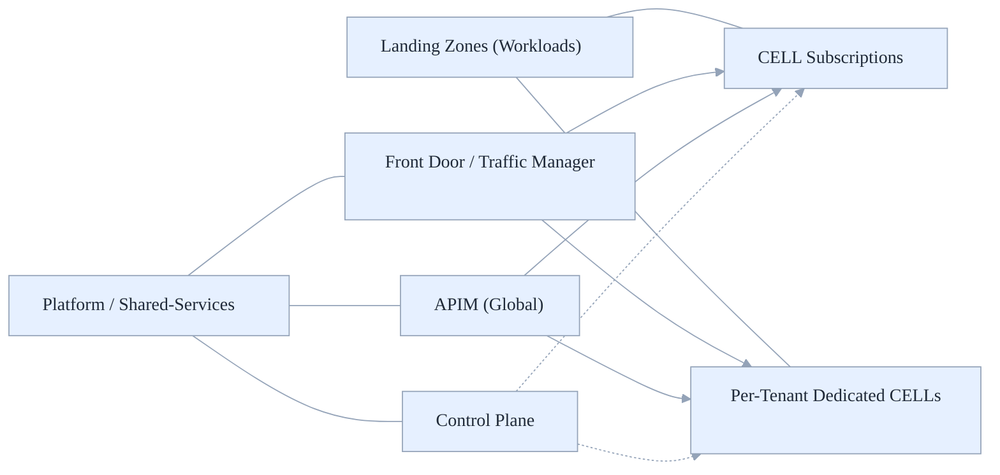
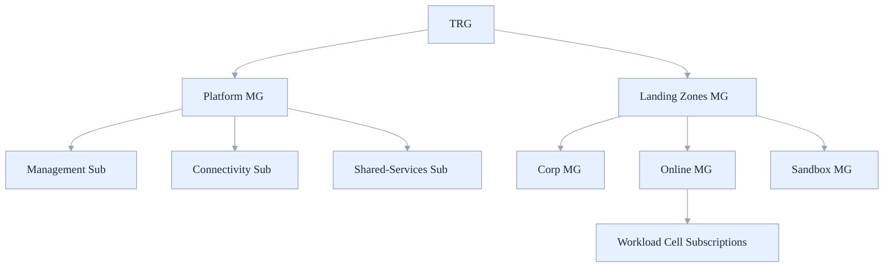
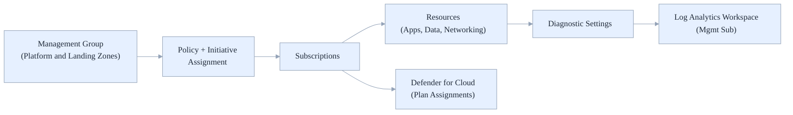
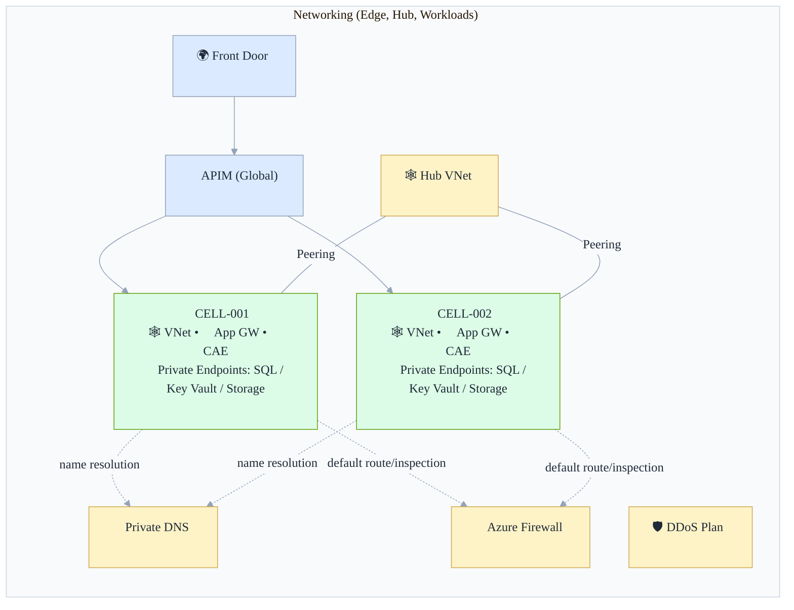
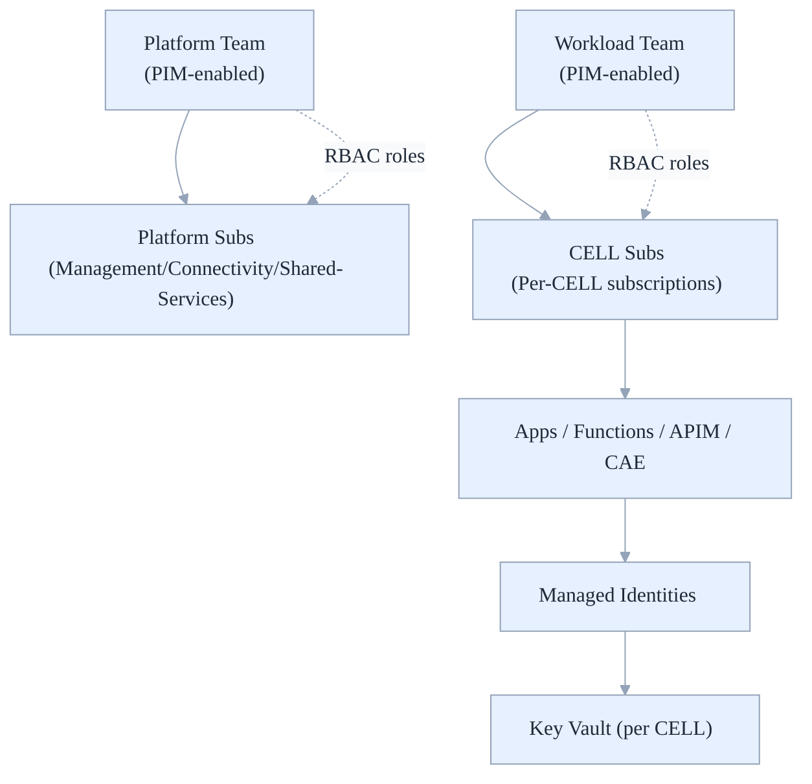
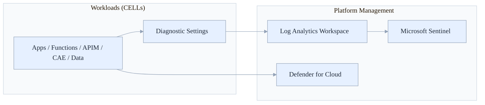
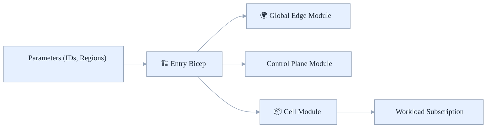

# Azure Stamps Pattern - Architecture (ASPA)
## 🏗️ Azure Landing Zones Guide

Practical guide to placing Azure Stamps Pattern components within Azure Landing Zones - platform versus workload boundaries, management group hierarchy, policy guardrails, and IaC entry points - so you can scale safely with clear ownership and governance.

- What's inside: MG hierarchy, subscription design, component-to-LZ mapping, policy assignments, networking, identity, monitoring, and IaC wiring
- Best for: Platform/ALZ teams, solution architects, DevOps/infra engineers, and security/governance leads
- Outcomes: Clear placement rules, repeatable deployments, consistent guardrails, and reduced blast radius

## 👤 Who Should Read This Guide?

- Platform/ALZ Teams: Define and operate CAF-aligned landing zones and guardrails
- Solution Architects: Map workload components to the right scopes (MG, subscription)
- DevOps/Infra Engineers: Implement IaC with correct scoping and parameters
- Security/Governance: Enforce policy-as-code and central diagnostics at scale

---

## 🧭 Quick Navigation

| Section | Focus Area | Best for |
|---------|------------|----------|
| [🗂️ MGs & Subscriptions](#-management-groups-and-subscriptions) | CAF hierarchy and scope | Platform, Architects |
| [🧩 Component Mapping](#-component-to-landing-zone-mapping) | Where each piece belongs | Architects, DevOps |
| [🛡️ Governance & Policy](#-governance--policy) | Initiatives, diagnostics, guardrails | Platform, Security |
| [🌐 Networking & Connectivity](#-networking--connectivity) | Hub/spoke, private DNS, vWAN | Network, DevOps |
| [🔐 Identity & Access](#-identity--access) | RBAC, PIM, managed identities | Security, Platform |
| [📈 Monitoring & Security](#-monitoring--security) | LAW, Defender, Sentinel | Ops, Security |
| [🚀 CI/CD & Environments](#-cicd--environments) | Pipelines and scopes | DevOps |
| [🏗️ IaC Structure & Parameters](#-iac-structure--parameters) | Scoping modules and params | DevOps |
| [🏷️ Tags, Cost, and Quotas](#-tags-cost-and-quotas) | Standards and limits | IT Leaders |

Last updated: August 2025

## 🧭 Where Things Go

- Platform landing zones host shared enterprise services: Identity (process), Management, Connectivity, and Shared Services (global edge, shared gateways). Do not put all infra into the Management subscription.
- Application (workload) landing zones host your CELLs (shared or dedicated) per region. Use one subscription per CELL for isolation, quotas, and billing clarity.
- Control Plane (management portal, DAB GraphQL, control metadata): either a) Platform Shared-Services subscription if used by many apps/org-wide, or b) a dedicated “ControlPlane” workload subscription under Landing Zones for autonomy and SDLC separation.

### 🖼️ Visual: High-Level Placement



Caption: High-level placement of global edge, control plane, and CELL subscriptions across landing zones.

---

## 🗂️ Management Groups and Subscriptions

Recommended CAF-aligned hierarchy:

```
Tenant Root Group (TRG)
├─ Platform (MG)
│  ├─ Identity (process-owned; Entra ID tenant scope)
│  ├─ Management (subscription)
│  ├─ Connectivity (subscription)
│  └─ Shared-Services (subscription)
└─ Landing Zones (MG)
   ├─ Corp (MG)
   │  ├─ Sub: corp-dev
   │  ├─ Sub: corp-test
   │  └─ Sub: corp-prod
   ├─ Online (MG)
   │  ├─ Sub: online-eus-cell-shared-z2
   │  ├─ Sub: online-weu-cell-shared-z2
   │  └─ Sub: online-eus-cell-dedicated-tenantX
   └─ Sandbox (MG)
      └─ Sub: sandbox
```

### 🖼️ Visual: MG Hierarchy (CAF-Aligned)



Caption: CAF-aligned management group hierarchy and subscription layout.

### 📦 Subscriptions at a Glance

- Platform/Management: Log Analytics, Sentinel, Defender, Automation; central diagnostics.
- Platform/Connectivity: vWAN/Hub VNets, Azure Firewall, Private DNS, DDoS plan.
- Platform/Shared-Services: Traffic Manager, Front Door, global APIM (if shared), optional Control Plane.
- Workload (Application) landing zones: CELL per subscription; VNet-injected Container Apps Env, App Gateway, Redis, SQL, Storage, per-CELL Key Vault, Private Endpoints.

---

## 🧩 Component-to-Landing-Zone Mapping

| Component (repo) | Resource examples | Landing zone | Rationale |
|---|---|---|---|
| Global Layer (traffic-routing.bicep) | Traffic Manager, Front Door | Platform/Shared-Services | Global edge, shared across workloads |
| Geodes/Global Control Plane (globalLayer.bicep) | APIM (global), External ID (customers), Control Plane Cosmos (if shared) | Platform/Shared-Services (or dedicated ControlPlane workload sub) | Central governance & reuse |
| Regional Layer (regionalLayer.bicep) | App Gateway, Key Vault, Automation | Platform/Connectivity (shared) or per-workload if required | Regional entry, shared networking |
| CELL Layer (deploymentStampLayer.bicep, geodesLayer.bicep) | Container Apps Env and apps, Redis, SQL/Storage, KV, Private Endpoints | Application/Workload LZ (per-CELL subscription) | Isolation, quotas, billing |
| Management Portal (management-portal) | Blazor Server app, DAB GraphQL, control-plane Cosmos DB | Platform/Shared-Services or dedicated ControlPlane workload sub | Org-wide mgmt or app autonomy |
| Monitoring (monitoringLayer.bicep, monitoringDashboards.bicep) | Log Analytics, Dashboards, alerts | Platform/Management (central) + per-CELL in workload subs | Central visibility + local SLOs |
| Security/Policy (policyAsCode.bicep, zeroTrustSecurity.bicep) | Policy assignments, Defender, Sentinel | MG scopes (Platform, Landing Zones) | Inheritance and guardrails |

---

## 🛡️ Governance & Policy

- Apply policy at MG scope; inherit to subscriptions. At minimum:
  - Required: Diagnostic settings to Log Analytics, Defender for Cloud on, baseline tag requirements, allowed locations/SKUs, secure transfer, TLS minimums, managed identity enforced.
  - Workload MG: allow list of PaaS services, regional/AZ constraints, Private Endpoint requirement for data services.
- Use your `policyAsCode.bicep` to assign initiatives at MG scope. Example (Bicep):

```bicep
targetScope = 'managementGroup'

@description('ID of the management group (e.g., platform or landingzones)')
param mgId string

module diagnostics './policy/assign-diagnostics.bicep' = {
  name: 'assign-diagnostics'
  scope: managementGroup(mgId)
  params: {
    logAnalyticsResourceId: resourceId('/subscriptions/<mgmt-sub-id>/resourceGroups/rg-mgmt/providers/Microsoft.OperationalInsights/workspaces/law-central')
  }
}
```

### 🖼️ Visual: Policy-as-Code Flow (Scopes → Diagnostics)



Caption: Policies/initiatives assigned at MG scope inherit to subscriptions and resources; diagnostic settings route logs to central Log Analytics; Defender plans are enabled across scopes.

Learn more:

- Azure Policy overview: <a href="https://learn.microsoft.com/azure/governance/policy/overview" target="_blank" rel="noopener" title="Opens in a new tab">Docs</a>&nbsp;<sup>↗</sup>
- Management groups: <a href="https://learn.microsoft.com/azure/governance/management-groups/overview" target="_blank" rel="noopener" title="Opens in a new tab">Overview</a>&nbsp;<sup>↗</sup>
- Policy initiatives (policy sets): <a href="https://learn.microsoft.com/azure/governance/policy/concepts/initiative-definition" target="_blank" rel="noopener" title="Opens in a new tab">Concepts</a>&nbsp;<sup>↗</sup>
- Diagnostic settings: <a href="https://learn.microsoft.com/azure/azure-monitor/essentials/diagnostic-settings" target="_blank" rel="noopener" title="Opens in a new tab">Guide</a>&nbsp;<sup>↗</sup>

---

## 🌐 Networking & Connectivity

- Hub-and-spoke or vWAN in Platform/Connectivity subscription.
- Private DNS zones central in hub; link CELL spokes across subscriptions.
- Container Apps: use VNet-injected CAE in each CELL subscription; ensure hub-spoke peering/vWAN route propagation and Private DNS resolution.
- Private Endpoints for SQL/Storage/etc. in CELL spokes; integrate with central Private DNS.

### 🖼️ Visual: Networking (Hub-Spoke, Peering, Private Endpoints)



Caption: Hub-and-spoke topology with central Private DNS and optional Firewall inspection. Spokes host CELL resources (App Gateway, VNet-injected Container Apps) with Private Endpoints for data services.

Learn more:

- Hub-spoke topology: <a href="https://learn.microsoft.com/azure/architecture/reference-architectures/hybrid-networking/hub-spoke" target="_blank" rel="noopener" title="Opens in a new tab">Reference architecture</a>&nbsp;<sup>↗</sup>
- Virtual WAN overview: <a href="https://learn.microsoft.com/azure/virtual-wan/virtual-wan-about" target="_blank" rel="noopener" title="Opens in a new tab">Azure Virtual WAN</a>&nbsp;<sup>↗</sup>
- VNet peering: <a href="https://learn.microsoft.com/azure/virtual-network/virtual-network-peering-overview" target="_blank" rel="noopener" title="Opens in a new tab">Overview</a>&nbsp;<sup>↗</sup>
- Private Link & Private Endpoints: <a href="https://learn.microsoft.com/azure/private-link/private-link-overview" target="_blank" rel="noopener" title="Opens in a new tab">Overview</a>&nbsp;<sup>↗</sup>
- Private DNS zones: <a href="https://learn.microsoft.com/azure/dns/private-dns-privatednszone" target="_blank" rel="noopener" title="Opens in a new tab">Concepts</a>&nbsp;<sup>↗</sup>
- Container Apps networking: <a href="https://learn.microsoft.com/azure/container-apps/networking" target="_blank" rel="noopener" title="Opens in a new tab">Networking options</a>&nbsp;<sup>↗</sup>
- Application Gateway: <a href="https://learn.microsoft.com/azure/application-gateway/overview" target="_blank" rel="noopener" title="Opens in a new tab">Overview</a>&nbsp;<sup>↗</sup>
- APIM networking: <a href="https://learn.microsoft.com/azure/api-management/virtual-network-concepts" target="_blank" rel="noopener" title="Opens in a new tab">VNet concepts</a>&nbsp;<sup>↗</sup>

Tip, other helpful visuals to consider in this guide:

- Governance & Policy: a small “policy-as-code flow” diagram showing MG-scope assignment → subscription/resource inheritance → diagnostic settings to Log Analytics.
- Identity & Access: a “ownership and RBAC” diagram mapping Platform vs Workload teams, with PIM and managed identities.
- Monitoring & Security: a “signals flow” diagram from resources and Private Endpoints to LAW, Defender for Cloud, and Sentinel.

---

## 🔐 Identity & Access

- Entra ID tenant-level ownership for identity; PIM-enforced RBAC.
- Platform team owns Platform subscriptions; workload teams own CELL subscriptions.
- Managed identities everywhere (Functions/Apps/APIM/CAE); separate Key Vault per CELL; platform KV for shared secrets.

### 🖼️ Visual: Ownership, RBAC, and Managed Identities



Caption: Platform and Workload teams assume time-bound access via PIM and apply RBAC at subscription/resource scopes. Workloads use managed identities to access per-CELL Key Vault and other services.

Learn more:

- Azure RBAC: <a href="https://learn.microsoft.com/azure/role-based-access-control/overview" target="_blank" rel="noopener" title="Opens in a new tab">Overview</a>&nbsp;<sup>↗</sup>
- Privileged Identity Management (PIM): <a href="https://learn.microsoft.com/entra/privileged-identity-management/pim-configure" target="_blank" rel="noopener" title="Opens in a new tab">Configure PIM</a>&nbsp;<sup>↗</sup>
- Managed identities: <a href="https://learn.microsoft.com/entra/identity/managed-identities-azure-resources/overview" target="_blank" rel="noopener" title="Opens in a new tab">Overview</a>&nbsp;<sup>↗</sup>
- Azure Key Vault: <a href="https://learn.microsoft.com/azure/key-vault/general/overview" target="_blank" rel="noopener" title="Opens in a new tab">Overview</a>&nbsp;<sup>↗</sup>

---

## 🧭 Monitoring & Security

- Central Log Analytics workspace(s) in Platform/Management; optional per-CELL workspaces for autonomy.
- Defender for Cloud enabled across Platform and Landing Zones; Sentinel in Management.
- Standardize diagnostic settings via policy; use workbooks/dashboards (see `monitoringDashboards.bicep`).

### 🖼️ Visual: Signals Flow (Diagnostics, Defender, SIEM)



Caption: Resources emit logs/metrics via diagnostic settings to a central Log Analytics workspace; Sentinel consumes from LAW; Defender for Cloud analyzes resource posture and alerts across scopes.

Learn more:

- Log Analytics: <a href="https://learn.microsoft.com/azure/azure-monitor/logs/log-analytics-overview" target="_blank" rel="noopener" title="Opens in a new tab">Overview</a>&nbsp;<sup>↗</sup>
- Microsoft Sentinel: <a href="https://learn.microsoft.com/azure/sentinel/overview" target="_blank" rel="noopener" title="Opens in a new tab">Overview</a>&nbsp;<sup>↗</sup>
- Defender for Cloud: <a href="https://learn.microsoft.com/azure/defender-for-cloud/defender-for-cloud-introduction" target="_blank" rel="noopener" title="Opens in a new tab">Introduction</a>&nbsp;<sup>↗</sup>
- Diagnostic settings: <a href="https://learn.microsoft.com/azure/azure-monitor/essentials/diagnostic-settings" target="_blank" rel="noopener" title="Opens in a new tab">Guide</a>&nbsp;<sup>↗</sup>

---

## 🚀 CI/CD & Environments

- Platform pipelines (infrequent): Management/Connectivity/Shared-Services; policy assignments at MG.
- Workload pipelines (frequent): deploy stamps (CELLs) to workload subscriptions; parameterize subscription IDs and regions.
- Separate MGs or folders per env (dev/test/prod); align subscriptions accordingly.

---

## 🏗️ IaC Structure & Parameters

- Keep Bicep modules layer-aligned (already reflected in repo). Parameterize:
  - platformSubscriptionId, connectivitySubscriptionId, sharedServicesSubscriptionId
  - cellSubscriptionId, region, azZone, environment, cellId
- Example (Bicep entry-point):

```bicep
param platformSubId string
param sharedServicesSubId string
param cellSubId string
param region string
param cellId string

// Global edge
module global './traffic-routing.bicep' = {
  name: 'global-edge'
  scope: subscription(sharedServicesSubId)
  params: {
    // ... your params
  }
}

// Control plane (optional centralized)
module controlPlane './AzureArchitecture/globalLayer.bicep' = {
  name: 'control-plane'
  scope: subscription(sharedServicesSubId)
  params: {
    // ... your params
  }
}

// CELL in workload subscription
module cell './AzureArchitecture/deploymentStampLayer.bicep' = {
  name: 'cell-' + cellId
  scope: subscription(cellSubId)
  params: {
    location: region
    cellId: cellId
    // ... your params
  }
}
```

---

## 🏷️ Tags, Cost, and Quotas

- Standard tags: `env`, `costCenter`, `owner`, `app`, `cellId`, `tenantId`, `azd-env-name`.
- Budgets at subscription level per CELL; cost analysis by tag.
- Dedicated CELLs per enterprise tenant ease chargeback and increase quota limits vs shared.

---

## 🛟 Resiliency & DR

- Global: Front Door/Traffic Manager (active-active across regions).
- Regional: duplicate CELLs across at least two regions; align data replication (SQL/Cosmos) to RPO/RTO.
- Control Plane: geo-replicate Cosmos DB (if used centrally) and deploy portal/DAB in two regions.

---

## ✅ Quick Decisions Checklist

- [ ] Control Plane placement: Platform Shared-Services vs dedicated workload subscription
- [ ] Per-CELL subscription model: shared vs dedicated per enterprise tenant
- [ ] Hub/spoke or vWAN topology; Private DNS ownership location
- [ ] Single vs dual Log Analytics strategy; Sentinel enabled
- [ ] Region pairs and DR pattern; target RPO/RTO
- [ ] Policy initiatives at Platform and Landing Zones MGs

---

## 🧰 Implementation Starters

Starter Bicep templates are available under `infra/alz-starter/`:

- `mg-policy-assign.bicep`, Minimal management group policy/initiative assignment.
- `subscription-map.bicep`, Tenant-scope subscription mapping for platform/shared services and cells.

These are conservative, non-destructive starters you can extend with your own policy sets and subscription provisioning.

### 🖼️ Visual: IaC Flow (Consumer View)



---

## 📚 Related Guides

- [Architecture Guide](./ARCHITECTURE_GUIDE.md)
- [Deployment Guide](./DEPLOYMENT_GUIDE.md)
- [Security Guide](./SECURITY_GUIDE.md)
- [Parameterization Guide](./PARAMETERIZATION_GUIDE.md)
- [Naming Conventions](./NAMING_CONVENTIONS_GUIDE.md)
- [Glossary](./GLOSSARY.md)
- [Known Issues](./KNOWN_ISSUES.md)
- [Cost Optimization](./COST_OPTIMIZATION_GUIDE.md)

- Azure CAF – Landing Zones: <a href="https://learn.microsoft.com/azure/cloud-adoption-framework/ready/landing-zone/" target="_blank" rel="noopener">docs</a>
  <sup>↗</sup>
- Azure Architecture Center: <a href="https://learn.microsoft.com/azure/architecture/" target="_blank" rel="noopener" title="Opens in a new tab">docs</a> <sup>↗</sup>


- **Version**: 1.3.0
- **Last Updated**: 2025-08-18 01:02:00 UTC  
- **Status**: Current
- **Next Review**: 2025-11

---

*Part of the [Azure Stamps Pattern](../README.md) documentation suite*

- **Version**: 1.3.0
- **Last Updated**: 2025-08-18 01:03:41 UTC  
- **Status**: Current
- **Next Review**: 2025-11

---

*Part of the [Azure Stamps Pattern](../README.md) documentation suite*
---

**📝 Document Version Information**
- **Version**: 1.3.0
- **Last Updated**: 2025-08-18 01:28:00 UTC  
- **Status**: Current
- **Next Review**: 2025-11