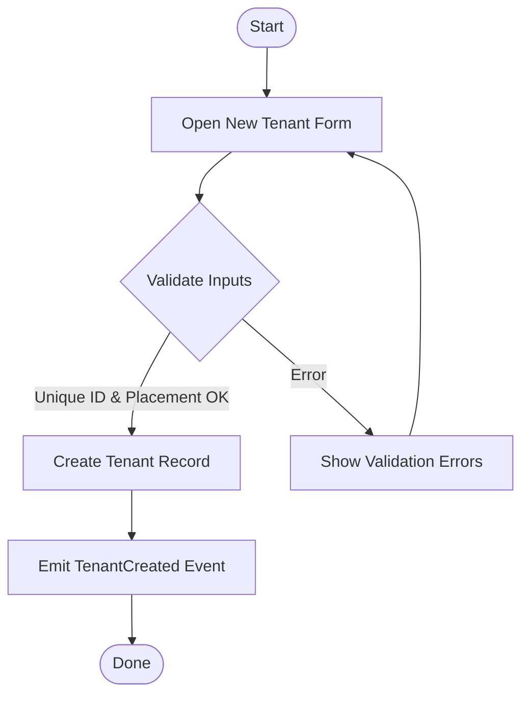
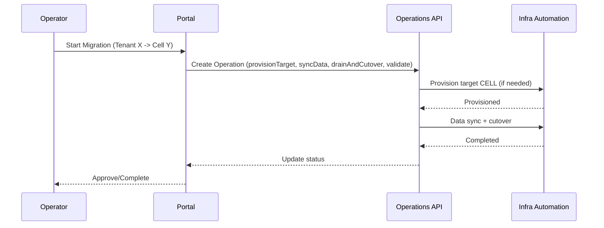
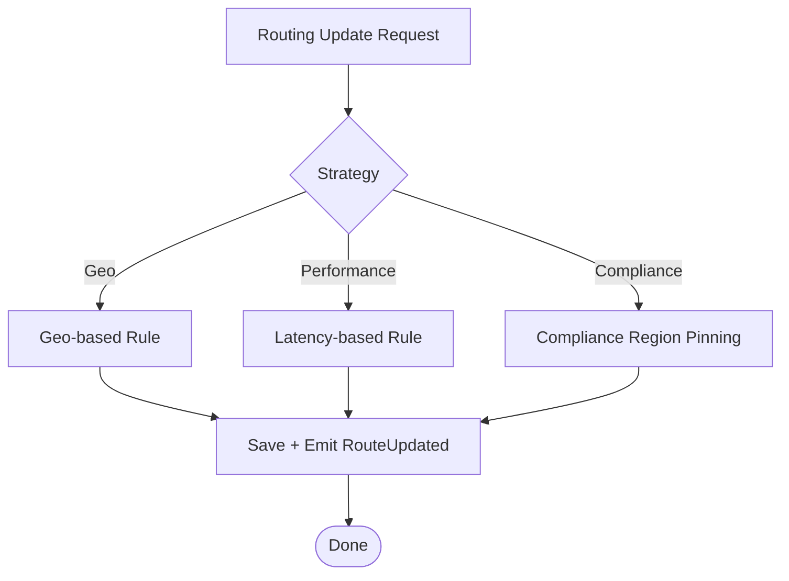

# 🧭 Management Portal — User Guide

---

> **Executive Summary:**
> This guide walks platform admins, operators, and support engineers through onboarding, managing, and operating tenants using the Management Portal (Control Plane UI). It covers concepts, workflows, and common tasks with a clear, action-first layout.

---

Last updated: August 2025

## 👥 Who Should Read This?

- Platform administrators
- Operators/SREs
- Support engineers

---

## ✅ Prerequisites

- Entra ID account with one of the following roles:
  - Platform.Admin (full admin)
  - Operator (manage routing and operations)
  - Reader (read-only)
- Network access to the portal URL

---

## 🧭 Quick Navigation

| Section | Focus Area | Time | Best for |
|---|---|---:|---|
| [📚 Concepts](#-concepts) | Tenant, Cell, Operation | 3 min | All |
| [🚀 Onboard a Tenant](#-onboarding-a-new-tenant) | Create and validate tenants | 5 min | Admins |
| [🧩 Routing Rules](#-updating-routing-rules) | Routing strategies and weights | 4 min | Operators |
| [🔁 Tenant Migration](#-migrating-a-tenant) | Shared → Dedicated or cell-to-cell | 6 min | Admins, Ops |
| [⏸️ Suspend/Resume](#-suspendingresuming-a-tenant) | Lifecycle controls | 2 min | Ops |
| [🗑️ Decommission](#-decommissioning-a-tenant) | Offboarding with retention | 3 min | Admins |
| [🏠 Manage Cells](#-managing-cells) | Health, capacity, constraints | 4 min | Ops |
| [🧾 Audit & Reporting](#-audit--reporting) | Changes and exports | 3 min | Compliance |
| [🛠️ Troubleshooting](#-troubleshooting) | Common fixes | 3 min | Support |
| [❓ FAQ](#-faq) | Quick answers | 3 min | All |

---

## 📚 Concepts

- Tenant: A customer instance with metadata, placement, and routing rules
- Cell: A deployment unit hosting one or more tenants
- Operation: A workflow (e.g., migration) tracked as steps with status

---

## �️ Visual Workflows

### 🚀 Tenant Onboarding Flow

### 🔁 Tenant Migration (Shared → Dedicated or Cell-to-Cell)

### 🧩 Routing Strategy Decision

---

## �🚀 Onboarding a New Tenant

1. Open the portal and navigate to Tenants → New Tenant
2. Provide:
   - Tenant ID (immutable) and Display Name
   - Organization Domain (e.g., contoso.com)
   - Tier (startup/smb/enterprise)
   - Compliance Flags (HIPAA, PCI, GDPR)
   - Initial Placement (Cell, Geo/Region, AZ)
   - Base Domain and APIM Product (if applicable)
3. Save to create the tenant record
4. Monitor status; the system emits a TenantCreated event (infra automation optional)

### ✅ Validations

- Tenant ID must be unique
- Placement must reference an existing Cell
- Compliance + region pinning rules enforced

---

## 🧩 Updating Routing Rules

1. Open Tenants → Select Tenant → Routing tab
2. Update strategy (geo, performance, compliance) and base domain
3. (Optional) Set traffic weights when multi-homing
4. Save; a RouteUpdated event is emitted

---

## 🔁 Migrating a Tenant

1. Open Tenants → Select Tenant → Actions → Migrate Tenant
2. Choose destination Cell and confirm compliance
3. The portal creates a Migration Operation with steps:
   - provisionTarget → syncData → drainAndCutover → validate
4. Track progress under Operations; approve/rollback as needed

---

## ⏸️ Suspending/Resuming a Tenant

- From Tenant page: Actions → Suspend (or Resume)
- Status updates reflect immediately; traffic may be shed/blocked per policy

---

## 🗑️ Decommissioning a Tenant

- From Tenant page: Actions → Decommission → Confirm
- Data export/retention executed per policy; status moves to decommissioned

---

## 🏠 Managing Cells

- Navigate to Cells:
  - Review health, capacity, and utilization snapshots
  - Mark Cell as constrained to prevent new placements

---

## 🧾 Audit & Reporting

- Operations log lists who changed what, when
- Export audit trail for compliance reviews

---

## 🛠️ Troubleshooting

- If changes don’t appear immediately, refresh (Cosmos eventual consistency)
- Check App Insights for errors (portal/backend)
- For migration failures: review Operation details → retry failed step or rollback

---

## ❓ FAQ

- Q: Can I change the Tenant ID?
  - A: No. Tenant ID is immutable; use Display Name for changes.
- Q: Can I move tenants across geos with compliance flags?
  - A: Not unless the policy allows; the portal will block or require an exception.

---

## 📚 Related Guides

- [Docs Hub](./DOCS.md)
- [Operations Guide](./OPERATIONS_GUIDE.md)
- [Deployment Guide](./DEPLOYMENT_GUIDE.md)
- [Security Guide](./SECURITY_GUIDE.md)
