# 🧭 Management Portal - User Guide

Practical guide to operating the Azure Stamps Management Portal, sign‑in and roles, safe tenant and cell operations, routing, migrations, and health monitoring, so teams can manage multi‑tenant control‑plane tasks with confidence and auditability.

- What's inside: Overview & architecture, operator quick start, roles & authentication, data model, workflows (onboarding, routing, migration, suspend/resume, decommission), GraphQL API, domain naming, troubleshooting
- Best for: Platform administrators, operators/SREs, support engineers, and developers integrating with the control plane
- Outcomes: Faster tenant onboarding, consistent guardrails for operations, improved visibility and audit readiness

Last updated: August 2025

---

## 👤 Who Should Read This Guide?

- Platform administrators (platform.admin)
- Operators/SREs (operator)
- Support engineers (reader)

---

## 🎯 What You Can Do With The Portal

- Onboard new tenants with validated placement and naming
- Update routing strategy and traffic weights per tenant
- Migrate tenants between cells (shared → dedicated or cell-to-cell)
- Suspend/resume and decommission tenants with auditability
- Review cell health/capacity and constrain new placements
- Track long‑running operations and review outcomes/errors

---

## 🧭 Overview & Architecture

## 🚦 Getting Started (Operators)

1. Sign in with your Entra ID account. If you see read‑only views, ask for operator or admin access.
2. Verify your role under your profile. Operators can edit routing and run safe operations; only admins can create/delete tenants.
3. Onboard a test tenant: Tenants → New Tenant. Use a unique tenant ID and select an existing cell for placement.
4. Update routing: Set strategy (geo/performance/compliance) and, if multi‑homed, weight targets.
5. Monitor operations: Open Operations to track long‑running tasks and review errors.
6. Need production? Review Domain Naming policy below to decide on domain reservation.

The Management Portal is a thin control‑plane app for administering tenants and cells. It exposes safe, role‑scoped CRUD over a Cosmos DB data model via Data API Builder (DAB), and optionally kicks off operational workflows via Azure Functions.

```mermaid
%%{init: {"theme":"base","themeVariables":{"background":"transparent","primaryColor":"#E6F0FF","primaryTextColor":"#1F2937","primaryBorderColor":"#94A3B8","lineColor":"#94A3B8","secondaryColor":"#F3F4F6","tertiaryColor":"#DBEAFE","clusterBkg":"#F8FAFC","clusterBorder":"#CBD5E1","edgeLabelBackground":"#F8FAFC","fontFamily":"Segoe UI, Roboto, Helvetica, Arial, sans-serif"}} }%%
flowchart LR
  U[👤 Operator/Admin] -->|OIDC (Entra ID)| P[🖥️ Blazor Server Portal]
  P -->|HTTP + headers| DAB[(🔧 Data API Builder)]
  DAB -->|GraphQL/REST| C[(🌌 Cosmos DB\ncontrol-plane)]
  P -->|Commands| F[⚙️ Azure Functions]
  F -->|Automation| AZ[☁️ Azure Resources\n(CELL infra)]

  subgraph Hosting
  ACA[🐳 Azure Container Apps] --- P
  ACA --- DAB
  KV[🔐 Key Vault]:::kv
  AI[📈 App Insights]:::ai
  end

  classDef kv fill:#F3F4F6,stroke:#94A3B8,color:#1F2937
  classDef ai fill:#F3F4F6,stroke:#94A3B8,color:#1F2937
```

Key points:
- Hosting: Azure Container Apps for Portal and DAB; Azure Functions for ops
- Auth: Built‑in auth (Easy Auth model) emits headers that DAB consumes
- Data: Cosmos (NoSQL) with explicit partition keys and TTL for operations
- Observability: App Insights + Log Analytics wired across components

---

## 🔐 Roles & Authentication

- Sign‑in: Entra ID via built‑in auth on Azure Container Apps and Functions
- Role mapping: Entra ID groups → application roles (platform.admin, operator, reader)
- DAB auth: Provider is set to accept Easy Auth compatible headers
  - Example headers: `X-MS-CLIENT-PRINCIPAL`, `X-MS-CLIENT-PRINCIPAL-IDP`
  - DAB authorizes mutations to admins only; readers/operators are scoped
- CORS: Restrict to trusted origins in production

Tip (local testing): The `scripts/graphql-smoke-test.ps1` simulates roles by injecting Easy Auth headers; use `-AsAdmin` for admin flows.

---

## 🧪 Local Development

- Prereqs: PowerShell 7+, Cosmos DB Emulator (or live), Node (for DAB if needed)
- Start locally:
  - `scripts/run-local.ps1` spins up the portal, DAB, and points to your emulator/instance
  - `scripts/graphql-smoke-test.ps1` validates list/create/delete paths; `-AsAdmin` sets platform.admin
- Seeder: The management data seeder aligns with current partition keys; run it to bootstrap sample cells/tenants.

> Troubleshooting tip: If GraphQL denies a mutation, verify your headers (role) and the entity’s partition key fields in variables.

---

## 📚 Concepts

- Tenant: A customer instance with metadata, placement, and routing rules
- Cell: A deployment unit hosting one or more tenants
- Operation: A workflow (e.g., migration) tracked as steps with status

---

## 🗂️ Control-plane Data Model (Cosmos DB)

This portal uses a control-plane Cosmos DB database (`stamps-control-plane`) to store tenant metadata, cell registry, and long‑running operations.

Current implementation (MVP):
- Containers: `tenants`, `cells`, `operations`
- Partition key path: `/pk` in each container (value mapped per-item)
- Access: GraphQL and REST via Data API Builder (DAB) configuration in `management-portal/dab/dab-config.json`

Proposed target schema (aligns with MANAGEMENT_PORTAL_PLAN.md):
- Tenants (pk: `/tenantId`), Cells (pk: `/cellId`), Operations (pk: `/tenantId`), Catalogs (pk: `/type`)
- Unique keys: Tenants enforce unique `domain`; Cells enforce unique `(region, availabilityZone, name)` if applicable
- TTL: Optional TTL on `operations` (e.g., 30–90 days) with PITR enabled at the account level

### 📘 Entity shapes (JSON examples)

- Tenants (container: `tenants`, pk: `/pk` today → `/tenantId` recommended)

  ```jsonc
  {
    "id": "contoso",
    "pk": "contoso",           // current pk value (maps to /pk)
    "tenantId": "contoso",     // proposed explicit pk
    "displayName": "Contoso",
    "domain": "contoso.com",   // unique
    "tier": "enterprise",      // startup | smb | enterprise
    "status": "active",        // active | suspended | decommissioned
    "cellId": "cell-eastus-1", // FK → cells.id
    "compliance": ["HIPAA", "GDPR"],
    "routing": {
      "strategy": "geo|performance|compliance",
      "baseDomain": "contoso.app.example.com",
      "weights": { "cell-eastus-1": 100 }
    },
    "createdAt": "2025-08-01T10:00:00Z",
    "updatedAt": "2025-08-01T10:00:00Z"
  }
  ```

- Cells (container: `cells`, pk: `/pk` today → `/cellId` recommended)

  ```jsonc
  {
    "id": "cell-eastus-1",
    "pk": "cell-eastus-1",
    "cellId": "cell-eastus-1",
    "region": "eastus",
    "availabilityZone": "1",
    "status": "healthy",      // healthy | constrained | offline
    "capacityUsed": 60,
    "capacityTotal": 100,
    "features": { "dedicated": false, "zones": 3 }
  }
  ```

- Operations (container: `operations`, pk: `/pk` today → `/tenantId` recommended)

  ```jsonc
  {
    "id": "op-001",
    "pk": "contoso",               // current pk → tenantId
    "tenantId": "contoso",
    "type": "migrate",             // migrate | suspend | resume | decommission
    "status": "running",           // queued | running | completed | failed
    "steps": [
      { "name": "provisionTarget", "status": "completed", "ts": "2025-08-01T10:00:00Z" },
      { "name": "syncData", "status": "running", "ts": "2025-08-01T10:20:00Z" }
    ],
    "createdAt": "2025-08-01T10:00:00Z",
    "updatedAt": "2025-08-01T10:20:00Z",
    "error": null
  }
  ```

 - Catalogs (container: `catalogs`, pk: `/type`), recommended addition

  ```jsonc
  {
    "id": "tiers-v1",
    "type": "tiers",
    "values": ["startup", "smb", "enterprise"]
  }
  ```

### 🧩 Relationships (ER view)


### 🔐 Partitioning, indexing, and constraints

- Partition keys
  - Today: generic `/pk` set to `id` (tenants/cells) or `tenantId` (operations)
  - Recommended: explicit `/tenantId` for `tenants` and `operations`, `/cellId` for `cells` to improve clarity and enforce intent
- Indexing
  - Keep `consistent` indexing with selective included paths for high‑cardinality fields
  - Add composite indexes to speed lookups: e.g., `(domain ASC, status ASC)` on `tenants`
- Unique keys
  - Tenants: `domain` should be unique. Note Cosmos unique keys are per‑partition; with pk `/tenantId` they won’t enforce global uniqueness.
  - Recommended: Reserve domains in `catalogs` (type: `domains`, id: `<domain>`). Create reservation before tenant create; delete on decommission.
- Domain reservation flow (GraphQL)

  ```graphql
  mutation ReserveDomain($d: Catalog_input!) {
    createCatalog(item: $d) { id }
  }
  ```

  Variables:

  ```json
  {
    "d": { "id": "contoso.com", "type": "domains" }
  }
  ```
- TTL
  - Apply TTL on `operations` (e.g., 60–90 days) to control storage costs; exempt retained/compliance operations by setting `ttl = -1` per item

> Note: For this test framework, a global domain reservation isn’t required, use Azure base domains/hostnames. For production SaaS, adopt a reservation strategy to avoid tenant domain collisions. See “Domain naming and global uniqueness” in the Management Portal Plan.

See also: `management-portal/infra/management-portal.bicep` and `docs/MANAGEMENT_PORTAL_PLAN.md`.

---

## 🔄 Workflows

### 🚀 Tenant Onboarding

1. Open Tenants → New Tenant
2. Provide: Tenant ID (immutable), Display Name, Domain, Tier, Compliance, Placement (Cell/Region/AZ), Base Domain, APIM Product (optional)
3. Save to create the record; an event may be emitted (`TenantCreated`) for infra automation
4. If production domain uniqueness is required, reserve domain first (see [Domain Naming](#-domain-naming-test-vs-production))


### 🧩 Update Routing Rules

1. Tenants → Select → Routing tab
2. Choose strategy (geo, performance, compliance) and base domain
3. Optional: Set weights for multi‑homing
4. Save; a `RouteUpdated` event can be emitted for downstream sync

### 🔁 Tenant Migration (Shared → Dedicated or Cell‑to‑Cell)

1. Tenants → Select → Actions → Migrate Tenant
2. Choose destination cell and confirm compliance
3. Operation created with steps: provisionTarget → syncData → drainAndCutover → validate
4. Track progress; approve or rollback as needed

```mermaid
%%{init: {"theme":"base","themeVariables":{"background":"transparent","primaryColor":"#E6F0FF","primaryTextColor":"#1F2937","primaryBorderColor":"#94A3B8","lineColor":"#94A3B8","secondaryColor":"#F3F4F6","tertiaryColor":"#DBEAFE","clusterBkg":"#F8FAFC","clusterBorder":"#CBD5E1","edgeLabelBackground":"#F8FAFC","fontFamily":"Segoe UI, Roboto, Helvetica, Arial, sans-serif"}} }%%
sequenceDiagram
  participant U as Operator
  participant P as Portal
  participant O as Operations_API
  participant I as Infra_Automation
  U->>P: Start Migration (Tenant X → Cell Y)
  P->>O: Create Operation (provisionTarget, syncData, cutover, validate)
  O->>I: Provision target CELL (if needed)
  I-->>O: Provisioned
  O->>I: Data sync + cutover
  I-->>O: Completed
  O-->>P: Update status
  P-->>U: Approve/Complete
```



### ⏸️ Suspend/Resume & 🗑️ Decommission

- Suspend/Resume from Tenant → Actions; traffic behavior follows policy
- Decommission executes export/retention as configured and marks tenant decommissioned

---

## 🔌 API (GraphQL) Quick Reference

Headers (Easy Auth compatible) used by DAB for auth:
- `X-MS-CLIENT-PRINCIPAL` (base64 JSON with claims/roles)
- `X-MS-CLIENT-PRINCIPAL-IDP`

Examples:

- List Tenants

  ```graphql
  query ListTenants {
    tenants { items { id tenantId displayName domain status cellId tier } }
  }
  ```

- Create Tenant (admin only; provide partition key fields)

  ```graphql
  mutation CreateTenant($t: Tenant_input!) {
    createTenant(item: $t) { id tenantId domain status }
  }
  ```

  Variables:

  ```json
  {
    "t": {
      "id": "contoso",
      "tenantId": "contoso",
      "displayName": "Contoso",
      "domain": "contoso.com",
      "status": "active",
      "tier": "enterprise",
      "cellId": "cell-eastus-1"
    }
  }
  ```

- Reserve Domain (recommended for production)

  ```graphql
  mutation ReserveDomain($d: Catalog_input!) { createCatalog(item: $d) { id } }
  ```

  Variables:

  ```json
  { "d": { "id": "contoso.com", "type": "domains" } }
  ```

Tip: Use `scripts/graphql-smoke-test.ps1 -AsAdmin` to simulate admin role locally.

---

## 🌐 Domain Naming (Test vs Production)

- Test framework: No global domain reservation required. Use Azure base domains/hostnames for Container Apps/Functions.
- Production: Implement global domain reservation to guarantee uniqueness across tenants. Enforce in API (reject duplicates) and clean up on decommission.
  - Pattern: `catalogs` container with `type = "domains"`, `id = <domain>` as reservation
  - See: Management Portal Plan → “Domain naming and global uniqueness”
  - Also see: Deployment Guide → “🧾 Production SaaS Checklist, One‑Pager”

---

## 🛠️ Troubleshooting

- 401/403 on mutations: Check role headers and that DAB maps your roles correctly
- GraphQL errors mentioning partition keys: Ensure required key fields (e.g., tenantId) are present in variables
- Domain conflict in production: Verify reservation exists or clear stale reservation on tenant delete
- Cosmos throttling (429): Review RU settings/auto‑scale and indexes; watch App Insights logs
- Nothing changes right away: Cosmos eventual consistency; refresh or re‑query

Known limitations:
- Cosmos unique keys are per partition; use catalogs‑based reservation for global uniqueness
- GraphQL introspection may be disabled in strict environments

---

## 📚 Related Guides

- [Docs Hub](./DOCS.md)
- [Operations Guide](./OPERATIONS_GUIDE.md)
- [Deployment Guide](./DEPLOYMENT_GUIDE.md)
- [Security Guide](./SECURITY_GUIDE.md)
- [Management Portal Plan](./MANAGEMENT_PORTAL_PLAN.md)
- [Production SaaS Checklist, One‑Pager](./one-pagers/production-saas-checklist.md)
