# 🧭 Management Portal - User Guide

---
---

Last updated: August 2025

## 👤 Who Should Read This Guide?

- Platform administrators
- Operators/SREs
- Support engineers

---

## ✅ Prerequisites

- Entra ID account with one of the following roles:
  - Platform.Admin (full admin)
  - Operator (manage routing and operations)
  - Reader (read-only)
- Network access to the portal URL

---

## 🧭 Quick Navigation

| Section | Focus Area | Time | Best for |
|---|---|---:|---|
| [📚 Concepts](#-concepts) | Tenant, Cell, Operation | 3 min | All |
| [🚀 Onboard a Tenant](#-onboarding-a-new-tenant) | Create and validate tenants | 5 min | Admins |
| [🧩 Routing Rules](#-updating-routing-rules) | Routing strategies and weights | 4 min | Operators |
| [🔁 Tenant Migration](#-migrating-a-tenant) | Shared → Dedicated or cell-to-cell | 6 min | Admins, Ops |
| [⏸️ Suspend/Resume](#-suspendingresuming-a-tenant) | Lifecycle controls | 2 min | Ops |
| [🗑️ Decommission](#-decommissioning-a-tenant) | Offboarding with retention | 3 min | Admins |
| [🏠 Manage Cells](#-managing-cells) | Health, capacity, constraints | 4 min | Ops |
| [🧾 Audit & Reporting](#-audit--reporting) | Changes and exports | 3 min | Compliance |
| [🛠️ Troubleshooting](#-troubleshooting) | Common fixes | 3 min | Support |
| [❓ FAQ](#-faq) | Quick answers | 3 min | All |

---

## 📚 Concepts

- Tenant: A customer instance with metadata, placement, and routing rules
- Cell: A deployment unit hosting one or more tenants
- Operation: A workflow (e.g., migration) tracked as steps with status

---

## �️ Control-plane Data Model (Cosmos DB)

This portal uses a control-plane Cosmos DB database (`stamps-control-plane`) to store tenant metadata, cell registry, and long‑running operations.

Current implementation (MVP):
- Containers: `tenants`, `cells`, `operations`
- Partition key path: `/pk` in each container (value mapped per-item)
- Access: GraphQL and REST via Data API Builder (DAB) configuration in `management-portal/dab/dab-config.json`

Proposed target schema (aligns with MANAGEMENT_PORTAL_PLAN.md):
- Tenants (pk: `/tenantId`), Cells (pk: `/cellId`), Operations (pk: `/tenantId`), Catalogs (pk: `/type`)
- Unique keys: Tenants enforce unique `domain`; Cells enforce unique `(region, availabilityZone, name)` if applicable
- TTL: Optional TTL on `operations` (e.g., 30–90 days) with PITR enabled at the account level

### 📘 Entity shapes (JSON examples)

- Tenants (container: `tenants`, pk: `/pk` today → `/tenantId` recommended)
  {
    "id": "contoso",
    "pk": "contoso",           // current pk value (maps to /pk)
    "tenantId": "contoso",     // proposed explicit pk
    "displayName": "Contoso",
    "domain": "contoso.com",   // unique
    "tier": "enterprise",      // startup | smb | enterprise
    "status": "active",        // active | suspended | decommissioned
    "cellId": "cell-eastus-1", // FK → cells.id
    "compliance": ["HIPAA", "GDPR"],
    "routing": {
      "strategy": "geo|performance|compliance",
      "baseDomain": "contoso.app.example.com",
      "weights": { "cell-eastus-1": 100 }
    },
    "createdAt": "2025-08-01T10:00:00Z",
    "updatedAt": "2025-08-01T10:00:00Z"
  }

- Cells (container: `cells`, pk: `/pk` today → `/cellId` recommended)
  {
    "id": "cell-eastus-1",
    "pk": "cell-eastus-1",
    "cellId": "cell-eastus-1",
    "region": "eastus",
    "availabilityZone": "1",
    "status": "healthy",      // healthy | constrained | offline
    "capacityUsed": 60,
    "capacityTotal": 100,
    "features": { "dedicated": false, "zones": 3 }
  }

- Operations (container: `operations`, pk: `/pk` today → `/tenantId` recommended)
  {
    "id": "op-001",
    "pk": "contoso",               // current pk → tenantId
    "tenantId": "contoso",
    "type": "migrate",             // migrate | suspend | resume | decommission
    "status": "running",           // queued | running | completed | failed
    "steps": [
      { "name": "provisionTarget", "status": "completed", "ts": "2025-08-01T10:00:00Z" },
      { "name": "syncData", "status": "running", "ts": "2025-08-01T10:20:00Z" }
    ],
    "createdAt": "2025-08-01T10:00:00Z",
    "updatedAt": "2025-08-01T10:20:00Z",
    "error": null
  }

- Catalogs (container: `catalogs`, pk: `/type`) — recommended addition
  {
    "id": "tiers-v1",
    "type": "tiers",
    "values": ["startup", "smb", "enterprise"]
  }

### 🧩 Relationships (ER view)

### 🔑 Partitioning, indexing, and constraints

- Partition keys
  - Today: generic `/pk` set to `id` (tenants/cells) or `tenantId` (operations)
  - Recommended: explicit `/tenantId` for `tenants` and `operations`, `/cellId` for `cells` to improve clarity and enforce intent
- Indexing
  - Keep `consistent` indexing with selective included paths for high‑cardinality fields
  - Add composite indexes to speed lookups: e.g., `(domain ASC, status ASC)` on `tenants`
- Unique keys
  - Tenants: `domain` must be unique; optionally `(tenantId)` enforced via id
- TTL
  - Apply TTL on `operations` (e.g., 60–90 days) to control storage costs; exempt retained/compliance operations by setting `ttl = -1` per item

See also: `management-portal/infra/management-portal.bicep` and `docs/MANAGEMENT_PORTAL_PLAN.md`.

---

## �🖼️ Visual Workflows

### 🚀 Tenant Onboarding Flow

### 🔁 Tenant Migration (Shared → Dedicated or Cell-to-Cell)

```mermaid
%%{init: {"theme":"base","themeVariables":{"background":"transparent","primaryColor":"#E6F0FF","primaryTextColor":"#1F2937","primaryBorderColor":"#94A3B8","lineColor":"#94A3B8","secondaryColor":"#F3F4F6","tertiaryColor":"#DBEAFE","clusterBkg":"#F8FAFC","clusterBorder":"#CBD5E1","edgeLabelBackground":"#F8FAFC","fontFamily":"Segoe UI, Roboto, Helvetica, Arial, sans-serif"}} }%%
sequenceDiagram
  participant U as Operator
  participant P as Portal
  participant O as Operations_API
  participant I as Infra_Automation
  U->>P: Start Migration (Tenant X → Cell Y)
  P->>O: Create Operation (provisionTarget, syncData, cutover, validate)
  O->>I: Provision target CELL (if needed)
  I-->>O: Provisioned
  O->>I: Data sync + cutover
  I-->>O: Completed
  O-->>P: Update status
  P-->>U: Approve/Complete
```

### 🧩 Routing Strategy Decision

---

## 🚀 Onboarding a New Tenant

1. Open the portal and navigate to Tenants → New Tenant
2. Provide:
   - Tenant ID (immutable) and Display Name
   - Organization Domain (e.g., contoso.com)
   - Tier (startup/smb/enterprise)
   - Compliance Flags (HIPAA, PCI, GDPR)
   - Initial Placement (Cell, Geo/Region, AZ)
   - Base Domain and APIM Product (if applicable)
3. Save to create the tenant record
4. Monitor status; the system emits a TenantCreated event (infra automation optional)

### ✅ Validations

- Tenant ID must be unique
- Placement must reference an existing Cell
- Compliance + region pinning rules enforced

---

## 🧩 Updating Routing Rules

1. Open Tenants → Select Tenant → Routing tab
2. Update strategy (geo, performance, compliance) and base domain
3. (Optional) Set traffic weights when multi-homing
4. Save; a RouteUpdated event is emitted

---

## 🔁 Migrating a Tenant

1. Open Tenants → Select Tenant → Actions → Migrate Tenant
2. Choose destination Cell and confirm compliance
3. The portal creates a Migration Operation with steps:
   - provisionTarget → syncData → drainAndCutover → validate
4. Track progress under Operations; approve/rollback as needed

---

## ⏸️ Suspending/Resuming a Tenant

- From Tenant page: Actions → Suspend (or Resume)
- Status updates reflect immediately; traffic may be shed/blocked per policy

---

## 🗑️ Decommissioning a Tenant

- From Tenant page: Actions → Decommission → Confirm
- Data export/retention executed per policy; status moves to decommissioned

---

## 🏠 Managing Cells

- Navigate to Cells:
  - Review health, capacity, and utilization snapshots
  - Mark Cell as constrained to prevent new placements

---

## 🧾 Audit & Reporting

- Operations log lists who changed what, when
- Export audit trail for compliance reviews

---

## 🛠️ Troubleshooting

- If changes don’t appear immediately, refresh (Cosmos eventual consistency)
- Check App Insights for errors (portal/backend)
- For migration failures: review Operation details → retry failed step or rollback

---

## ❓ FAQ

- Q: Can I change the Tenant ID?
  - A: No. Tenant ID is immutable; use Display Name for changes.
- Q: Can I move tenants across geos with compliance flags?
  - A: Not unless the policy allows; the portal will block or require an exception.

---

## 📚 Related Guides

- [Docs Hub](./DOCS.md)
- [Operations Guide](./OPERATIONS_GUIDE.md)
- [Deployment Guide](./DEPLOYMENT_GUIDE.md)
- [Security Guide](./SECURITY_GUIDE.md)
