<!-- Renamed from NAMING_CONVENTIONS.md to NAMING_CONVENTIONS_GUIDE.md for consistency -->

# 📋 Azure Stamps Pattern - Naming Conventions Guide

Standard naming for the Azure Stamps Pattern—patterns per resource type, region abbreviations, tagging, and migration guidance to keep deployments consistent and compliant at scale.

- What's inside: Resource naming patterns, region abbreviations, zone-aware names, tagging, and helpers
- Best for: DevOps, cloud engineers, solution architects, IT leaders, and operations teams
- Outcomes: Consistency, compliance, discoverability, and easier automation at scale

## 👤 Who Should Read This Guide?

- **Cloud Engineers/DevOps:** Implement and enforce naming standards in templates and scripts
- **Solution Architects:** Design scalable, maintainable resource hierarchies
- **IT Leaders:** Oversee compliance and operational consistency
- **Operations Teams:** Validate, migrate, and support resource naming

---

## 🧭 Quick Navigation

| Section | Focus Area | Time to Read | Best for |
|---------|------------|--------------|----------|
| [🎯 Overview](#-overview) | Why naming conventions matter | 3 min | All readers |
| [🌍 Resource Group Naming](#-resource-group-naming) | Patterns and examples | 5 min | DevOps, Architects |
| [🗺️ Region Abbreviations](#-azure-region-abbreviations) | Standard short names | 3 min | DevOps |
| [🏗️ Resource Naming Patterns](#-resource-naming-patterns) | Compute, data, network, security | 10 min | DevOps, Architects |
| [🔄 Zone-Aware Naming](#-zone-aware-naming-considerations) | When/why to include zones | 5 min | DevOps |
| [🏷️ Tagging Strategy](#-tagging-strategy) | Required/optional tags | 5 min | IT Leaders |
| [📝 Implementation Guidelines](#-implementation-guidelines) | Template/script helpers | 10 min | DevOps |
| [✅ Validation Rules](#-validation-rules) | Naming checks | 5 min | DevOps |
| [🔧 Migration Guidelines](#-migration-guidelines) | Adopting new names | 5 min | Operations |
| [📚 References](#-references) | More docs | 2 min | All readers |

---

## 📚 For Newcomers to Azure Stamps Pattern Naming

**What are Naming Conventions in the Azure Stamps Pattern?**
> Naming conventions are the rules that make your Azure resources discoverable, manageable, and compliant. This guide shows you how to name every resource—across regions, zones, and environments—so your cloud is organized, scalable, and easy to operate.

**Why is this important?**
> - **Clarity:** Instantly know what a resource is, where it lives, and who owns it
> - **Automation:** Scripts and templates work everywhere, every time
> - **Compliance:** Meet Azure and enterprise standards for naming and tagging
> - **Migration-ready:** Easily move, audit, and manage resources at scale

---

## 🎯 Overview

This guide defines the standardized naming conventions for the Azure Stamps Pattern implementation to ensure consistency, clarity, and Azure best practices compliance.

> **📝 Recent Updates**: This guide now reflects the four-tier hierarchy: **GEO → Region → Availability Zone → CELL**. All CELL-level resources should include zone information in their names and tags to support high availability (HA), disaster recovery (DR), and cost/SLA flexibility.

### 🏗️ **Naming Convention Architecture**

```mermaid
%%{init: {"theme":"base","themeVariables":{"background":"transparent","primaryColor":"#E6F0FF","primaryTextColor":"#1F2937","primaryBorderColor":"#94A3B8","lineColor":"#94A3B8","secondaryColor":"#F3F4F6","tertiaryColor":"#DBEAFE","clusterBkg":"#F8FAFC","clusterBorder":"#CBD5E1","edgeLabelBackground":"#F8FAFC","fontFamily":"Segoe UI, Roboto, Helvetica, Arial, sans-serif"}} }%%
graph TD
	subgraph "🌍 Global Layer"
		A[cosmos-stamps-global<br/>🌐 Global Services]
	end
    
	subgraph "🗺️ Geography Layer"
		B[rg-stamps-eus-prod<br/>📍 Regional Resources]
		C[agw-us-eus-prod<br/>🚪 Application Gateway]
	end
    
	subgraph "🏠 CELL Layer - Zone Aware"
		D[ca-shared-smb-z3-eus-prod<br/>🐳 3-Zone Shared CELL]
		E[ca-dedicated-bank-z2-eus-prod<br/>🏢 2-Zone Dedicated CELL]
		F[sqldb-shared-smb-z3-eus-prod<br/>🗄️ Multi-Zone Database]
		G[st-us-eus-start-z1-dev<br/>💾 Single-Zone Storage]
	end
    
	A --> B
	B --> C
	C --> D
	C --> E
	D --> F
	E --> F
	D --> G

```



### 🎯 **Zone-Aware Naming Strategy**

```mermaid
%%{init: {"theme":"base","themeVariables":{"background":"transparent","primaryColor":"#E6F0FF","primaryTextColor":"#1F2937","primaryBorderColor":"#94A3B8","lineColor":"#94A3B8","secondaryColor":"#F3F4F6","tertiaryColor":"#DBEAFE","clusterBkg":"#F8FAFC","clusterBorder":"#CBD5E1","edgeLabelBackground":"#F8FAFC","fontFamily":"Segoe UI, Roboto, Helvetica, Arial, sans-serif"}} }%%
graph LR
	subgraph "💰 Cost vs Resilience"
		A[z0: No Zone<br/>💰 Lowest Cost<br/>🔴 Basic SLA]
		B[z1: Single Zone<br/>💰 Low Cost<br/>🟡 Standard SLA]
		C[z2: Two Zones<br/>💰 Medium Cost<br/>🟠 99.95% SLA]
		D[z3: Three Zones<br/>💰 Highest Cost<br/>🟢 99.99% SLA]
	end
    
	A -->|Dev/Test| E[ca-test-app-z0-eus-dev]
	B -->|Standard Prod| F[ca-shared-smb-z1-eus-prod]
	C -->|Enterprise| G[ca-dedicated-bank-z2-eus-prod]
	D -->|Mission Critical| H[ca-critical-health-z3-eus-prod]

```



## 🌍 **Resource Group Naming**

### **Pattern**: `rg-{purpose}-{region-short}-{environment}`

| Component | Description | Examples |
|-----------|-------------|----------|
| `rg` | Resource Group prefix | Fixed |
| `{purpose}` | Project/workload identifier | `stamps`, `stamps-global` |
| `{region-short}` | Azure region abbreviation | `eus`, `wus`, `neu`, `weu` |
| `{environment}` | Environment identifier | `dev`, `test`, `prod` |

### **Examples**:
- `rg-stamps-eus-dev` (East US Development)
- `rg-stamps-wus-prod` (West US Production)  
- `rg-stamps-neu-test` (North Europe Test)
- `rg-stamps-global-prod` (Global/multi-region resources)

## 🗺️ **Azure Region Abbreviations**

| Region | Short Name | Region | Short Name |
|--------|------------|--------|------------|
| eastus | eus | westus | wus |
| eastus2 | eus2 | westus2 | wus2 |
| centralus | cus | westus3 | wus3 |
| northcentralus | ncus | southcentralus | scus |
| canadacentral | cac | canadaeast | cae |
| brazilsouth | brs | | |
| **Europe** | | **Asia Pacific** | |
| northeurope | neu | southeastasia | sea |
| westeurope | weu | eastasia | ea |
| francecentral | frc | japaneast | jpe |
| germanywestcentral | gwc | japanwest | jpw |
| norwayeast | noe | koreacentral | krc |
| uksouth | uks | australiaeast | aue |
| ukwest | ukw | centralindia | cin |

## 🏗️ **Resource Naming Patterns**

### **Compute Resources**
```bicep
// Application Gateway (Zone-Redundant)
'agw-{geo}-{region-short}-{environment}'
// Example: agw-us-eus-prod (automatically zone-redundant)

// Container Apps (CELL-Specific with Zone Info)
'ca-{cell-name}-z{zone-count}-{region-short}-{environment}'
// Example: ca-shared-smb-z3-eus-prod, ca-dedicated-bank-z2-eus-prod

// Container App Environment (Zone-Aware)
'cae-{purpose}-z{zone-count}-{region-short}-{environment}'
// Example: cae-stamps-z3-eus-prod

// Function Apps (Zone-Aware)
'func-{purpose}-z{zone-count}-{region-short}-{environment}'
// Example: func-tenant-mgmt-z2-eus-prod

// Azure SQL Database (Zone Configuration)
'sqldb-{cell-name}-z{zone-count}-{region-short}-{environment}'
// Example: sqldb-shared-smb-z3-eus-prod
```

**Zone Count Convention**:
- `z0`: No zone (development/testing, lowest cost)
- `z1`: Single zone deployment (standard)
- `z2`: Two-zone deployment (99.95% SLA, HA)
- `z3`: Three-zone deployment (99.99% SLA, maximum resilience)

### **Data Resources**
```bicep
// SQL Server (Zone-Redundant)
'sql-{geo}-{region-short}-{cell}-{environment}'
// Example: sql-us-eus-banking-prod (zone-redundant by default)

// SQL Database (Zone-Aware)
'sqldb-{cell-name}-z{zone-count}-{region-short}-{environment}'
// Example: sqldb-shared-smb-z3-eus-prod, sqldb-dedicated-bank-z2-eus-prod

// Cosmos DB (Global)
'cosmos-{purpose}-global'
// Example: cosmos-stamps-global

// Cosmos DB (CELL-Specific, Zone-Aware)
'cosmos-{cell-name}-z{zone-count}-{region-short}-{environment}'
// Example: cosmos-shared-smb-z3-eus-prod

// Storage Account (24 char limit, Zone-Aware)
'st{geo}{regshort}{cell}z{zcount}{env}'
// Example: stuseusbankz3prd (17 chars), stuseusstartz2dev (17 chars)
```

### **Networking Resources**
```bicep
// Virtual Network
'vnet-{purpose}-{region-short}-{environment}'
// Example: vnet-stamps-eus-prod

// Subnet
'snet-{purpose}-{region-short}-{environment}'
// Example: snet-stamps-eus-prod

// Public IP
'pip-{resource}-{region-short}-{environment}'
// Example: pip-agw-eus-prod

// Traffic Manager
'tm-{purpose}-global'
// Example: tm-stamps-global

// Front Door
'fd-{purpose}-global'
// Example: fd-stamps-global
```

### **Security & Management**
```bicep
// Key Vault
'kv-{geo}-{region-short}-{environment}'
// Example: kv-us-eus-prod

// Log Analytics Workspace
'law-{purpose}-{region-short}-{environment}'
// Example: law-stamps-eus-prod

// Application Insights
'ai-{purpose}-{region-short}-{environment}'
// Example: ai-stamps-eus-prod

// Automation Account
'auto-{geo}-{region-short}-{environment}'
// Example: auto-us-eus-prod
```

### **Container Resources**
```bicep
// Container Registry (Global/Regional)
'acr{geo}{regionshort}{environment}'
// Example: acruseusprod
```


## 🔄 **Zone-Aware Naming Considerations**

### **Hierarchy:** GEO → Region → Availability Zone → CELL

### **When to Include Zone Information**
- ✅ **CELL Resources**: All CELL-level resources should include zone count (ca-, sqldb-, cosmos-)
- ✅ **Application Services**: Container Apps, Function Apps that are CELL-specific
- ✅ **Data Services**: Databases and storage that are CELL-specific
- ❌ **Global Resources**: Traffic Manager, Front Door, global Cosmos DB
- ❌ **Zone-Redundant by Default**: Application Gateway, Key Vault (already zone-redundant)

### **Zone Count Mapping**
| Zone Config | Naming | Use Case | SLA | Cost Impact |
|-------------|--------|----------|-----|-------------|
| **0 Zones** | `z0` | No zone (dev/test, lowest cost) | Standard | Baseline |
| **1 Zone** | `z1` | Single zone deployment | Standard | Baseline |
| **2 Zones** | `z2` | Basic HA with failover | 99.95% | +20% |
| **3 Zones** | `z3` | Maximum resilience | 99.99% | +40% |

### **Why Availability Zones Matter**
- **High Availability (HA):** Deploying CELLs across multiple AZs protects against datacenter failures.
- **Disaster Recovery (DR):** AZs enable rapid failover and business continuity.
- **Flexible Cost/SLA:** You can choose the number of AZs per CELL to balance cost and durability for each tenant or workload.

### **Examples by Tenancy Model**
```bicep
// Shared Tenancy Examples
'ca-shared-smb-z3-eus-prod'           // Shared SMB CELL, 3 zones
'sqldb-shared-startup-z2-wus-dev'     // Shared startup CELL, 2 zones
'cosmos-shared-retail-z3-neu-prod'    // Shared retail CELL, 3 zones

// Dedicated Tenancy Examples  
'ca-dedicated-bank-z3-eus-prod'       // Dedicated banking CELL, 3 zones
'sqldb-dedicated-health-z2-wus-prod'  // Dedicated healthcare CELL, 2 zones
'cosmos-dedicated-gov-z3-cus-prod'    // Dedicated government CELL, 3 zones

// Development/Testing Examples
'ca-shared-dev-z0-eus-dev'            // Development CELL, no zone redundancy
'sqldb-test-env-z1-wus-test'          // Test environment, single zone
```

## 🏷️ **Tagging Strategy**

### **Mandatory Tags**
```jsonc
{
  "environment": "dev|test|staging|prod",
  "geo": "us|eu|asia",
  "region": "eastus|westus|northeurope",
  "cell": "banking|retail|healthcare",
  "availabilityZones": "0|1|2|3",
  "tenancyModel": "shared|dedicated",
  "maxTenantCount": "1|50|100",
  "workload": "stamps-pattern",
  "costCenter": "IT-Infrastructure",
  "owner": "platform-team@contoso.com"
}
```

### **Optional Tags**
```jsonc
{
  "backup": "daily|weekly|none",
  "monitoring": "enabled|disabled", 
  "compliance": "pci|hipaa|sox",
  "dataClassification": "public|internal|confidential"
}
```

## 📝 **Implementation Guidelines**

### **Bicep Template Variables**
```bicep
// Region mapping helper
var regionShortNames = {
  eastus: 'eus'
  eastus2: 'eus2'
  westus: 'wus'
  westus2: 'wus2'
  westus3: 'wus3'
  northeurope: 'neu'
  westeurope: 'weu'
}

// Zone configuration helper
var zoneConfigMapping = {
  0: { suffix: 'z0', description: 'Single zone (dev/test)' }
  1: { suffix: 'z1', description: 'Single zone deployment' }
  2: { suffix: 'z2', description: 'Basic HA (99.95% SLA)' }
  3: { suffix: 'z3', description: 'Maximum resilience (99.99% SLA)' }
}

// Generate standardized names
var regionShort = contains(regionShortNames, location) ? regionShortNames[location] : take(location, 3)
var zoneConfig = zoneConfigMapping[availabilityZones]
var resourceGroupName = 'rg-stamps-${regionShort}-${environment}'
var containerAppName = 'ca-${cellName}-${zoneConfig.suffix}-${regionShort}-${environment}'
var sqlDatabaseName = 'sqldb-${cellName}-${zoneConfig.suffix}-${regionShort}-${environment}'
```

### **PowerShell Helper Function**
```powershell
function Get-RegionShortName {
	param([string]$Location)
    
	$RegionMap = @{
		'eastus' = 'eus'; 'westus' = 'wus'; 'northeurope' = 'neu'
		'westeurope' = 'weu'; 'eastus2' = 'eus2'; 'westus2' = 'wus2'
	}
    
	return $RegionMap[$Location] ?? $Location.Substring(0, [Math]::Min(3, $Location.Length))
}

function Get-ZoneAwareName {
	param(
		[string]$ResourceType,
		[string]$CellName,
		[int]$AvailabilityZones,
		[string]$Location,
		[string]$Environment
	)
    
	$RegionShort = Get-RegionShortName -Location $Location
	$ZoneConfig = "z$AvailabilityZones"
    
	switch ($ResourceType) {
		'ContainerApp' { return "ca-$CellName-$ZoneConfig-$RegionShort-$Environment" }
		'SqlDatabase' { return "sqldb-$CellName-$ZoneConfig-$RegionShort-$Environment" }
		'FunctionApp' { return "func-$CellName-$ZoneConfig-$RegionShort-$Environment" }
		'CosmosDb' { return "cosmos-$CellName-$ZoneConfig-$RegionShort-$Environment" }
		default { return "$ResourceType-$CellName-$ZoneConfig-$RegionShort-$Environment" }
	}
}

# Usage examples
$RegionShort = Get-RegionShortName -Location $Location
$ResourceGroupName = "rg-stamps-$RegionShort-$Environment"
$ContainerAppName = Get-ZoneAwareName -ResourceType 'ContainerApp' -CellName $CellName -AvailabilityZones $AvailabilityZones -Location $Location -Environment $Environment
```

### **Bash Helper Function**
```bash
get_region_short() {
	case $1 in
		eastus) echo "eus" ;;
		westus) echo "wus" ;;
		northeurope) echo "neu" ;;
		westeurope) echo "weu" ;;
		eastus2) echo "eus2" ;;
		westus2) echo "wus2" ;;
		*) echo "${1:0:3}" ;;
	esac
}

REGION_SHORT=$(get_region_short "$LOCATION")
RESOURCE_GROUP_NAME="rg-stamps-${REGION_SHORT}-${ENVIRONMENT}"
```

## ✅ **Validation Rules**

### **Resource Group Names**
- ✅ Must include region abbreviation
- ✅ Must include environment suffix
- ✅ Maximum 90 characters
- ✅ Pattern: `rg-{purpose}-{region-short}-{environment}`

### **Storage Account Names**
- ✅ Must be globally unique
- ✅ Maximum 24 characters
- ✅ Lowercase letters and numbers only
- ✅ Pattern: `st{geo}{regionshort}{cell}{env}`

### **Resource Names**
- ✅ Must indicate purpose/function
- ✅ Must include region and environment
- ✅ Must follow Azure naming conventions
- ✅ Must be consistent across templates

## 🔧 **Migration Guidelines**

### **Existing Resources**
1. **Assessment**: Identify non-compliant resource names
2. **Planning**: Create migration plan with downtime windows
3. **Execution**: Use Azure Resource Manager move operations where possible
4. **Validation**: Verify all references are updated

### **New Deployments**
1. **Templates**: Update all Bicep templates with new naming patterns
2. **Parameters**: Update parameter files with correct names
3. **Documentation**: Update all guides and examples
4. **CI/CD**: Update pipeline variables and scripts

---

## 📚 **References**

- <a href="https://learn.microsoft.com/azure/cloud-adoption-framework/ready/azure-best-practices/naming-and-tagging" target="_blank" rel="noopener">Azure Naming Conventions</a>
- <a href="https://learn.microsoft.com/azure/cloud-adoption-framework/ready/azure-best-practices/resource-abbreviations" target="_blank" rel="noopener">Azure Resource Abbreviations</a>
- <a href="https://learn.microsoft.com/azure/cloud-adoption-framework/ready/azure-best-practices/resource-tagging" target="_blank" rel="noopener">Azure Tagging Strategy</a>

