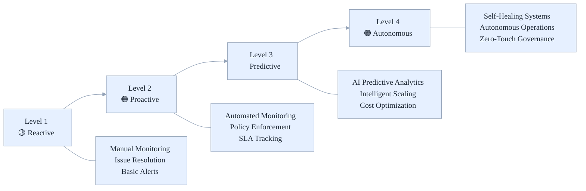

# ⚙️ Azure Stamps Pattern - AI-Driven Operations Guide

Operational runbook for the Azure Stamps Pattern—AI-driven monitoring, predictive analytics, automated governance, and incident response for resilient, compliant, and cost-optimized operations.


- What's inside: Monitoring, incident response, maintenance, scaling, and automation playbooks
- Best for: Operations/SRE, DevOps engineers, IT leaders, and security/compliance teams
- Outcomes: Faster MTTR/MTTD, higher resilience, better cost control, and consistent runbooks

## 👤 Who Should Read This Guide?

- **Operations/SRE Teams:** Day-to-day management, monitoring, and incident response
- **DevOps Engineers:** Automation, maintenance, and scaling
- **IT Leaders:** Evaluate operational maturity, cost, and compliance
- **Security/Compliance Teams:** Review operational controls and governance

---


## 🧭 Quick Navigation

| Section | Focus Area | Time to Read | Best for |
|---------|------------|--------------|----------|
| [🎯 Operations Overview](#-operations-overview) | What operations covers | 5 min | All readers |
| [📊 Monitoring & Observability](#-monitoring--observability) | Multi-layer monitoring | 15 min | Ops, DevOps |
| [🚨 Incident Response](#-incident-response) | Emergency procedures | 10 min | Ops, SRE |
| [🔧 Maintenance Procedures](#-maintenance-procedures) | Routine/automated tasks | 10 min | Ops, DevOps |
| [📈 Performance & Scaling](#-performance--scaling-capacity-planning) | Optimization, scaling | 10 min | Ops, IT Leaders |
| [📚 Related Guides](#-related-guides) | More docs | 2 min | All readers |

### 🔗 **Key Subsections You Can Jump To:**
- [🎛️ AI-Driven Operational Maturity](#-ai-driven-operational-maturity)
- [📈 Key Performance Indicators (KPIs)](#-key-performance-indicators-kpis)
- [🚨 Alert Configuration](#-alert-configuration)  
- [📊 Flexible Tenant Management Operations](#-flexible-tenant-management-operations)
- [🔧 Tenant Onboarding Automation](#-tenant-onboarding-automation)
- [📊 Custom Dashboards](#-custom-dashboards)
- [🔄 Routine Maintenance Tasks](#-routine-maintenance-tasks)
- [📋 Incident Classification](#-incident-classification)
- [🔧 Incident Response Playbooks](#-incident-response-playbooks)
- [📈 Growth Projections](#-growth-projections)
- [🎯 Scaling Triggers](#-scaling-triggers)

---

## 📚 For Newcomers to Azure Stamps Pattern Operations

**What is Operations in the Azure Stamps Pattern?**
> Think of operations as running a global network of “smart factories” (CELLs) that are monitored, maintained, and optimized by AI. This guide helps you keep everything healthy, secure, and cost-effective—whether you’re responding to incidents, scaling up, or automating routine tasks.

**Why is this important?**
> - **Proactive monitoring:** Spot issues before they impact users
> - **Automated maintenance:** Reduce manual toil and errors
> - **Predictive analytics:** Plan for growth and optimize costs
> - **Resilience:** Rapid, automated incident response

---


### 🎛️ **AI-Driven Operational Maturity**



_Figure: Operational maturity curve from reactive to autonomous; use to set quarterly improvement targets._

## 📊 Monitoring & Observability

Effective monitoring and observability in the Azure Stamps Pattern goes beyond traditional metrics collection to provide intelligent, AI-driven insights that enable proactive operations. The multi-layer monitoring strategy provides comprehensive visibility from global traffic patterns down to individual tenant performance, enabling rapid issue identification, intelligent capacity planning, and automated optimization. This approach transforms reactive operations into predictive, data-driven decision making.

### 🔍 **Multi-Layer Monitoring Strategy**

```
🌍 Global Monitoring
    ├─ Cross-region performance metrics
    ├─ Global routing health status  
    ├─ DNS resolution performance
    ├─ Front Door cache efficiency
    ├─ APIM gateway health and latency
    └─ API usage analytics per tenant
         ↓
🏢 Regional Monitoring  
    ├─ Application Gateway health
    ├─ Regional resource utilization
    ├─ Key Vault access patterns
    ├─ APIM regional endpoint status
    └─ Automation Account execution
         ↓
🏠 CELL Monitoring
    ├─ Container App performance
    ├─ SQL Database metrics
    ├─ Storage utilization
    ├─ API response times per tenant
    └─ Tenant-specific KPIs
```

_Diagram: Layered monitoring scope from global to CELL; align dashboards and alerts to each layer._

### 📈 **Key Performance Indicators (KPIs)**

#### Global KPIs:
```jsonc
{
  "globalKPIs": {
    "availability": {
      "target": "99.95%",
      "measurement": "Global endpoint uptime",
      "alertThreshold": "< 99.9%"
    },
    "latency": {
      "target": "< 100ms",
      "measurement": "DNS resolution + Front Door + APIM response",
      "alertThreshold": "> 150ms"
    },
    "apiThroughput": {
      "target": "50,000 requests/minute",
      "measurement": "Cross-region APIM aggregate",
      "alertThreshold": "< 40,000 requests/minute"
    },
    "errorRate": {
      "target": "< 0.1%",
      "measurement": "Global error percentage",
      "alertThreshold": "> 0.5%"
    },
    "apiLatency": {
      "target": "< 50ms",
      "measurement": "APIM gateway response time",
      "alertThreshold": "> 100ms"
    }
  }
}
```

_Block: Suggested global SLO/SLA indicators and alert thresholds for baseline monitoring._

#### CELL-Level KPIs:
```jsonc
{
  "cellKPIs": {
    "tenantLatency": {
      "target": "< 200ms",
      "measurement": "App response time per tenant",
      "alertThreshold": "> 500ms"
    },
    "databasePerformance": {
      "target": "< 50ms",
      "measurement": "SQL query response time",
      "alertThreshold": "> 100ms"
    },
    "storageIOPS": {
      "target": "> 1000 IOPS",
      "measurement": "Storage account throughput",
      "alertThreshold": "< 500 IOPS"
    },
    "containerCPU": {
      "target": "< 70%",
      "measurement": "Container CPU utilization",
      "alertThreshold": "> 85%"
    }
  }
}
```

_Block: CELL-level KPIs to guide scaling, capacity, and tenant experience SLIs._

### 🚨 **Alert Configuration**

#### Critical Alerts:
```bash
#!/bin/bash
# Create comprehensive alert rules

RESOURCE_GROUP="rg-stamps-production"
ACTION_GROUP="ag-stamps-critical"

# Global Traffic Manager Health
az monitor metrics alert create \
    --name "Traffic-Manager-Endpoint-Down" \
    --resource-group $RESOURCE_GROUP \
    --scopes $(az network traffic-manager profile show --name tm-stamps --resource-group $RESOURCE_GROUP --query id -o tsv) \
    --condition "count staticThreshold equals 0 endpoint_status" \
    --threshold 1 \
    --aggregation Count \
    --period "PT5M" \
    --frequency "PT1M" \
    --severity 0 \
    --action $ACTION_GROUP \
    --description "Traffic Manager has no healthy endpoints"

# Front Door Response Time
az monitor metrics alert create \
    --name "Front-Door-High-Latency" \
    --resource-group $RESOURCE_GROUP \
    --scopes $(az network front-door show --name fd-stamps --resource-group $RESOURCE_GROUP --query id -o tsv) \
    --condition "avg staticThreshold greaterThan OriginLatency" \
    --threshold 500 \
    --aggregation Average \
    --period "PT15M" \
    --frequency "PT5M" \
    --severity 2 \
    --action $ACTION_GROUP \
    --description "Front Door origin latency exceeds 500ms"

# SQL Database DTU Utilization
az monitor metrics alert create \
    --name "SQL-Database-High-DTU" \
    --resource-group $RESOURCE_GROUP \
    --scopes $(az sql db list --server sql-stamps --resource-group $RESOURCE_GROUP --query "[].id" -o tsv) \
    --condition "avg staticThreshold greaterThan dtu_consumption_percent" \
    --threshold 80 \
    --aggregation Average \
    --period "PT10M" \
    --frequency "PT5M" \
    --severity 1 \
    --action $ACTION_GROUP \
    --description "SQL Database DTU utilization above 80%"

# Container Apps Memory Usage
az monitor metrics alert create \
    --name "Container-Apps-High-Memory" \
    --resource-group $RESOURCE_GROUP \
    --scopes $(az containerapp list --resource-group $RESOURCE_GROUP --query "[].id" -o tsv) \
    --condition "avg staticThreshold greaterThan WorkingSetBytes" \
    --threshold 1073741824 \
    --aggregation Average \
    --period "PT10M" \
    --frequency "PT5M" \
    --severity 2 \
    --action $ACTION_GROUP \
    --description "Container Apps memory usage above 1GB"

# API Management Gateway Latency
az monitor metrics alert create \
    --name "APIM-Gateway-High-Latency" \
    --resource-group $RESOURCE_GROUP \
    --scopes $(az apim show --name apim-stamps --resource-group $RESOURCE_GROUP --query id -o tsv) \
    --condition "avg staticThreshold greaterThan Gateway.Duration" \
    --threshold 1000 \
    --aggregation Average \
    --period "PT5M" \
    --frequency "PT1M" \
    --severity 1 \
    --action $ACTION_GROUP \
    --description "APIM Gateway latency exceeds 1 second"

# API Management Request Rate
az monitor metrics alert create \
    --name "APIM-High-Request-Rate" \
    --resource-group $RESOURCE_GROUP \
    --scopes $(az apim show --name apim-stamps --resource-group $RESOURCE_GROUP --query id -o tsv) \
    --condition "avg staticThreshold greaterThan Gateway.Requests" \
    --threshold 10000 \
    --aggregation Total \
    --period "PT1M" \
    --frequency "PT1M" \
    --severity 2 \
    --action $ACTION_GROUP \
    --description "APIM request rate exceeds 10K per minute"
```

---


---

### 📊 **Flexible Tenant Management Operations**

#### **🏠 Shared CELL Tenant Onboarding**
```bash
# 1. Check shared CELL capacity before adding tenants
SHARED_CELL="shared-smb-eastus"
az monitor metrics list \
    --resource "/subscriptions/$SUBSCRIPTION/resourceGroups/rg-stamps-$SHARED_CELL" \
    --metric "cpu_percent" "memory_percent" \
    --aggregation Average

# 2. Add tenant to shared CELL (no new infrastructure needed)
az apim product subscription create \
    --resource-group $RESOURCE_GROUP \
    --service-name apim-stamps \
    --product-id basic-shared-tier \
    --subscription-id tenant-startup-basic \
    --display-name "Startup Tenant - Shared Basic Tier"

# 3. Configure application-level tenant isolation
# Update tenant routing in Global Cosmos DB
az cosmosdb sql container create \
    --account-name cosmos-global-stamps \
    --database-name globaldb \
    --name tenants \
    --resource-group $RESOURCE_GROUP \
    --partition-key-path "/tenantId"
```

#### **🏢 Dedicated CELL Tenant Deployment**
```bash
# 1. Deploy dedicated infrastructure for enterprise tenant
ENTERPRISE_TENANT="banking-corp"
az deployment group create \
    --resource-group rg-stamps-production \
    --template-file traffic-routing.bicep \
    --parameters @traffic-routing.parameters.json \
    --parameters enableDedicatedCell=true \
                 dedicatedTenantName=$ENTERPRISE_TENANT \
                 dedicatedCellSku=premium

# 2. Configure dedicated APIM subscription with custom policies
az apim product subscription create \
    --resource-group $RESOURCE_GROUP \
    --service-name apim-stamps \
    --product-id enterprise-dedicated-tier \
    --subscription-id tenant-$ENTERPRISE_TENANT-enterprise \
    --display-name "$ENTERPRISE_TENANT - Enterprise Dedicated Tier"

# 3. Set enterprise-specific rate limits and security policies
az apim policy create \
    --resource-group $RESOURCE_GROUP \
    --service-name apim-stamps \
    --policy-format xml \
    --value @enterprise-$ENTERPRISE_TENANT-policy.xml \
    --subscription-id tenant-$ENTERPRISE_TENANT-enterprise
```

#### **🔄 Tenant Migration: Shared → Dedicated**
```bash
# 1. Deploy new dedicated CELL for growing tenant
GROWING_TENANT="fintech-scale"
az deployment group create \
    --resource-group rg-stamps-production \
    --template-file traffic-routing.bicep \
    --parameters tenantMigration=true \
                 sourceTenant=$GROWING_TENANT \
                 targetModel=dedicated

# 2. Data migration (implement zero-downtime migration)
# Export tenant data from shared SQL schema
sqlcmd -S shared-sql-server.database.windows.net \
       -d shared-database \
       -Q "SELECT * FROM tenant_data WHERE tenant_id='$GROWING_TENANT'" \
       -o /tmp/tenant-migration-$GROWING_TENANT.sql

# Import to dedicated SQL database
sqlcmd -S dedicated-$GROWING_TENANT-sql.database.windows.net \
       -d dedicated-database \
       -i /tmp/tenant-migration-$GROWING_TENANT.sql

# 3. Update routing in Global Cosmos DB
az cosmosdb sql container item replace \
    --account-name cosmos-global-stamps \
    --database-name globaldb \
    --container-name tenants \
    --item-id $GROWING_TENANT \
    --body "{\"tenantId\":\"$GROWING_TENANT\",\"cellType\":\"dedicated\",\"cellBackendPool\":\"dedicated-$GROWING_TENANT-backend\"}"

# 4. Validate migration and performance
curl -H "X-Tenant-ID: $GROWING_TENANT" \
     -H "Ocp-Apim-Subscription-Key: $NEW_SUBSCRIPTION_KEY" \
     https://api.contoso.com/tenant/health
```

#### **Monitoring Tenant API Usage**
```bash
# Get tenant API usage analytics
az monitor metrics list \
    --resource $(az apim show --name apim-stamps --resource-group $RESOURCE_GROUP --query id -o tsv) \
    --metric "Gateway.Requests" \
    --aggregation Total \
    --start-time "2024-01-01T00:00:00Z" \
    --end-time "2024-01-31T23:59:59Z" \
    --filter "SubscriptionId eq 'tenant-banking-premium'"

# Check tenant rate limit violations
az monitor metrics list \
    --resource $(az apim show --name apim-stamps --resource-group $RESOURCE_GROUP --query id -o tsv) \
    --metric "Gateway.Failed" \
    --aggregation Total \
    --filter "ResponseCode eq '429' and SubscriptionId eq 'tenant-banking-premium'"
```

#### **APIM Health Checks**
```bash
# Verify APIM gateway status across regions
az apim show \
    --name apim-stamps \
    --resource-group $RESOURCE_GROUP \
    --query "{name:name, status:provisioningState, gatewayUrl:gatewayUrl, regions:additionalLocations[].{location:location,status:provisioningState}}"

# Test API endpoint health
curl -H "Ocp-Apim-Subscription-Key: $SUBSCRIPTION_KEY" \
     -H "X-Tenant-ID: banking-tenant" \
     https://api.contoso.com/tenant/health

# Check APIM policy compilation
az apim policy show \
    --resource-group $RESOURCE_GROUP \
    --service-name apim-stamps \
    --policy-id global
```

### 🔧 **Tenant Onboarding Automation**
```bash
#!/bin/bash
# Automated tenant onboarding script

TENANT_ID=$1
TIER=$2  # basic or premium
TENANT_EMAIL=$3

# Create tenant user in APIM
az apim user create \
    --resource-group $RESOURCE_GROUP \
    --service-name apim-stamps \
    --user-id "${TENANT_ID}-admin" \
    --email $TENANT_EMAIL \
    --first-name "Tenant" \
    --last-name "Administrator" \
    --confirmation "signup"

# Create tenant subscription
az apim product subscription create \
    --resource-group $RESOURCE_GROUP \
    --service-name apim-stamps \
    --product-id "${TIER}-tier" \
    --subscription-id "${TENANT_ID}-subscription" \
    --display-name "${TENANT_ID} - ${TIER} tier" \
    --user-id "${TENANT_ID}-admin" \
    --state "active"

# Create custom rate limiting policy
cat > "${TENANT_ID}-policy.xml" << EOF
<policies>
  <inbound>
    <rate-limit calls="$([ "$TIER" = "premium" ] && echo "50000" || echo "10000")" renewal-period="3600" />
    <quota calls="$([ "$TIER" = "premium" ] && echo "1000000" || echo "100000")" renewal-period="86400" />
    <set-header name="X-Tenant-ID" exists-action="override">
      <value>$TENANT_ID</value>
    </set-header>
  </inbound>
  <backend>
    <forward-request />
  </backend>
  <outbound />
  <on-error />
</policies>
EOF

az apim policy create \
    --resource-group $RESOURCE_GROUP \
    --service-name apim-stamps \
    --policy-format xml \
    --value "@${TENANT_ID}-policy.xml" \
    --subscription-id "${TENANT_ID}-subscription"

echo "✅ Tenant $TENANT_ID onboarded successfully with $TIER tier"
```

### 📊 **Custom Dashboards**

#### Global Operations Dashboard:
```jsonc
{
  "dashboardConfig": {
    "name": "Stamps Pattern - Global Operations",
    "tiles": [
      {
        "title": "Global Availability Map",
        "type": "world-map",
        "query": "requests | summarize success_rate=avg(success) by client_CountryOrRegion",
        "size": "large"
      },
      {
        "title": "Traffic Distribution",
        "type": "pie-chart", 
        "query": "requests | summarize count() by cloud_RegionName",
        "size": "medium"
      },
      {
        "title": "Response Time Trends",
        "type": "line-chart",
        "query": "requests | summarize avg(duration) by bin(timestamp, 5m)",
        "size": "large"
      },
      {
        "title": "Error Rate by Region",
        "type": "bar-chart",
        "query": "requests | where success == false | summarize count() by cloud_RegionName",
        "size": "medium"
      }
    ]
  }
}
```

#### CELL Operations Dashboard:
```jsonc
{
  "dashboardConfig": {
    "name": "Stamps Pattern - CELL Operations",
    "tiles": [
      {
        "title": "CELL Health Status",
        "type": "status-grid",
        "query": "Heartbeat | summarize last_heartbeat=max(TimeGenerated) by Computer | extend status=iff(last_heartbeat > ago(5m), 'healthy', 'unhealthy')",
        "size": "large"
      },
      {
        "title": "Database Performance",
        "type": "metric-chart",
        "query": "AzureMetrics | where ResourceProvider == 'MICROSOFT.SQL' | where MetricName == 'dtu_consumption_percent'",
        "size": "medium"
      },
      {
        "title": "Storage Utilization",
        "type": "gauge",
        "query": "AzureMetrics | where ResourceProvider == 'MICROSOFT.STORAGE' | where MetricName == 'UsedCapacity'",
        "size": "small"
      }
    ]
  }
}
```


---

---

## 🔧 Maintenance Procedures

### 🔄 **Routine Maintenance Tasks**

#### Weekly Tasks:
```bash
#!/bin/bash
# Weekly maintenance script

echo "🔍 Starting weekly maintenance tasks..."

# 1. Resource health check
echo "📊 Checking resource health..."
az resource list --resource-group rg-stamps-production \
    --query "[?provisioningState!='Succeeded'].{Name:name, State:provisioningState, Type:type}" \
    --output table

# 2. Cost analysis
echo "💰 Generating cost report..."
az consumption usage list --start-date $(date -d "7 days ago" +%Y-%m-%d) \
    --end-date $(date +%Y-%m-%d) \
    --query "[].{Service:meterName, Cost:pretaxCost, UsageQuantity:usageQuantity}" \
    --output table > weekly_cost_report.txt

# 3. Security updates check
echo "🛡️ Checking for security updates..."
az security assessment list --query "[?status.code=='Unhealthy'].{Name:displayName, Severity:metadata.severity}" \
    --output table

# 4. Backup verification
echo "💾 Verifying backups..."
az backup job list --resource-group rg-stamps-production \
    --vault-name rsv-stamps-backup \
    --query "[?properties.status!='Completed'].{Job:properties.jobType, Status:properties.status}" \
    --output table

# 5. Certificate expiration check
echo "🔐 Checking certificate expiration..."
az keyvault certificate list --vault-name kv-stamps-global \
    --query "[?attributes.expires<'$(date -d '+30 days' --iso-8601)'].{Name:name, Expires:attributes.expires}" \
    --output table

echo "✅ Weekly maintenance completed"
```

#### Monthly Tasks:
```bash
#!/bin/bash
# Monthly maintenance script

echo "🔍 Starting monthly maintenance tasks..."

# 1. Performance baseline update
echo "📈 Updating performance baselines..."
az monitor metrics list-definitions --resource $(az network traffic-manager profile show --name tm-stamps --resource-group rg-stamps-production --query id -o tsv) \
    --query "[].{Metric:name.value, Unit:unit}" --output table

# 2. Access review
echo "👥 Generating access review report..."
az role assignment list --scope "/subscriptions/$(az account show --query id -o tsv)" \
    --query "[].{Principal:principalName, Role:roleDefinitionName, Scope:scope}" \
    --output table > monthly_access_report.txt

# 3. Disaster recovery test
echo "🚨 Initiating DR test (simulation)..."
# Simulate failover procedures
az network traffic-manager endpoint update \
    --name primary-endpoint \
    --profile-name tm-stamps \
    --resource-group rg-stamps-production \
    --endpoint-status Disabled \
    --type ExternalEndpoints

sleep 300  # Wait 5 minutes for failover

# Re-enable primary endpoint
az network traffic-manager endpoint update \
    --name primary-endpoint \
    --profile-name tm-stamps \
    --resource-group rg-stamps-production \
    --endpoint-status Enabled \
    --type ExternalEndpoints

echo "✅ Monthly maintenance completed"
```

### 📦 **Update Management**

#### Application Updates:
```bash
#!/bin/bash
# Application update procedure

APP_VERSION=$1
RESOURCE_GROUP="rg-stamps-production"

if [ -z "$APP_VERSION" ]; then
    echo "Usage: $0 <app-version>"
    exit 1
fi

echo "🚀 Starting application update to version $APP_VERSION"

# 1. Blue-Green Deployment Strategy
echo "💙 Creating green environment..."
az containerapp revision copy \
    --name app-stamps-cell1 \
    --resource-group $RESOURCE_GROUP \
    --from-revision app-stamps-cell1--latest \
    --revision-suffix green-$APP_VERSION

# 2. Health check on green environment
echo "🔍 Performing health checks..."
sleep 60  # Wait for green environment to stabilize

GREEN_URL=$(az containerapp revision show \
    --name app-stamps-cell1 \
    --resource-group $RESOURCE_GROUP \
    --revision app-stamps-cell1--green-$APP_VERSION \
    --query properties.fqdn -o tsv)

if curl -f "https://$GREEN_URL/health"; then
    echo "✅ Green environment healthy"
    
    # 3. Traffic shifting (10% -> 50% -> 100%)
    echo "🔄 Shifting traffic to green environment..."
    az containerapp ingress traffic set \
        --name app-stamps-cell1 \
        --resource-group $RESOURCE_GROUP \
        --traffic-weight latest=90 green-$APP_VERSION=10
    
    sleep 300  # Monitor for 5 minutes
    
    az containerapp ingress traffic set \
        --name app-stamps-cell1 \
        --resource-group $RESOURCE_GROUP \
        --traffic-weight latest=50 green-$APP_VERSION=50
        
    sleep 300  # Monitor for 5 minutes
    
    az containerapp ingress traffic set \
        --name app-stamps-cell1 \
        --resource-group $RESOURCE_GROUP \
        --traffic-weight green-$APP_VERSION=100
    
    echo "✅ Application update completed successfully"
else
    echo "❌ Green environment health check failed - rolling back"
    az containerapp revision delete \
        --name app-stamps-cell1 \
        --resource-group $RESOURCE_GROUP \
        --revision app-stamps-cell1--green-$APP_VERSION
fi
```

#### Infrastructure Updates:
```bash
#!/bin/bash
# Infrastructure update procedure using Bicep

TEMPLATE_FILE="traffic-routing.bicep"
PARAMETERS_FILE="traffic-routing.parameters.json"
RESOURCE_GROUP="rg-stamps-production"

echo "🏗️ Starting infrastructure update..."

# 1. Pre-deployment validation
echo "🔍 Validating Bicep template..."
bicep build $TEMPLATE_FILE

if [ $? -ne 0 ]; then
    echo "❌ Template validation failed"
    exit 1
fi

# 2. What-if analysis
echo "📊 Running what-if analysis..."
az deployment group what-if \
    --resource-group $RESOURCE_GROUP \
    --template-file $TEMPLATE_FILE \
    --parameters @$PARAMETERS_FILE \
    --result-format FullResourcePayloads > whatif-results.json

# 3. Review and confirm
echo "📋 Review what-if results in whatif-results.json"
read -p "Continue with deployment? (y/N): " confirm

if [ "$confirm" != "y" ]; then
    echo "Deployment cancelled"
    exit 0
fi

# 4. Execute deployment
echo "🚀 Executing infrastructure deployment..."
az deployment group create \
    --resource-group $RESOURCE_GROUP \
    --template-file $TEMPLATE_FILE \
    --parameters @$PARAMETERS_FILE \
    --verbose

echo "✅ Infrastructure update completed"
```


---

## 🚨 Incident Response

Incident response in the Azure Stamps Pattern leverages AI-driven detection and automated response workflows to minimize Mean Time to Detection (MTTD) and Mean Time to Resolution (MTTR). The intelligent incident response system automatically correlates signals across multiple monitoring layers, provides contextual information for faster diagnosis, and can execute predetermined response actions for common scenarios. This approach ensures that incidents are detected early, escalated appropriately, and resolved with minimal business impact.

### 📞 **Incident Classification**

#### Severity Levels:
```json
{
  "incidentSeverity": {
    "P0-Critical": {
      "description": "Complete service outage affecting all users",
      "responseTime": "15 minutes",
      "escalation": "Immediate executive notification",
      "examples": ["Global Front Door down", "All Traffic Manager endpoints failed"]
    },
    "P1-High": {
      "description": "Major service degradation affecting multiple CELLs",
      "responseTime": "30 minutes", 
      "escalation": "Operations manager notification",
      "examples": ["Regional Application Gateway down", "Multiple CELL failures"]
    },
    "P2-Medium": {
      "description": "Single CELL or limited service impact",
      "responseTime": "2 hours",
      "escalation": "Team lead notification",
      "examples": ["Single CELL database issues", "Storage performance degradation"]
    },
    "P3-Low": {
      "description": "Minor issues with workarounds available",
      "responseTime": "24 hours",
      "escalation": "Standard ticket queue",
      "examples": ["Non-critical monitoring alerts", "Documentation updates"]
    }
  }
}
```

### 🔧 **Incident Response Playbooks**

#### Global Outage Response:
```bash
#!/bin/bash
# Global outage response playbook

echo "🚨 CRITICAL: Global outage detected"

# 1. Immediate assessment
echo "🔍 Performing rapid assessment..."

# Check Traffic Manager health
TM_STATUS=$(az network traffic-manager profile show \
    --name tm-stamps \
    --resource-group rg-stamps-production \
    --query profileStatus -o tsv)

echo "Traffic Manager Status: $TM_STATUS"

# Check Front Door health  
FD_STATUS=$(az network front-door show \
    --name fd-stamps \
    --resource-group rg-stamps-production \
    --query enabledState -o tsv)

echo "Front Door Status: $FD_STATUS"

# 2. Immediate mitigation
if [ "$TM_STATUS" != "Enabled" ]; then
    echo "⚡ Attempting Traffic Manager recovery..."
    az network traffic-manager profile update \
        --name tm-stamps \
        --resource-group rg-stamps-production \
        --status Enabled
fi

# 3. Communication
echo "📢 Sending status page update..."
# Update status page (integrate with your status page API)
curl -X POST "https://api.statuspage.io/v1/pages/YOUR_PAGE_ID/incidents" \
    -H "Authorization: OAuth YOUR_API_KEY" \
    -d '{
        "incident": {
            "name": "Service Disruption",
            "status": "investigating",
            "impact_override": "critical",
            "body": "We are investigating reports of service disruption."
        }
    }'

# 4. Escalation
echo "📞 Escalating to on-call engineer..."
# Send alert to on-call system
curl -X POST "https://events.pagerduty.com/v2/enqueue" \
    -H "Content-Type: application/json" \
    -d '{
        "routing_key": "YOUR_INTEGRATION_KEY",
        "event_action": "trigger",
        "payload": {
            "summary": "Critical: Global Azure Stamps Pattern outage",
            "severity": "critical",
            "source": "Azure Stamps Pattern",
            "component": "Global Infrastructure"
        }
    }'

echo "🎯 Incident response initiated"
```

#### CELL Isolation Procedure:
```bash
#!/bin/bash
# CELL isolation procedure for security or performance issues

CELL_NAME=$1
RESOURCE_GROUP="rg-stamps-production"

if [ -z "$CELL_NAME" ]; then
    echo "Usage: $0 <cell-name>"
    exit 1
fi

echo "🚨 Isolating CELL: $CELL_NAME"

# 1. Remove from Application Gateway backend pool
echo "🔌 Removing from Application Gateway..."
az network application-gateway address-pool update \
    --gateway-name agw-stamps \
    --resource-group $RESOURCE_GROUP \
    --name $CELL_NAME-backend \
    --servers ""

# 2. Disable Container App revisions
echo "⏸️ Stopping Container App..."
az containerapp revision deactivate \
    --name app-$CELL_NAME \
    --resource-group $RESOURCE_GROUP \
    --revision app-$CELL_NAME--latest

# 3. Update monitoring
echo "📊 Updating monitoring configuration..."
az monitor metrics alert update \
    --name "$CELL_NAME-Health-Alert" \
    --resource-group $RESOURCE_GROUP \
    --enabled false

# 4. Document isolation
echo "📝 Documenting isolation..."
echo "$(date): CELL $CELL_NAME isolated for investigation" >> isolation_log.txt

echo "✅ CELL $CELL_NAME successfully isolated"
```


---

### 🏗️ **DR Architecture**

```
Primary Region (East US)
├─ 🏠 CELL-Banking-Primary
├─ 🏠 CELL-Retail-Primary  
└─ 🏠 CELL-Healthcare-Primary

DR Region (West US)
├─ 🏠 CELL-Banking-DR (Standby)
├─ 🏠 CELL-Retail-DR (Standby)
└─ 🏠 CELL-Healthcare-DR (Standby)
```

### 📋 **DR Procedures**

#### Automated Failover:
```bash
#!/bin/bash
# Automated disaster recovery failover

PRIMARY_REGION="eastus"
DR_REGION="westus"
RESOURCE_GROUP="rg-stamps-production"

echo "🚨 Initiating disaster recovery failover"

# 1. Health check on primary region
echo "🔍 Checking primary region health..."
PRIMARY_HEALTH=$(az network traffic-manager endpoint show \
    --name primary-endpoint \
    --profile-name tm-stamps \
    --resource-group $RESOURCE_GROUP \
    --query endpointMonitorStatus -o tsv)

if [ "$PRIMARY_HEALTH" == "Online" ]; then
    echo "⚠️ Primary region appears healthy - confirm manual failover"
    read -p "Force failover? (y/N): " confirm
    if [ "$confirm" != "y" ]; then
        exit 0
    fi
fi

# 2. Activate DR region
echo "⚡ Activating DR region..."

# Update Traffic Manager to prioritize DR region
az network traffic-manager endpoint update \
    --name dr-endpoint \
    --profile-name tm-stamps \
    --resource-group $RESOURCE_GROUP \
    --endpoint-status Enabled \
    --priority 1

az network traffic-manager endpoint update \
    --name primary-endpoint \
    --profile-name tm-stamps \
    --resource-group $RESOURCE_GROUP \
    --priority 2

# 3. Scale up DR region resources
echo "📈 Scaling up DR region..."
az containerapp update \
    --name app-stamps-dr \
    --resource-group $RESOURCE_GROUP \
    --min-replicas 3 \
    --max-replicas 10

# 4. Update DNS TTL for faster propagation
echo "🌐 Updating DNS settings..."
az network traffic-manager profile update \
    --name tm-stamps \
    --resource-group $RESOURCE_GROUP \
    --ttl 60

# 5. Notification
echo "📢 Sending failover notification..."
curl -X POST "https://hooks.slack.com/services/YOUR/SLACK/WEBHOOK" \
    -H "Content-Type: application/json" \
    -d '{
        "text": "🚨 DISASTER RECOVERY: Failover to West US region completed",
        "username": "Azure Stamps Bot",
        "channel": "#operations"
    }'

echo "✅ Disaster recovery failover completed"
```

#### Data Recovery:
```bash
#!/bin/bash
# Data recovery procedures

BACKUP_DATE=$1
TARGET_CELL=$2

if [ -z "$BACKUP_DATE" ] || [ -z "$TARGET_CELL" ]; then
    echo "Usage: $0 <backup-date> <target-cell>"
    echo "Example: $0 2024-01-15 cell-banking"
    exit 1
fi

echo "💾 Starting data recovery for $TARGET_CELL from $BACKUP_DATE"

# 1. SQL Database point-in-time restore
echo "🗄️ Restoring SQL Database..."
az sql db restore \
    --dest-name sql-$TARGET_CELL-restored \
    --dest-server sql-stamps-dr \
    --resource-group rg-stamps-dr \
    --name sql-$TARGET_CELL \
    --time $BACKUP_DATE

# 2. Storage account blob restore
echo "💾 Restoring blob storage..."
az storage blob restore \
    --account-name st${TARGET_CELL}dr \
    --resource-group rg-stamps-dr \
    --time-to-restore $BACKUP_DATE \
    --blob-range container1/backup-*

# 3. Cosmos DB point-in-time restore
echo "🌌 Restoring Cosmos DB..."
az cosmosdb sql database restore \
    --account-name cosmos-$TARGET_CELL-dr \
    --database-name $TARGET_CELL-db \
    --resource-group rg-stamps-dr \
    --restore-timestamp $BACKUP_DATE

echo "✅ Data recovery completed for $TARGET_CELL"
```


---

---

## 📈 Performance & Scaling (Capacity Planning)

### 📈 **Growth Projections**

#### CELL Scaling Matrix:
```json
{
  "capacityPlanning": {
    "currentBaseline": {
      "cellCount": 6,
      "regionsActive": 2,
      "avgRequestsPerSecond": 1000,
      "avgDataVolumeGB": 500
    },
    "projections": {
      "6months": {
        "cellCount": 10,
        "regionsActive": 3,
        "avgRequestsPerSecond": 2500,
        "avgDataVolumeGB": 1250,
        "resourceAdjustments": [
          "Upgrade SQL databases to Premium tier",
          "Add Front Door Premium features",
          "Implement Azure Cache for Redis"
        ]
      },
      "12months": {
        "cellCount": 20,
        "regionsActive": 4,
        "avgRequestsPerSecond": 5000,
        "avgDataVolumeGB": 2500,
        "resourceAdjustments": [
          "Deploy dedicated ExpressRoute",
          "Implement Cosmos DB multi-master",
          "Add Azure Application Gateway V2"
        ]
      }
    }
  }
}
```

### 🎯 **Scaling Triggers**

```bash
#!/bin/bash
# Automated scaling trigger script

RESOURCE_GROUP="rg-stamps-production"
SCALE_THRESHOLD_CPU=80
SCALE_THRESHOLD_MEMORY=85
SCALE_THRESHOLD_REQUESTS=5000

# Monitor key metrics
CPU_USAGE=$(az monitor metrics list \
    --resource $(az containerapp show --name app-stamps-cell1 --resource-group $RESOURCE_GROUP --query id -o tsv) \
    --metric "CpuPercentage" \
    --aggregation Average \
    --interval PT5M \
    --query "value[0].timeseries[0].data[-1].average" -o tsv)

if (( $(echo "$CPU_USAGE > $SCALE_THRESHOLD_CPU" | bc -l) )); then
    echo "🚀 Scaling up due to high CPU usage: $CPU_USAGE%"
    
    # Scale out Container Apps
    az containerapp update \
        --name app-stamps-cell1 \
        --resource-group $RESOURCE_GROUP \
        --min-replicas 5 \
        --max-replicas 20
        
    # Upgrade SQL Database tier if needed
    az sql db update \
        --name sql-stamps-cell1 \
        --server sql-stamps \
        --resource-group $RESOURCE_GROUP \
        --service-objective S2
fi
```

---


---

### 🛠️ **Automation Tools**
- **Azure Automation**: Runbook execution and scheduling
- **Logic Apps**: Event-driven workflow automation  
- **Azure Functions**: Serverless operations tasks
- **Azure DevOps**: CI/CD pipeline management

### 📖 **Documentation References**
- <a href="https://learn.microsoft.com/azure/azure-monitor/best-practices" target="_blank" rel="noopener">Azure Monitor Best Practices</a>
- <a href="https://learn.microsoft.com/azure/architecture/framework/devops/" target="_blank" rel="noopener">Azure Well-Architected Operations</a>
- <a href="https://learn.microsoft.com/azure/site-recovery/" target="_blank" rel="noopener">Disaster Recovery Planning</a>

---


---

## 📚 Related Guides

- [Architecture Guide](./ARCHITECTURE_GUIDE.md)
- [Deployment Guide](./DEPLOYMENT_GUIDE.md)
- [Security Guide](./SECURITY_GUIDE.md)
- [Parameterization Guide](./PARAMETERIZATION_GUIDE.md)
- [Naming Conventions](./NAMING_CONVENTIONS_GUIDE.md)
- [Glossary](./GLOSSARY.md)
- [Known Issues](./KNOWN_ISSUES.md)
- [Cost Optimization](./COST_OPTIMIZATION_GUIDE.md)
 - [CAF/WAF Compliance Analysis](./CAF_WAF_COMPLIANCE_ANALYSIS.md)
 - [Azure Landing Zones Guide](./LANDING_ZONES_GUIDE.md)

---

*Last updated: August 2025*
