# Azure Stamps Pattern - Architecture (ASPA)
## ⚙️ AI-Driven Operations Guide

Operational runbook for the Azure Stamps Pattern - Architecture (ASPA), AI-driven monitoring, predictive analytics, automated governance, and incident response for resilient, compliant, and cost-optimized operations.

- What's inside: Monitoring, incident response, maintenance, scaling, and automation playbooks
- Best for: Operations/SRE, DevOps engineers, IT leaders, and security/compliance teams
- Outcomes: Faster MTTR/MTTD, higher resilience, better cost control, and consistent runbooks

## 👤 Who Should Read This Guide?

- **Operations/SRE Teams:** Day-to-day management, monitoring, and incident response
- **DevOps Engineers:** Automation, maintenance, and scaling
- **IT Leaders:** Evaluate operational maturity, cost, and compliance
- **Security/Compliance Teams:** Review operational controls and governance

---

## 🧭 Quick Navigation

| Section | Focus Area | Best for |
|---------|------------|----------|
| [🎯 Environment profiles and diagnostics](#-environment-profiles-and-diagnostics-ops-quick-start) | What operations covers | All readers |
| [📈 Monitoring & Observability](#-monitoring--observability) | Multi-layer monitoring | Ops, DevOps |
| [🚨 Incident Response](#-incident-response) | Emergency procedures | Ops, SRE |
| [🔧 Maintenance Procedures](#-maintenance-procedures) | Routine/automated tasks | Ops, DevOps |
| [📊 Performance & Scaling](#-performance--scaling-capacity-planning) | Optimization, scaling | Ops, IT Leaders |
| [📚 Related Guides](#-related-guides) | More docs | All readers |

### 🔗 **Key Subsections (Detailed Navigation):**

- [🎛️ AI-Driven Operational Maturity](#-ai-driven-operational-maturity)
- [📊 Key Performance Indicators (KPIs)](#-key-performance-indicators-kpis)
- [🚨 Alert Configuration](#-alert-configuration)
- [📈 Flexible Tenant Management Operations](#-flexible-tenant-management-operations)
- [🔧 Tenant Onboarding Automation](#-tenant-onboarding-automation)
- [📊 Custom Dashboards](#-custom-dashboards)
- [🔄 Routine Maintenance Tasks](#-routine-maintenance-tasks)
- [📞 Incident Classification](#-incident-classification)
- [🔧 Incident Response Playbooks](#-incident-response-playbooks)

---

## 📚 For Newcomers to Azure Stamps Pattern Operations

**What is Operations in the Azure Stamps Pattern?**
> Think of operations as running a global network of “smart factories” (CELLs) that are monitored, maintained, and optimized by AI. This guide helps you keep everything healthy, secure, and cost-effective, whether you’re responding to incidents, scaling up, or automating routine tasks.

**Why is this important?**
>
> - **Proactive monitoring:** Spot issues before they impact users
> - **Automated maintenance:** Reduce manual toil and errors
> - **Predictive analytics:** Plan for growth and optimize costs
> - **Resilience:** Rapid, automated incident response

---

### 🎛️ **AI-Driven Operational Maturity**

```mermaid
%%{init: {"theme":"base","themeVariables":{"background":"transparent","primaryColor":"#E6F0FF","primaryTextColor":"#1F2937","primaryBorderColor":"#94A3B8","lineColor":"#94A3B8","secondaryColor":"#F3F4F6","tertiaryColor":"#DBEAFE","clusterBkg":"#F8FAFC","clusterBorder":"#CBD5E1","edgeLabelBackground":"#F8FAFC","fontFamily":"Segoe UI, Roboto, Helvetica, Arial, sans-serif"}} }%%
flowchart LR
  A[Level 1\n🟡 Reactive] --> B[Level 2\n🟠 Proactive]
  B --> C[Level 3\n🔴 Predictive]
  C --> D[Level 4\n🟣 Autonomous]
    
  A1[Manual Monitoring\nIssue Resolution\nBasic Alerts]
  B1[Automated Monitoring\nPolicy Enforcement\nSLA Tracking]
  C1[AI Predictive Analytics\nIntelligent Scaling\nCost Optimization]
  D1[Self-Healing Systems\nAutonomous Operations\nZero-Touch Governance]
    
  A --- A1
  B --- B1
  C --- C1
  D --- D1
  
```



_Figure: Operational maturity curve from reactive to autonomous; use to set quarterly improvement targets._

## 🧪 Environment profiles and diagnostics (Ops quick-start)

Profiles let you run lighter or fuller deployments depending on the operational need. Diagnostics mode controls logging vs. metrics to keep smoke tests fast and reliable.

- Profiles: smoke, dev, prod
  - smoke: minimal, fast-to-provision, metrics-only diagnostics, HTTPS off where allowed (HTTP for lab/app gateway paths), optional services disabled (e.g., ACR)
  - dev: fuller diagnostics (logs+metrics), HTTPS enabled, suitable for non-prod testing
  - prod: production-hardened footprint; HTTPS everywhere, comprehensive diagnostics
- Diagnostics mode (wired from main to stamp layer):
  - metricsOnly: emit platform metrics only (robust across SKUs/regions; best for smoke)
  - standard: enable logs where supported + metrics (best for dev/prod)

### Run What-If by profile

Use the helper to validate changes safely. It creates the resource group if missing.

```powershell
# Default smoke profile in eastus
./scripts/what-if.ps1

# Explicit profile and location
./scripts/what-if.ps1 -Profile dev -ResourceGroup rg-stamps-dev -Location eastus2

# Target a specific subscription
./scripts/what-if.ps1 -Profile prod -SubscriptionId <00000000-0000-0000-0000-000000000000>
```

### Deploy by profile

This uses profile-specific example parameters and ensures the resource group exists.

```powershell
# Smoke (defaults to rg-stamps-smoke, eastus)
./scripts/deploy.ps1

# Dev with explicit RG/location
./scripts/deploy.ps1 -Profile dev -ResourceGroup rg-stamps-dev -Location eastus2

# Prod targeting a subscription with verbose output
./scripts/deploy.ps1 -Profile prod -SubscriptionId <00000000-0000-0000-0000-000000000000> -VerboseOutput
```

Notes:

- Parameter files used per profile:
  - smoke → `AzureArchitecture/examples/main.sample.smoke.json`
  - dev → `AzureArchitecture/examples/main.sample.silver.json`
  - prod → `AzureArchitecture/examples/main.sample.platinum.json`
- Default resource group per profile (overridable):
  - smoke → `rg-stamps-smoke`
  - dev → `rg-stamps-dev`
  - prod → `rg-stamps-prod`
- Expect smoke deployments to be minimal and fast; dev/prod enable richer diagnostics and HTTPS.

---

## 📈 Monitoring & Observability

Effective monitoring and observability in the Azure Stamps Pattern goes beyond traditional metrics collection to provide intelligent, AI-driven insights that enable proactive operations. The multi-layer monitoring strategy provides comprehensive visibility from global traffic patterns down to individual tenant performance, enabling rapid issue identification, intelligent capacity planning, and automated optimization. This approach transforms reactive operations into predictive, data-driven decision making.

### 🔍 **Multi-Layer Monitoring Strategy**

```
🌍 Global Monitoring
    ├─ Cross-region performance metrics
    ├─ Global routing health status  
    ├─ DNS resolution performance
    ├─ Front Door cache efficiency
    ├─ APIM gateway health and latency
    └─ API usage analytics per tenant
         ↓
🏢 Regional Monitoring  
    ├─ Application Gateway health
    ├─ Regional resource utilization
    ├─ Key Vault access patterns
    ├─ APIM regional endpoint status
    └─ Automation Account execution
         ↓
🏠 CELL Monitoring
    ├─ Container App performance
    ├─ SQL Database metrics
    ├─ Storage utilization
    ├─ API response times per tenant
    └─ Tenant-specific KPIs
```

_Diagram: Layered monitoring scope from global to CELL; align dashboards and alerts to each layer._

### 📊 **Key Performance Indicators (KPIs)**

#### Global KPIs

```jsonc
{
  "globalKPIs": {
    "availability": {
      "target": "99.95%",
      "measurement": "Global endpoint uptime",
      "alertThreshold": "< 99.9%"
    },
    "latency": {
      "target": "< 100ms",
      "measurement": "DNS resolution + Front Door + APIM response",
      "alertThreshold": "> 150ms"
    },
    "apiThroughput": {
      "target": "50,000 requests/minute",
      "measurement": "Cross-region APIM aggregate",
      "alertThreshold": "< 40,000 requests/minute"
    },
    "errorRate": {
      "target": "< 0.1%",
      "measurement": "Global error percentage",
      "alertThreshold": "> 0.5%"
    },
    "apiLatency": {
      "target": "< 50ms",
      "measurement": "APIM gateway response time",
      "alertThreshold": "> 100ms"
    }
  }
}
```

_Block: Suggested global SLO/SLA indicators and alert thresholds for baseline monitoring._

#### CELL-Level KPIs

```jsonc
{
  "cellKPIs": {
    "tenantLatency": {
      "target": "< 200ms",
      "measurement": "App response time per tenant",
      "alertThreshold": "> 500ms"
    },
    "databasePerformance": {
      "target": "< 50ms",
      "measurement": "SQL query response time",
      "alertThreshold": "> 100ms"
    },
    "storageIOPS": {
      "target": "> 1000 IOPS",
      "measurement": "Storage account throughput",
      "alertThreshold": "< 500 IOPS"
    },
    "containerCPU": {
      "target": "< 70%",
      "measurement": "Container CPU utilization",
      "alertThreshold": "> 85%"
    }
  }
}
```

_Block: CELL-level KPIs to guide scaling, capacity, and tenant experience SLIs._

### 🚨 **Alert Configuration**

#### Critical Alerts

```powershell
#!/bin/bash
# Create comprehensive alert rules

RESOURCE_GROUP="rg-stamps-production"
ACTION_GROUP="ag-stamps-critical"

# Global Traffic Manager Health
az monitor metrics alert create \
    --name "Traffic-Manager-Endpoint-Down" \
    --resource-group $RESOURCE_GROUP \
    --scopes $(az network traffic-manager profile show --name tm-stamps --resource-group $RESOURCE_GROUP --query id -o tsv) \
    --condition "count staticThreshold equals 0 endpoint_status" \
    --threshold 1 \
    --aggregation Count \
    --period "PT5M" \
    --frequency "PT1M" \
    --severity 0 \
    --action $ACTION_GROUP \
    --description "Traffic Manager has no healthy endpoints"

# Front Door Response Time
az monitor metrics alert create \
    --name "Front-Door-High-Latency" \
    --resource-group $RESOURCE_GROUP \
    --scopes $(az network front-door show --name fd-stamps --resource-group $RESOURCE_GROUP --query id -o tsv) \
    --condition "avg staticThreshold greaterThan OriginLatency" \
    --threshold 500 \
    --aggregation Average \
    --period "PT15M" \
    --frequency "PT5M" \
    --severity 2 \
    --action $ACTION_GROUP \
    --description "Front Door origin latency exceeds 500ms"

# SQL Database DTU Utilization
az monitor metrics alert create \
    --name "SQL-Database-High-DTU" \
    --resource-group $RESOURCE_GROUP \
    --scopes $(az sql db list --server sql-stamps --resource-group $RESOURCE_GROUP --query "[].id" -o tsv) \
    --condition "avg staticThreshold greaterThan dtu_consumption_percent" \
    --threshold 80 \
    --aggregation Average \
    --period "PT10M" \
    --frequency "PT5M" \
    --severity 1 \
    --action $ACTION_GROUP \
    --description "SQL Database DTU utilization above 80%"

# Container Apps Memory Usage
az monitor metrics alert create \
    --name "Container-Apps-High-Memory" \
    --resource-group $RESOURCE_GROUP \
    --scopes $(az containerapp list --resource-group $RESOURCE_GROUP --query "[].id" -o tsv) \
    --condition "avg staticThreshold greaterThan WorkingSetBytes" \
    --threshold 1073741824 \
    --aggregation Average \
    --period "PT10M" \
    --frequency "PT5M" \
    --severity 2 \
    --action $ACTION_GROUP \
    --description "Container Apps memory usage above 1GB"

# API Management Gateway Latency
az monitor metrics alert create \
    --name "APIM-Gateway-High-Latency" \
    --resource-group $RESOURCE_GROUP \
    --scopes $(az apim show --name apim-stamps --resource-group $RESOURCE_GROUP --query id -o tsv) \
    --condition "avg staticThreshold greaterThan Gateway.Duration" \
    --threshold 1000 \
    --aggregation Average \
    --period "PT5M" \
    --frequency "PT1M" \
    --severity 1 \
    --action $ACTION_GROUP \
    --description "APIM Gateway latency exceeds 1 second"

# API Management Request Rate
az monitor metrics alert create \
    --name "APIM-High-Request-Rate" \
    --resource-group $RESOURCE_GROUP \
    --scopes $(az apim show --name apim-stamps --resource-group $RESOURCE_GROUP --query id -o tsv) \
    --condition "avg staticThreshold greaterThan Gateway.Requests" \
    --threshold 10000 \
    --aggregation Total \
    --period "PT1M" \
    --frequency "PT1M" \
    --severity 2 \
    --action $ACTION_GROUP \
    --description "APIM request rate exceeds 10K per minute"

# Application Gateway Backend Health
az monitor metrics alert create \
    --name "Application-Gateway-Backend-Unhealthy" \
    --resource-group $RESOURCE_GROUP \
    --scopes $(az network application-gateway list --resource-group $RESOURCE_GROUP --query "[].id" -o tsv) \
    --condition "avg staticThreshold lessThan HealthyHostCount" \
    --threshold 1 \
    --aggregation Average \
    --period "PT5M" \
    --frequency "PT1M" \
    --severity 0 \
    --action $ACTION_GROUP \
    --description "Application Gateway has no healthy backend targets"

# Application Gateway Failed Requests
az monitor metrics alert create \
    --name "Application-Gateway-High-Failed-Requests" \
    --resource-group $RESOURCE_GROUP \
    --scopes $(az network application-gateway list --resource-group $RESOURCE_GROUP --query "[].id" -o tsv) \
    --condition "total staticThreshold greaterThan FailedRequests" \
    --threshold 100 \
    --aggregation Total \
    --period "PT15M" \
    --frequency "PT5M" \
    --severity 1 \
    --action $ACTION_GROUP \
    --description "Application Gateway failed requests exceed 100 in 15 minutes"
```

---

---

### 📈 **Flexible Tenant Management Operations**

#### **🏠 Shared CELL Tenant Onboarding**

```powershell
# 1. Check shared CELL capacity before adding tenants
SHARED_CELL="shared-smb-eastus"
az monitor metrics list \
    --resource "/subscriptions/$SUBSCRIPTION/resourceGroups/rg-stamps-$SHARED_CELL" \
    --metric "cpu_percent" "memory_percent" \
    --aggregation Average

# 2. Add tenant to shared CELL (no new infrastructure needed)
az apim product subscription create \
    --resource-group $RESOURCE_GROUP \
    --service-name apim-stamps \
    --product-id basic-shared-tier \
    --subscription-id tenant-startup-basic \
    --display-name "Startup Tenant - Shared Basic Tier"

# 3. Configure application-level tenant isolation
# Update tenant routing in Global Cosmos DB
az cosmosdb sql container create \
    --account-name cosmos-global-stamps \
    --database-name globaldb \
    --name tenants \
    --resource-group $RESOURCE_GROUP \
    --partition-key-path "/tenantId"
```

#### **🏢 Dedicated CELL Tenant Deployment**

```powershell
# 1. Deploy dedicated infrastructure for enterprise tenant
ENTERPRISE_TENANT="banking-corp"
az deployment group create \
    --resource-group rg-stamps-production \
    --template-file traffic-routing.bicep \
    --parameters @traffic-routing.parameters.json \
    --parameters enableDedicatedCell=true \
                 dedicatedTenantName=$ENTERPRISE_TENANT \
                 dedicatedCellSku=premium

# 2. Configure dedicated APIM subscription with custom policies
az apim product subscription create \
    --resource-group $RESOURCE_GROUP \
    --service-name apim-stamps \
    --product-id enterprise-dedicated-tier \
    --subscription-id tenant-$ENTERPRISE_TENANT-enterprise \
    --display-name "$ENTERPRISE_TENANT - Enterprise Dedicated Tier"

# 3. Set enterprise-specific rate limits and security policies
az apim policy create \
    --resource-group $RESOURCE_GROUP \
    --service-name apim-stamps \
    --policy-format xml \
    --value @enterprise-$ENTERPRISE_TENANT-policy.xml \
    --subscription-id tenant-$ENTERPRISE_TENANT-enterprise
```

#### **🔄 Tenant Migration: Shared → Dedicated**

```powershell
# 1. Deploy new dedicated CELL for growing tenant
GROWING_TENANT="fintech-scale"
az deployment group create \
    --resource-group rg-stamps-production \
    --template-file traffic-routing.bicep \
    --parameters tenantMigration=true \
                 sourceTenant=$GROWING_TENANT \
                 targetModel=dedicated

# 2. Data migration (implement zero-downtime migration)
# Export tenant data from shared SQL schema
sqlcmd -S shared-sql-server.database.windows.net \
       -d shared-database \
       -Q "SELECT * FROM tenant_data WHERE tenant_id='$GROWING_TENANT'" \
       -o /tmp/tenant-migration-$GROWING_TENANT.sql

# Import to dedicated SQL database
sqlcmd -S dedicated-$GROWING_TENANT-sql.database.windows.net \
       -d dedicated-database \
       -i /tmp/tenant-migration-$GROWING_TENANT.sql

# 3. Update routing in Global Cosmos DB
az cosmosdb sql container item replace \
    --account-name cosmos-global-stamps \
    --database-name globaldb \
    --container-name tenants \
    --item-id $GROWING_TENANT \
    --body "{\"tenantId\":\"$GROWING_TENANT\",\"cellType\":\"dedicated\",\"cellBackendPool\":\"dedicated-$GROWING_TENANT-backend\"}"

# 4. Validate migration and performance
curl -H "X-Tenant-ID: $GROWING_TENANT" \
     -H "Ocp-Apim-Subscription-Key: $NEW_SUBSCRIPTION_KEY" \
     https://api.contoso.com/tenant/health
```

#### **Monitoring Tenant API Usage**

```powershell
# Get tenant API usage analytics
az monitor metrics list \
    --resource $(az apim show --name apim-stamps --resource-group $RESOURCE_GROUP --query id -o tsv) \
    --metric "Gateway.Requests" \
    --aggregation Total \
    --start-time "2024-01-01T00:00:00Z" \
    --end-time "2024-01-31T23:59:59Z" \
    --filter "SubscriptionId eq 'tenant-banking-premium'"

# Check tenant rate limit violations
az monitor metrics list \
    --resource $(az apim show --name apim-stamps --resource-group $RESOURCE_GROUP --query id -o tsv) \
    --metric "Gateway.Failed" \
    --aggregation Total \
    --filter "ResponseCode eq '429' and SubscriptionId eq 'tenant-banking-premium'"
```

#### **APIM Health Checks**

```powershell
# Verify APIM gateway status across regions
az apim show \
    --name apim-stamps \
    --resource-group $RESOURCE_GROUP \
    --query "{name:name, status:provisioningState, gatewayUrl:gatewayUrl, regions:additionalLocations[].{location:location,status:provisioningState}}"

# Test API endpoint health
curl -H "Ocp-Apim-Subscription-Key: $SUBSCRIPTION_KEY" \
     -H "X-Tenant-ID: banking-tenant" \
     https://api.contoso.com/tenant/health

# Check APIM policy compilation
az apim policy show \
    --resource-group $RESOURCE_GROUP \
    --service-name apim-stamps \
    --policy-id global
```

### 🔧 **Tenant Onboarding Automation**

```powershell
#!/bin/bash
# Automated tenant onboarding script

TENANT_ID=$1
TIER=$2  # basic or premium
TENANT_EMAIL=$3

# Create tenant user in APIM
az apim user create \
    --resource-group $RESOURCE_GROUP \
    --service-name apim-stamps \
    --user-id "${TENANT_ID}-admin" \
    --email $TENANT_EMAIL \
    --first-name "Tenant" \
    --last-name "Administrator" \
    --confirmation "signup"

# Create tenant subscription
az apim product subscription create \
    --resource-group $RESOURCE_GROUP \
    --service-name apim-stamps \
    --product-id "${TIER}-tier" \
    --subscription-id "${TENANT_ID}-subscription" \
    --display-name "${TENANT_ID} - ${TIER} tier" \
    --user-id "${TENANT_ID}-admin" \
    --state "active"

# Create custom rate limiting policy
cat > "${TENANT_ID}-policy.xml" << EOF
<policies>
  <inbound>
    <rate-limit calls="$([ "$TIER" = "premium" ] && echo "50000" || echo "10000")" renewal-period="3600" />
    <quota calls="$([ "$TIER" = "premium" ] && echo "1000000" || echo "100000")" renewal-period="86400" />
    <set-header name="X-Tenant-ID" exists-action="override">
      <value>$TENANT_ID</value>
    </set-header>
  </inbound>
  <backend>
    <forward-request />
  </backend>
  <outbound />
  <on-error />
</policies>
EOF

az apim policy create \
    --resource-group $RESOURCE_GROUP \
    --service-name apim-stamps \
    --policy-format xml \
    --value "@${TENANT_ID}-policy.xml" \
    --subscription-id "${TENANT_ID}-subscription"

echo "✅ Tenant $TENANT_ID onboarded successfully with $TIER tier"
```

### 📊 **Custom Dashboards**

#### Global Operations Dashboard

```jsonc
{
  "dashboardConfig": {
    "name": "Stamps Pattern - Global Operations",
    "tiles": [
      {
        "title": "Global Availability Map",
        "type": "world-map",
        "query": "requests | summarize success_rate=avg(success) by client_CountryOrRegion",
        "size": "large"
      },
      {
        "title": "Traffic Distribution",
        "type": "pie-chart", 
        "query": "requests | summarize count() by cloud_RegionName",
        "size": "medium"
      },
      {
        "title": "Response Time Trends",
        "type": "line-chart",
        "query": "requests | summarize avg(duration) by bin(timestamp, 5m)",
        "size": "large"
      },
      {
        "title": "Error Rate by Region",
        "type": "bar-chart",
        "query": "requests | where success == false | summarize count() by cloud_RegionName",
        "size": "medium"
      }
    ]
  }
}
```

#### CELL Operations Dashboard

```jsonc
{
  "dashboardConfig": {
    "name": "Stamps Pattern - CELL Operations",
    "tiles": [
      {
        "title": "CELL Health Status",
        "type": "status-grid",
        "query": "Heartbeat | summarize last_heartbeat=max(TimeGenerated) by Computer | extend status=iff(last_heartbeat > ago(5m), 'healthy', 'unhealthy')",
        "size": "large"
      },
      {
        "title": "Database Performance",
        "type": "metric-chart",
        "query": "AzureMetrics | where ResourceProvider == 'MICROSOFT.SQL' | where MetricName == 'dtu_consumption_percent'",
        "size": "medium"
      },
      {
        "title": "Storage Utilization",
        "type": "gauge",
        "query": "AzureMetrics | where ResourceProvider == 'MICROSOFT.STORAGE' | where MetricName == 'UsedCapacity'",
        "size": "small"
      }
    ]
  }
}
```

---

---

## 🔧 Maintenance Procedures

### 🔄 **Routine Maintenance Tasks**

#### Weekly Tasks

```bash
#!/bin/bash
# Weekly maintenance script

echo "🔍 Starting weekly maintenance tasks..."

# 1. Resource health check
echo "📊 Checking resource health..."
az resource list --resource-group rg-stamps-production \
    --query "[?provisioningState!='Succeeded'].{Name:name, State:provisioningState, Type:type}" \
    --output table

# 2. Cost analysis
echo "💰 Generating cost report..."
az consumption usage list --start-date $(date -d "7 days ago" +%Y-%m-%d) \
    --end-date $(date +%Y-%m-%d) \
    --query "[].{Service:meterName, Cost:pretaxCost, UsageQuantity:usageQuantity}" \
    --output table > weekly_cost_report.txt

# 3. Security updates check
echo "🛡️ Checking for security updates..."
az security assessment list --query "[?status.code=='Unhealthy'].{Name:displayName, Severity:metadata.severity}" \
    --output table

# 4. Backup verification
echo "💾 Verifying backups..."
az backup job list --resource-group rg-stamps-production \
    --vault-name rsv-stamps-backup \
    --query "[?properties.status!='Completed'].{Job:properties.jobType, Status:properties.status}" \
    --output table

# 5. Certificate expiration check
echo "🔐 Checking certificate expiration..."
az keyvault certificate list --vault-name kv-stamps-global \
    --query "[?attributes.expires<'$(date -d '+30 days' --iso-8601)'].{Name:name, Expires:attributes.expires}" \
    --output table

echo "✅ Weekly maintenance completed"
```

#### Monthly Tasks

```bash
#!/bin/bash
# Monthly maintenance script

echo "🔍 Starting monthly maintenance tasks..."

# 1. Performance baseline update
echo "📈 Updating performance baselines..."
az monitor metrics list-definitions --resource $(az network traffic-manager profile show --name tm-stamps --resource-group rg-stamps-production --query id -o tsv) \
    --query "[].{Metric:name.value, Unit:unit}" --output table

# 2. Access review
echo "👥 Generating access review report..."
az role assignment list --scope "/subscriptions/$(az account show --query id -o tsv)" \
    --query "[].{Principal:principalName, Role:roleDefinitionName, Scope:scope}" \
    --output table > monthly_access_report.txt

# 3. Disaster recovery test
echo "🚨 Initiating DR test (simulation)..."
# Simulate failover procedures
az network traffic-manager endpoint update \
    --name primary-endpoint \
    --profile-name tm-stamps \
    --resource-group rg-stamps-production \
    --endpoint-status Disabled \
    --type ExternalEndpoints

sleep 300  # Wait 5 minutes for failover

# Re-enable primary endpoint
az network traffic-manager endpoint update \
    --name primary-endpoint \
    --profile-name tm-stamps \
    --resource-group rg-stamps-production \
    --endpoint-status Enabled \
    --type ExternalEndpoints

echo "✅ Monthly maintenance completed"
```

### 📦 **Update Management**

#### Application Updates

```bash
#!/bin/bash
# Application update procedure

APP_VERSION=$1
RESOURCE_GROUP="rg-stamps-production"

if [ -z "$APP_VERSION" ]; then
    echo "Usage: $0 <app-version>"
    exit 1
fi

echo "🚀 Starting application update to version $APP_VERSION"

# 1. Blue-Green Deployment Strategy
echo "💙 Creating green environment..."
az containerapp revision copy \
    --name app-stamps-cell1 \
    --resource-group $RESOURCE_GROUP \
    --from-revision app-stamps-cell1--latest \
    --revision-suffix green-$APP_VERSION

# 2. Health check on green environment
echo "🔍 Performing health checks..."
sleep 60  # Wait for green environment to stabilize

GREEN_URL=$(az containerapp revision show \
    --name app-stamps-cell1 \
    --resource-group $RESOURCE_GROUP \
    --revision app-stamps-cell1--green-$APP_VERSION \
    --query properties.fqdn -o tsv)

if curl -f "https://$GREEN_URL/health"; then
    echo "✅ Green environment healthy"
    
    # 3. Traffic shifting (10% -> 50% -> 100%)
    echo "🔄 Shifting traffic to green environment..."
    az containerapp ingress traffic set \
        --name app-stamps-cell1 \
        --resource-group $RESOURCE_GROUP \
        --traffic-weight latest=90 green-$APP_VERSION=10
    
    sleep 300  # Monitor for 5 minutes
    
    az containerapp ingress traffic set \
        --name app-stamps-cell1 \
        --resource-group $RESOURCE_GROUP \
        --traffic-weight latest=50 green-$APP_VERSION=50
        
    sleep 300  # Monitor for 5 minutes
    
    az containerapp ingress traffic set \
        --name app-stamps-cell1 \
        --resource-group $RESOURCE_GROUP \
        --traffic-weight green-$APP_VERSION=100
    
    echo "✅ Application update completed successfully"
else
    echo "❌ Green environment health check failed - rolling back"
    az containerapp revision delete \
        --name app-stamps-cell1 \
        --resource-group $RESOURCE_GROUP \
        --revision app-stamps-cell1--green-$APP_VERSION
fi
```

#### Infrastructure Updates

```bash
#!/bin/bash
# Infrastructure update procedure using Bicep

TEMPLATE_FILE="traffic-routing.bicep"
PARAMETERS_FILE="traffic-routing.parameters.json"
RESOURCE_GROUP="rg-stamps-production"

echo "🏗️ Starting infrastructure update..."

# 1. Pre-deployment validation
echo "🔍 Validating Bicep template..."
bicep build $TEMPLATE_FILE

if [ $? -ne 0 ]; then
    echo "❌ Template validation failed"
    exit 1
fi

# 2. What-if analysis
echo "📊 Running what-if analysis..."
az deployment group what-if \
    --resource-group $RESOURCE_GROUP \
    --template-file $TEMPLATE_FILE \
    --parameters @$PARAMETERS_FILE \
    --result-format FullResourcePayloads > whatif-results.json

# 3. Review and confirm
echo "📋 Review what-if results in whatif-results.json"
read -p "Continue with deployment? (y/N): " confirm

if [ "$confirm" != "y" ]; then
    echo "Deployment cancelled"
    exit 0
fi

# 4. Execute deployment
echo "🚀 Executing infrastructure deployment..."
az deployment group create \
    --resource-group $RESOURCE_GROUP \
    --template-file $TEMPLATE_FILE \
    --parameters @$PARAMETERS_FILE \
    --verbose

echo "✅ Infrastructure update completed"
```

---

## 🚨 Incident Response

Incident response in the Azure Stamps Pattern leverages AI-driven detection and automated response workflows to minimize Mean Time to Detection (MTTD) and Mean Time to Resolution (MTTR). The intelligent incident response system automatically correlates signals across multiple monitoring layers, provides contextual information for faster diagnosis, and can execute predetermined response actions for common scenarios. This approach ensures that incidents are detected early, escalated appropriately, and resolved with minimal business impact.

### 📞 **Incident Classification**

#### Severity Levels

```json
{
  "incidentSeverity": {
  "Critical": {
      "description": "Complete service outage affecting all users",
      "responseTime": "15 minutes",
      "escalation": "Immediate executive notification",
      "examples": ["Global Front Door down", "All Traffic Manager endpoints failed"]
    },
  "High": {
      "description": "Major service degradation affecting multiple CELLs",
      "responseTime": "30 minutes", 
      "escalation": "Operations manager notification",
      "examples": ["Regional Application Gateway down", "Multiple CELL failures"]
    },
  "Medium": {
      "description": "Single CELL or limited service impact",
      "responseTime": "2 hours",
      "escalation": "Team lead notification",
      "examples": ["Single CELL database issues", "Storage performance degradation"]
    },
    "P3-Low": {
      "description": "Minor issues with workarounds available",
      "responseTime": "24 hours",
      "escalation": "Standard ticket queue",
      "examples": ["Non-critical monitoring alerts", "Documentation updates"]
    }
  }
}
```

### 🔧 **Incident Response Playbooks**

#### Global Outage Response

```bash
#!/bin/bash
# Global outage response playbook

echo "🚨 CRITICAL: Global outage detected"

# 1. Immediate assessment
echo "🔍 Performing rapid assessment..."

# Check Traffic Manager health
TM_STATUS=$(az network traffic-manager profile show \
    --name tm-stamps \
    --resource-group rg-stamps-production \
    --query profileStatus -o tsv)

echo "Traffic Manager Status: $TM_STATUS"

# Check Front Door health  
FD_STATUS=$(az network front-door show \
    --name fd-stamps \
    --resource-group rg-stamps-production \
    --query enabledState -o tsv)

echo "Front Door Status: $FD_STATUS"

# 2. Immediate mitigation
if [ "$TM_STATUS" != "Enabled" ]; then
    echo "⚡ Attempting Traffic Manager recovery..."
    az network traffic-manager profile update \
        --name tm-stamps \
        --resource-group rg-stamps-production \
        --status Enabled
fi

# 3. Communication
echo "📢 Sending status page update..."
# Update status page (integrate with your status page API)
curl -X POST "https://api.statuspage.io/v1/pages/YOUR_PAGE_ID/incidents" \
    -H "Authorization: OAuth YOUR_API_KEY" \
    -d '{
        "incident": {
            "name": "Service Disruption",
            "status": "investigating",
            "impact_override": "critical",
            "body": "We are investigating reports of service disruption."
        }
    }'

# 4. Escalation
echo "📞 Escalating to on-call engineer..."
# Send alert to on-call system
curl -X POST "https://events.pagerduty.com/v2/enqueue" \
    -H "Content-Type: application/json" \
    -d '{
        "routing_key": "YOUR_INTEGRATION_KEY",
        "event_action": "trigger",
        "payload": {
            "summary": "Critical: Global Azure Stamps Pattern outage",
            "severity": "critical",
            "source": "Azure Stamps Pattern",
            "component": "Global Infrastructure"
        }
    }'

echo "🎯 Incident response initiated"
```

#### CELL Isolation Procedure

```bash
#!/bin/bash
# CELL isolation procedure for security or performance issues

CELL_NAME=$1
RESOURCE_GROUP="rg-stamps-production"

if [ -z "$CELL_NAME" ]; then
    echo "Usage: $0 <cell-name>"
    exit 1
fi

echo "🚨 Isolating CELL: $CELL_NAME"

# 1. Remove from Application Gateway backend pool
echo "🔌 Removing from Application Gateway..."
az network application-gateway address-pool update \
    --gateway-name agw-stamps \
    --resource-group $RESOURCE_GROUP \
    --name $CELL_NAME-backend \
    --servers ""

# 2. Disable Container App revisions
echo "⏸️ Stopping Container App..."
az containerapp revision deactivate \
    --name app-$CELL_NAME \
    --resource-group $RESOURCE_GROUP \
    --revision app-$CELL_NAME--latest

# 3. Update monitoring
echo "📈 Updating monitoring configuration..."
az monitor metrics alert update \
    --name "$CELL_NAME-Health-Alert" \
    --resource-group $RESOURCE_GROUP \
    --enabled false

# 4. Document isolation
echo "📝 Documenting isolation..."
echo "$(date): CELL $CELL_NAME isolated for investigation" >> isolation_log.txt

echo "✅ CELL $CELL_NAME successfully isolated"
```

---

## 🚑 Incident Playbooks (step-by-step)

This section consolidates concise, runnable playbooks for common incidents (Portal→DAB connectivity, DAB startup, and AAD/auth). They are direct conversions of the troubleshooting playbooks so operators can run them from a PowerShell console with Azure CLI available.

### 1) Portal → DAB connectivity (playbook)

Goal: confirm the portal can reach DAB GraphQL and diagnose where the failure sits (config, DNS, network, auth, or DAB itself).

Checklist:

- [ ] Confirm portal `DAB_GRAPHQL_URL` secret is correct
- [ ] Confirm DAB Container App revision is healthy
- [ ] Tail DAB logs for GraphQL errors
- [ ] Run an introspection query against DAB

Step-by-step

1) Inspect portal configuration (secret env var)

```powershell
# Show env used by the portal container (replace RG and name)
az containerapp show --name ca-stamps-portal --resource-group rg-stamps-mgmt --query "properties.template.containers[0].env" -o table

# If using secrets, list them (names only)
az containerapp secret list --name ca-stamps-portal --resource-group rg-stamps-mgmt -o table
```

2) Check the `DAB_GRAPHQL_URL` value and try a raw HTTP POST from your workstation

```powershell
$dab = 'https://<dab-ingress-fqdn>/graphql'
$body = '{"query":"{ __schema { types { name } } }"}'

# Simple POST (PowerShell Invoke-RestMethod):
Invoke-RestMethod -Method POST -Uri $dab -Body $body -ContentType 'application/json' -ErrorAction Stop

# If Portal uses Key Vault/managed identity to fetch the URL, ensure Portal can read the secret (see AAD section below)
```

3) Inspect Container App and revision status for DAB

```powershell
az containerapp revision list -g rg-stamps-mgmt -n ca-stamps-dab -o table
az containerapp show -g rg-stamps-mgmt -n ca-stamps-dab --query properties.configuration.ingress -o json

# Tail logs (container name in the DAB image is usually 'dab')
az containerapp logs show -g rg-stamps-mgmt -n ca-stamps-dab --container dab --tail 300
```

4) If you get 401/403 from the portal when it calls DAB

```powershell
# Check Portal principal/secret access: ensure portal has KeyVault Get or the secret is present as a Container App secret
az keyvault secret show --vault-name <kv-name> --name DAB_GRAPHQL_URL

# If Portal relies on managed identity to fetch an endpoint, ensure the identity is assigned and has appropriate Key Vault or role assignments
az containerapp show --name ca-stamps-portal -g rg-stamps-mgmt --query properties.identity
```

5) If DAB responds but GraphQL errors appear, run an introspection or specific query to see schema/status

```powershell
Invoke-RestMethod -Method POST -Uri $dab -Body '{"query":"{ __schema { queryType { name } } }"}' -ContentType 'application/json'
```

If the above shows schema, the portal should be able to fetch data; if not, continue with the DAB startup playbook below.

---

### 2) DAB container startup (playbook)

Goal: diagnose container start failures, image pull problems, missing config files, or permission errors.

Checklist:

- [ ] Confirm image exists in ACR
- [ ] Confirm managed identity has AcrPull on ACR
- [ ] Tail container logs for startup exceptions
- [ ] Confirm /App/dab-config.json is present or mapped

Step-by-step

1) Check container app revision state and recent events

```powershell
az containerapp revision list --name ca-stamps-dab --resource-group rg-stamps-mgmt --output table
az containerapp show --name ca-stamps-dab --resource-group rg-stamps-mgmt --query properties.template.containers -o json
```

2) If the revision failed to pull the image, validate ACR and managed identity

```powershell
# Check image exists
az acr repository show --name <acrName> --repository <repo> --output table

# Get ACR resource id
$acrId = az acr show --name <acrName> --resource-group <acrRg> --query id -o tsv

# Assign AcrPull to managed identity (use principalId from container app identity)
az role assignment create --assignee <principalId-or-objectId> --role AcrPull --scope $acrId

# After assigning role, restart the containerapp revision or create a new revision
az containerapp revision restart --name ca-stamps-dab --resource-group rg-stamps-mgmt
```

3) Tail logs and inspect startup stacktraces

```powershell
az containerapp logs show -g rg-stamps-mgmt -n ca-stamps-dab --container dab --tail 500

# If logs show missing file errors, confirm the image contains /App/dab-config.json or that the containerapp mounts it via secret
az containerapp show --name ca-stamps-dab --resource-group rg-stamps-mgmt --query properties.template.containers[0].env -o table
```

4) If config is missing, either rebuild the image to include the file or inject config via secret/file mount

```powershell
# Example: store dab-config.json as a secret (if small) and set env to secretref
az containerapp secret set --name ca-stamps-dab --resource-group rg-stamps-mgmt --secrets dab-config='{"key":"value"}'

# Update container app environment variables to reference secretref if code supports it
az containerapp update --name ca-stamps-dab --resource-group rg-stamps-mgmt --set properties.template.containers[0].env[?name=='DAB_CONFIG'].value='secretref:dab-config'
```

5) If the container starts but GraphQL endpoints return 500s, inspect logs for unhandled exceptions and missing connection strings (Cosmos/KeyVault)

```powershell
# Check environment variables for missing values
az containerapp show --name ca-stamps-dab --resource-group rg-stamps-mgmt --query properties.template.containers[0].env -o table

# Verify Cosmos DB connection string or use managed identity; if using system/user assigned MI, check role assignment
az role assignment list --assignee <principalId> --scope $(az cosmosdb show --name <cosmosName> --resource-group <rg> --query id -o tsv)
```

If you must rebuild the image, follow normal build/push flow and update the containerapp image to the new tag, then monitor logs.

---

### 3) AAD / Authentication (playbook)

Goal: fix 401/403 issues coming from local dev or deployed services using DefaultAzureCredential or managed identities.

Checklist:

- [ ] Determine if call is from local dev or deployed resource
- [ ] For local dev: verify `az login` or VS Code account
- [ ] For deployed: confirm managed identity presence and role assignments

Step-by-step

1) Local dev troubleshooting

```powershell
# Verify CLI login
az account show

# Test token for resource (KeyVault/ACR/Cosmos)
az account get-access-token --resource https://vault.azure.net

# If using Visual Studio/VS Code credentials, ensure extension is signed in
```

2) Deployed resource troubleshooting (managed identity)

```powershell
# Show container app identity
az containerapp show --name ca-stamps-dab --resource-group rg-stamps-mgmt --query properties.identity -o json

# If user-assigned, get principalId and verify role assignments
az role assignment list --assignee <principalId> --scope $(az cosmosdb show --name <cosmosName> --resource-group <rg> --query id -o tsv)

# Grant Cosmos DB Data Contributor role if missing (data plane role)
az role assignment create --assignee <principalId> --role "Cosmos DB Built-in Data Contributor" --scope $(az cosmosdb show --name <cosmosName> --resource-group <rg> --query id -o tsv)

# Grant AcrPull role for ACR pulls
az role assignment create --assignee <principalId> --role AcrPull --scope $(az acr show --name <acrName> --resource-group <acrRg> --query id -o tsv)

# Grant Key Vault access policy (if using access policies rather than role-based access)
az keyvault set-policy --name <kvName> --object-id <principalId> --secret-permissions get list
```

3) If token audience/scopes appear incorrect

```powershell
# Capture a token and inspect it on jwt.ms or decode locally
$tok = az account get-access-token --resource https://management.azure.com
Write-Output $tok.accessToken.Substring(0,200) # do not paste full tokens in public logs

# Use jwt.ms to inspect aud/roles/scopes
```

4) Wait for role propagation and retry (role assignments can take 1-5 minutes)

---

Appendix: useful quick commands

```powershell
# Container app logs (generic)
az containerapp logs show --name <name> --resource-group <rg> --tail 300

# Container app show
az containerapp show --name <name> --resource-group <rg>

# Restart container app revision
az containerapp revision restart --name <name> --resource-group <rg>

# List role assignments for a principal
az role assignment list --assignee <principalId>

# Inspect ACR repository
az acr repository show --name <acrName> --repository <repo>

# Assign role
az role assignment create --assignee <principalId> --role AcrPull --scope <scope>
```

---

If you'd like, I can also:

- convert these playbooks into step-by-step runbooks in `docs/OPERATIONS_GUIDE.md` under a dedicated "Incident Playbooks" section, or
- add a small `bin/diagnostics.ps1` script that runs a subset of these checks and prints a short report for the current environment.

---

## 📚 Related Guides

- [Architecture Guide](./ARCHITECTURE_GUIDE.md)
- [Deployment Guide](./DEPLOYMENT_GUIDE.md)
- [Security Guide](./SECURITY_GUIDE.md)
- [Parameterization Guide](./PARAMETERIZATION_GUIDE.md)
- [Naming Conventions](./NAMING_CONVENTIONS_GUIDE.md)
- [Glossary](./GLOSSARY.md)
- [Known Issues](./KNOWN_ISSUES.md)
- [Cost Optimization](./COST_OPTIMIZATION_GUIDE.md)
- [CAF/WAF Compliance Analysis](./CAF_WAF_COMPLIANCE_ANALYSIS.md)
- [Azure Landing Zones Guide](./LANDING_ZONES_GUIDE.md)

---

**📝 Document Version Information**
- **Version**: 1.3.0
- **Last Updated**: 2025-08-18 01:28:00 UTC  
- **Status**: Current
- **Next Review**: 2025-11