# 📋 Parameterization Guide for Azure Stamps Pattern

---

> **Onboarding & Executive Summary:**
> 
> Welcome to the Parameterization Guide for the **Azure Stamps Pattern**! This guide will help you understand how to make your deployments flexible, reusable, and scalable across multiple organizations and geographies. Whether you're a new developer, DevOps engineer, or IT leader, you'll learn how to use parameters to unlock multi-tenant, multi-region, and multi-environment support with minimal risk and maximum maintainability.

---


## 👤 Who Should Read This Guide?

- **Cloud Engineers/DevOps:** Implement and maintain parameterized templates and scripts
- **IT Leaders:** Oversee multi-org, multi-region deployment strategies
- **Solution Architects:** Design reusable, scalable infrastructure
- **Operations Teams:** Validate, migrate, and support parameterized deployments

---


## 🧭 Quick Navigation

| Section | Focus Area |
|---------|------------|
| [🎯 Overview](#-overview) | What parameterization enables |
| [🔧 New Parameters](#-new-parameters-added) | Parameter reference |
| [🏗️ Template Changes](#-template-changes-made) | Bicep/PowerShell updates |
| [🚀 Script Updates](#-powershell-script-updates) | PowerShell parameterization |
| [📝 Usage Examples](#-usage-examples) | Real-world scenarios |
| [✅ Benefits](#-benefits-achieved) | Flexibility, tagging, cost |
| [🔍 Validation](#-validation) | Testing and validation |
| [🎭 Migration Notes](#-migration-notes) | Adopting new parameters |
| [📚 Related Documentation](#-related-documentation) | More docs |

---


## 🚀 Getting Started: What is Parameterization?

Parameterization means making every deployment flexible and reusable—no more hardcoded values. You can deploy the same templates and scripts for any organization, region, or environment, simply by changing parameters. This approach unlocks:

- **Enterprise flexibility:** Deploy anywhere, for anyone, with a single codebase
- **Operational excellence:** Consistent tagging, ownership, and cost tracking
- **Rapid onboarding:** New orgs and regions require only parameter changes
- **Migration-ready:** Move from hardcoded to parameterized with minimal risk

---


# 📋 Template Parameterization Guide

**Enterprise Multi-Organization Deployment Support**

## 🎯 Overview

The Azure Stamps Pattern templates have been enhanced with comprehensive parameterization to make them reusable across different organizations, geographies, and environments. All previously hardcoded values are now configurable parameters, enabling **enterprise-grade multi-organization support** with custom domains, branding, and geographic deployment strategies.

### 📊 **Parameterization Architecture Overview**

```mermaid
graph TD
    A[🏢 Organization Parameters] --> D[🏗️ Template Processing]
    B[🌍 Geography Parameters] --> D
    C[🏷️ Tagging Parameters] --> D
    
    D --> E[📝 Bicep Templates]
    D --> F[🔧 PowerShell Scripts]
    D --> G[📋 Parameter Files]
    
    E --> H[🚀 Deployment Engine]
    F --> H
    G --> H
    
    H --> I[🏠 Shared CELLs]
    H --> J[🏢 Dedicated CELLs]
    H --> K[🌐 Global Services]
    
    subgraph "🔧 Parameter Types"
        A1[organizationDomain<br/>organizationName<br/>department<br/>ownerEmail]
        B1[geoName<br/>baseDnsZoneName<br/>region]
        C1[projectName<br/>workloadName<br/>environment]
    end
    
    A --- A1
    B --- B1
    C --- C1
    
    style D fill:#e1f5fe
    style H fill:#f3e5f5
```



### 🔄 **Before vs After: Template Flexibility**


## 🔧 New Parameters Added

### **Organization Parameters**
| Parameter | Description | Default Value | Usage |
|-----------|-------------|---------------|-------|
| `organizationDomain` | The organization domain (e.g., contoso.com) | `contoso.com` | DNS zones, email addresses |
| `organizationName` | The organization name for resource naming | `contoso` | Resource naming (future use) |
| `department` | The department responsible for the deployment | `IT` | Resource tagging |
| `projectName` | The project name for resource tagging and naming | `StampsPattern` | Resource tagging |
| `workloadName` | The workload name for resource tagging | `stamps-pattern` | Resource tagging |
| `ownerEmail` | The owner email for resource tagging | `platform-team@contoso.com` | Resource tagging |

### **Geography Parameters**
| Parameter | Description | Default Value | Usage |
|-----------|-------------|---------------|-------|
| `geoName` | The geography name (e.g., northamerica, europe, asia) | `northamerica` | Resource naming, tagging |
| `baseDnsZoneName` | The base DNS zone name (without domain) | `stamps` | DNS zone construction |

### **Computed Parameters**
| Parameter | Description | Computed From |
|-----------|-------------|---------------|
| `dnsZoneName` | The complete DNS zone name | `${baseDnsZoneName}.${organizationDomain}` |

## 🏗️ Template Changes Made

### **1. Parameter Additions**
```bicep
// Organization Parameters
@description('The organization domain (e.g., contoso.com)')
param organizationDomain string = 'contoso.com'

@description('The geography name (e.g., northamerica, europe, asia)')
param geoName string = 'northamerica'

@description('The base DNS zone name (without domain)')
param baseDnsZoneName string = 'stamps'
```

### **2. Dynamic DNS Zone Construction**
```bicep
// Before (hardcoded):
param dnsZoneName string = 'stamps.contoso.com'

// After (computed):
param dnsZoneName string = '${baseDnsZoneName}.${organizationDomain}'
```

### **3. Dynamic Base Domains**
```bicep
// Before (hardcoded):
baseDomain: 'eastus.stamps.contoso.com'

// After (computed):
baseDomain: 'eastus.${baseDnsZoneName}.${organizationDomain}'
```

### **4. Parameterized Tags**
```bicep
// Before (hardcoded):
var baseTags = {
  department: 'IT'
  project: 'StampsPattern'
  owner: 'platform-team@contoso.com'
}

// After (parameterized):
var baseTags = {
  department: department
  project: projectName
  owner: ownerEmail
}
```

### **5. Parameterized Geography**
```bicep
// Before (hardcoded):
geoName: 'northamerica'

// After (parameterized):
geoName: geoName
```

## 🚀 PowerShell Script Updates

### **New Parameters Added**
```powershell
[Parameter(Mandatory = $false)]
[string]$OrganizationDomain = "contoso.com",

[Parameter(Mandatory = $false)]
[string]$GeoName = "northamerica",

[Parameter(Mandatory = $false)]
[string]$BaseDnsZoneName = "stamps"
```

### **Updated Domain Construction**
```powershell
# Before (hardcoded):
baseDomain = "$Location.stamps.contoso.com"

# After (parameterized):
baseDomain = "$Location.$BaseDnsZoneName.$OrganizationDomain"
```

## 📝 Usage Examples

### **Example 1: Different Organization**
```powershell
.\deploy-stamps.ps1 `
  -ResourceGroupName "rg-stamps-prod" `
  -Location "eastus" `
  -OrganizationDomain "fabrikam.com" `
  -OrganizationName "fabrikam" `
  -Department "Engineering" `
  -OwnerEmail "devops-team@fabrikam.com"
```

### **Example 2: European Geography**
```powershell
.\deploy-stamps.ps1 `
  -ResourceGroupName "rg-stamps-eu-prod" `
  -Location "westeurope" `
  -GeoName "europe" `
  -OrganizationDomain "company.eu" `
  -BaseDnsZoneName "microservices"
```

### **Example 3: Using Parameters File**
```json
{
  "organizationDomain": { "value": "healthcare.org" },
  "organizationName": { "value": "healthcorp" },
  "department": { "value": "IT-Healthcare" },
  "projectName": { "value": "PatientPortal" },
  "geoName": { "value": "northamerica" },
  "baseDnsZoneName": { "value": "portal" }
}
```

## ✅ Benefits Achieved

### **1. Multi-Organization Support**
- ✅ **Complete Domain Flexibility**: Any organization can use their own domain
- ✅ **Custom Branding**: Organization name, department, project name are configurable
- ✅ **Email Customization**: Owner contact information is parameterized

### **2. Multi-Geography Support**
- ✅ **Geography Flexibility**: Support for different geographic regions (US, Europe, Asia)
- ✅ **Region-Agnostic**: No hardcoded region assumptions
- ✅ **Localized Naming**: Geographic context preserved in resource names

### **3. Environment Flexibility**
- ✅ **DNS Zone Flexibility**: Custom DNS zone patterns for different environments
- ✅ **Subdomain Control**: Complete control over subdomain structure
- ✅ **Multi-Environment**: Support for dev, test, staging, prod with appropriate DNS

### **4. Operational Excellence**
- ✅ **Proper Tagging**: All resources properly tagged with configurable metadata
- ✅ **Ownership Tracking**: Clear ownership information in tags
- ✅ **Cost Allocation**: Department and project tags for cost tracking

## 🔍 Validation

### **Template Validation**
```powershell
# Validate the Bicep template
az deployment group validate `
  --resource-group "rg-stamps-test" `
  --template-file "AzureArchitecture/main.bicep" `
  --parameters "@AzureArchitecture/main.parameters.example.json"
```

### **Parameter File Validation**
- ✅ All required parameters have default values
- ✅ Parameter file example includes all new parameters
- ✅ PowerShell script passes all new parameters correctly

## 🎭 Migration Notes

### **For Existing Deployments**
1. **Review Current Values**: Document current hardcoded values
2. **Update Parameters**: Use current values as parameter defaults
3. **Test in Dev**: Validate new parameters in development environment
4. **Gradual Rollout**: Update environments incrementally

### **For New Deployments**
1. **Copy Example File**: Use `main.parameters.example.json` as starting point
2. **Customize Values**: Update all organization-specific parameters
3. **Validate Template**: Run validation before deployment
4. **Deploy**: Use enhanced PowerShell script with new parameters

---


## 📚 Related Documentation

- [README.md](../README.md) – Main onboarding and navigation
- [DOCS.md](./DOCS.md) – Documentation index
- [ARCHITECTURE_GUIDE.md](./ARCHITECTURE_GUIDE.md) – Solution architecture
- [DEPLOYMENT_GUIDE.md](./DEPLOYMENT_GUIDE.md) – Deployment procedures
- [NAMING_CONVENTIONS.md](./NAMING_CONVENTIONS.md) – Zone-aware naming patterns
- [SECURITY_GUIDE.md](./SECURITY_GUIDE.md) – Security best practices
- [COST_OPTIMIZATION_GUIDE.md](./COST_OPTIMIZATION_GUIDE.md) – Cost management
- [DEVELOPER_SECURITY_GUIDE.md](./DEVELOPER_SECURITY_GUIDE.md) – Developer security
- [CAF_WAF_COMPLIANCE_ANALYSIS.md](./CAF_WAF_COMPLIANCE_ANALYSIS.md) – Compliance analysis
- [KNOWN_ISSUES.md](./KNOWN_ISSUES.md) – Known issues
- [GLOSSARY.md](./GLOSSARY.md) – Key terms
- [Azure Naming Conventions](https://learn.microsoft.com/en-us/azure/cloud-adoption-framework/ready/azure-best-practices/naming-and-tagging)
