# Azure Stamps Pattern - Architecture (ASPA)
## 📋 Parameterization Guide

Make deployments flexible and reusable with parameters, enable multi-tenant, multi-region, multi-environment support using a single codebase with strong tagging and governance.

- What's inside: Parameter types, template/script changes, usage examples, validation, and migration notes
- Best for: DevOps, cloud engineers, solution architects, and operations teams
- Outcomes: Reusable templates, clean tagging, faster onboarding, and safer migrations

## 👤 Who Should Read This Guide?

- **Cloud Engineers/DevOps:** Implement and maintain parameterized templates and scripts
- **IT Leaders:** Oversee multi-org, multi-region deployment strategies
- **Solution Architects:** Design reusable, scalable infrastructure
- **Operations Teams:** Validate, migrate, and support parameterized deployments

---

## 🧭 Quick Navigation

| Section | Focus Area |
|---------|------------|
| [🎯 Overview](#-overview) | What parameterization enables |
| [🔧 New Parameters](#-new-parameters-added) | Parameter reference |
| [🏗️ Template Changes](#-template-changes-made) | Bicep/PowerShell updates |
| [🚀 Script Updates](#-powershell-script-updates) | PowerShell parameterization |
| [📝 Usage Examples](#-usage-examples) | Real-world scenarios |
| [✅ Benefits](#-benefits-achieved) | Flexibility, tagging, cost |
| [🔍 Validation](#-validation) | Testing and validation |
| [🎭 Migration Notes](#-migration-notes) | Adopting new parameters |
| [📚 Related Documentation](#-related-documentation) | More docs |

---

## 🚀 Getting Started: What is Parameterization?

Parameterization means making every deployment flexible and reusable, no more hardcoded values. You can deploy the same templates and scripts for any organization, region, or environment, simply by changing parameters. This approach unlocks:

- **Enterprise flexibility:** Deploy anywhere, for anyone, with a single codebase
- **Operational excellence:** Consistent tagging, ownership, and cost tracking
- **Rapid onboarding:** New orgs and regions require only parameter changes
- **Migration-ready:** Move from hardcoded to parameterized with minimal risk

---

# 📋 Template Parameterization Guide

**Enterprise Multi-Organization Deployment Support**

## 🎯 Overview

The Azure Stamps Pattern templates have been enhanced with comprehensive parameterization to make them reusable across different organizations, geographies, and environments. All previously hardcoded values are now configurable parameters, enabling **enterprise-grade multi-organization support** with custom domains, branding, and geographic deployment strategies.

Read this section as the “contract” between your parameter files, Bicep templates, and scripts: it explains the inputs you control, the outputs you get, and how they flow through deployment.

### 📊 **Parameterization Architecture Overview**

```mermaid
%%{init: {"theme":"base","themeVariables":{"background":"transparent","primaryColor":"#E6F0FF","primaryTextColor":"#1F2937","primaryBorderColor":"#94A3B8","lineColor":"#94A3B8","secondaryColor":"#F3F4F6","tertiaryColor":"#DBEAFE","clusterBkg":"#F8FAFC","clusterBorder":"#CBD5E1","edgeLabelBackground":"#F8FAFC","fontFamily":"Segoe UI, Roboto, Helvetica, Arial, sans-serif"}} }%%
flowchart TD
    A[🏢 Organization Parameters] --> D[🏗️ Template Processing]
    B[🌍 Geography Parameters] --> D
    C[🏷️ Tagging Parameters] --> D
    
    D --> E[📝 Bicep Templates]
    D --> F[🔧 PowerShell Scripts]
    D --> G[📋 Parameter Files]
    
    E --> H[🚀 Deployment Engine]
    F --> H
    G --> H
    
    H --> I[🏠 Shared CELLs]
    H --> J[🏢 Dedicated CELLs]
    H --> K[🌐 Global Services]
    
    subgraph "🔧 Parameter Types"
        A1[organizationDomain<br/>organizationName<br/>department<br/>ownerEmail]
        B1[geoName<br/>baseDnsZoneName<br/>region]
        C1[projectName<br/>workloadName<br/>environment]
    end
    
    A --- A1
    B --- B1
    C --- C1

```



_Figure: How organization, geography, and tagging parameters propagate into Bicep, scripts, and parameter files, producing global, regional, and CELL resources._

### 🔄 **Before vs After: Template Flexibility**

```mermaid
%%{init: {"theme":"base","themeVariables":{"background":"transparent","primaryColor":"#E6F0FF","primaryTextColor":"#1F2937","primaryBorderColor":"#94A3B8","lineColor":"#94A3B8","secondaryColor":"#F3F4F6","tertiaryColor":"#DBEAFE","clusterBkg":"#F8FAFC","clusterBorder":"#CBD5E1","edgeLabelBackground":"#F8FAFC","fontFamily":"Segoe UI, Roboto, Helvetica, Arial, sans-serif"}} }%%
flowchart LR
    subgraph "❌ Before: Hardcoded"
        A1[Fixed Domain:<br/>stamps.contoso.com]
        A2[Fixed Tags:<br/>project: StampsPattern<br/>owner: platform-team]
        A3[Fixed Geography:<br/>northamerica]
        A4[Single Organization<br/>Only]
    end
    
    subgraph "✅ After: Parameterized"
        B1[Dynamic Domain:<br/>$baseDnsZone.$orgDomain]
        B2[Flexible Tags:<br/>project: $projectName<br/>owner: $ownerEmail]
        B3[Multi-Geography:<br/>$geoName]
        B4[Multi-Organization<br/>Support]
    end
    
    A1 -.->|Transform| B1
    A2 -.->|Transform| B2
    A3 -.->|Transform| B3
    A4 -.->|Transform| B4

```



_Figure: Migration path from hardcoded values to configurable parameters; use as a checklist when refactoring older templates._

## 🔧 New Parameters Added

### **Organization Parameters**

| Parameter | Description | Default Value | Usage |
|-----------|-------------|---------------|-------|
| `organizationDomain` | The organization domain (e.g., contoso.com) | `contoso.com` | DNS zones, email addresses |
| `organizationName` | The organization name for resource naming | `contoso` | Resource naming (future use) |
| `department` | The department responsible for the deployment | `IT` | Resource tagging |
| `projectName` | The project name for resource tagging and naming | `StampsPattern` | Resource tagging |
| `workloadName` | The workload name for resource tagging | `stamps-pattern` | Resource tagging |
| `ownerEmail` | The owner email for resource tagging | `platform-team@contoso.com` | Resource tagging |

_Table: Organization-scoped parameters for identity, cost allocation, and ownership._

### **Geography Parameters**

| Parameter | Description | Default Value | Usage |
|-----------|-------------|---------------|-------|
| `geoName` | The geography name (e.g., northamerica, europe, asia) | `northamerica` | Resource naming, tagging |
| `baseDnsZoneName` | The base DNS zone name (without domain) | `stamps` | DNS zone construction |

_Table: Geography-scoped parameters that drive DNS and region naming conventions._

### **Computed Parameters**

| Parameter | Description | Computed From |
|-----------|-------------|---------------|
| `dnsZoneName` | The complete DNS zone name | `${baseDnsZoneName}.${organizationDomain}` |

_Note: Computed parameters reduce duplication and prevent drift across files._

## 🏗️ Template Changes Made

### **1. Parameter Additions**

```bicep
// Organization Parameters
@description('The organization domain (e.g., contoso.com)')
param organizationDomain string = 'contoso.com'

@description('The geography name (e.g., northamerica, europe, asia)')
param geoName string = 'northamerica'

@description('The base DNS zone name (without domain)')
param baseDnsZoneName string = 'stamps'
```

_Snippet: New inputs added to templates; defaults are safe for local testing but should be overridden per environment._

### **2. Dynamic DNS Zone Construction**

```bicep
// Before (hardcoded):
param dnsZoneName string = 'stamps.contoso.com'

// After (computed):
param dnsZoneName string = '${baseDnsZoneName}.${organizationDomain}'
```

_Change: Replace hardcoded DNS with computed patterns to enable multi-organization reuse._

### **3. Dynamic Base Domains**

```bicep
// Before (hardcoded):
baseDomain: 'eastus.stamps.contoso.com'

// After (computed):
baseDomain: 'eastus.${baseDnsZoneName}.${organizationDomain}'
```

_Change: Ensure regional base domains derive from parameters rather than fixed strings._

### **4. Parameterized Tags**

```bicep
// Before (hardcoded):
var baseTags = {
  department: 'IT'
  project: 'StampsPattern'
  owner: 'platform-team@contoso.com'
}

// After (parameterized):
var baseTags = {
  department: department
  project: projectName
  owner: ownerEmail
}
```

_Change: Uniform tagging enables governance, ownership tracking, and cost allocation._

### **5. Parameterized Geography**

```bicep
// Before (hardcoded):
geoName: 'northamerica'

// After (parameterized):
geoName: geoName
```

_Change: Geography becomes an input so deployments adapt to your landing zone topology._

## 🚀 PowerShell Script Updates

### **New Parameters Added**

```powershell
[Parameter(Mandatory = $false)]
[string]$OrganizationDomain = "contoso.com",

[Parameter(Mandatory = $false)]
[string]$GeoName = "northamerica",

[Parameter(Mandatory = $false)]
[string]$BaseDnsZoneName = "stamps"
```

_Snippet: Script inputs align with template parameters to keep a single source of truth._

### **Updated Domain Construction**

```powershell
# Before (hardcoded):
baseDomain = "$Location.stamps.contoso.com"

# After (parameterized):
baseDomain = "$Location.$BaseDnsZoneName.$OrganizationDomain"
```

_Change: Domain construction switches to parameterized composition for consistent naming across regions._

## 📝 Usage Examples

### **Example 1: Different Organization**

```powershell
.\deploy-stamps.ps1 `
  -ResourceGroupName "rg-stamps-prod" `
  -Location "eastus" `
  -OrganizationDomain "fabrikam.com" `
  -OrganizationName "fabrikam" `
  -Department "Engineering" `
  -OwnerEmail "devops-team@fabrikam.com"
```

### **Example 2: European Geography**

```powershell
.\deploy-stamps.ps1 `
  -ResourceGroupName "rg-stamps-eu-prod" `
  -Location "westeurope" `
  -GeoName "europe" `
  -OrganizationDomain "company.eu" `
  -BaseDnsZoneName "microservices"
```

### **Example 3: Using Parameters File**

```json
{
  "organizationDomain": { "value": "healthcare.org" },
  "organizationName": { "value": "healthcorp" },
  "department": { "value": "IT-Healthcare" },
  "projectName": { "value": "PatientPortal" },
  "geoName": { "value": "northamerica" },
  "baseDnsZoneName": { "value": "portal" }
}
```
### **Direct Bicep Deployment Examples**

You can use parameter files for both single-subscription and multi-subscription direct Bicep deployments:

**Single-Subscription Example:**

```powershell
az deployment sub create \
  --location eastus \
  --template-file AzureArchitecture/main.bicep \
  --parameters @AzureArchitecture/main.parameters.json \
  --subscription <your-subscription-id>
```

**Multi-Subscription (Hub/Host) Example:**

```powershell
# Deploy hub-main.bicep to the hub subscription
az deployment sub create \
  --location eastus \
  --template-file AzureArchitecture/hub-main.bicep \
  --parameters @AzureArchitecture/hub-main.parameters.json \
  --subscription <your-hub-subscription-id>

# Deploy host-main.bicep to the host (workload) subscription
az deployment sub create \
  --location eastus \
  --template-file AzureArchitecture/host-main.bicep \
  --parameters @AzureArchitecture/host-main.parameters.json \
  --subscription <your-host-subscription-id>
```

Update the relevant parameter files for each environment and subscription as needed.
```

## ✅ Benefits Achieved

### **1. Multi-Organization Support**

- ✅ **Complete Domain Flexibility**: Any organization can use their own domain
- ✅ **Custom Branding**: Organization name, department, project name are configurable
- ✅ **Email Customization**: Owner contact information is parameterized

### **2. Multi-Geography Support**

- ✅ **Geography Flexibility**: Support for different geographic regions (US, Europe, Asia)
- ✅ **Region-Agnostic**: No hardcoded region assumptions
- ✅ **Localized Naming**: Geographic context preserved in resource names

### **3. Environment Flexibility**

- ✅ **DNS Zone Flexibility**: Custom DNS zone patterns for different environments
- ✅ **Subdomain Control**: Complete control over subdomain structure
- ✅ **Multi-Environment**: Support for dev, test, staging, prod with appropriate DNS

### **4. Operational Excellence**

- ✅ **Proper Tagging**: All resources properly tagged with configurable metadata
- ✅ **Ownership Tracking**: Clear ownership information in tags
- ✅ **Cost Allocation**: Department and project tags for cost tracking

## 🔍 Validation

### **Template Validation**

```powershell
# Validate the Bicep template
az deployment group validate `
  --resource-group "rg-stamps-test" `
  --template-file "AzureArchitecture/main.bicep" `
  --parameters "@AzureArchitecture/main.parameters.example.json"
```

### **Parameter File Validation**

- ✅ All required parameters have default values
- ✅ Parameter file example includes all new parameters
- ✅ PowerShell script passes all new parameters correctly

## 🎭 Migration Notes

### **For Existing Deployments**

1. **Review Current Values**: Document current hardcoded values
2. **Update Parameters**: Use current values as parameter defaults
3. **Test in Dev**: Validate new parameters in development environment
4. **Gradual Rollout**: Update environments incrementally

### **For New Deployments**

1. **Copy Example File**: Use `main.parameters.example.json` as starting point
2. **Customize Values**: Update all organization-specific parameters
3. **Validate Template**: Run validation before deployment
4. **Deploy**: Use enhanced PowerShell script with new parameters

---

## 🧪 Environment Profiles

Use `environmentProfile` to steer safe defaults across templates:

- smoke: minimal footprint; disables optional global components and uses metrics-only diagnostics.
- dev: enables most features with reasonable defaults.
- prod: enables full features, higher resiliency, and richer diagnostics.

Backward compatibility: `useHttpForSmoke` still works. Effective smoke mode is derived as:

isSmoke = useHttpForSmoke || environmentProfile == 'smoke'

Recommended usage in parameters:

- Smoke: set `environmentProfile` to `smoke` and keep `useHttpForSmoke` if needed for HTTP listeners.
- Dev/Prod: set `environmentProfile` to `dev` or `prod`. You typically don’t need `useHttpForSmoke`.

## 📈 Diagnostics Modes

The CELL (stamp) module supports a `diagnosticsMode` parameter to control diagnostic categories:

- metricsOnly: emits AllMetrics only (default in smoke), avoiding region/tier-specific log category mismatches.
- standard: enables common logs for Cosmos DB, Key Vault, and Application Gateway in addition to metrics.

The orchestrator sets `diagnosticsMode` automatically based on `environmentProfile`. You can override per-cell if required.

## 📚 Related Documentation

- [README.md](../README.md), Main onboarding and navigation
- [DOCS.md](./DOCS.md), Documentation index
- [ARCHITECTURE_GUIDE.md](./ARCHITECTURE_GUIDE.md), Solution architecture
- [DEPLOYMENT_GUIDE.md](./DEPLOYMENT_GUIDE.md), Deployment procedures
- [NAMING_CONVENTIONS_GUIDE.md](./NAMING_CONVENTIONS_GUIDE.md), Zone-aware naming patterns
- [SECURITY_GUIDE.md](./SECURITY_GUIDE.md), Security best practices
- [COST_OPTIMIZATION_GUIDE.md](./COST_OPTIMIZATION_GUIDE.md), Cost management
- [DEVELOPER_SECURITY_GUIDE.md](./DEVELOPER_SECURITY_GUIDE.md), Developer security
- [CAF_WAF_COMPLIANCE_ANALYSIS.md](./CAF_WAF_COMPLIANCE_ANALYSIS.md), Compliance analysis
- [KNOWN_ISSUES.md](./KNOWN_ISSUES.md), Known issues
- [GLOSSARY.md](./GLOSSARY.md), Key terms
- <a href="https://learn.microsoft.com/azure/cloud-adoption-framework/ready/azure-best-practices/naming-and-tagging" target="_blank" rel="noopener">Azure Naming Conventions</a>
- [CAF/WAF Compliance Analysis](./CAF_WAF_COMPLIANCE_ANALYSIS.md)
- [Azure Landing Zones Guide](./LANDING_ZONES_GUIDE.md)

---

**📝 Document Version Information**
- **Version**: 1.6.3
- **Last Updated**: 2025-09-03 13:38:16 UTC  
- **Status**: Current
- **Next Review**: 2025-11
