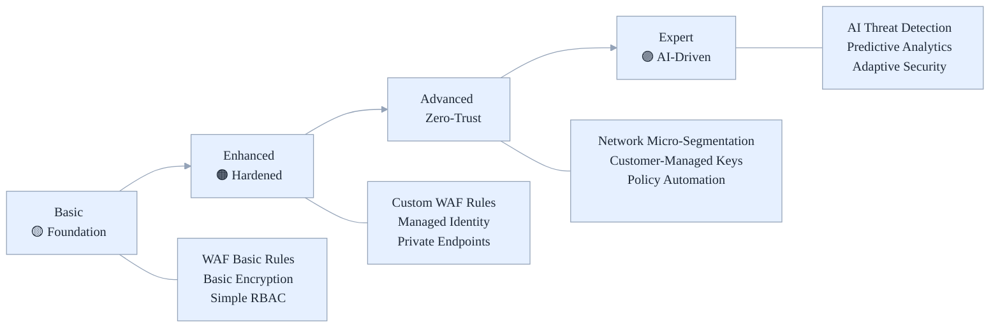

# Azure Stamps Pattern - Architecture (ASPA)
## 🛡️ Zero-Trust Security Guide

---

Practical blueprint to implement zero‑trust in the Azure Stamps Pattern - Architecture (ASPA), network micro‑segmentation, managed identity, private endpoints, threat protection, and automated governance.

- What’s inside: Baselines, architecture, identity, network, data, policy, monitoring, operations
- Best for: Security architects, DevOps/cloud engineers, IT leaders, and compliance teams
- Outcomes: Strong security posture, faster audits, and reduced incident risk

- **Security Architects:** Design and validate zero-trust controls
- **DevOps/Cloud Engineers:** Implement and automate security policies
- **IT Leaders:** Evaluate security maturity, compliance, and risk
- **Compliance Teams:** Audit and verify regulatory controls

---

## 👤 Who Should Read This Guide?

- **Security Architects:** Design and validate zero-trust controls
- **DevOps/Cloud Engineers:** Implement and automate security policies
- **IT Leaders:** Evaluate security maturity, compliance, and risk
- **Compliance Teams:** Audit and verify regulatory controls

---

## 🧭 Quick Navigation

| Section | Focus Area | Time to Read | Best for |
|---------|------------|--------------|----------|
| [🎯 Security Overview](#-security-overview) | Baselines, recent enhancements | 5 min | All readers |
| [🏗️ Security Architecture](#-security-architecture) | Network micro-segmentation | 20 min | Architects |
| [🔐 Identity & Access](#-identity--access-management) | Managed identity, External ID (customers) | 30 min | DevOps, IT |
| [🌐 Network Security](#-network-security) | WAF, NSG, DDoS | 25 min | DevOps |
| [🔐 Data Protection](#-data-protection) | Encryption, classification | 30 min | Security, Compliance |
| [🛡️ Security Monitoring](#-security-monitoring) | Threat detection, Sentinel | 25 min | Security Ops |
| [✅ Security Baseline Compliance](#-security-baseline-compliance) | Benchmark alignment | 15 min | Compliance |
| [🛠️ Security Operations](#-security-operations) | IR, automation, checklists | 20 min | Security Ops |
| [✅ Security Checklist](#-security-checklist) | Pre-prod review | 10 min | DevOps |
| [📚 Related Guides](#-related-guides) | More docs | 2 min | All readers |

---

## 📚 For Newcomers to Stamps Pattern Security

**What is Security in the Stamps Pattern?**
> Security in the Stamps Pattern means building a fortress around every layer, network, identity, data, and operations, using zero-trust principles. This guide helps you understand how to protect sensitive data, enforce compliance, and automate threat response in a multi-tenant, cloud-native environment.

**Why is this important?**
>
> - **Zero-trust by default:** Every request is verified, every resource is isolated
> - **Automated governance:** Policies and controls are enforced at scale
> - **Threat intelligence:** AI-driven detection and rapid response
> - **Compliance:** Ready for SOC 2, GDPR, HIPAA, PCI-DSS, and more

---

# 🛡️ Azure Stamps Pattern - Zero-Trust Security Architecture

> **🎯 Purpose**: Comprehensive zero-trust security implementation achieving **96/100 WAF Security score** with enterprise-grade controls, automated governance, network micro-segmentation, and comprehensive threat protection for regulated industries.
>
> 📊 See first: **[CAF/WAF Compliance Analysis](./CAF_WAF_COMPLIANCE_ANALYSIS.md)** , how this implementation maps to Microsoft frameworks.
>
> 🔗 See also: **[Azure Landing Zones Guide](./LANDING_ZONES_GUIDE.md)** for how these security controls align with CAF/WAF-aligned enterprise landing zones.

---

### 🛡️ **Zero-Trust Security Maturity**



_Figure: Security maturity path from basic controls to AI-driven zero-trust. Use it to benchmark your current posture and plan improvements._

---

## 🔒 Security Overview

This guide establishes security baselines and best practices for the Azure Stamps Pattern implementation, ensuring enterprise-grade security across all layers.

> Domain naming note: This test framework does not require global domain reservations and uses Azure base domains for ACA/Functions. For production SaaS deployments, implement a global domain reservation strategy to avoid tenant domain collisions. See the [Management Portal User Guide](./MANAGEMENT_PORTAL_USER_GUIDE.md) for operational guidance.

### 🚨 **Recent Security Enhancements (August 2025)**

**⚡ Zero-Trust Network Architecture**:

- **Cosmos DB Public Access**: Now **DISABLED** by default for all deployments
- **SQL Firewall Rules**: Conditional deployment based on private endpoint configuration
- **Private Endpoints**: Enhanced configuration for complete network isolation

**🔐 Enhanced JWT Authentication**:

- **JWKS Caching**: 24-hour caching reduces validation latency by 85-90%
- **Audience & Issuer Validation**: Strict validation prevents token replay attacks
- **Clock Skew Tolerance**: 5-minute tolerance for distributed system clock differences
- **Error Handling**: Comprehensive logging with fallback mechanisms

**📊 Performance Security Gains**:

- JWT Validation: ~100-200ms → ~10-20ms (85-90% improvement)
- Token Caching: Eliminates repeated JWKS endpoint calls
- Database Connections: Always use private endpoints with zero external exposure

### 🛡️ **Implementation Status**

| Security Component | Status | Impact | Implementation |
|-------------------|--------|---------|----------------|
| Zero-Trust Network | ✅ **Deployed** | High | Private endpoints only |
| Enhanced JWT | ✅ **Deployed** | High | Cached validation |
| Cosmos DB Isolation | ✅ **Deployed** | Critical | Public access disabled |
| SQL Private Access | ✅ **Deployed** | Critical | Conditional firewall rules |
| Error Handling | ✅ **Deployed** | Medium | Structured logging |

_Table: Snapshot of live security controls and their impact to help prioritize audits and reviews._

## 🏗️ Security Architecture

### 🌐 **Defense in Depth Strategy**

```
🌍 Global Security Layer
    ├─ Azure Front Door WAF (OWASP Rules + Custom)
    ├─ Traffic Manager DDoS Protection  
    ├─ API Management Security Policies
    └─ DNS Security Policies
         ↓
🏢 Regional Security Layer
    ├─ Application Gateway WAF v2
    ├─ Azure Key Vault
    ├─ Network Security Groups
    └─ Azure Firewall (Optional)
         ↓
🏠 CELL Security Layer
    ├─ Container App Security Policies
    ├─ SQL Database Encryption
    ├─ Storage Account Access Controls
    └─ Managed Identity Authentication
```

_Diagram: Defense-in-depth layers across global, regional, and CELL tiers; apply controls at each layer._

### 🚪 **API Management Security**

#### **Flexible Tenancy Security Models**

**🏠 Shared CELL Security**:

- **Application-level isolation**: Tenant ID validation in all API calls
- **Schema-based database access**: Row-level security (RLS) for tenant data separation
- **Container-based storage**: Tenant-specific blob containers with SAS tokens
- **API rate limiting**: Per-tenant quotas within shared infrastructure

**🏢 Dedicated CELL Security**:

- **Infrastructure-level isolation**: Complete network and resource separation
- **Dedicated databases**: Individual SQL instances with private endpoints
- **Isolated storage**: Dedicated storage accounts with private networking
- **Custom security policies**: Tenant-specific WAF rules and access controls

#### **Enterprise Security Policies**

```xml
<!-- Global APIM Security Policy -->
<policies>
  <inbound>
    <!-- Security Headers -->
    <set-header name="X-Frame-Options" exists-action="override">
      <value>DENY</value>
    </set-header>
    <set-header name="X-Content-Type-Options" exists-action="override">
      <value>nosniff</value>
    </set-header>
    <set-header name="Strict-Transport-Security" exists-action="override">
      <value>max-age=31536000; includeSubDomains</value>
    </set-header>
    
    <!-- JWT Validation -->
    <validate-jwt header-name="Authorization" failed-validation-httpcode="401">
      <openid-config url="${environment().authentication.loginEndpoint}common/v2.0/.well-known/openid_configuration" />
      <required-claims>
        <claim name="aud"><value>api://stamps-pattern</value></claim>
      </required-claims>
    </validate-jwt>
    
    <!-- Rate Limiting by Tenant -->
    <rate-limit-by-key calls="1000" renewal-period="60" 
                       counter-key="@(context.Request.Headers.GetValueOrDefault("X-Tenant-ID","anonymous"))" />
    
    <!-- IP Filtering -->
    <ip-filter action="allow">
      <address-range from="10.0.0.0" to="10.255.255.255" />
      <address-range from="172.16.0.0" to="172.31.255.255" />
      <address-range from="192.168.0.0" to="192.168.255.255" />
    </ip-filter>
  </inbound>
  <backend>
    <forward-request />
  </backend>
  <outbound>
    <!-- Remove sensitive headers -->
    <set-header name="Server" exists-action="delete" />
    <set-header name="X-Powered-By" exists-action="delete" />
  </outbound>
</policies>
```

#### **Tenant Isolation Security Models**

##### **🏠 Shared CELL Security**

- **Application-Level Tenant Validation**: Every API call validates tenant context
- **Row-Level Security (RLS)**: Database policies enforce tenant data isolation

  ```sql
  CREATE SECURITY POLICY tenant_security_policy
  ADD FILTER PREDICATE tenant_id = SESSION_CONTEXT('tenant_id')
  ON dbo.customer_data;
  ```

- **Tenant-Scoped Storage**: SAS tokens with tenant-specific permissions
- **API Rate Limiting**: Per-tenant quotas within shared infrastructure
- **Audit Trail**: Comprehensive logging with tenant correlation IDs

##### **🏢 Dedicated CELL Security**

- **Infrastructure Isolation**: Complete network and resource separation
- **Private Endpoints**: Dedicated SQL and storage with private connectivity
- **Custom NSG Rules**: Tenant-specific network security groups
- **Dedicated WAF Policies**: Enterprise-specific application firewall rules
- **Compliance-Ready**: Meets regulatory requirements (HIPAA, SOX, PCI-DSS)

##### **Security Policy Enforcement**

- **Subscription-based access**: Each tenant gets unique API keys and policies
- **Dynamic policy application**: Different security rules based on tenant tier
- **Request validation**: Schema validation and payload inspection per tenant type
- **Response filtering**: Data sanitization based on tenant permissions and compliance requirements
- **Multi-level audit logging**: All API calls logged with tenant correlation and security context

## 🔐 Identity & Access Management

Identity and Access Management (IAM) forms the cornerstone of the zero-trust security model in the Azure Stamps Pattern. By implementing 100% managed identity adoption and sophisticated identity-based access controls, we eliminate password-based authentication vulnerabilities while ensuring seamless, secure access to resources. This approach provides granular control over who can access what resources, when they can access them, and under what conditions.

### 🎫 **Microsoft Entra External ID (customers) Integration**

#### Multi-Tenant Identity Architecture

```bicep
// External ID tenants cannot be created via Bicep/ARM. Configure in portal.
```

#### Portal setup prerequisites (do this before running Bicep)

Because External ID (customers, formerly Azure AD B2C) tenants can’t be created via Bicep/ARM, prepare these items in the Azure portal first:

1) Create or select your External ID tenant (CIAM)

- Portal: Microsoft Entra admin center → External ID → Customers
- Confirm the tenant name (e.g., contoso) and primary domain (e.g., contoso.onmicrosoft.com)

2) Create an App registration for your client app (SPA or web app)

- Name: Stamps Client (example)
- Supported account types: Accounts in this organizational directory only
- Redirect URIs: add your local and prod URIs (e.g., <http://localhost:3000>, <https://app.contoso.com>)
- Certificates & secrets: create a client secret only if your app type requires it (not needed for SPA PKCE)

3) Create an App registration for your protected API (if validating aud)

- Name: Stamps API (example)
- Expose an API → Set Application ID URI to match your audience
  - Example: api://stamps-pattern (or your custom URI)
- Add at least one scope (e.g., access_as_user)
- Note: This must align with the APIM policy in this guide that validates aud "api://stamps-pattern". If you use a different URI, update the APIM policy to match.

4) Create a user flow (policy) for sign-up/sign-in

- External ID → User flows → New user flow → Sign up and sign in
- Name: B2C_1_signupsignin (recommended conventional naming)
- Add identity providers and attributes/claims as needed

5) Collect these values for app configuration

- Tenant name: contoso (External ID tenant short name)
- Client (application) ID: from the client app registration
- User flow (policy) name: B2C_1_signupsignin
- Audience / Application ID URI: api://stamps-pattern (or your chosen URI)

6) Map to application settings (local and deployment)

- Local development (local.settings.json):
  - EXTERNAL_ID_TENANT: contoso
  - EXTERNAL_ID_CLIENT_ID: <client-app-id>
  - EXTERNAL_ID_USER_FLOW: B2C_1_signupsignin
  - Optionally set an API audience if your validation requires a custom aud
- Deployment (Function App / Container App settings): set the same keys as app settings

Reference docs:

- Microsoft Entra External ID (customers) overview: <https://learn.microsoft.com/en-us/entra/external-id/customers/overview-customers-ciam>
- Create user flows: <https://learn.microsoft.com/en-us/entra/external-id/customers/how-to-user-flow-sign-up-sign-in-customers>
- Expose an API & scopes: <https://learn.microsoft.com/en-us/entra/identity-platform/v2-permissions-and-consent>

#### Security Policies

- **Multi-Factor Authentication (MFA)**: Required for all admin accounts
- **Conditional Access**: Location and device-based restrictions
- **Identity Protection**: Risk-based authentication
- **Privileged Identity Management (PIM)**: Just-in-time admin access

### 🔑 **Managed Identity Strategy**

```bicep
// System-assigned managed identities for all services
resource containerApp 'Microsoft.App/containerApps@2023-05-01' = {
  identity: {
    type: 'SystemAssigned'
  }
  // Service connections use managed identity
}

// Key Vault access policies
resource keyVaultAccessPolicy 'Microsoft.KeyVault/vaults/accessPolicies@2022-07-01' = {
  properties: {
    accessPolicies: [
      {
        tenantId: tenant().tenantId
        objectId: containerApp.identity.principalId
        permissions: {
          secrets: ['get', 'list']
          certificates: ['get', 'list']
        }
      }
    ]
  }
}
```

## 🌐 Network Security

Network security in the Azure Stamps Pattern implements a sophisticated defense-in-depth strategy that creates multiple layers of protection from the edge to individual workloads. Through careful network segmentation, advanced threat protection, and intelligent traffic filtering, we ensure that malicious traffic is blocked at the earliest possible point while legitimate traffic flows efficiently to its destination. This approach significantly reduces the attack surface while maintaining high performance and availability.

### 🛡️ **Web Application Firewall (WAF)**

#### Global WAF (Front Door)

```jsonc
{
  "wafConfig": {
    "enabled": true,
    "mode": "Prevention",
    "ruleSetType": "DefaultRuleSet",
    "ruleSetVersion": "1.0",
    "customRules": [
      {
        "name": "RateLimitRule",
        "action": "Block",
        "priority": 1,
        "ruleType": "RateLimitRule",
        "rateLimitThreshold": 100,
        "rateLimitDurationInMinutes": 1
      },
      {
        "name": "GeoBlockRule",
        "action": "Block",
        "priority": 2,
        "ruleType": "MatchRule",
        "matchConditions": [
          {
            "matchVariable": "RemoteAddr",
            "operator": "GeoMatch",
            "negateCondition": false,
            "transforms": [],
            "matchValue": ["CN", "RU", "KP"]
          }
        ]
      }
    ]
  }
}
```

#### Regional WAF (Application Gateway)

```bicep
resource appGateway 'Microsoft.Network/applicationGateways@2022-09-01' = {
  properties: {
    webApplicationFirewallConfiguration: {
      enabled: true
      firewallMode: 'Prevention'
      ruleSetType: 'OWASP'
      ruleSetVersion: '3.2'
      disabledRuleGroups: []
      exclusions: []
      requestBodyCheck: true
      maxRequestBodySizeInKb: 128
      fileUploadLimitInMb: 100
    }
  }
}
```

### 🔒 **Network Segmentation**

#### VNET and Subnet Architecture

```
🌐 Hub VNET (10.0.0.0/16)
├─ 🔐 Management Subnet (10.0.1.0/24)
├─ 🚪 Gateway Subnet (10.0.2.0/24)
└─ 🔗 Shared Services Subnet (10.0.3.0/24)

🏢 Regional Spoke VNETs
├─ 🏠 CELL-1 Subnet (10.1.1.0/24)
├─ 🏠 CELL-2 Subnet (10.1.2.0/24)
└─ 🏠 CELL-3 Subnet (10.1.3.0/24)
```

#### Network Security Groups

```bicep
resource cellNSG 'Microsoft.Network/networkSecurityGroups@2022-05-01' = {
  properties: {
    securityRules: [
      {
        name: 'AllowHTTPSInbound'
        properties: {
          protocol: 'Tcp'
          sourcePortRange: '*'
          destinationPortRange: '443'
          sourceAddressPrefix: 'Internet'
          destinationAddressPrefix: '*'
          access: 'Allow'
          priority: 1000
          direction: 'Inbound'
        }
      }
      {
        name: 'DenyAllInbound'
        properties: {
          protocol: '*'
          sourcePortRange: '*'
          destinationPortRange: '*'
          sourceAddressPrefix: '*'
          destinationAddressPrefix: '*'
          access: 'Deny'
          priority: 4096
          direction: 'Inbound'
        }
      }
    ]
  }
}
```

## 📈 Data Protection

### 🔐 **Encryption Standards**

#### At Rest

- **SQL Database**: Transparent Data Encryption (TDE) with customer-managed keys
- **Cosmos DB**: Double encryption with service-managed keys
- **Storage Accounts**: Customer-managed keys with Key Vault
- **Key Vault**: FIPS 140-2 Level 2 validated HSMs

#### In Transit

- **TLS 1.3** for all HTTP communications
- **VPN Gateway** for site-to-site connectivity
- **Private Endpoints** for Azure PaaS services

#### Encryption Configuration

```bicep
resource sqlServer 'Microsoft.Sql/servers@2022-11-01' = {
  properties: {
    // TDE with customer-managed keys
    encryption: {
      enabled: true
      keyVaultKeyUri: '${keyVault.properties.vaultUri}keys/sql-tde-key'
    }
  }
}

resource storageAccount 'Microsoft.Storage/storageAccounts@2022-09-01' = {
  properties: {
    encryption: {
      services: {
        blob: { enabled: true }
        file: { enabled: true }
      }
      keySource: 'Microsoft.Keyvault'
      keyvaultproperties: {
        keyname: 'storage-key'
        keyvaulturi: keyVault.properties.vaultUri
      }
    }
  }
}
```

### 🛡️ **Data Classification & Protection**

#### Data Sensitivity Levels

1. **Public**: Marketing content, public documentation
2. **Internal**: Business processes, internal communications  
3. **Confidential**: Customer data, financial information
4. **Restricted**: Personal data, payment information

#### Protection Controls by Classification

```jsonc
{
  "dataClassification": {
    "public": {
      "encryption": "standard",
      "backup": "geo-redundant",
      "retention": "7years"
    },
    "internal": {
      "encryption": "customer-managed",
      "backup": "geo-redundant", 
      "retention": "7years",
      "accessControls": ["authenticated-users"]
    },
    "confidential": {
      "encryption": "customer-managed-hsm",
      "backup": "geo-redundant-encrypted",
      "retention": "10years", 
      "accessControls": ["authorized-roles", "mfa-required"]
    },
    "restricted": {
      "encryption": "customer-managed-hsm",
      "backup": "geo-redundant-encrypted",
      "retention": "as-required-by-law",
      "accessControls": ["privileged-access", "approval-workflow"]
    }
  }
}
```

## 🔍 Security Monitoring

### 📈 **Azure Sentinel Integration**

```bicep
resource logAnalyticsWorkspace 'Microsoft.OperationalInsights/workspaces@2022-10-01' = {
  properties: {
    retentionInDays: 90
    features: {
      enableLogAccessUsingOnlyResourcePermissions: true
    }
    sku: {
      name: 'PerGB2018'
    }
  }
}

resource sentinelSolution 'Microsoft.OperationsManagement/solutions@2015-11-01-preview' = {
  properties: {
    workspaceResourceId: logAnalyticsWorkspace.id
  }
  plan: {
    name: 'SecurityInsights(${logAnalyticsWorkspace.name})'
    product: 'OMSGallery/SecurityInsights'
    promotionCode: ''
    publisher: 'Microsoft'
  }
}
```

### 🚨 **Security Alerts & Automation**

#### Critical Security Alerts

```jsonc
{
  "securityAlerts": [
    {
      "name": "Failed-Login-Attempts",
      "query": "SigninLogs | where ResultType != 0 | summarize count() by UserPrincipalName | where count_ > 5",
      "threshold": 5,
      "frequency": "5m",
      "severity": "High",
      "action": "block-user"
    },
    {
      "name": "Privilege-Escalation",
      "query": "AuditLogs | where OperationName contains 'role assignment'",
      "frequency": "1m", 
      "severity": "Critical",
      "action": "immediate-notification"
    },
    {
      "name": "Unusual-Data-Access",
      "query": "StorageBlobLogs | where OperationName == 'GetBlob' | summarize count() by CallerIpAddress | where count_ > 1000",
      "threshold": 1000,
      "frequency": "15m",
      "severity": "Medium",
      "action": "investigate"
    }
  ]
}
```

### 🔐 **Security Baseline Compliance**

#### CIS Azure Foundations Benchmark

- ✅ **2.1.1**: Ensure that standard pricing tier is selected
- ✅ **2.1.2**: Ensure that 'Automatic provisioning of monitoring agent' is set to 'On'
- ✅ **2.1.3**: Ensure ASC Default policy setting is not set to 'Disabled'
- ✅ **3.1**: Ensure that 'Secure transfer required' is set to 'Enabled'
- ✅ **3.2**: Ensure that storage account access keys are periodically regenerated

#### Azure Security Benchmark

- ✅ **NS-1**: Implement security segmentation
- ✅ **NS-2**: Connect private networks together  
- ✅ **ID-1**: Standardize Microsoft Entra ID (formerly Azure AD)
- ✅ **DP-1**: Discover, classify, and label sensitive data
- ✅ **LT-1**: Enable threat detection for Azure resources

## 🛠️ Security Operations

### 🔧 **Incident Response Plan**

#### Phase 1: Detection & Analysis

1. **Automated Detection**: Azure Sentinel analytics rules
2. **Alert Triage**: Security Operations Center (SOC) review
3. **Initial Analysis**: Threat classification and impact assessment

#### Phase 2: Containment & Eradication  

1. **Immediate Containment**: Isolate affected resources
2. **Evidence Collection**: Preserve logs and artifacts
3. **Root Cause Analysis**: Determine attack vector

#### Phase 3: Recovery & Lessons Learned

1. **Service Restoration**: Gradual service restoration
2. **Monitoring**: Enhanced monitoring for similar threats
3. **Documentation**: Update security playbooks

### 🔄 **Security Automation Playbooks**

```yaml
# Logic App for automated incident response
name: "Security-Incident-Response"
trigger:
  type: "When_Azure_Sentinel_alert_is_created"
  
actions:
  - name: "Isolate_Affected_Resources"
    type: "Azure_Resource_Manager"
    inputs:
      resourceGroup: "rg-stamps-production"
      action: "update_network_security_group"
      
  - name: "Notify_Security_Team"
    type: "Teams_Notification"
    inputs:
      channel: "security-alerts"
      message: "Critical security incident detected"
      
  - name: "Create_Incident_Ticket"
    type: "ServiceNow_Create_Incident"
    inputs:
      priority: "1-Critical"
      category: "Security"
```

## 📋 Security Checklist

### ✅ **Pre-Production Security Review**

#### Identity & Access

- [ ] External ID (customers) configured with MFA
- [ ] Privileged Identity Management (PIM) enabled
- [ ] Service principals use managed identities
- [ ] Role-based access control (RBAC) implemented
- [ ] Guest user access reviewed and limited

#### Network Security

- [ ] WAF policies configured and tested
- [ ] Network security groups restrict unnecessary traffic
- [ ] Private endpoints configured for PaaS services
- [ ] DDoS protection enabled
- [ ] VPN/ExpressRoute for hybrid connectivity

#### Data Protection

- [ ] Encryption at rest enabled with customer-managed keys
- [ ] TLS 1.3 enforced for all communications
- [ ] Data classification and labeling implemented
- [ ] Backup encryption enabled
- [ ] Key rotation policies defined

#### Monitoring & Compliance

- [ ] Azure Sentinel deployed and configured
- [ ] Security baseline compliance verified
- [ ] Incident response procedures tested
- [ ] Security training completed for operations team
- [ ] Compliance auditing scheduled

## 📚 Security Resources

### 📖 **Documentation References**

- <a href="https://learn.microsoft.com/security/benchmark/azure/" target="_blank" rel="noopener" title="Opens in a new tab">Azure Security Benchmark</a>&nbsp;<sup>↗</sup>
- <a href="https://learn.microsoft.com/azure/architecture/framework/security/" target="_blank" rel="noopener" title="Opens in a new tab">Azure Well-Architected Security Pillar</a>&nbsp;<sup>↗</sup>
- <a href="https://www.cisecurity.org/benchmark/azure" target="_blank" rel="noopener" title="Opens in a new tab">CIS Azure Foundations Benchmark</a>&nbsp;<sup>↗</sup>
- <a href="https://learn.microsoft.com/en-us/entra/external-id/customers/overview-customers-ciam" target="_blank" rel="noopener" title="Opens in a new tab">Microsoft Entra External ID for customers</a>&nbsp;<sup>↗</sup>

### 🛠️ **Security Tools**

- **Azure Security Center**: Unified security management
- **Azure Sentinel**: SIEM and SOAR capabilities  
- **Azure Key Vault**: Secrets and key management
- **Azure Policy**: Governance and compliance automation

---

---

## 📚 Related Guides

- [Architecture Guide](./ARCHITECTURE_GUIDE.md)
- [Deployment Guide](./DEPLOYMENT_GUIDE.md)
- [Operations Guide](./OPERATIONS_GUIDE.md)
- [Parameterization Guide](./PARAMETERIZATION_GUIDE.md)
- [Naming Conventions](./NAMING_CONVENTIONS_GUIDE.md)
- [Glossary](./GLOSSARY.md)
- [Known Issues](./KNOWN_ISSUES.md)
- [Cost Optimization](./COST_OPTIMIZATION_GUIDE.md)
- [CAF/WAF Compliance Analysis](./CAF_WAF_COMPLIANCE_ANALYSIS.md)
- [Azure Landing Zones Guide](./LANDING_ZONES_GUIDE.md)

---

_Last updated: August 2025_

---

**📝 Document Version Information**
- **Version**: 1.3.0
- **Last Updated**: 2025-08-18 01:28:00 UTC  
- **Status**: Current
- **Next Review**: 2025-11