# 🛡️ Azure Stamps Pattern - Zero-Trust Security Architecture

> **🎯 Purpose**: Comprehensive zero-trust security implementation achieving **96/100 WAF Security score** with enterprise-grade controls, automated governance, network micro-segmentation, and comprehensive threat protection for regulated industries.

## 📋 **Zero-Trust Security Navigation**

| Section | Focus Area | Implementation Time |
|---------|------------|-------------------|
| [🏗️ Zero-Trust Architecture](#%EF%B8%8F-zero-trust-architecture) | Network micro-segmentation strategy | 20 minutes |
| [🔐 Identity & Access](#-identity--access-management) | 100% managed identity adoption | 30 minutes |
| [🌐 Network Security](#-network-security) | Firewall Premium, NSG, DDoS protection | 25 minutes |
| [🗄️ Data Protection](#%EF%B8%8F-data-protection) | Customer-managed encryption, private endpoints | 30 minutes |
| [📜 Governance & Policy](#-governance--policy-enforcement) | Azure Policy as Code automation | 20 minutes |
| [📊 Security Monitoring](#-security-monitoring) | AI-driven threat detection and response | 25 minutes |
| [✅ Compliance](#-compliance-frameworks) | SOC 2, GDPR, HIPAA, PCI-DSS readiness | 20 minutes |

### 🛡️ **Zero-Trust Security Maturity**

```mermaid
graph LR
    A[Basic<br/>🟡 Foundation] --> B[Enhanced<br/>🟠 Hardened]
    B --> C[Advanced<br/>🔴 Zero-Trust]
    C --> D[Expert<br/>🟣 AI-Driven]
    
    A1[WAF Basic Rules<br/>Basic Encryption<br/>Simple RBAC] 
    B1[Custom WAF Rules<br/>Managed Identity<br/>Private Endpoints]
    C1[Network Micro-Segmentation<br/>Customer-Managed Keys<br/>Policy Automation]
    D1[AI Threat Detection<br/>Predictive Analytics<br/>Adaptive Security]
    
    A --- A1
    B --- B1  
    C --- C1
    D --- D1
    
    style C fill:#ff6b6b
    style D fill:#9775fa
    style C1 fill:#ff6b6b
    style D1 fill:#9775fa
````
    C --- C1
    D --- D1
```



---

## 🔒 Security Overview

This guide establishes security baselines and best practices for the Azure Stamps Pattern implementation, ensuring enterprise-grade security across all layers.

## 🏗️ Security Architecture

### 🌐 **Defense in Depth Strategy**

```
🌍 Global Security Layer
    ├─ Azure Front Door WAF (OWASP Rules + Custom)
    ├─ Traffic Manager DDoS Protection  
    ├─ API Management Security Policies
    └─ DNS Security Policies
         ↓
🏢 Regional Security Layer
    ├─ Application Gateway WAF v2
    ├─ Azure Key Vault
    ├─ Network Security Groups
    └─ Azure Firewall (Optional)
         ↓
🏠 CELL Security Layer
    ├─ Container App Security Policies
    ├─ SQL Database Encryption
    ├─ Storage Account Access Controls
    └─ Managed Identity Authentication
```

### 🚪 **API Management Security**

#### **Flexible Tenancy Security Models**

**🏠 Shared CELL Security**:
- **Application-level isolation**: Tenant ID validation in all API calls
- **Schema-based database access**: Row-level security (RLS) for tenant data separation
- **Container-based storage**: Tenant-specific blob containers with SAS tokens
- **API rate limiting**: Per-tenant quotas within shared infrastructure

**🏢 Dedicated CELL Security**:
- **Infrastructure-level isolation**: Complete network and resource separation
- **Dedicated databases**: Individual SQL instances with private endpoints
- **Isolated storage**: Dedicated storage accounts with private networking
- **Custom security policies**: Tenant-specific WAF rules and access controls

#### **Enterprise Security Policies**
```xml
<!-- Global APIM Security Policy -->
<policies>
  <inbound>
    <!-- Security Headers -->
    <set-header name="X-Frame-Options" exists-action="override">
      <value>DENY</value>
    </set-header>
    <set-header name="X-Content-Type-Options" exists-action="override">
      <value>nosniff</value>
    </set-header>
    <set-header name="Strict-Transport-Security" exists-action="override">
      <value>max-age=31536000; includeSubDomains</value>
    </set-header>
    
    <!-- JWT Validation -->
    <validate-jwt header-name="Authorization" failed-validation-httpcode="401">
      <openid-config url="${environment().authentication.loginEndpoint}common/v2.0/.well-known/openid_configuration" />
      <required-claims>
        <claim name="aud"><value>api://stamps-pattern</value></claim>
      </required-claims>
    </validate-jwt>
    
    <!-- Rate Limiting by Tenant -->
    <rate-limit-by-key calls="1000" renewal-period="60" 
                       counter-key="@(context.Request.Headers.GetValueOrDefault("X-Tenant-ID","anonymous"))" />
    
    <!-- IP Filtering -->
    <ip-filter action="allow">
      <address-range from="10.0.0.0" to="10.255.255.255" />
      <address-range from="172.16.0.0" to="172.31.255.255" />
      <address-range from="192.168.0.0" to="192.168.255.255" />
    </ip-filter>
  </inbound>
  <backend>
    <forward-request />
  </backend>
  <outbound>
    <!-- Remove sensitive headers -->
    <set-header name="Server" exists-action="delete" />
    <set-header name="X-Powered-By" exists-action="delete" />
  </outbound>
</policies>
```

#### **Tenant Isolation Security Models**

##### **🏠 Shared CELL Security**
- **Application-Level Tenant Validation**: Every API call validates tenant context
- **Row-Level Security (RLS)**: Database policies enforce tenant data isolation
  ```sql
  CREATE SECURITY POLICY tenant_security_policy
  ADD FILTER PREDICATE tenant_id = SESSION_CONTEXT('tenant_id')
  ON dbo.customer_data;
  ```
- **Tenant-Scoped Storage**: SAS tokens with tenant-specific permissions
- **API Rate Limiting**: Per-tenant quotas within shared infrastructure
- **Audit Trail**: Comprehensive logging with tenant correlation IDs

##### **🏢 Dedicated CELL Security**
- **Infrastructure Isolation**: Complete network and resource separation
- **Private Endpoints**: Dedicated SQL and storage with private connectivity
- **Custom NSG Rules**: Tenant-specific network security groups
- **Dedicated WAF Policies**: Enterprise-specific application firewall rules
- **Compliance-Ready**: Meets regulatory requirements (HIPAA, SOX, PCI-DSS)

##### **Security Policy Enforcement**
- **Subscription-based access**: Each tenant gets unique API keys and policies
- **Dynamic policy application**: Different security rules based on tenant tier
- **Request validation**: Schema validation and payload inspection per tenant type
- **Response filtering**: Data sanitization based on tenant permissions and compliance requirements
- **Multi-level audit logging**: All API calls logged with tenant correlation and security context

## 🔐 Identity & Access Management

Identity and Access Management (IAM) forms the cornerstone of the zero-trust security model in the Azure Stamps Pattern. By implementing 100% managed identity adoption and sophisticated identity-based access controls, we eliminate password-based authentication vulnerabilities while ensuring seamless, secure access to resources. This approach provides granular control over who can access what resources, when they can access them, and under what conditions.

### 🎫 **Azure B2C Integration**

#### Multi-Tenant Identity Architecture:
```bicep
// B2C Tenant Configuration (b2c-setup.bicep)
resource b2cTenant 'Microsoft.AzureActiveDirectory/b2cDirectories@2021-04-01' = {
  name: 'contoso-stamps-b2c'
  location: 'United States'
  properties: {
    createTenantProperties: {
      displayName: 'Contoso Stamps B2C'
      countryCode: 'US'
    }
  }
}
```

#### Security Policies:
- **Multi-Factor Authentication (MFA)**: Required for all admin accounts
- **Conditional Access**: Location and device-based restrictions
- **Identity Protection**: Risk-based authentication
- **Privileged Identity Management (PIM)**: Just-in-time admin access

### 🔑 **Managed Identity Strategy**

```bicep
// System-assigned managed identities for all services
resource containerApp 'Microsoft.App/containerApps@2023-05-01' = {
  identity: {
    type: 'SystemAssigned'
  }
  // Service connections use managed identity
}

// Key Vault access policies
resource keyVaultAccessPolicy 'Microsoft.KeyVault/vaults/accessPolicies@2022-07-01' = {
  properties: {
    accessPolicies: [
      {
        tenantId: tenant().tenantId
        objectId: containerApp.identity.principalId
        permissions: {
          secrets: ['get', 'list']
          certificates: ['get', 'list']
        }
      }
    ]
  }
}
```

## 🌐 Network Security

Network security in the Azure Stamps Pattern implements a sophisticated defense-in-depth strategy that creates multiple layers of protection from the edge to individual workloads. Through careful network segmentation, advanced threat protection, and intelligent traffic filtering, we ensure that malicious traffic is blocked at the earliest possible point while legitimate traffic flows efficiently to its destination. This approach significantly reduces the attack surface while maintaining high performance and availability.

### 🛡️ **Web Application Firewall (WAF)**

#### Global WAF (Front Door):
```json
{
  "wafConfig": {
    "enabled": true,
    "mode": "Prevention",
    "ruleSetType": "DefaultRuleSet",
    "ruleSetVersion": "1.0",
    "customRules": [
      {
        "name": "RateLimitRule",
        "action": "Block",
        "priority": 1,
        "ruleType": "RateLimitRule",
        "rateLimitThreshold": 100,
        "rateLimitDurationInMinutes": 1
      },
      {
        "name": "GeoBlockRule",
        "action": "Block",
        "priority": 2,
        "ruleType": "MatchRule",
        "matchConditions": [
          {
            "matchVariable": "RemoteAddr",
            "operator": "GeoMatch",
            "negateCondition": false,
            "transforms": [],
            "matchValue": ["CN", "RU", "KP"]
          }
        ]
      }
    ]
  }
}
```

#### Regional WAF (Application Gateway):
```bicep
resource appGateway 'Microsoft.Network/applicationGateways@2022-09-01' = {
  properties: {
    webApplicationFirewallConfiguration: {
      enabled: true
      firewallMode: 'Prevention'
      ruleSetType: 'OWASP'
      ruleSetVersion: '3.2'
      disabledRuleGroups: []
      exclusions: []
      requestBodyCheck: true
      maxRequestBodySizeInKb: 128
      fileUploadLimitInMb: 100
    }
  }
}
```

### 🔒 **Network Segmentation**

#### VNET and Subnet Architecture:
```
🌐 Hub VNET (10.0.0.0/16)
├─ 🔐 Management Subnet (10.0.1.0/24)
├─ 🚪 Gateway Subnet (10.0.2.0/24)
└─ 🔗 Shared Services Subnet (10.0.3.0/24)

🏢 Regional Spoke VNETs
├─ 🏠 CELL-1 Subnet (10.1.1.0/24)
├─ 🏠 CELL-2 Subnet (10.1.2.0/24)
└─ 🏠 CELL-3 Subnet (10.1.3.0/24)
```

#### Network Security Groups:
```bicep
resource cellNSG 'Microsoft.Network/networkSecurityGroups@2022-05-01' = {
  properties: {
    securityRules: [
      {
        name: 'AllowHTTPSInbound'
        properties: {
          protocol: 'Tcp'
          sourcePortRange: '*'
          destinationPortRange: '443'
          sourceAddressPrefix: 'Internet'
          destinationAddressPrefix: '*'
          access: 'Allow'
          priority: 1000
          direction: 'Inbound'
        }
      }
      {
        name: 'DenyAllInbound'
        properties: {
          protocol: '*'
          sourcePortRange: '*'
          destinationPortRange: '*'
          sourceAddressPrefix: '*'
          destinationAddressPrefix: '*'
          access: 'Deny'
          priority: 4096
          direction: 'Inbound'
        }
      }
    ]
  }
}
```

## 📊 Data Protection

### 🔐 **Encryption Standards**

#### At Rest:
- **SQL Database**: Transparent Data Encryption (TDE) with customer-managed keys
- **Cosmos DB**: Double encryption with service-managed keys
- **Storage Accounts**: Customer-managed keys with Key Vault
- **Key Vault**: FIPS 140-2 Level 2 validated HSMs

#### In Transit:
- **TLS 1.3** for all HTTP communications
- **VPN Gateway** for site-to-site connectivity
- **Private Endpoints** for Azure PaaS services

#### Encryption Configuration:
```bicep
resource sqlServer 'Microsoft.Sql/servers@2022-11-01' = {
  properties: {
    // TDE with customer-managed keys
    encryption: {
      enabled: true
      keyVaultKeyUri: '${keyVault.properties.vaultUri}keys/sql-tde-key'
    }
  }
}

resource storageAccount 'Microsoft.Storage/storageAccounts@2022-09-01' = {
  properties: {
    encryption: {
      services: {
        blob: { enabled: true }
        file: { enabled: true }
      }
      keySource: 'Microsoft.Keyvault'
      keyvaultproperties: {
        keyname: 'storage-key'
        keyvaulturi: keyVault.properties.vaultUri
      }
    }
  }
}
```

### 🛡️ **Data Classification & Protection**

#### Data Sensitivity Levels:
1. **Public**: Marketing content, public documentation
2. **Internal**: Business processes, internal communications  
3. **Confidential**: Customer data, financial information
4. **Restricted**: Personal data, payment information

#### Protection Controls by Classification:
```json
{
  "dataClassification": {
    "public": {
      "encryption": "standard",
      "backup": "geo-redundant",
      "retention": "7years"
    },
    "internal": {
      "encryption": "customer-managed",
      "backup": "geo-redundant", 
      "retention": "7years",
      "accessControls": ["authenticated-users"]
    },
    "confidential": {
      "encryption": "customer-managed-hsm",
      "backup": "geo-redundant-encrypted",
      "retention": "10years", 
      "accessControls": ["authorized-roles", "mfa-required"]
    },
    "restricted": {
      "encryption": "customer-managed-hsm",
      "backup": "geo-redundant-encrypted",
      "retention": "as-required-by-law",
      "accessControls": ["privileged-access", "approval-workflow"]
    }
  }
}
```

## 🔍 Security Monitoring

### 📊 **Azure Sentinel Integration**

```bicep
resource logAnalyticsWorkspace 'Microsoft.OperationalInsights/workspaces@2022-10-01' = {
  properties: {
    retentionInDays: 90
    features: {
      enableLogAccessUsingOnlyResourcePermissions: true
    }
    sku: {
      name: 'PerGB2018'
    }
  }
}

resource sentinelSolution 'Microsoft.OperationsManagement/solutions@2015-11-01-preview' = {
  properties: {
    workspaceResourceId: logAnalyticsWorkspace.id
  }
  plan: {
    name: 'SecurityInsights(${logAnalyticsWorkspace.name})'
    product: 'OMSGallery/SecurityInsights'
    promotionCode: ''
    publisher: 'Microsoft'
  }
}
```

### 🚨 **Security Alerts & Automation**

#### Critical Security Alerts:
```json
{
  "securityAlerts": [
    {
      "name": "Failed-Login-Attempts",
      "query": "SigninLogs | where ResultType != 0 | summarize count() by UserPrincipalName | where count_ > 5",
      "threshold": 5,
      "frequency": "5m",
      "severity": "High",
      "action": "block-user"
    },
    {
      "name": "Privilege-Escalation",
      "query": "AuditLogs | where OperationName contains 'role assignment'",
      "frequency": "1m", 
      "severity": "Critical",
      "action": "immediate-notification"
    },
    {
      "name": "Unusual-Data-Access",
      "query": "StorageBlobLogs | where OperationName == 'GetBlob' | summarize count() by CallerIpAddress | where count_ > 1000",
      "threshold": 1000,
      "frequency": "15m",
      "severity": "Medium",
      "action": "investigate"
    }
  ]
}
```

### 🔐 **Security Baseline Compliance**

#### CIS Azure Foundations Benchmark:
- ✅ **2.1.1**: Ensure that standard pricing tier is selected
- ✅ **2.1.2**: Ensure that 'Automatic provisioning of monitoring agent' is set to 'On'
- ✅ **2.1.3**: Ensure ASC Default policy setting is not set to 'Disabled'
- ✅ **3.1**: Ensure that 'Secure transfer required' is set to 'Enabled'
- ✅ **3.2**: Ensure that storage account access keys are periodically regenerated

#### Azure Security Benchmark:
- ✅ **NS-1**: Implement security segmentation
- ✅ **NS-2**: Connect private networks together  
- ✅ **ID-1**: Standardize Azure Active Directory
- ✅ **DP-1**: Discover, classify, and label sensitive data
- ✅ **LT-1**: Enable threat detection for Azure resources

## 🛠️ Security Operations

### 🔧 **Incident Response Plan**

#### Phase 1: Detection & Analysis
1. **Automated Detection**: Azure Sentinel analytics rules
2. **Alert Triage**: Security Operations Center (SOC) review
3. **Initial Analysis**: Threat classification and impact assessment

#### Phase 2: Containment & Eradication  
1. **Immediate Containment**: Isolate affected resources
2. **Evidence Collection**: Preserve logs and artifacts
3. **Root Cause Analysis**: Determine attack vector

#### Phase 3: Recovery & Lessons Learned
1. **Service Restoration**: Gradual service restoration
2. **Monitoring**: Enhanced monitoring for similar threats
3. **Documentation**: Update security playbooks

### 🔄 **Security Automation Playbooks**

```yaml
# Logic App for automated incident response
name: "Security-Incident-Response"
trigger:
  type: "When_Azure_Sentinel_alert_is_created"
  
actions:
  - name: "Isolate_Affected_Resources"
    type: "Azure_Resource_Manager"
    inputs:
      resourceGroup: "rg-stamps-production"
      action: "update_network_security_group"
      
  - name: "Notify_Security_Team"
    type: "Teams_Notification"
    inputs:
      channel: "security-alerts"
      message: "Critical security incident detected"
      
  - name: "Create_Incident_Ticket"
    type: "ServiceNow_Create_Incident"
    inputs:
      priority: "1-Critical"
      category: "Security"
```

## 📋 Security Checklist

### ✅ **Pre-Production Security Review**

#### Identity & Access:
- [ ] Azure AD B2C configured with MFA
- [ ] Privileged Identity Management (PIM) enabled
- [ ] Service principals use managed identities
- [ ] Role-based access control (RBAC) implemented
- [ ] Guest user access reviewed and limited

#### Network Security:
- [ ] WAF policies configured and tested
- [ ] Network security groups restrict unnecessary traffic
- [ ] Private endpoints configured for PaaS services
- [ ] DDoS protection enabled
- [ ] VPN/ExpressRoute for hybrid connectivity

#### Data Protection:
- [ ] Encryption at rest enabled with customer-managed keys
- [ ] TLS 1.3 enforced for all communications
- [ ] Data classification and labeling implemented
- [ ] Backup encryption enabled
- [ ] Key rotation policies defined

#### Monitoring & Compliance:
- [ ] Azure Sentinel deployed and configured
- [ ] Security baseline compliance verified
- [ ] Incident response procedures tested
- [ ] Security training completed for operations team
- [ ] Compliance auditing scheduled

## 📚 Security Resources

### 📖 **Documentation References**
- [Azure Security Benchmark](https://docs.microsoft.com/en-us/security/benchmark/azure/)
- [Azure Well-Architected Security Pillar](https://docs.microsoft.com/en-us/azure/architecture/framework/security/)
- [CIS Azure Foundations Benchmark](https://www.cisecurity.org/benchmark/azure)
- [Azure B2C Security Best Practices](https://docs.microsoft.com/en-us/azure/active-directory-b2c/security-best-practices)

### 🛠️ **Security Tools**
- **Azure Security Center**: Unified security management
- **Azure Sentinel**: SIEM and SOAR capabilities  
- **Azure Key Vault**: Secrets and key management
- **Azure Policy**: Governance and compliance automation

---

## 🔗 Related Guides
- [Architecture Guide](./ARCHITECTURE_GUIDE.md)
- [Deployment Guide](./DEPLOYMENT_GUIDE.md)
- [Operations Guide](./OPERATIONS_GUIDE.md)
