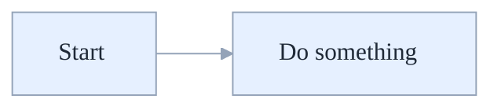

# Mermaid Diagram Template (Light-Blue Base Theme)

Use this snippet as the standard for all diagrams.

Notes:

- Always use flowchart LR/TD/TB (not graph) for consistent rendering.
- Quote subgraph titles: subgraph "My Title" ... end
- Avoid Unicode dashes; use ASCII '-' only to prevent parser issues.
- Define classDef/class statements before using classes.
- Prefer concise labels; use \n for line breaks and   in HTML when needed.
- Use spacer nodes (e.g., X[ ] or X[" "]) to preserve layout when necessary.
- Icon helpers: you can prefix node labels with small emoji/icons (e.g., 🌍 Front Door, 🔌 APIM, 🚪 App Gateway, 🐳 Container Apps, 🗄️ SQL, 🌐 Cosmos DB, 🔐 Key Vault, 📊 Log Analytics). Keep them short for readability.
---

**📝 Document Version Information**
- **Version**: 1.4.0
- **Last Updated**: 2025-08-18 01:28:00 UTC  
- **Status**: Current
- **Next Review**: 2025-11