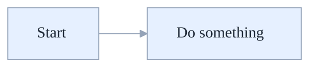

# Mermaid Diagram Template (Light-Blue Base Theme)

Use this snippet as the standard for all diagrams.

Notes:
- Keep background transparent for dark/light mode.
- Prefer concise labels; wrap with \n for line breaks.
- Use graph LR/TB based on flow.
