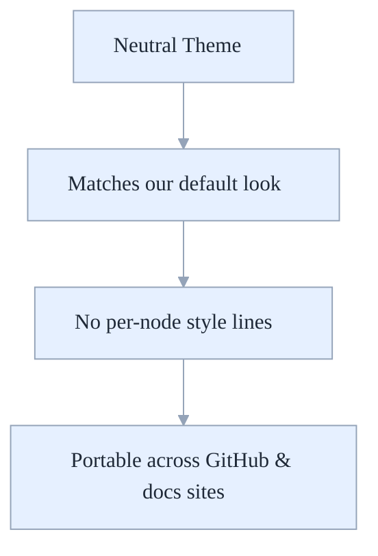
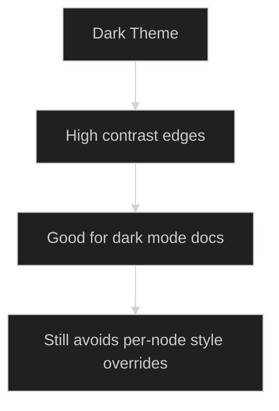

# Mermaid Theme Samples (Per-Diagram Init)

This page shows how a single-line Mermaid init directive can set a consistent theme per diagram (useful on GitHub where there’s no global site config).

- Neutral (light-friendly) theme with transparent background
- Dark theme with transparent background

## Neutral theme example



## Dark theme example



## Notes
- Keep the init line as the first line inside each ```mermaid block.
- Prefer themeVariables for small tweaks (background, fonts) over per-node `style` lines.
- For truly global theming, use a docs generator (MkDocs/Docusaurus) and set Mermaid theme in site config.
