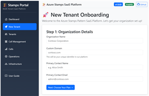

# Management Portal Screenshots

This page shows the screenshots located in this folder. Images are displayed as thumbnails and link to the full-size images so they render nicely on GitHub and stay fast to load.

Images live in `management-portal/docs` — you can link to them from other docs using the same relative path.

---

## Gallery (click a thumbnail to open the full-size image)

<table>
  <tr>
    <td align="center">
      <a href="ManagmentPortal-Dashboard-Screenshot.png">
        
      </a>
      <p><strong>Dashboard</strong><br /><em>Main application dashboard and summary widgets.</em></p>
    </td>
    <td align="center">
      <a href="ManagmentPortal-Tenants-Screenshot.png">
        
      </a>
      <p><strong>Tenants</strong><br /><em>Tenant list and quick actions.</em></p>
    </td>
  </tr>
  <tr>
    <td align="center">
      <a href="ManagmentPortal-Cell-Screenshot.png">
        
      </a>
      <p><strong>Cell</strong><br /><em>Cell overview and status.</em></p>
    </td>
    <td align="center">
      <a href="ManagmentPortal-CellMgmt-Screenshot.png">
        
      </a>
      <p><strong>Cell Management</strong><br /><em>Cell configuration and management screens.</em></p>
    </td>
  </tr>
  <tr>
    <td align="center">
      <a href="ManagmentPortal-Infrastructure-Screenshot.png">
        
      </a>
      <p><strong>Infrastructure</strong><br /><em>Infrastructure view and resource mapping.</em></p>
    </td>
    <td align="center">
      <a href="ManagmentPortal-Operations-Screenshot.png">
        
      </a>
      <p><strong>Operations</strong><br /><em>Operational metrics and logs.</em></p>
    </td>
  </tr>
  <tr>
    <td align="center">
      <a href="ManagmentPortal-NewTenant-Screenshot.png">
        
      </a>
      <p><strong>New Tenant</strong><br /><em>Create a new tenant flow.</em></p>
    </td>
    <td></td>
  </tr>
</table>

---

## How to regenerate thumbnails locally

I included a PowerShell helper `generate-thumbnails.ps1` in this folder that uses ImageMagick to create thumbnails (300px wide by default). Run it from this folder like:

```powershell
powershell -NoProfile -ExecutionPolicy Bypass -File .\generate-thumbnails.ps1 -Width 300
```

The script writes thumbnails to `management-portal/docs/thumbnails` with the `-thumb` suffix.

## CI / automated generation

A GitHub Actions workflow (.github/workflows/generate-thumbnails.yml) is included. It runs on push and on manual dispatch and will generate thumbnails and push them back to the repository automatically.

## Notes and tips

- If images are large, thumbnails speed up page rendering; clicking a thumbnail opens the full image.
- For accessibility, edit the `alt` text and captions to be more descriptive if needed.
- If you want different thumbnail sizes or a different filename convention, edit `generate-thumbnails.ps1` and the workflow accordingly.
