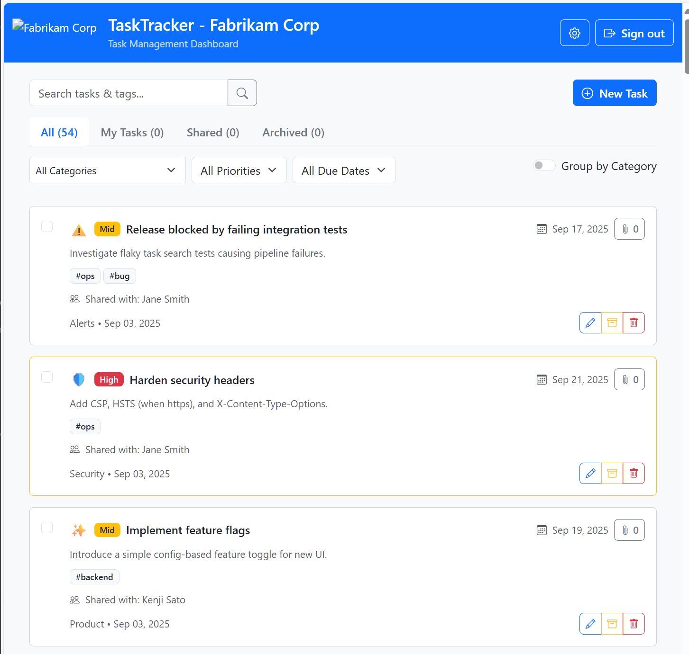
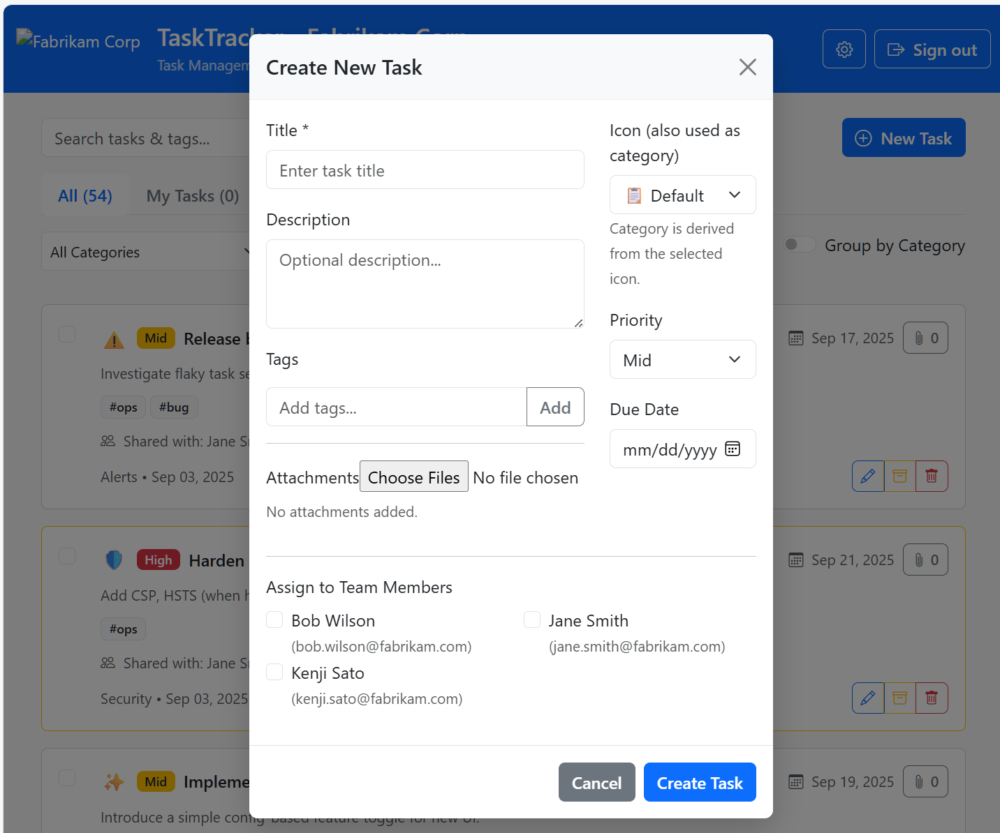
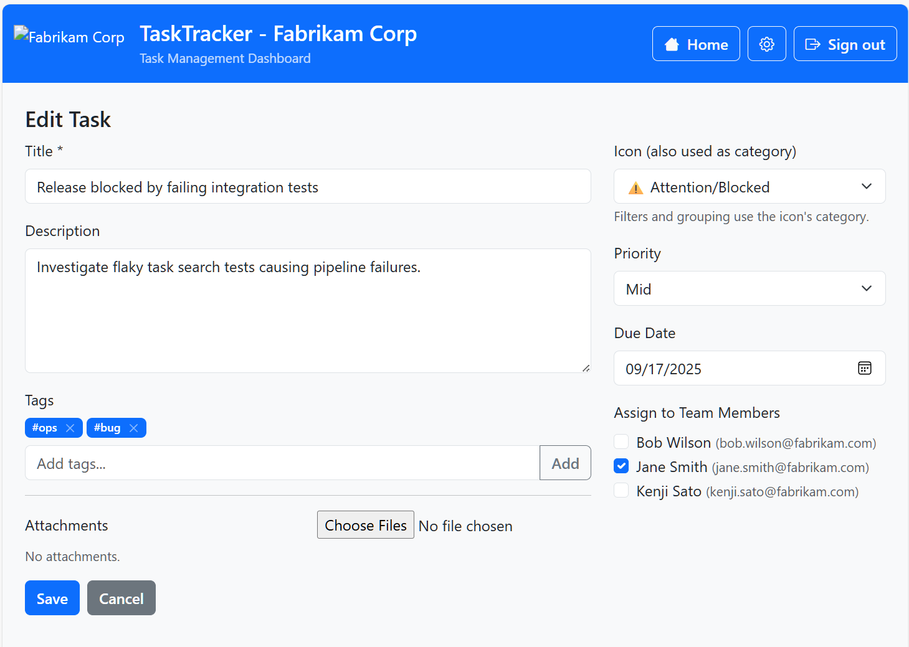

# TaskTracker Screenshots

This folder contains screenshots for the TaskTracker sample app. Images are referenced using relative paths so they render on GitHub.

---

## Gallery

<table>
  <tr>
    <td align="center">
      
      <p><strong>Home</strong><br /><em>Home page with projects, task counts and quick filters for status and priority.</em></p>
    </td>
    <td align="center">
      
      <p><strong>New Task</strong><br /><em>New task creation form with required fields and optional metadata.</em></p>
    </td>
  </tr>
  <tr>
    <td align="center">
      
      <p><strong>Edit Task</strong><br /><em>Edit task details including status, priority, and comments history.</em></p>
    </td>
    <td></td>
  </tr>
</table>

---

## How to link these images

From other docs in the repo (example from repo root):

```markdown

```

## Accessibility notes

- The `alt` text above describes the primary content of each screenshot. Update them if you change the UI or add new screenshots.
- If you'd like thumbnails for faster loading, you can reuse the thumbnail generator script at `management-portal/docs/generate-thumbnails.ps1`.

